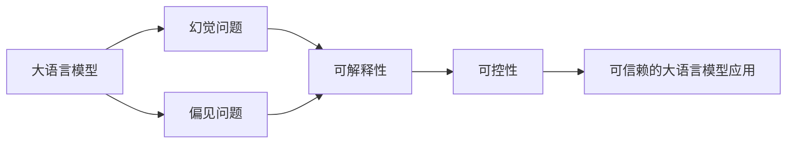

# 大语言模型应用指南：幻觉和偏见问题

## 1. 背景介绍
### 1.1 大语言模型的发展历程
#### 1.1.1 早期的语言模型
#### 1.1.2 Transformer 的出现
#### 1.1.3 预训练语言模型的崛起

### 1.2 大语言模型的应用现状
#### 1.2.1 自然语言处理任务
#### 1.2.2 对话系统和聊天机器人
#### 1.2.3 知识问答和信息检索

### 1.3 大语言模型面临的挑战
#### 1.3.1 幻觉问题
#### 1.3.2 偏见问题
#### 1.3.3 可解释性和可控性

## 2. 核心概念与联系
### 2.1 大语言模型
#### 2.1.1 定义和特点
#### 2.1.2 训练方法和数据集
#### 2.1.3 评估指标和方法

### 2.2 幻觉问题
#### 2.2.1 定义和表现形式
#### 2.2.2 产生原因和影响
#### 2.2.3 检测和缓解方法

### 2.3 偏见问题  
#### 2.3.1 定义和类型
#### 2.3.2 来源和影响
#### 2.3.3 评估和消除方法

### 2.4 概念之间的联系


## 3. 核心算法原理具体操作步骤
### 3.1 幻觉问题检测算法
#### 3.1.1 基于规则的方法
#### 3.1.2 基于统计的方法 
#### 3.1.3 基于深度学习的方法

### 3.2 偏见问题评估算法
#### 3.2.1 词嵌入偏见评估
#### 3.2.2 句子级别偏见评估
#### 3.2.3 上下文化偏见评估

### 3.3 幻觉问题缓解算法
#### 3.3.1 数据增强方法
#### 3.3.2 模型结构改进
#### 3.3.3 后处理方法

### 3.4 偏见问题消除算法
#### 3.4.1 数据去偏方法  
#### 3.4.2 模型去偏方法
#### 3.4.3 后处理去偏方法

## 4. 数学模型和公式详细讲解举例说明
### 4.1 幻觉问题检测模型
#### 4.1.1 基于规则的方法数学模型
设规则集合为 $R=\{r_1,r_2,...,r_n\}$，对于生成文本 $T$，如果满足任一规则 $r_i$，则判定为幻觉。

#### 4.1.2 基于统计的方法数学模型
设生成文本为 $T$，参考文本集合为 $\{S_1,S_2,...,S_m\}$，如果 $\exists S_i$，使得：

$$\text{similarity}(T,S_i) > \theta$$

其中 $\text{similarity}$ 为相似度度量函数，$\theta$ 为阈值，则判定 $T$ 为幻觉。

#### 4.1.3 基于深度学习的方法数学模型
设幻觉检测模型为 $f_\phi$，生成文本为 $T$，则幻觉概率为：

$$p_\text{hallucination} = f_\phi(T)$$

其中 $f_\phi$ 可以是 RNN、Transformer 等深度神经网络。

### 4.2 偏见问题评估模型
#### 4.2.1 词嵌入偏见评估模型
设词嵌入向量为 $\mathbf{w} \in \mathbb{R}^d$，属性词向量集合为 $A=\{\mathbf{a}_1, \mathbf{a}_2, ..., \mathbf{a}_n\}$，目标词向量集合为 $T=\{\mathbf{t}_1, \mathbf{t}_2, ..., \mathbf{t}_m\}$，偏见得分为：

$$b(\mathbf{w},A,T) = \frac{1}{n}\sum_{i=1}^n \mathbf{a}_i^\top \mathbf{w} - \frac{1}{m}\sum_{j=1}^m \mathbf{t}_j^\top \mathbf{w}$$

#### 4.2.2 句子级别偏见评估模型
设句子 $s$ 的词嵌入向量为 $\{\mathbf{w}_1, \mathbf{w}_2, ..., \mathbf{w}_l\}$，属性词向量集合为 $A$，目标词向量集合为 $T$，句子级别偏见得分为：

$$b(s,A,T) = \frac{1}{l}\sum_{i=1}^l b(\mathbf{w}_i,A,T)$$

#### 4.2.3 上下文化偏见评估模型
设句子 $s$ 的上下文向量为 $\mathbf{c} \in \mathbb{R}^h$，偏见评估模型为 $f_\theta$，则上下文化偏见得分为：

$$b(s,A,T) = f_\theta(\mathbf{c},A,T)$$

其中 $f_\theta$ 可以是前馈神经网络等。

### 4.3 幻觉问题缓解模型
#### 4.3.1 数据增强方法数学模型
设原始训练数据集为 $D$，数据增强后的训练集为 $\tilde{D}$，则数据增强过程可以表示为：

$$\tilde{D} = D \cup \{T_1,T_2,...,T_k\}$$

其中 $\{T_1,T_2,...,T_k\}$ 为生成的增强数据。

#### 4.3.2 模型结构改进数学模型
设原始语言模型为 $p_\theta(x)$，引入幻觉缓解机制后的语言模型为 $\tilde{p}_\theta(x)$，则：

$$\tilde{p}_\theta(x) = p_\theta(x) \cdot g_\phi(x)$$

其中 $g_\phi(x)$ 为幻觉缓解模块，可以是基于注意力机制、外部知识等的结构。

#### 4.3.3 后处理方法数学模型
设生成的文本为 $T$，后处理模型为 $h_\psi$，则修正后的文本 $\tilde{T}$ 为：

$$\tilde{T} = h_\psi(T)$$

其中 $h_\psi$ 可以是基于规则、检索等的后处理模型。

### 4.4 偏见问题消除模型
#### 4.4.1 数据去偏方法数学模型
设原始训练数据集为 $D$，去偏后的训练集为 $\tilde{D}$，则数据去偏过程可以表示为：

$$\tilde{D} = \{(x,y) \in D | b(x,A,T) < \epsilon\}$$

其中 $b(x,A,T)$ 为偏见评估函数，$\epsilon$ 为去偏阈值。

#### 4.4.2 模型去偏方法数学模型
设原始语言模型为 $p_\theta(y|x)$，引入偏见惩罚项后的语言模型为 $\tilde{p}_\theta(y|x)$，则：

$$\tilde{p}_\theta(y|x) = p_\theta(y|x) \cdot \exp(-\lambda \cdot b(y,A,T))$$

其中 $b(y,A,T)$ 为偏见评估函数，$\lambda$ 为惩罚项权重。

#### 4.4.3 后处理去偏方法数学模型
设生成的文本为 $T$，后处理去偏模型为 $q_\omega$，则去偏后的文本 $\tilde{T}$ 为：

$$\tilde{T} = q_\omega(T,A,T)$$

其中 $q_\omega$ 可以是基于对抗学习、强化学习等的后处理模型。

## 5. 项目实践：代码实例和详细解释说明
### 5.1 幻觉问题检测代码实例
```python
import torch
import torch.nn as nn

class HallucinationDetector(nn.Module):
    def __init__(self, vocab_size, embed_dim, hidden_dim, num_layers):
        super().__init__()
        self.embedding = nn.Embedding(vocab_size, embed_dim)
        self.rnn = nn.LSTM(embed_dim, hidden_dim, num_layers, batch_first=True)
        self.fc = nn.Linear(hidden_dim, 1)
        
    def forward(self, x):
        x = self.embedding(x)
        _, (h_n, _) = self.rnn(x)
        out = self.fc(h_n[-1])
        return torch.sigmoid(out)
```
上述代码实现了一个基于 LSTM 的幻觉检测模型，通过对输入文本进行编码，然后使用全连接层输出幻觉概率。

### 5.2 偏见问题评估代码实例
```python
def word_embedding_bias(word, A, T):
    a_avg = torch.mean(torch.stack([w for w in A]), dim=0)
    t_avg = torch.mean(torch.stack([w for w in T]), dim=0)
    return torch.dot(word, a_avg - t_avg).item()

def sentence_bias(sentence, A, T):
    words = [w for w in sentence]
    return sum([word_embedding_bias(w, A, T) for w in words]) / len(words)
```
上述代码实现了词嵌入偏见评估和句子级别偏见评估，通过计算词嵌入与属性词和目标词之间的差异来衡量偏见程度。

### 5.3 幻觉问题缓解代码实例
```python
def data_augmentation(model, tokenizer, prompt, num_samples):
    generated_texts = []
    for _ in range(num_samples):
        outputs = model.generate(
            input_ids=tokenizer.encode(prompt, return_tensors='pt'),
            max_length=100,
            do_sample=True,
            top_k=50,
            top_p=0.95
        )
        generated_text = tokenizer.decode(outputs[0], skip_special_tokens=True)
        generated_texts.append(generated_text)
    return generated_texts
```
上述代码实现了基于生成式预训练语言模型的数据增强方法，通过采样生成多样化的文本来丰富训练数据，缓解幻觉问题。

### 5.4 偏见问题消除代码实例
```python
def adversarial_debiasing(model, discriminator, dataloader, num_epochs):
    optimizer = torch.optim.Adam(model.parameters())
    for epoch in range(num_epochs):
        for batch in dataloader:
            inputs, labels = batch
            preds = model(inputs)
            loss = F.cross_entropy(preds, labels)
            
            bias_scores = discriminator(inputs)
            bias_loss = torch.mean(bias_scores)
            
            total_loss = loss - 0.1 * bias_loss
            
            optimizer.zero_grad()
            total_loss.backward()
            optimizer.step()
```
上述代码实现了基于对抗学习的偏见消除方法，通过引入偏见判别器，在训练过程中最小化语言模型的偏见，实现去偏的目的。

## 6. 实际应用场景
### 6.1 智能客服系统
在智能客服系统中，大语言模型可以用于生成回复和解答用户问题。但是，如果模型存在幻觉问题，可能会生成错误或不相关的回复，影响用户体验。同时，如果模型存在偏见问题，可能会对某些用户群体产生不公平的对待。因此，需要应用幻觉检测和偏见评估技术，及时发现和纠正模型的问题，提供更加准确和公平的客服服务。

### 6.2 内容生成平台
在内容生成平台中，大语言模型可以用于自动生成文章、新闻、评论等各种类型的文本内容。但是，如果模型存在幻觉问题，生成的内容可能与事实不符，传播错误信息。如果模型存在偏见问题，生成的内容可能带有性别、种族等方面的歧视和偏见。因此，需要应用幻觉缓解和偏见消除技术，确保生成的内容真实可靠、公平无偏。

### 6.3 教育和培训领域
在教育和培训领域，大语言模型可以用于生成教材、试题、反馈等教学内容。但是，如果模型存在幻觉问题，生成的内容可能与教学目标不一致，误导学生。如果模型存在偏见问题，生成的内容可能对不同群体的学生产生不公平的影响。因此，需要应用幻觉检测和偏见评估技术，保证教学内容的准确性和公平性，提供高质量的教育和培训服务。

## 7. 工具和资源推荐
### 7.1 幻觉检测工具
- [OpenAI GPT-3