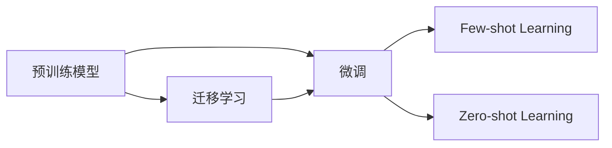

# 大语言模型应用指南：数据准备和参数微调

## 1. 背景介绍

近年来，大语言模型(Large Language Models, LLMs)在自然语言处理(Natural Language Processing, NLP)领域取得了令人瞩目的进展。从GPT-3到ChatGPT，这些模型展示了在各种自然语言任务上的卓越性能，如问答、对话、文本生成等。然而，要将这些强大的模型应用到实际场景中，我们还需要对模型进行微调(Fine-tuning)，使其适应特定领域的数据和任务。本文将深入探讨大语言模型应用中的数据准备和参数微调技术，为读者提供实用的指导和见解。

### 1.1 大语言模型的发展历程
#### 1.1.1 Transformer架构的诞生
#### 1.1.2 GPT系列模型的演进
#### 1.1.3 ChatGPT的问世与影响

### 1.2 大语言模型的应用场景
#### 1.2.1 问答系统
#### 1.2.2 对话生成
#### 1.2.3 文本摘要
#### 1.2.4 机器翻译
#### 1.2.5 其他应用领域

### 1.3 微调的必要性与挑战
#### 1.3.1 通用模型与特定领域的差异
#### 1.3.2 数据质量与数量的要求
#### 1.3.3 计算资源与时间成本

## 2. 核心概念与联系

在深入探讨数据准备和参数微调之前，我们需要了解一些核心概念及其之间的联系。

### 2.1 预训练(Pre-training)与微调(Fine-tuning)
#### 2.1.1 预训练的目的与方法
#### 2.1.2 微调的定义与作用
#### 2.1.3 预训练与微调的关系

### 2.2 迁移学习(Transfer Learning)
#### 2.2.1 迁移学习的概念
#### 2.2.2 迁移学习在NLP中的应用
#### 2.2.3 迁移学习与微调的区别

### 2.3 Few-shot Learning与Zero-shot Learning
#### 2.3.1 Few-shot Learning的定义与应用
#### 2.3.2 Zero-shot Learning的定义与应用
#### 2.3.3 Few-shot Learning与Zero-shot Learning在微调中的作用

以下是这些概念之间关系的Mermaid流程图：



## 3. 核心算法原理具体操作步骤

### 3.1 数据准备
#### 3.1.1 数据收集与清洗
##### 3.1.1.1 数据来源与筛选
##### 3.1.1.2 数据预处理与清洗
##### 3.1.1.3 数据隐私与安全

#### 3.1.2 数据标注
##### 3.1.2.1 标注方法与工具
##### 3.1.2.2 标注质量控制
##### 3.1.2.3 标注成本优化

#### 3.1.3 数据增强
##### 3.1.3.1 数据增强的目的
##### 3.1.3.2 数据增强的方法
##### 3.1.3.3 数据增强的效果评估

### 3.2 参数微调
#### 3.2.1 微调的目标函数
##### 3.2.1.1 交叉熵损失
##### 3.2.1.2 对比学习损失
##### 3.2.1.3 多任务学习损失

#### 3.2.2 微调的优化算法
##### 3.2.2.1 AdamW优化器
##### 3.2.2.2 学习率调度策略
##### 3.2.2.3 梯度裁剪与正则化

#### 3.2.3 微调的超参数选择
##### 3.2.3.1 Batch Size与Epoch数
##### 3.2.3.2 学习率与权重衰减
##### 3.2.3.3 Dropout与Early Stopping

### 3.3 模型评估与部署
#### 3.3.1 评估指标选择
##### 3.3.1.1 准确率、精确率、召回率、F1值
##### 3.3.1.2 BLEU、ROUGE、METEOR等
##### 3.3.1.3 人工评估与用户反馈

#### 3.3.2 模型部署与推理优化
##### 3.3.2.1 模型量化与剪枝
##### 3.3.2.2 模型并行与流水线并行
##### 3.3.2.3 推理引擎与硬件加速

## 4. 数学模型和公式详细讲解举例说明

### 4.1 Transformer架构
Transformer是大语言模型的核心架构，其中的关键组件包括多头注意力机制(Multi-head Attention)和前馈神经网络(Feed-forward Neural Network)。

多头注意力机制可以表示为：

$$
\text{MultiHead}(Q, K, V) = \text{Concat}(\text{head}_1, ..., \text{head}_h)W^O \\
\text{where}\ \text{head}_i = \text{Attention}(QW_i^Q, KW_i^K, VW_i^V)
$$

其中，$Q$、$K$、$V$分别表示查询(Query)、键(Key)、值(Value)，$W_i^Q$、$W_i^K$、$W_i^V$、$W^O$为可学习的权重矩阵。

前馈神经网络可以表示为：

$$
\text{FFN}(x) = \max(0, xW_1 + b_1)W_2 + b_2
$$

其中，$W_1$、$W_2$、$b_1$、$b_2$为可学习的权重矩阵和偏置向量。

### 4.2 微调的目标函数
在微调过程中，我们通常使用交叉熵损失作为目标函数。对于分类任务，交叉熵损失可以表示为：

$$
\mathcal{L}_{CE} = -\sum_{i=1}^N \sum_{c=1}^C y_{i,c} \log(\hat{y}_{i,c})
$$

其中，$N$为样本数，$C$为类别数，$y_{i,c}$为真实标签，$\hat{y}_{i,c}$为预测概率。

对于生成任务，我们可以使用对数似然损失：

$$
\mathcal{L}_{LL} = -\sum_{i=1}^N \sum_{t=1}^T \log p(x_t^{(i)} | x_{<t}^{(i)}, \theta)
$$

其中，$N$为样本数，$T$为序列长度，$x_t^{(i)}$为第$i$个样本的第$t$个token，$\theta$为模型参数。

## 5. 项目实践：代码实例和详细解释说明

以下是使用PyTorch和Hugging Face Transformers库进行大语言模型微调的示例代码：

```python
from transformers import AutoTokenizer, AutoModelForSequenceClassification, TrainingArguments, Trainer

# 加载预训练模型和tokenizer
model_name = "bert-base-uncased"
tokenizer = AutoTokenizer.from_pretrained(model_name)
model = AutoModelForSequenceClassification.from_pretrained(model_name, num_labels=2)

# 准备数据集
train_dataset = ...  # 加载训练集
eval_dataset = ...   # 加载验证集

# 定义训练参数
training_args = TrainingArguments(
    output_dir='./results',
    num_train_epochs=3,
    per_device_train_batch_size=16,
    per_device_eval_batch_size=64,
    warmup_steps=500,
    weight_decay=0.01,
    logging_dir='./logs',
    logging_steps=10,
    evaluation_strategy="epoch"
)

# 定义Trainer
trainer = Trainer(
    model=model,
    args=training_args,
    train_dataset=train_dataset,
    eval_dataset=eval_dataset
)

# 开始微调
trainer.train()
```

在上述代码中，我们首先加载了预训练的BERT模型和对应的tokenizer。然后，我们准备了训练集和验证集，并定义了训练参数，如训练轮数、批大小、学习率等。接着，我们创建了一个Trainer对象，将模型、训练参数、数据集等传入其中。最后，调用trainer.train()方法开始微调过程。

微调完成后，我们可以使用trainer.evaluate()方法在验证集上评估模型性能，并使用trainer.save_model()方法保存微调后的模型。

## 6. 实际应用场景

大语言模型微调技术在各个领域都有广泛的应用，以下是一些典型的应用场景：

### 6.1 客服聊天机器人
利用微调技术，我们可以将大语言模型应用于客服聊天场景，使其能够理解用户问题并给出相关的回答。通过在特定领域的客服对话数据上进行微调，模型可以学习到领域知识，提供更加专业、准确的回复。

### 6.2 医疗诊断辅助
将大语言模型微调应用于医疗领域，可以辅助医生进行疾病诊断。通过在大量医疗文献和病例数据上微调模型，使其能够理解医学术语、症状描述等，并根据患者的病情给出可能的诊断结果和治疗建议。

### 6.3 金融风险评估
在金融领域，大语言模型微调可以用于评估企业或个人的信贷风险。通过在历史信贷数据、财务报告等数据上微调模型，使其能够分析企业或个人的财务状况、信用记录等，并给出风险评分和贷款建议。

### 6.4 法律文档分析
大语言模型微调技术还可以应用于法律领域，协助律师和法官分析法律文档。通过在大量法律案例、法规条文等数据上微调模型，使其能够理解法律术语、案件事实等，并对案件进行分类、摘要、判决预测等。

## 7. 工具和资源推荐

以下是一些常用的大语言模型微调工具和资源：

### 7.1 开源框架
- Hugging Face Transformers：提供了丰富的预训练模型和微调工具，支持多种任务和框架。
- OpenAI GPT-3 API：提供了强大的GPT-3模型API，可以通过Few-shot Learning的方式进行微调。
- Google BERT：Google开源的BERT模型，提供了预训练模型和微调示例代码。

### 7.2 数据集
- GLUE Benchmark：包含多个自然语言理解任务的数据集，可用于评估模型性能。
- SQuAD：大规模阅读理解数据集，可用于微调问答模型。
- CoNLL-2003：命名实体识别数据集，可用于微调序列标注模型。

### 7.3 学习资源
- Coursera自然语言处理专项课程：由deeplearning.ai提供，涵盖了NLP基础知识和实践应用。
- fast.ai自然语言处理课程：提供了实践性很强的NLP课程，包括大语言模型微调的内容。
- Hugging Face官方文档：提供了详尽的Transformers库使用指南和实践教程。

## 8. 总结：未来发展趋势与挑战

大语言模型微调技术的发展日新月异，未来还有许多值得期待的方向和挑战：

### 8.1 更大规模的预训练模型
随着计算能力的提升和数据量的增加，预训练模型的参数规模也在不断增长。更大规模的模型通常能够学习到更丰富的语言知识，在下游任务上取得更好的性能。未来，我们可能会看到万亿、百万亿参数量级的预训练模型出现。

### 8.2 更高效的微调方法
目前的微调方法通常需要在整个预训练模型上进行训练，对计算资源和时间成本要求较高。未来，我们需要探索更高效的微调方法，如参数高效微调、模型压缩等，以降低微调的成本，提高微调的效率。

### 8.3 更广泛的应用场景
大语言模型微调技术目前主要应用于文本领域，未来有望扩展到更多的应用场景，如语音、图像、视频等。跨模态的大语言模型微调可以实现更加自然、智能的人机交互。

### 8.4 可解释性与可控性
大语言模型微调后的决策过程通常是黑盒的，缺乏可解释性。未来，我们需要研究如何提高微调模型的可解释性，让用户能够理解模型的决策依据。同时，我们还需要探索如何增强微调模型的可控性，避免模型产生有害、偏见的输出。

### 8.5 隐私与安全
在大语言模型微调过程中，我们需要处理大量的用户数据，这可能涉及到隐私和安全问