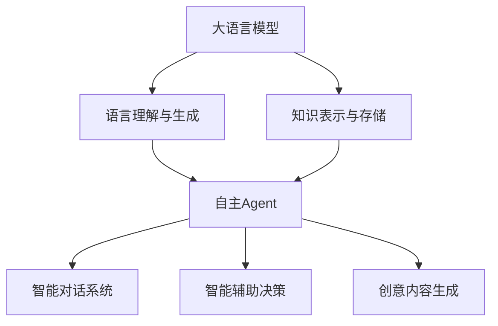

# 大语言模型应用指南：自主Agent系统案例分析（一）

## 1. 背景介绍
### 1.1 大语言模型的发展历程
#### 1.1.1 早期的语言模型
#### 1.1.2 Transformer架构的突破  
#### 1.1.3 预训练语言模型的崛起
### 1.2 大语言模型的应用现状
#### 1.2.1 自然语言处理领域的应用
#### 1.2.2 知识图谱与问答系统
#### 1.2.3 文本生成与创意写作
### 1.3 自主Agent系统概述
#### 1.3.1 自主Agent的定义与特点
#### 1.3.2 自主Agent系统的研究意义
#### 1.3.3 自主Agent系统的发展现状

## 2. 核心概念与联系
### 2.1 大语言模型
#### 2.1.1 语言模型的基本原理
#### 2.1.2 大语言模型的特点与优势
#### 2.1.3 常见的大语言模型架构
### 2.2 自主Agent
#### 2.2.1 自主性的定义与衡量标准
#### 2.2.2 Agent的基本组成与交互方式
#### 2.2.3 自主Agent的关键能力
### 2.3 大语言模型与自主Agent的关系
#### 2.3.1 大语言模型为自主Agent提供知识与语言理解能力
#### 2.3.2 自主Agent赋予大语言模型更广泛的应用场景
#### 2.3.3 两者结合推动人工智能领域的发展



## 3. 核心算法原理具体操作步骤
### 3.1 基于Transformer的语言模型预训练
#### 3.1.1 Transformer编码器结构
#### 3.1.2 Masked Language Model预训练任务
#### 3.1.3 Next Sentence Prediction预训练任务
### 3.2 基于Prompt的自主Agent交互
#### 3.2.1 Prompt的设计原则与方法
#### 3.2.2 Few-shot Learning与In-context Learning
#### 3.2.3 Prompt工程的优化策略
### 3.3 基于规划的自主Agent决策
#### 3.3.1 基于规则的行为决策
#### 3.3.2 基于强化学习的策略优化
#### 3.3.3 多Agent协作与博弈

## 4. 数学模型和公式详细讲解举例说明
### 4.1 Transformer的注意力机制
Transformer的核心是自注意力机制（Self-Attention），其数学表达式为：

$$
\text{Attention}(Q, K, V) = \text{softmax}(\frac{QK^T}{\sqrt{d_k}})V
$$

其中，$Q$、$K$、$V$ 分别表示查询（Query）、键（Key）和值（Value）矩阵，$d_k$ 为键向量的维度。

举例说明：假设我们有一个输入序列 $X = [x_1, x_2, ..., x_n]$，其中 $x_i$ 表示第 $i$ 个词的词向量。我们可以将 $X$ 分别作为 $Q$、$K$、$V$ 的输入，通过自注意力机制计算每个位置的注意力权重，进而得到上下文相关的表示。

### 4.2 语言模型的概率建模
语言模型的目标是估计一个句子 $S = [w_1, w_2, ..., w_m]$ 的概率 $P(S)$。根据链式法则，我们可以将其分解为：

$$
P(S) = P(w_1, w_2, ..., w_m) = \prod_{i=1}^m P(w_i | w_1, w_2, ..., w_{i-1})
$$

其中，$P(w_i | w_1, w_2, ..., w_{i-1})$ 表示在给定前 $i-1$ 个词的情况下，第 $i$ 个词出现的条件概率。

举例说明：假设我们要计算句子 "I love natural language processing" 的概率。根据上述公式，我们可以将其分解为：

$$
\begin{aligned}
P(\text{"I love natural language processing"}) = & P(\text{"I"}) \times P(\text{"love"} | \text{"I"}) \\
& \times P(\text{"natural"} | \text{"I love"}) \\
& \times P(\text{"language"} | \text{"I love natural"}) \\
& \times P(\text{"processing"} | \text{"I love natural language"})
\end{aligned}
$$

语言模型的任务就是学习如何估计这些条件概率，从而对句子的合理性进行评估。

## 5. 项目实践：代码实例和详细解释说明
下面我们通过一个简单的基于 PyTorch 的 Transformer 语言模型示例来说明如何实现自主 Agent。

```python
import torch
import torch.nn as nn

class TransformerBlock(nn.Module):
    def __init__(self, embed_dim, num_heads, ff_dim):
        super().__init__()
        self.attention = nn.MultiheadAttention(embed_dim, num_heads)
        self.ff = nn.Sequential(
            nn.Linear(embed_dim, ff_dim),
            nn.ReLU(),
            nn.Linear(ff_dim, embed_dim)
        )
        self.norm1 = nn.LayerNorm(embed_dim)
        self.norm2 = nn.LayerNorm(embed_dim)
    
    def forward(self, x):
        attended = self.attention(x, x, x)[0]
        x = self.norm1(attended + x)
        fed_forward = self.ff(x)
        x = self.norm2(fed_forward + x)
        return x

class TransformerModel(nn.Module):
    def __init__(self, vocab_size, embed_dim, num_heads, ff_dim, num_layers):
        super().__init__()
        self.embedding = nn.Embedding(vocab_size, embed_dim)
        self.layers = nn.ModuleList([
            TransformerBlock(embed_dim, num_heads, ff_dim) for _ in range(num_layers)
        ])
        self.fc = nn.Linear(embed_dim, vocab_size)
    
    def forward(self, x):
        x = self.embedding(x)
        for layer in self.layers:
            x = layer(x)
        x = self.fc(x)
        return x
```

上面的代码定义了一个简单的 Transformer 语言模型，包括以下几个关键组件：

1. `TransformerBlock`：实现了 Transformer 的基本构建块，包括多头自注意力机制和前馈神经网络。
2. `TransformerModel`：通过堆叠多个 `TransformerBlock` 构建完整的 Transformer 模型，并在最后使用全连接层将隐藏状态映射到词表大小的输出。

在实际应用中，我们可以使用预训练好的 Transformer 模型作为自主 Agent 的语言理解和生成模块，并结合其他技术如强化学习和规划算法来实现自主决策和交互。

## 6. 实际应用场景
自主 Agent 系统在多个领域都有广泛的应用前景，下面列举几个具体的应用场景：

### 6.1 智能客服
利用大语言模型和自主 Agent 技术，可以构建智能客服系统，自动理解用户的问题并给出相应的回答和解决方案。这种系统可以大大减轻人工客服的工作量，提高响应速度和服务质量。

### 6.2 个性化推荐
通过分析用户的对话内容和行为数据，自主 Agent 可以学习用户的兴趣爱好和偏好，进而提供个性化的内容推荐和服务。这在电商、新闻、娱乐等领域都有广泛应用。

### 6.3 智能辅助决策
在金融、医疗、法律等专业领域，自主 Agent 可以作为智能辅助工具，帮助专业人士进行数据分析、风险评估和决策支持。通过自然语言交互，专业人士可以更高效地获取所需信息和见解。

## 7. 工具和资源推荐
以下是一些实现和研究自主 Agent 系统的常用工具和资源：

1. PyTorch：一个流行的深度学习框架，提供了丰富的工具和库，方便实现各种神经网络模型。
2. Hugging Face Transformers：一个基于 PyTorch 的自然语言处理库，提供了多个预训练的 Transformer 模型和实用工具。
3. OpenAI Gym：一个用于开发和测试强化学习算法的工具包，提供了各种标准化的环境和接口。
4. Stanford CoreNLP：一个功能强大的自然语言处理工具包，提供了词性标注、命名实体识别、句法分析等功能。
5. arXiv：一个免费的学术论文预印本库，包含了大量人工智能和自然语言处理领域的最新研究成果。

## 8. 总结：未来发展趋势与挑战
自主 Agent 系统是人工智能领域的一个重要研究方向，随着大语言模型等技术的不断进步，其应用前景也越来越广阔。未来的发展趋势可能包括：

1. 更大规模、更高质量的语言模型，能够理解和生成更加自然、连贯的语言。
2. 更紧密结合知识图谱、常识推理等技术，使 Agent 具备更强的理解和决策能力。
3. 更好地融合多模态信息，如视觉、语音等，实现更全面、更自然的人机交互。
4. 更注重安全性、可解释性和伦理问题，确保 Agent 的行为符合人类价值观。

同时，自主 Agent 系统的发展也面临着一些挑战，例如：

1. 如何在开放领域构建高质量的对话数据集，用于训练和评估 Agent。
2. 如何设计更有效的学习算法，使 Agent 能够快速适应新的任务和环境。
3. 如何权衡 Agent 的自主性和可控性，既要赋予其一定的自主决策能力，又要确保其行为在可接受的范围内。
4. 如何评估 Agent 的性能和安全性，建立标准化的测试基准和规范。

总的来说，自主 Agent 系统是一个充满机遇和挑战的研究领域，需要来自学术界和工业界的共同努力，不断突破技术瓶颈，推动其在各个应用场景中的落地和发展。

## 9. 附录：常见问题与解答
### 9.1 自主 Agent 和传统的规则系统有什么区别？
传统的规则系统通常基于预定义的规则和逻辑，对输入进行匹配和处理。而自主 Agent 则更多地依赖于数据驱动的方法，通过机器学习从大规模数据中自动提取知识和模式，具有更强的泛化能力和适应性。

### 9.2 自主 Agent 需要多少训练数据？
这取决于具体的任务和模型复杂度。一般来说，训练一个高质量的自主 Agent 需要大量的高质量对话数据，覆盖尽可能多的领域和场景。同时，也可以利用迁移学习、少样本学习等技术，减少所需的训练数据量。

### 9.3 如何保证自主 Agent 的安全性和伦理性？
这是一个复杂的问题，需要从技术、伦理、法律等多个角度来考虑。一些可能的措施包括：在训练数据中加入伦理和安全方面的考量，对 Agent 的输出进行过滤和审核，建立人工干预和控制机制，制定相应的法律法规等。这需要学术界、工业界和政策制定者的共同努力。

### 9.4 自主 Agent 会取代人工吗？
自主 Agent 的目标是成为人类的助手和协作者，而不是替代者。它们可以帮助人类处理大量重复性的任务，提供智能的建议和服务，但在很多领域，特别是那些需要创造力、同理心、伦理判断的领域，人类的作用仍然是不可替代的。人机协作将是未来的主要模式。

作者：禅与计算机程序设计艺术 / Zen and the Art of Computer Programming