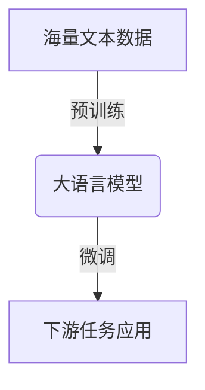
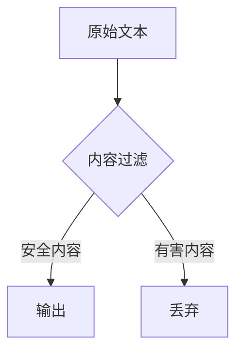

下面是以"大语言模型应用指南：防御策略"为主题的技术博客文章正文内容：

# 大语言模型应用指南：防御策略

## 1. 背景介绍

### 1.1 大语言模型的崛起

近年来,大型语言模型(Large Language Models, LLMs)在自然语言处理领域掀起了一场革命。这些模型通过在海量文本数据上进行预训练,获得了惊人的语言理解和生成能力,在机器翻译、问答系统、文本摘要等任务中表现出色。

代表性的大语言模型包括GPT-3、BERT、XLNet等,其中GPT-3凭借高达1750亿个参数的规模,展现出令人惊叹的文本生成质量,能够生成看似人类水平的文本内容。

### 1.2 安全隐患与防御需求

然而,大语言模型的强大能力也带来了一些潜在的安全隐患和伦理风险。由于这些模型是在公开互联网数据上训练的,它们可能会学习并复制一些有害、不当或非法的内容。此外,大语言模型还可能被滥用于生成诈骗性、仇恨性或暴力性的语言。

为了确保大语言模型的安全和负责任的使用,我们需要采取有效的防御策略,以降低相关风险,同时发挥这些模型的巨大潜力。本文将探讨大语言模型应用中的主要安全隐患,并提出相应的防御措施和最佳实践。

## 2. 核心概念与联系

### 2.1 大语言模型的工作原理

大语言模型的核心是一种基于transformer的序列到序列(Seq2Seq)模型,它能够学习文本数据中的上下文关系和语义信息。在训练过程中,模型会尝试预测下一个单词或标记,从而捕捉语言的统计规律。

预训练完成后,大语言模型可以通过微调(fine-tuning)等方式,将其应用于特定的下游任务,如文本生成、问答等。



### 2.2 安全隐患分类

大语言模型的安全隐患可以分为以下几个主要类别:

1. **有害内容生成**: 模型可能会生成包含仇恨、暴力、色情等有害内容的文本。
2. **版权侵犯**: 模型可能会复制受版权保护的内容。
3. **隐私泄露**: 模型可能会泄露个人隐私信息或敏感数据。
4. **误导性信息**: 模型生成的信息可能存在偏差或错误,导致误导。
5. **模型漏洞利用**: 黑客可能利用模型的漏洞进行攻击或操纵。

## 3. 核心算法原理具体操作步骤

### 3.1 内容过滤

内容过滤是防御有害内容生成的关键步骤。常见的方法包括:

1. **关键词过滤**: 使用预定义的关键词列表,过滤包含这些关键词的生成内容。
2. **语义过滤**: 利用语义分析技术,识别和过滤具有潜在有害语义的内容。
3. **人工审查**: 由人工审查员对生成的内容进行审核和过滤。



### 3.2 版权保护

为了避免版权侵犯,我们可以采取以下措施:

1. **指纹匹配**: 对训练数据进行指纹匹配,排除受版权保护的内容。
2. **水印嵌入**: 在生成的文本中嵌入不可见水印,以追踪其来源。
3. **输出检测**: 使用相似性检测算法,识别生成内容中的潜在版权侵犯行为。

### 3.3 隐私保护

保护个人隐私和敏感数据是大语言模型应用的另一个重要方面。常见的隐私保护措施包括:

1. **数据脱敏**: 在训练数据中对个人身份信息和敏感数据进行脱敏处理。
2. **差分隐私**: 在模型训练过程中引入噪声,以保护个人隐私。
3. **访问控制**: 对模型的访问和使用进行严格的访问控制和审计。

### 3.4 信息可靠性

为了确保生成内容的可靠性,我们可以采取以下策略:

1. **事实检查**: 利用知识图谱或外部数据源,对生成内容中的事实陈述进行验证。
2. **多模型集成**: 结合多个大语言模型的输出,通过投票或加权平均等方式获得更可靠的结果。
3. **人工审查**: 由专家人员对生成内容进行审核和校对。

### 3.5 模型安全性

为了防止模型被滥用或攻击,我们需要关注模型本身的安全性:

1. **漏洞修复**: 及时修复模型中发现的安全漏洞。
2. **对抗训练**: 通过对抗训练,提高模型对adversarial attack的鲁棒性。
3. **访问控制**: 对模型的访问和使用进行严格的访问控制和审计。

## 4. 数学模型和公式详细讲解举例说明

### 4.1 语言模型基础

大语言模型的核心是一种基于概率的语言模型,它旨在学习文本数据中的统计规律。给定一个文本序列 $X = (x_1, x_2, \dots, x_n)$,语言模型的目标是估计该序列的概率 $P(X)$。根据链式法则,我们可以将 $P(X)$ 分解为:

$$P(X) = P(x_1, x_2, \dots, x_n) = \prod_{i=1}^{n} P(x_i | x_1, \dots, x_{i-1})$$

其中 $P(x_i | x_1, \dots, x_{i-1})$ 表示在已知前 $i-1$ 个单词的情况下,第 $i$ 个单词出现的条件概率。

为了估计这些条件概率,我们可以使用神经网络模型,如 N-gram 语言模型或基于 transformer 的语言模型。这些模型会在训练过程中学习捕捉文本数据中的上下文信息和语义关系。

### 4.2 序列到序列模型

大语言模型通常采用序列到序列(Seq2Seq)的框架,将输入序列 $X$ 映射到输出序列 $Y$。这种框架可以用于机器翻译、文本摘要等任务。

在 Seq2Seq 模型中,我们首先使用一个编码器(encoder)将输入序列 $X$ 编码为一系列隐藏状态 $H = (h_1, h_2, \dots, h_n)$,然后使用一个解码器(decoder)根据这些隐藏状态生成输出序列 $Y$。

编码器和解码器都可以使用递归神经网络(如 LSTM 或 GRU)或transformer 结构。transformer 结构通过自注意力(self-attention)机制,能够更好地捕捉长距离依赖关系,因此在大语言模型中得到了广泛应用。

### 4.3 掩码语言模型

掩码语言模型(Masked Language Model, MLM)是一种常见的大语言模型预训练方式,它的目标是预测被掩码(masked)的单词。

给定一个输入序列 $X = (x_1, x_2, \dots, x_n)$,我们随机将其中的一些单词替换为特殊的掩码标记 [MASK]。模型的目标是根据上下文,正确预测这些被掩码的单词。

形式上,我们希望最大化以下条件概率:

$$\max_{\theta} \prod_{i=1}^{n} P(x_i | X^{masked}, \theta)$$

其中 $X^{masked}$ 表示包含掩码标记的输入序列, $\theta$ 是模型参数。

通过这种掩码预训练方式,大语言模型能够学习到丰富的语义和上下文信息,从而获得强大的语言理解和生成能力。

## 5. 项目实践:代码实例和详细解释说明

以下是一个使用 Hugging Face 库和 BERT 模型进行文本分类的示例代码,包括数据预处理、模型微调和评估等步骤。

```python
# 导入所需库
from transformers import BertTokenizer, BertForSequenceClassification
from transformers import TrainingArguments, Trainer
from datasets import load_dataset

# 加载数据集
dataset = load_dataset("imdb")

# 数据预处理
tokenizer = BertTokenizer.from_pretrained('bert-base-uncased')

def preprocess(examples):
    return tokenizer(examples['text'], truncation=True, padding='max_length', max_length=512)

encoded_dataset = dataset.map(preprocess, batched=True)

# 设置模型和训练参数
model = BertForSequenceClassification.from_pretrained('bert-base-uncased', num_labels=2)
training_args = TrainingArguments(output_dir='./results', num_train_epochs=3, per_device_train_batch_size=16)

# 训练模型
trainer = Trainer(
    model=model,
    args=training_args,
    train_dataset=encoded_dataset['train'],
    eval_dataset=encoded_dataset['test']
)
trainer.train()

# 评估模型
eval_result = trainer.evaluate()
print(f"Accuracy: {eval_result['eval_accuracy']}")
```

在这个示例中,我们首先加载 IMDB 电影评论数据集,然后使用 BERT tokenizer 对文本进行编码和预处理。接下来,我们加载预训练的 BERT 模型,并将其微调到文本分类任务上。最后,我们评估模型在测试集上的准确率。

需要注意的是,这只是一个简单的示例,在实际应用中,您可能需要进行更多的数据预处理、模型调优和部署等工作。

## 6. 实际应用场景

大语言模型在许多领域都有广泛的应用前景,包括但不限于:

1. **自然语言处理**: 文本生成、机器翻译、文本摘要、情感分析等。
2. **问答系统**: 构建智能问答助手,为用户提供准确、人性化的回答。
3. **内容创作**: 辅助写作、内容生成、创意灵感等。
4. **知识提取**: 从大量非结构化数据中提取有价值的知识和见解。
5. **对话系统**: 构建具有上下文理解能力的对话代理。

## 7. 工具和资源推荐

以下是一些常用的大语言模型工具和资源:

1. **Hugging Face Transformers**: 一个强大的自然语言处理库,提供了多种预训练语言模型和工具。
2. **OpenAI GPT-3**: 一个具有惊人性能的大型语言模型,可通过 API 访问。
3. **Google AI Language**: Google 提供的一系列自然语言处理工具和模型。
4. **AllenNLP**: 一个开源的自然语言处理研究库,包含多种模型和工具。
5. **LinggleCorpus**: 一个庞大的中文语料库,可用于训练和评估中文语言模型。

## 8. 总结:未来发展趋势与挑战

大语言模型的发展正处于一个关键时期。未来,我们可以预期会出现更大规模、更强大的语言模型,能够处理更复杂的任务。同时,模型的效率、可解释性和可控性也将成为重点关注的方向。

另一个值得关注的趋势是多模态大语言模型的兴起,这种模型能够同时处理文本、图像、视频等多种模态的数据,有望实现更自然、更智能的人机交互。

然而,大语言模型也面临着一些重大挑战,包括:

1. **计算资源需求**: 训练大型语言模型需要巨大的计算资源,这可能会带来高昂的成本和环境影响。
2. **数据质量和偏差**: 训练数据的质量和偏差会直接影响模型的表现和公平性。
3. **安全和隐私**: 如何确保大语言模型的安全使用,并保护个人隐私和知识产权,是一个亟待解决的问题。
4. **可解释性和可控性**: 目前的大语言模型往往是一个黑箱,缺乏可解释性和可控性,这可能会影响其在关键领域的应用。

总的来说,大语言模型的发展需要技术创新、伦理考量和社会共识