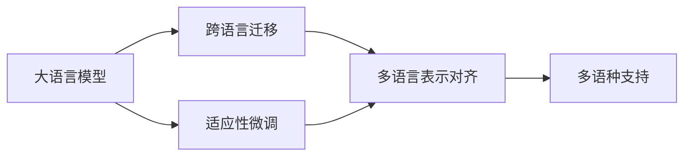

# 大语言模型的多语种支持:跨语言迁移与适应性研究

## 1.背景介绍
### 1.1 大语言模型的发展历程
#### 1.1.1 早期的语言模型
#### 1.1.2 Transformer的出现
#### 1.1.3 预训练语言模型的崛起

### 1.2 多语种支持的意义
#### 1.2.1 全球化背景下的语言需求  
#### 1.2.2 提升人工智能的普适性
#### 1.2.3 促进跨语言知识迁移

### 1.3 当前多语种支持的挑战
#### 1.3.1 语言多样性与复杂性
#### 1.3.2 语料资源的不平衡
#### 1.3.3 评估标准的缺乏

## 2.核心概念与联系
### 2.1 跨语言迁移
#### 2.1.1 定义与目标
#### 2.1.2 基于共享参数的迁移方法
#### 2.1.3 基于对比学习的迁移方法

### 2.2 适应性微调
#### 2.2.1 定义与目标
#### 2.2.2 基于梯度更新的微调方法
#### 2.2.3 基于提示学习的微调方法

### 2.3 多语言表示对齐
#### 2.3.1 词嵌入空间对齐
#### 2.3.2 句嵌入空间对齐 
#### 2.3.3 多语言对比学习

### 2.4 概念关系图


## 3.核心算法原理具体操作步骤
### 3.1 多语言预训练
#### 3.1.1 多语料混合预训练
1. 收集多种语言的无标注语料
2. 对语料进行清洗和预处理
3. 将不同语言的语料混合在一起
4. 使用混合语料对模型进行预训练

#### 3.1.2 翻译语言模型预训练
1. 构建平行语料库
2. 使用编码器-解码器结构
3. 编码器编码源语言句子
4. 解码器解码目标语言句子
5. 联合训练编码器和解码器

### 3.2 零样本跨语言迁移
#### 3.2.1 基于共享参数的迁移
1. 在源语言上预训练模型
2. 冻结模型参数
3. 在目标语言上微调分类器
4. 利用共享的编码器参数进行迁移

#### 3.2.2 基于对比学习的迁移
1. 构建多语言对比学习任务
2. 最大化正样本的相似度
3. 最小化负样本的相似度
4. 得到语言无关的句嵌入表示

### 3.3 少样本适应性微调
#### 3.3.1 基于梯度更新的微调
1. 在目标语言上准备少量标注数据
2. 使用预训练模型初始化参数
3. 在标注数据上进行梯度下降
4. 更新模型参数实现适应

#### 3.3.2 基于提示学习的微调
1. 设计语言无关的提示模板
2. 将任务转化为文本生成问题
3. 在少量样本上微调语言模型
4. 利用生成结果进行预测

## 4.数学模型和公式详细讲解举例说明
### 4.1 跨语言对比学习
给定一个batch的句子对 $\{(x_i, y_i)\}_{i=1}^N$，其中 $x_i$ 和 $y_i$ 分别表示不同语言的句子。我们的目标是学习一个编码函数 $f(\cdot)$，使得相似句子对的编码在语义空间中更接近。

损失函数定义为：

$$\mathcal{L} = -\sum_{i=1}^N \log \frac{\exp(\text{sim}(f(x_i), f(y_i))/\tau)}{\sum_{j=1}^N \exp(\text{sim}(f(x_i), f(y_j))/\tau)}$$

其中，$\text{sim}(\cdot)$ 表示余弦相似度，$\tau$ 是温度超参数。直观地看，该损失函数鼓励正样本对的相似度尽可能高，同时负样本对的相似度尽可能低。

举例说明：假设我们有一个英文句子 "I love natural language processing" 和一个对应的中文翻译 "我热爱自然语言处理"。通过对比学习，我们希望模型能够学到这两个句子在语义空间中是相近的，即 $f(\text{"I love natural language processing"}) \approx f(\text{"我热爱自然语言处理"})$。

### 4.2 适应性微调
假设我们有一个预训练的语言模型 $\mathcal{M}$，参数为 $\theta$。给定目标语言上的少量标注数据 $\mathcal{D}=\{(x_i, y_i)\}_{i=1}^K$，我们希望通过微调使模型适应目标任务。

微调的目标是最小化如下损失函数：

$$\mathcal{L}(\theta) = -\sum_{(x,y)\in\mathcal{D}} \log P(y|x;\theta)$$

其中，$P(y|x;\theta)$ 表示模型 $\mathcal{M}$ 在参数 $\theta$ 下给定输入 $x$ 生成标签 $y$ 的概率。我们通过梯度下降法来最小化损失函数，更新模型参数：

$$\theta \leftarrow \theta - \alpha \nabla_\theta \mathcal{L}(\theta)$$

其中，$\alpha$ 是学习率。

举例说明：假设我们有一个英文上预训练的情感分类模型，现在想将其适应到中文情感分类任务。我们收集一些中文情感标注数据，然后在这些数据上微调预训练模型，使其能够很好地处理中文情感分类问题。

## 5.项目实践：代码实例和详细解释说明
下面我们通过一个简单的PyTorch代码实例来说明如何进行跨语言文本分类。

```python
import torch
import torch.nn as nn
from transformers import AutoTokenizer, AutoModel

# 加载预训练的多语言模型和分词器
model_name = "xlm-roberta-base"
tokenizer = AutoTokenizer.from_pretrained(model_name)
model = AutoModel.from_pretrained(model_name)

# 定义微调的分类器
class Classifier(nn.Module):
    def __init__(self, hidden_size, num_labels):
        super().__init__()
        self.linear = nn.Linear(hidden_size, num_labels)
        
    def forward(self, pooled_output):
        return self.linear(pooled_output)

# 准备数据
texts = ["This movie is great!", "这部电影太棒了！"]
labels = [1, 1]  # 1表示正面情感，0表示负面情感

# 将文本转化为模型输入
inputs = tokenizer(texts, padding=True, truncation=True, return_tensors="pt")

# 提取句子表示
with torch.no_grad():
    outputs = model(**inputs)
    pooled_output = outputs.pooler_output

# 初始化分类器
hidden_size = pooled_output.shape[-1]
num_labels = 2
classifier = Classifier(hidden_size, num_labels)

# 计算分类概率
logits = classifier(pooled_output)
probs = torch.softmax(logits, dim=-1)

print(probs)
```

代码解释：
1. 我们首先加载了一个预训练的多语言模型`xlm-roberta-base`，这个模型在100多种语言上进行了预训练，具有很好的跨语言迁移能力。

2. 接着定义了一个简单的线性分类器`Classifier`，用于将模型输出的句子表示映射到情感标签上。

3. 我们准备了两个文本，一个英文的"This movie is great!"和一个中文的"这部电影太棒了！"，它们都表示正面情感。

4. 使用分词器将文本转化为模型可以接受的输入格式。

5. 将输入传给预训练模型，提取句子表示`pooled_output`。

6. 初始化分类器，将句子表示传入分类器，计算情感标签的概率分布。

7. 最后打印出概率分布，可以看到模型能够正确地判断出两个句子都表示正面情感，尽管它们分别来自英语和中文。

这个简单的例子展示了如何利用预训练的多语言模型进行跨语言迁移学习，实现对不同语言文本的情感分类。在实践中，我们还需要在目标语言上准备一些标注数据，用于微调模型，提高其在目标任务上的表现。

## 6.实际应用场景
多语种支持的大语言模型在实际应用中有广泛的用途，下面列举几个典型场景：

### 6.1 跨语言文本分类
利用多语言预训练模型，我们可以构建一个通用的文本分类系统，能够处理不同语言的文本，如情感分析、主题分类、垃圾邮件检测等。这对于全球化的企业和组织非常有帮助，可以大大降低开发和维护多个单语言系统的成本。

### 6.2 跨语言信息检索
多语种大语言模型可以将不同语言的文本映射到一个共享的语义空间中，从而实现跨语言信息检索。用户可以用一种语言进行查询，系统可以返回用其他语言编写的相关文档。这在学术研究、国际组织和跨国企业中有重要应用。

### 6.3 机器翻译后编辑
机器翻译系统的输出通常还需要人工进行后编辑和修正。使用多语种支持的大语言模型，可以开发智能的后编辑辅助工具，自动检测翻译错误并提供修改建议，从而提高翻译效率和质量。

### 6.4 多语言对话系统
对于跨国企业的客服系统，多语种对话系统可以用一个统一的模型处理不同语言的用户查询，大大简化系统架构和维护。此外，在医疗、法律等领域，多语言对话系统可以为不同语言背景的人们提供公平、高质量的服务。

### 6.5 低资源语言处理
世界上大多数语言都缺乏大规模标注数据，因此难以训练高质量的单语言模型。多语种大语言模型可以通过迁移学习的方式，将高资源语言的知识迁移到低资源语言上，从而提升低资源语言的各类任务性能。

## 7.工具和资源推荐
以下是一些常用的多语种大语言模型及相关资源：

1. [XLM-RoBERTa](https://huggingface.co/xlm-roberta-base)：基于Transformer的多语言预训练模型，在100多种语言上进行预训练，可用于各类跨语言任务。

2. [mBART](https://huggingface.co/facebook/mbart-large-cc25)：一个多语言的序列到序列预训练模型，支持25种语言，在机器翻译和跨语言摘要等任务上表现出色。

3. [mT5](https://huggingface.co/google/mt5-base)：多语言版的T5模型，在101种语言上进行预训练，可用于各类自然语言生成任务。

4. [XTREME](https://github.com/google-research/xtreme)：一个跨语言迁移学习的基准测试，涵盖了40多种语言的9个任务，可用于评估模型的跨语言泛化能力。

5. [HuggingFace](https://huggingface.co/)：一个流行的NLP工具包，提供了大量预训练模型和便捷的API，支持100多种语言，是开展多语言研究的首选工具。

6. [OPUS](http://opus.nlpl.eu/)：一个开放的多语言平行语料库，收集了多个领域的翻译数据，可用于训练机器翻译模型和对比学习等任务。

7. [WikiAnn](https://elisa-ie.github.io/wikiann/)：一个多语言命名实体识别数据集，覆盖了282种语言，可用于评估模型在实际应用中的表现。

8. [FLORES](https://github.com/facebookresearch/flores)：Facebook发布的一个多语言机器翻译评估基准，包括200个语言方向的测试集，可用于评估模型在低资源语言上的翻译质量。

## 8.总结：未来发展趋势与挑战
多语种支持是大语言模型发展的重要方向，对于促进人工智能的普惠化和全球化具有重要意义。未来的研究将继续探索以下几个方面：

1. 更大规模、更