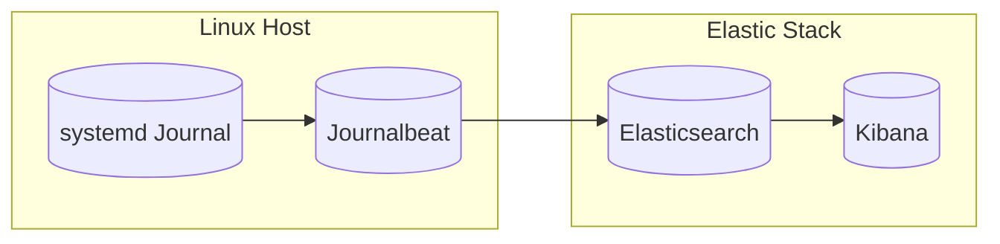

# 实战：使用Journalbeat采集systemd服务日志

## 1.背景介绍

在现代基础设施中,日志管理和分析是一项关键任务。随着容器和微服务架构的广泛采用,分布式系统中的日志数据变得越来越分散和庞大。有效地收集和处理这些日志数据对于故障排查、性能监控和安全审计至关重要。

systemd是Linux系统中广泛使用的系统和服务管理器,它以journal的形式记录系统和应用程序的日志。Journalbeat是Elastic Stack中的一个轻量级日志采集器,专门用于从systemd journal中读取和发送日志数据。它可以无缝集成到Elastic Stack中,为日志数据提供集中式存储、搜索和可视化功能。

## 2.核心概念与联系

### 2.1 Elastic Stack

Elastic Stack是一个开源的数据分析和可视化平台,由以下几个核心组件组成:

- Elasticsearch: 分布式搜索和分析引擎,用于存储和索引数据。
- Kibana: 数据可视化和探索的Web界面。
- Beats: 轻量级数据采集器,用于从不同来源收集数据并发送到Elasticsearch或Logstash。

### 2.2 Journalbeat

Journalbeat是Beats家族中专门用于从systemd journal中读取日志的成员。它具有以下关键特性:

- 高效读取: 使用内核接口直接从journal中读取数据,减少资源占用。
- 结构化数据: 保留journal中的元数据和结构化数据。
- 过滤和编码: 支持基于元数据过滤日志,并对日志进行编码。
- 监视多个机器: 可以从多台机器上的journal读取数据。

### 2.3 Mermaid 流程图

下面的Mermaid流程图展示了Journalbeat在Elastic Stack中的工作流程:



## 3.核心算法原理具体操作步骤

Journalbeat的核心算法原理包括以下几个步骤:

### 3.1 打开journal

Journalbeat使用systemd提供的`sdjournal`库直接打开本地或远程机器上的journal。它可以通过多种方式指定要读取的journal,例如机器ID、_MACHINE_ID元数据或Unix域套接字路径。

### 3.2 设置游标位置

Journalbeat使用一个名为`cursor`的概念来跟踪读取进度。它可以从上次读取的位置继续,也可以从journal的头或尾部开始读取。

### 3.3 读取journal条目

Journalbeat使用`sdjournal`库提供的API循环读取journal条目。每个条目都包含元数据和实际的日志内容。

### 3.4 过滤和编码

根据配置,Journalbeat可以基于元数据过滤日志条目。它还支持对日志内容进行编码,例如将JSON字符串解码为结构化数据。

### 3.5 发送到Elasticsearch

经过过滤和编码后,Journalbeat将日志数据发送到Elasticsearch进行存储和索引。

## 4.数学模型和公式详细讲解举例说明

在Journalbeat中,没有直接涉及复杂的数学模型或公式。但是,我们可以从日志数据的存储和索引角度来探讨一些相关概念。

在Elasticsearch中,每个日志条目被存储为一个JSON文档。这些文档被组织到不同的索引(indices)中,每个索引可以看作是一个优化的数据分区。Elasticsearch使用倒排索引(inverted index)的数据结构来加速搜索和聚合操作。

倒排索引的核心思想是将文档中的每个唯一词条(term)与包含该词条的文档列表相关联。这种数据结构可以高效地响应诸如"查找包含特定词条的所有文档"之类的查询。

我们可以使用一个简单的例子来说明倒排索引的工作原理。假设我们有三个文档:

$$
D_1 = \text{"the quick brown fox"}\\
D_2 = \text{"the lazy dog"}\\
D_3 = \text{"the quick fox jumps"}
$$

对于这三个文档,我们可以构建如下的倒排索引:

$$
\begin{array}{c|c}
\text{Term} & \text{Document List} \\\hline
\text{the} & \{D_1, D_2, D_3\} \\
\text{quick} & \{D_1, D_3\} \\
\text{brown} & \{D_1\} \\
\text{fox} & \{D_1, D_3\} \\
\text{lazy} & \{D_2\} \\
\text{dog} & \{D_2\} \\
\text{jumps} & \{D_3\}
\end{array}
$$

使用这种数据结构,如果我们想查找包含"quick"和"fox"的文档,只需要取两个词条的文档列表的交集,即`\{D_1, D_3\}`。这比逐个扫描每个文档的内容要高效得多。

虽然这是一个简化的例子,但它展示了倒排索引在日志数据存储和搜索中的重要作用。Elasticsearch在这个基础上进行了许多优化和扩展,以支持大规模数据集、分布式环境和复杂查询。

## 5.项目实践:代码实例和详细解释说明

### 5.1 安装Journalbeat

首先,我们需要在Linux机器上安装Journalbeat。可以从Elastic的官方仓库下载适合您系统的版本:

```bash
# 导入Elastic的GPG密钥
rpm --import https://artifacts.elastic.co/GPG-KEY-elasticsearch

# 添加Elastic仓库
echo "deb https://artifacts.elastic.co/packages/7.x/apt stable main" | sudo tee -a /etc/apt/sources.list.d/elastic-7.x.list

# 更新包索引
sudo apt-get update

# 安装Journalbeat
sudo apt-get install journalbeat
```

### 5.2 配置Journalbeat

安装完成后,我们需要编辑Journalbeat的配置文件`/etc/journalbeat/journalbeat.yml`。下面是一个示例配置:

```yaml
journalbeat.inputs:
- paths: 
    # 从本地journal读取
    - /var/log/journal/{{ .SHORTREV }}/system.journal
    # 从远程机器读取
    - remote+//remote-host.com

# 设置Elasticsearch输出
output.elasticsearch:
  hosts: ["http://elasticsearch-host:9200"]

# 启用日志记录
logging.level: info

# 添加自定义字段
processors:
- add_host_metadata: ~

# 包含特定的日志级别
journalbeat.inputs:
- paths: /var/log/journal/{{ .SHORTREV }}/system.journal
  seek:
    cursor: tail
    location:
      Logs:
        - INFO
        - WARNING
        - ERROR
```

这个配置文件指定了Journalbeat从哪里读取journal,如何过滤日志级别,以及将数据发送到哪个Elasticsearch实例。您可以根据需要进行自定义。

### 5.3 启动Journalbeat

配置完成后,我们可以启动Journalbeat服务:

```bash
# 启动Journalbeat
sudo systemctl start journalbeat

# 检查状态
sudo journalbeat status

# 查看日志
sudo journalctl -f --unit journalbeat
```

启动后,Journalbeat将开始从journal中读取日志数据,并将其发送到Elasticsearch进行存储和索引。

### 5.4 在Kibana中查看日志

最后,我们可以在Kibana中查看和分析从Journalbeat收集的日志数据。打开Kibana的Web界面,创建一个新的索引模式,然后就可以开始探索和可视化日志数据了。

## 6.实际应用场景

Journalbeat在以下场景中发挥着重要作用:

1. **集中式日志管理**: 将分散在多台机器上的systemd journal日志集中收集到Elastic Stack中,实现统一的存储、搜索和分析。

2. **容器和微服务日志**: 在基于容器和微服务的架构中,Journalbeat可以从每个容器或微服务实例中采集日志,提供全面的可见性和监控能力。

3. **故障排查和调试**: 通过搜索和分析日志数据,可以快速定位和诊断系统和应用程序的问题。

4. **安全审计**: 监视系统和应用程序的日志,检测潜在的安全威胁或异常行为。

5. **性能监控**: 分析日志中的指标和统计数据,了解系统和应用程序的性能表现。

6. **合规性和法规遵从**: 在受监管行业中,日志数据可用于证明合规性和满足法规要求。

## 7.工具和资源推荐

除了Journalbeat和Elastic Stack之外,以下工具和资源也可能对您有所帮助:

- **Filebeat**: Elastic Stack中另一个轻量级日志采集器,用于收集文件系统中的日志文件。

- **Logstash**: Elastic Stack中的数据处理管道,提供更强大的日志转换、过滤和enrichment功能。

- **Metricbeat**: Elastic Stack中用于收集系统和服务指标的组件。

- **Elastic Cloud**: Elastic提供的托管Elastic Stack服务,简化了部署和管理。

- **Elastic官方文档**: https://www.elastic.co/guide/index.html

- **Elastic社区论坛**: https://discuss.elastic.co/

## 8.总结:未来发展趋势与挑战

随着云原生技术和分布式系统的不断发展,日志管理和分析将变得越来越重要和复杂。未来,我们可能会看到以下趋势和挑战:

1. **日志数据量的增长**: 随着系统规模和复杂性的增加,需要处理的日志数据量将呈指数级增长。这对日志采集、存储和分析系统提出了更高的性能和扩展性要求。

2. **多种日志格式和来源**: 除了传统的文本日志,我们还需要处理结构化日志(如JSON)、跟踪数据、指标等多种格式的日志数据,来自容器、微服务、Serverless函数等多种来源。

3. **实时日志处理和分析**: 越来越多的场景需要实时处理和分析日志数据,例如实时监控、安全威胁检测和自动化运维。

4. **机器学习和人工智能**: 利用机器学习和人工智能技术,可以从海量日志数据中自动发现模式、异常和洞察,提高日志分析的效率和价值。

5. **安全性和隐私**: 随着日志数据中包含越来越多的敏感信息,确保日志采集、传输和存储的安全性和隐私性将变得至关重要。

6. **开源和商业解决方案的融合**: 开源日志管理解决方案(如Elastic Stack)将继续发展,同时也会有更多商业产品和服务出现,提供更好的支持、集成和附加功能。

面对这些趋势和挑战,日志管理和分析领域将不断创新和发展,以满足不断增长的需求。

## 9.附录:常见问题与解答

### 9.1 Journalbeat与Filebeat有什么区别?

Journalbeat和Filebeat都是Elastic Stack中的日志采集器,但它们的设计目标不同:

- Journalbeat专门用于从systemd journal中读取日志,利用了journal的特性和优化。
- Filebeat则是一个通用的日志文件采集器,可以从文件系统中读取各种格式的日志文件。

如果您的日志存储在journal中,使用Journalbeat会更高效;如果日志存储在文件中,则应该使用Filebeat。

### 9.2 如何从远程机器采集日志?

Journalbeat支持从远程机器上的journal读取日志。您需要在配置文件中指定远程机器的地址,例如`remote+//remote-host.com`。

### 9.3 如何过滤日志级别?

在Journalbeat的配置文件中,您可以使用`seek`选项来过滤特定的日志级别。例如,只包含INFO、WARNING和ERROR级别的日志:

```yaml
journalbeat.inputs:
- paths: /var/log/journal/{{ .SHORTREV }}/system.journal
  seek:
    cursor: tail
    location:
      Logs:
        - INFO
        - WARNING
        - ERROR
```

### 9.4 如何处理JSON格式的日志?

Journalbeat支持对JSON格式的日志进行解码,将其转换为结构化数据。您可以在配置文件中启用`decode_json_fields`选项,并指定要解码的字段。

### 9.5 如何监控Journalbeat的运行状态?

您可以使用Elastic Stack中的监控功能来监控Journalbeat的运行状态,包括CPU、内存和磁盘使用情况等