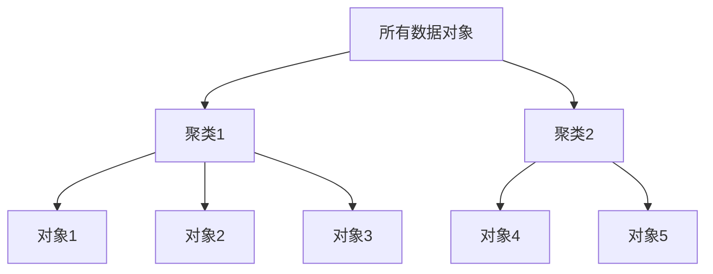
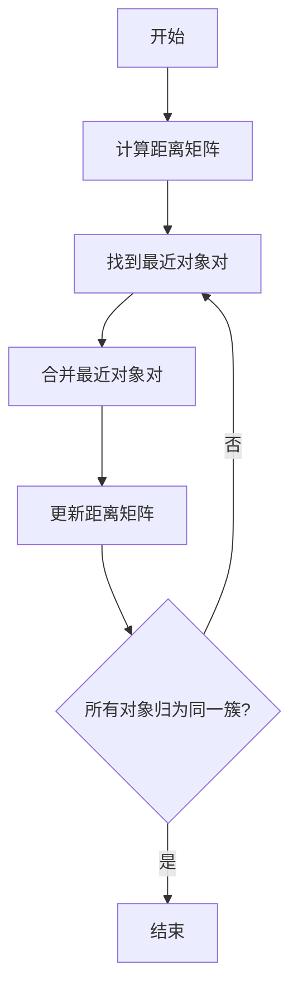

# 层次聚类(Hierarchical Clustering) - 原理与代码实例讲解

## 1.背景介绍

### 1.1 什么是聚类

聚类是一种无监督学习技术,旨在将相似的对象归为同一组。聚类广泛应用于多个领域,如计算机视觉、自然语言处理、生物信息学等。聚类可帮助发现数据中隐藏的模式和结构。

### 1.2 聚类的类型

常见的聚类算法包括:

- **分区聚类**: 将数据对象分成互不相交的簇,如 K-Means 算法。
- **层次聚类**: 构建层次聚类树,可分为凝聚式(自底向上)和分裂式(自顶向下)。
- **基于密度的聚类**: 根据数据密集程度划分簇,如 DBSCAN 算法。
- **基于网格的聚类**: 将数据空间划分为有限个单元格,并对其进行聚类。

本文着重介绍层次聚类算法。

### 1.3 层次聚类的应用

层次聚类广泛应用于以下领域:

- **基因组学**: 对基因表达数据进行聚类,识别具有相似表达模式的基因。
- **社交网络分析**: 对社交网络用户进行聚类,发现具有相似兴趣或行为的群组。
- **计算机视觉**: 对图像像素进行聚类,实现图像分割。
- **网页挖掘**: 对网页进行聚类,发现相似主题的网页组。
- **市场细分**: 根据客户特征对其进行聚类,实现精准营销。

## 2.核心概念与联系

### 2.1 层次聚类树

层次聚类的结果通常呈现为一种树形结构,称为层次聚类树或树状图。树的根节点代表整个数据集,每个叶节点代表一个数据对象。中间节点表示数据对象的聚类。



### 2.2 相似度度量

层次聚类算法需要定义一种相似度度量来判断两个对象或簇之间的相似程度。常用的相似度度量包括:

- **欧氏距离**: 计算两个向量之间的直线距离。
- **曼哈顿距离**: 计算两个向量各维度差值的绝对值之和。
- **余弦相似度**: 计算两个向量夹角的余弦值,常用于文本挖掘。
- **Jaccard相似系数**: 计算两个集合的交集大小与并集大小的比值。

### 2.3 聚类策略

层次聚类算法根据构建聚类树的方式分为两类:

- **凝聚式聚类(AGGLOMERATIVE)**: 初始时将每个对象作为一个簇,然后按照某种策略逐步合并最相似的簇,直至所有对象归为同一簇。这是自底向上的过程。
- **分裂式聚类(DIVISIVE)**: 初始时将所有对象作为一个簇,然后按照某种策略递归地将簇分裂为更小的簇,直至每个簇只包含一个对象。这是自顶向下的过程。

## 3.核心算法原理具体操作步骤

本节以凝聚式层次聚类为例,介绍算法的具体步骤。

### 3.1 算法步骤

1. **计算距离矩阵**: 计算所有对象对之间的距离或相似度,构建距离矩阵。
2. **找到最近对象对**: 在距离矩阵中找到距离最小的两个对象或簇。
3. **合并最近对象对**: 将找到的最近对象对合并为一个新的簇。
4. **更新距离矩阵**: 根据选定的聚类策略,计算新簇与其他簇的距离,更新距离矩阵。
5. **重复2-4步骤**: 重复步骤2-4,直至所有对象归为同一簇。

### 3.2 聚类策略

合并簇时需要定义簇间距离的计算方式,常用策略包括:

- **单链接(SINGLE)**: 簇间距离定义为两个簇中最近对象对的距离。
- **完全链接(COMPLETE)**: 簇间距离定义为两个簇中最远对象对的距离。
- **均值链接(AVERAGE)**: 簇间距离定义为两个簇所有对象对距离的均值。
- **重心链接(CENTROID)**: 簇间距离定义为两个簇质心之间的距离。
- **Ward's方法**: 基于最小化簇内平方和准则,每次合并使簇内平方和增加最小的对象对。

不同策略适用于不同数据分布,影响聚类效果。



## 4.数学模型和公式详细讲解举例说明

### 4.1 距离度量

假设有两个n维数据对象 $\vec{x} = (x_1, x_2, ..., x_n)$ 和 $\vec{y} = (y_1, y_2, ..., y_n)$, 常用的距离度量如下:

**欧氏距离**:
$$dist_{euclid}(\vec{x}, \vec{y}) = \sqrt{\sum_{i=1}^{n}(x_i - y_i)^2}$$

**曼哈顿距离**:
$$dist_{manhattan}(\vec{x}, \vec{y}) = \sum_{i=1}^{n}|x_i - y_i|$$

**Minkowski距离**:
$$dist_{minkowski}(\vec{x}, \vec{y}) = \left(\sum_{i=1}^{n}|x_i - y_i|^p\right)^{\frac{1}{p}}$$

其中 $p \geq 1$, 当 $p=2$ 时即为欧氏距离, $p=1$ 时为曼哈顿距离。

### 4.2 簇间距离

假设有两个簇 $C_1$ 和 $C_2$, 常用的簇间距离计算方式如下:

**单链接距离**:
$$dist_{single}(C_1, C_2) = \min\limits_{\vec{x} \in C_1, \vec{y} \in C_2}dist(\vec{x}, \vec{y})$$

**完全链接距离**:
$$dist_{complete}(C_1, C_2) = \max\limits_{\vec{x} \in C_1, \vec{y} \in C_2}dist(\vec{x}, \vec{y})$$

**均值链接距离**:
$$dist_{average}(C_1, C_2) = \frac{1}{|C_1||C_2|}\sum_{\vec{x} \in C_1}\sum_{\vec{y} \in C_2}dist(\vec{x}, \vec{y})$$

**重心链接距离**:
$$dist_{centroid}(C_1, C_2) = dist(\vec{c}_1, \vec{c}_2)$$
其中 $\vec{c}_1$ 和 $\vec{c}_2$ 分别为 $C_1$ 和 $C_2$ 的质心。

**Ward's距离**:
$$dist_{ward}(C_1, C_2) = \sqrt{\frac{|C_1||C_2|}{|C_1| + |C_2|}}dist(\vec{c}_1, \vec{c}_2)$$

这里采用了欧氏距离,也可使用其他距离度量。

### 4.3 层次聚类代价函数

层次聚类的目标是最小化所有簇内样本距离质心的平方和:

$$J = \sum_{k=1}^{K}\sum_{\vec{x} \in C_k}dist(\vec{x}, \vec{c}_k)^2$$

其中 $K$ 为簇的个数, $C_k$ 为第 $k$ 个簇, $\vec{c}_k$ 为第 $k$ 个簇的质心。

不同的聚类策略对应不同的代价函数,Ward's方法就是最小化上述代价函数。

## 5.项目实践: 代码实例和详细解释说明

以下是使用Python中的scikit-learn库实现层次聚类的示例代码:

```python
from sklearn.datasets import make_blobs
from sklearn.cluster import AgglomerativeClustering
import matplotlib.pyplot as plt

# 生成样本数据
X, y = make_blobs(n_samples=500, n_features=2, centers=4, cluster_std=1, random_state=1)

# 层次聚类
clustering = AgglomerativeClustering(n_clusters=4, linkage='ward').fit(X)
labels = clustering.labels_

# 可视化结果
plt.scatter(X[:, 0], X[:, 1], c=labels)
plt.title('Hierarchical Clustering')
plt.show()
```

### 5.1 导入库

首先导入所需的Python库:

- `make_blobs` 从 `sklearn.datasets` 用于生成样本数据。
- `AgglomerativeClustering` 从 `sklearn.cluster` 实现层次聚类算法。
- `matplotlib.pyplot` 用于数据可视化。

### 5.2 生成样本数据

使用 `make_blobs` 函数生成500个2维数据样本,包含4个簇,簇间标准差为1。

```python
X, y = make_blobs(n_samples=500, n_features=2, centers=4, cluster_std=1, random_state=1)
```

### 5.3 层次聚类

使用 `AgglomerativeClustering` 类执行层次聚类:

```python
clustering = AgglomerativeClustering(n_clusters=4, linkage='ward').fit(X)
```

- `n_clusters=4` 指定聚类数为4。
- `linkage='ward'` 指定使用Ward's聚类策略。
- `fit(X)` 在数据 `X` 上训练模型。

`clustering.labels_` 返回每个样本的簇标签。

### 5.4 可视化结果

使用matplotlib将聚类结果可视化,不同簇用不同颜色表示:

```python
plt.scatter(X[:, 0], X[:, 1], c=labels)
plt.title('Hierarchical Clustering')
plt.show()
```

运行该示例代码,可以看到如下可视化结果:


## 6.实际应用场景

层次聚类在以下场景中有广泛应用:

### 6.1 基因表达数据分析

在基因组学中,常使用层次聚类对基因表达数据进行聚类分析,发现具有相似表达模式的基因簇。这有助于鉴别与特定疾病或生物过程相关的基因,为药物开发和疾病诊断提供线索。

### 6.2 社交网络分析

在社交网络分析中,可以将用户视为对象,根据用户间的交互行为(如关注、点赞等)构建相似度矩阵,然后使用层次聚类算法对用户进行分组,发现具有相似兴趣或行为模式的用户群体。这对于精准营销和社区发现等应用非常有用。

### 6.3 文本挖掘

在文本挖掘领域,可以将文档表示为词频向量,然后基于文档间的相似度(如余弦相似度)进行层次聚类。这样可以自动发现文档的主题类别,对文档进行自动分类和组织。

### 6.4 市场细分

在市场营销领域,可以根据客户的人口统计学、地理和行为数据构建客户特征向量,然后使用层次聚类对客户进行分组。这样可以发现具有相似特征和需求的客户群体,为企业制定有针对性的营销策略提供依据。

## 7.工具和资源推荐

以下是一些实现层次聚类算法的流行工具和学习资源:

### 7.1 Python库

- **scikit-learn**: 机器学习库,提供 `AgglomerativeClustering` 类实现层次聚类。
- **SciPy**: 科学计算库,`scipy.cluster.hierarchy` 模块实现层次聚类算法。
- **Pandas**: 数据分析库,可与scikit-learn集成进行聚类分析。

### 7.2 R语言包

- **stats**: R基础包,提供 `hclust` 函数实现层次聚类。
- **cluster**: 聚类分析包,包含多种层次聚类算法。

### 7.3 在线课程

- 吴恩达机器学习公开课(Coursera): 介绍无监督学习和聚类算法原理。
- 斯坦福大学机器学习课程(Coursera): 包含聚类算