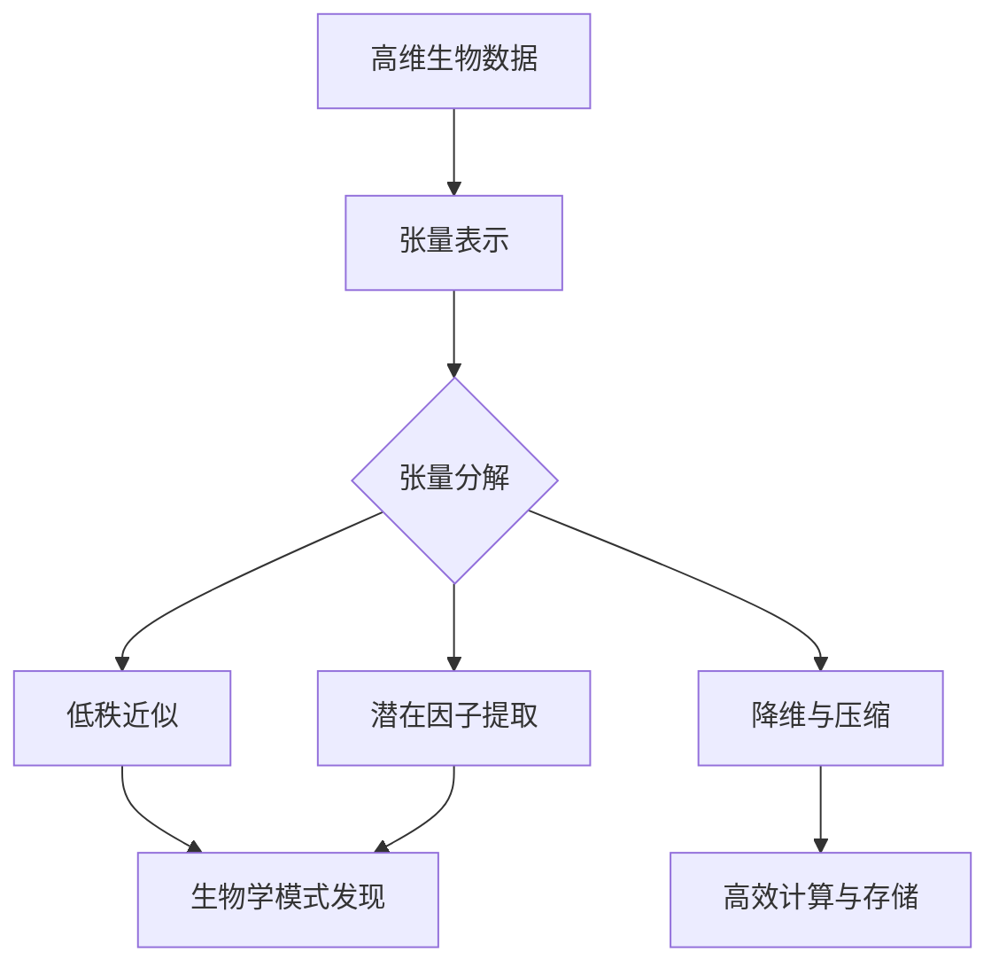

# 张量分解在生物信息学的应用

## 1. 背景介绍
### 1.1 生物信息学的发展历程
### 1.2 高维生物数据的挑战
### 1.3 张量分解技术的兴起

## 2. 核心概念与联系
### 2.1 张量的定义与表示
#### 2.1.1 张量的数学定义
#### 2.1.2 张量的图形化表示
#### 2.1.3 张量与矩阵、向量的关系
### 2.2 张量分解的基本概念
#### 2.2.1 张量分解的目标
#### 2.2.2 常见的张量分解模型
#### 2.2.3 张量分解与矩阵分解的区别
### 2.3 张量分解在生物信息学中的应用价值
#### 2.3.1 处理高维生物数据
#### 2.3.2 发现潜在的生物学模式
#### 2.3.3 提高计算效率与可解释性

## 3. 核心算法原理与具体操作步骤
### 3.1 CANDECOMP/PARAFAC (CP) 分解
#### 3.1.1 CP分解的数学定义
#### 3.1.2 CP分解的几何解释
#### 3.1.3 CP分解的计算步骤
### 3.2 Tucker分解
#### 3.2.1 Tucker分解的数学定义
#### 3.2.2 Tucker分解的核心张量
#### 3.2.3 Tucker分解的计算步骤
### 3.3 张量奇异值分解 (t-SVD)
#### 3.3.1 t-SVD的数学定义
#### 3.3.2 t-SVD与矩阵SVD的关系
#### 3.3.3 t-SVD的计算步骤

## 4. 数学模型和公式详细讲解举例说明
### 4.1 CP分解的数学模型与公式
#### 4.1.1 三阶张量的CP分解
$$\mathcal{X} \approx \sum_{r=1}^{R} \mathbf{a}_r \circ \mathbf{b}_r \circ \mathbf{c}_r$$
#### 4.1.2 高阶张量的CP分解推广
### 4.2 Tucker分解的数学模型与公式
#### 4.2.1 三阶张量的Tucker分解
$$\mathcal{X} \approx \mathcal{G} \times_1 \mathbf{A} \times_2 \mathbf{B} \times_3 \mathbf{C}$$
#### 4.2.2 核心张量与因子矩阵的含义
### 4.3 t-SVD的数学模型与公式
#### 4.3.1 张量的t-SVD分解
$$\mathcal{X} = \mathcal{U} * \mathcal{S} * \mathcal{V}^\top$$
#### 4.3.2 t-SVD分解的性质与应用

## 5. 项目实践：代码实例和详细解释说明
### 5.1 使用Python的TensorLy库进行张量分解
#### 5.1.1 安装与导入TensorLy库
#### 5.1.2 创建与操作张量
#### 5.1.3 进行CP分解与Tucker分解
### 5.2 使用MATLAB的Tensor Toolbox进行张量分解
#### 5.2.1 安装与导入Tensor Toolbox
#### 5.2.2 创建与操作张量
#### 5.2.3 进行CP分解、Tucker分解与t-SVD
### 5.3 实际生物数据的张量分解案例
#### 5.3.1 基因表达数据的张量分解
#### 5.3.2 蛋白质-蛋白质相互作用网络的张量分解
#### 5.3.3 脑影像数据的张量分解

## 6. 实际应用场景
### 6.1 基因表达数据分析
#### 6.1.1 发现基因共表达模块
#### 6.1.2 识别关键调控因子
#### 6.1.3 疾病诊断与预后预测
### 6.2 蛋白质组学数据分析
#### 6.2.1 蛋白质复合物识别
#### 6.2.2 蛋白质功能预测
#### 6.2.3 药物靶点发现
### 6.3 脑影像数据分析
#### 6.3.1 脑功能网络构建
#### 6.3.2 脑疾病诊断与分类
#### 6.3.3 脑认知过程研究

## 7. 工具和资源推荐
### 7.1 张量分解的软件工具
#### 7.1.1 MATLAB Tensor Toolbox
#### 7.1.2 Python TensorLy
#### 7.1.3 R rTensor
### 7.2 张量分解的在线学习资源
#### 7.2.1 在线课程
#### 7.2.2 教程与博客
#### 7.2.3 学术论文与综述
### 7.3 生物信息学数据库与工具
#### 7.3.1 基因表达数据库
#### 7.3.2 蛋白质相互作用数据库
#### 7.3.3 生物信息学分析工具

## 8. 总结：未来发展趋势与挑战
### 8.1 张量分解技术的发展趋势
#### 8.1.1 更高阶张量的分解方法
#### 8.1.2 张量分解与深度学习的结合
#### 8.1.3 张量分解在多组学数据整合中的应用
### 8.2 张量分解在生物信息学中面临的挑战
#### 8.2.1 生物数据的高维度与高噪声
#### 8.2.2 张量分解结果的生物学解释
#### 8.2.3 计算效率与可扩展性问题
### 8.3 未来研究方向与展望
#### 8.3.1 张量分解与因果推断
#### 8.3.2 张量分解在个性化医疗中的应用
#### 8.3.3 张量分解与人工智能在生物医学中的融合

## 9. 附录：常见问题与解答
### 9.1 张量分解与主成分分析（PCA）的区别
### 9.2 张量分解的计算复杂度如何？
### 9.3 如何选择合适的张量分解模型？
### 9.4 张量分解结果的可视化方法有哪些？
### 9.5 张量分解在其他领域还有哪些应用？

作者：禅与计算机程序设计艺术 / Zen and the Art of Computer Programming