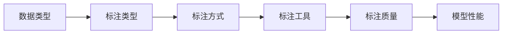

# 手把手教你选择最适合你的数据标注工具

## 1. 背景介绍

在当今人工智能快速发展的时代,高质量的训练数据对于构建高性能的机器学习模型至关重要。数据标注是获取高质量训练数据的关键步骤,它直接影响着模型的性能表现。然而,面对市面上众多的数据标注工具,如何选择一款最适合自己需求的工具,成为了许多AI从业者面临的难题。本文将从数据标注的核心概念出发,深入剖析主流数据标注工具的特点,并给出实用的选择建议,助力你在数据标注的道路上更进一步。

### 1.1 数据标注的重要性
#### 1.1.1 高质量训练数据的必要性
#### 1.1.2 数据标注在AI开发流程中的地位
#### 1.1.3 数据标注对模型性能的影响

### 1.2 数据标注的主要类型
#### 1.2.1 分类标注
#### 1.2.2 文本标注  
#### 1.2.3 图像标注
#### 1.2.4 视频标注
#### 1.2.5 语音标注

### 1.3 数据标注面临的挑战
#### 1.3.1 标注成本高
#### 1.3.2 标注效率低
#### 1.3.3 标注质量难以保证
#### 1.3.4 数据安全与隐私问题

## 2. 核心概念与联系

要选择合适的数据标注工具,首先需要了解数据标注的一些核心概念,它们之间的关系如下图所示:



### 2.1 数据类型
数据标注工具通常根据待标注的数据类型进行分类,主要包括:
#### 2.1.1 文本数据
#### 2.1.2 图像数据
#### 2.1.3 视频数据 
#### 2.1.4 语音数据

### 2.2 标注类型
针对不同的数据类型和应用场景,标注类型也各不相同:
#### 2.2.1 分类标注
#### 2.2.2 检测标注
#### 2.2.3 分割标注
#### 2.2.4 关键点标注
#### 2.2.5 文本标注

### 2.3 标注方式 
标注方式反映了标注过程的人机协作程度:
#### 2.3.1 人工标注
#### 2.3.2 半自动化标注
#### 2.3.3 自动化标注

### 2.4 标注质量
标注质量直接决定了训练数据的可用性,通常从以下几个维度进行评估:
#### 2.4.1 准确性
#### 2.4.2 一致性
#### 2.4.3 完整性
#### 2.4.4 及时性

## 3. 核心算法原理具体操作步骤

数据标注工具的核心是其内置的自动化标注算法,以下是几种常见算法的原理和操作步骤。

### 3.1 主动学习(Active Learning)
#### 3.1.1 基本原理
主动学习通过模型主动挑选最有价值的未标注样本让人工标注,从而用最少的标注成本获得最大的性能提升。
#### 3.1.2 算法步骤
1. 用少量已标注数据训练初始模型
2. 用模型对未标注数据进行预测
3. 根据一定的策略选择最有价值的样本
4. 人工标注所选样本
5. 将新标注的样本加入训练集,重复步骤2-5

### 3.2 迁移学习(Transfer Learning)  
#### 3.2.1 基本原理
迁移学习利用在其他相关任务上训练的模型作为预训练模型,在新任务上进行微调,减少所需标注数据。
#### 3.2.2 算法步骤  
1. 选择合适的预训练模型
2. 冻结预训练模型的部分层
3. 在新任务的少量标注数据上微调模型
4. 用微调后的模型对未标注数据进行预测
5. 人工校验预测结果

### 3.3 半监督学习(Semi-supervised Learning)
#### 3.3.1 基本原理
半监督学习利用未标注数据中蕴含的信息,结合少量已标注数据,训练出性能更好的模型。
#### 3.3.2 算法步骤
1. 用已标注数据训练初始模型  
2. 用初始模型对未标注数据进行预测
3. 选择置信度高的预测结果作为新的训练样本
4. 将新样本加入训练集,重复步骤2-4

## 4. 数学模型和公式详细讲解举例说明

为了更好地理解数据标注算法的内在机理,这里以主动学习为例,详细讲解其背后的数学模型。

### 4.1 不确定性采样(Uncertainty Sampling)

不确定性采样是主动学习最常用的样本选择策略,其核心思想是选择那些模型最不确定的样本让人工标注。常见的不确定性度量包括:

#### 4.1.1 最小置信度(Least Confidence)

$x^*_{LC} = \underset{x}{\arg\max} \  1 - P_\theta(\hat{y}|x)$

其中$x$为未标注样本,$\hat{y} = \underset{y}{\arg\max} \  P_\theta(y|x)$为模型预测的标签,$P_\theta(\hat{y}|x)$为模型对其预测标签的置信度。

#### 4.1.2 边缘采样(Margin Sampling) 

$x^*_{MS} = \underset{x}{\arg\min} \  P_\theta(\hat{y}_1|x) - P_\theta(\hat{y}_2|x)$

其中$\hat{y}_1$和$\hat{y}_2$分别为模型预测的置信度最高和次高的标签。

#### 4.1.3 熵(Entropy)

$x^*_{H} = \underset{x}{\arg\max} \  - \sum_{y} P_\theta(y|x) \log P_\theta(y|x)$

熵衡量了模型预测分布的不确定性,熵越大表示模型越不确定。

### 4.2 基于委员会的采样(Query-By-Committee)

QBC通过训练多个模型组成委员会,对未标注样本进行预测,选择委员会意见分歧最大的样本让人工标注。常见的分歧度量包括:

#### 4.2.1 投票熵(Vote Entropy)

$x^*_{VE} = \underset{x}{\arg\max} \  - \sum_{y} \frac{V(y)}{C} \log \frac{V(y)}{C}$

其中$C$为委员会的模型数,$V(y)$为预测标签为$y$的模型数。

#### 4.2.2 平均KL散度(Average KL Divergence)

$$x^*_{AKL} = \underset{x}{\arg\max} \  \frac{1}{C} \sum_{c=1}^{C} D_{KL}(P_c \| P_C)$$

$$P_C(y) = \frac{1}{C} \sum_{c=1}^{C} P_{\theta_c}(y|x)$$

其中$P_{\theta_c}$为第$c$个模型的后验概率分布,$P_C$为所有模型预测分布的平均,$D_{KL}$为KL散度,用于衡量两个分布的差异。

## 5. 项目实践：代码实例和详细解释说明

下面以Python为例,演示如何用主动学习进行图像分类任务的数据标注。

### 5.1 初始化模型和数据集

```python
import numpy as np
from sklearn.ensemble import RandomForestClassifier
from modAL.models import ActiveLearner

# 初始化随机森林分类器
model = RandomForestClassifier()

# 初始化主动学习器
learner = ActiveLearner(
    estimator=model,
    query_strategy=uncertainty_sampling,
    X_training=X_initial, 
    y_training=y_initial
)
```

这里我们使用随机森林作为基分类器,uncertainty_sampling作为查询策略,同时提供少量初始标注数据用于训练初始模型。

### 5.2 主动学习循环

```python
# 迭代进行主动学习
for idx in range(num_queries):
    query_idx, query_sample = learner.query(X_pool)
    label = oracle(query_sample)
    learner.teach(query_sample, label)
    X_pool = np.delete(X_pool, query_idx, axis=0)
```

每一轮迭代中,主动学习器会根据当前模型和查询策略,从未标注样本池X_pool中选择最有价值的样本query_sample,然后询问人工标注者(oracle)获得其标签label,再将新标注的样本加入训练集并更新模型,不断重复此过程直到达到预设的查询次数num_queries。

### 5.3 评估模型性能

```python
# 在测试集上评估模型性能
accuracy = learner.score(X_test, y_test)
print(f"Accuracy after {num_queries} queries: {accuracy}")
```

在每轮查询结束后,我们可以在单独的测试集上评估模型的性能,以验证主动学习的有效性。通过对比使用主动学习和随机采样所需的标注样本数,可以直观地体现主动学习的优势。

## 6. 实际应用场景

数据标注工具在各个领域都有广泛应用,下面列举几个典型场景:

### 6.1 自然语言处理
- 命名实体识别
- 关系抽取
- 情感分析
- 文本分类

### 6.2 计算机视觉
- 图像分类
- 目标检测
- 语义分割
- 关键点检测

### 6.3 语音识别
- 语音转文字
- 说话人识别
- 情绪识别

### 6.4 医学影像
- 病灶检测
- 器官分割
- 疾病诊断

## 7. 工具和资源推荐

市面上常用的数据标注工具有:

### 7.1 通用工具
- LabelMe
- LabelImg
- CVAT
- Labelbox
- Supervisely

### 7.2 文本标注工具
- Doccano
- Prodigy
- BRAT
- Tagtog

### 7.3 语音标注工具
- Praat
- Audacity
- EchoML

### 7.4 开源资源
- ImageNet
- COCO
- VOC
- SQuAD
- GLUE

## 8. 总结：未来发展趋势与挑战

随着人工智能技术的不断进步,数据标注工具也在向着更加智能化、自动化的方向发展。未来的发展趋势主要有以下几点:

### 8.1 多模态标注
多模态数据的标注需求日益增长,未来的标注工具需要支持文本、图像、视频、语音等多种模态数据的标注。

### 8.2 弱监督标注
弱监督学习可以利用大量无标注数据和少量弱标注数据训练模型,大大减轻人工标注的负担。将弱监督学习与主动学习相结合是一个有前景的研究方向。

### 8.3 联邦学习标注
联邦学习允许在不共享原始数据的情况下进行协作学习,可以有效解决数据隐私和安全问题。支持联邦学习的标注工具可以促进不同组织间的数据共享和协作。 

### 8.4 持续学习标注
持续学习旨在让模型在面对新数据时能够不断学习和进化,减少因数据分布变化而导致的性能下降。持续学习标注工具可以自适应动态变化的数据,持续提升模型性能。

同时,数据标注也面临着以下挑战:

- 标注成本高昂
- 缺乏标注人才
- 数据质量难以保证
- 数据安全和隐私问题

未来,数据标注工具如何进一步降低标注成本、提高标注效率、保证数据质量和隐私安全,将是值得关注的重点问题。

## 9. 附录：常见问题与解答

### 9.1 什么是数据标注?
数据标注是为原始数据样本添加标签的过程,是构建高质量训练数据集的关键步骤。

### 9.2 数据标注有哪些常见类型?
常见的数据标注类型包括分类、检测、分割、关键点、文本等。

### 9.3 如何选择数据标注工具?
选择标注工具需要考虑数据类型、标注类型、标注方式、性能需求、成本预算等因素,建议多试用几种工具进行对比。

### 9.4 数据标注的一般流程是怎样