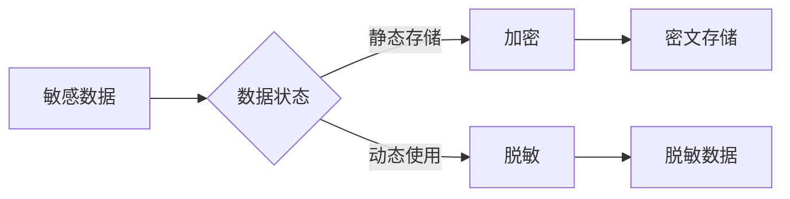

# 数据加密与脱敏：保护敏感信息

## 1. 背景介绍

在当今数字化时代,数据已成为各行各业的宝贵资产。随着大数据、云计算、人工智能等技术的快速发展,企业和组织收集、存储和处理的数据量呈指数级增长。然而,这些数据中往往包含大量敏感信息,如个人身份信息、财务数据、医疗记录等。一旦这些敏感数据遭到泄露或滥用,将给个人隐私和企业声誉带来严重损害。因此,数据加密和脱敏技术应运而生,成为保护敏感信息安全的重要手段。

### 1.1 数据安全面临的挑战

- 数据泄露事件频发
- 隐私保护法规日益严格
- 网络攻击手段不断升级
- 内部人员安全意识薄弱

### 1.2 数据加密与脱敏的重要性

- 保护个人隐私 
- 维护企业声誉
- 满足法律合规要求
- 提升数据安全水平

## 2. 核心概念与联系

### 2.1 数据加密

数据加密是将明文数据转换为密文的过程,使得未经授权的人无法直接读取原始数据内容。加密过程通常使用加密算法和密钥,只有拥有正确密钥的人才能解密还原数据。

### 2.2 数据脱敏

数据脱敏是对敏感数据进行变形、替换、删除等处理,使其不再敏感,同时保留数据的可用性。脱敏后的数据可用于测试、开发、数据分析等场景,而不会泄露真实的敏感信息。

### 2.3 两者之间的联系

数据加密和脱敏都是保护敏感数据的手段,但侧重点有所不同:
- 加密强调数据的机密性,防止未授权访问
- 脱敏强调在保护隐私的同时保留数据可用性

在实践中,两者常结合使用,形成纵深防御:
- 静态存储的敏感数据进行加密
- 动态使用的敏感数据进行脱敏



## 3. 核心算法原理具体操作步骤

### 3.1 对称加密算法

对称加密使用同一个密钥进行加密和解密。常见算法有:
- DES
- 3DES 
- AES

以AES为例,加密步骤如下:
1. 密钥扩展:由种子密钥生成轮密钥
2. 初始轮:AddRoundKey
3. 重复轮:SubBytes、ShiftRows、MixColumns、AddRoundKey
4. 最终轮:SubBytes、ShiftRows、AddRoundKey

解密步骤与加密相反。

### 3.2 非对称加密算法

非对称加密使用公钥加密,私钥解密。常见算法有:
- RSA
- ECC

以RSA为例,加密步骤如下:
1. 选择两个大质数p和q
2. 计算n=p*q
3. 计算欧拉函数φ(n)=(p-1)(q-1)
4. 选择整数e,满足1<e<φ(n)且gcd(e,φ(n))=1
5. 计算d,满足d*e≡1 mod φ(n)
6. 公钥为(n,e),私钥为(n,d)
7. 加密:c=m^e mod n
8. 解密:m=c^d mod n

### 3.3 哈希算法

哈希将任意长度的数据映射为固定长度的摘要。常见算法有:
- MD5
- SHA-1
- SHA-256

哈希的特点是:
- 单向性:难以由摘要反推原数据
- 雪崩效应:输入微小改变,输出剧烈变化
- 抗碰撞性:难以找到不同输入得到相同输出

### 3.4 数据脱敏方法

常见的数据脱敏方法包括:
- 隐藏/删除:如隐藏身份证号后4位
- 替换:如用星号替换部分字符
- 加密:可逆的替代真实数据
- 数据变形:改变数据格式如地址用坐标表示
- 假名化:用等价的虚构数据代替

## 4. 数学模型和公式详细讲解举例说明

### 4.1 AES加密数学基础

AES基于有限域上的多项式运算。设有限域为$GF(2^8)$,多项式系数为字节(8位)。

- 多项式加法:系数按位异或(XOR)
$$
(x^6+x^4+x^2+x+1)+(x^7+x+1)=x^7+x^6+x^4+x^2
$$

- 多项式乘法:系数乘法后求和,系数乘法定义为有限域乘法
$$
(x^6+x^4+x^2+x+1)(x^7+x+1)=x^{13}+x^{11}+x^9+x^8+x^7+x^6+x^4+x^2+1
$$

AES中使用不可约多项式$x^8+x^4+x^3+x+1$进行模运算。

### 4.2 RSA中模运算

RSA安全性基于大整数因数分解困难性。

模运算定义:若整数a、n互质,且$a^k \equiv 1 \pmod n$,则k为a模n的阶,记为$\delta_n(a)$。

欧拉函数$\phi(n)$表示小于n且与n互质的正整数个数。若n为质数p,则$\phi(p)=p-1$。

欧拉定理:若整数a、n互质,则$a^{\phi(n)} \equiv 1 \pmod n$。

由此,可得RSA中ed满足:$ed \equiv 1 \pmod{\phi(n)}$,即$ed=k\phi(n)+1$。

## 5. 项目实践：代码实例和详细解释说明

以下是使用Python实现AES加密和RSA加密的示例代码。

### 5.1 AES加密实例

```python
from Crypto.Cipher import AES
from Crypto.Random import get_random_bytes

# 生成随机的16字节密钥
key = get_random_bytes(16)

# 创建AES加密器
cipher = AES.new(key, AES.MODE_EAX)
plaintext = b'This is a secret message!'

# 加密明文
ciphertext, tag = cipher.encrypt_and_digest(plaintext)

# 解密密文
cipher = AES.new(key, AES.MODE_EAX, nonce=cipher.nonce)
decrypted_plaintext = cipher.decrypt_and_verify(ciphertext, tag)

print(f"Original plaintext: {plaintext}")
print(f"Encrypted ciphertext: {ciphertext}")
print(f"Decrypted plaintext: {decrypted_plaintext}")
```

代码解释:
1. 生成随机的16字节AES密钥
2. 创建AES加密器,使用EAX模式(提供认证)
3. 加密明文,得到密文和认证标签
4. 解密密文,需要提供密钥、nonce和标签,验证通过返回明文

### 5.2 RSA加密实例

```python
from Crypto.PublicKey import RSA
from Crypto.Cipher import PKCS1_OAEP

# 生成RSA密钥对
key = RSA.generate(2048)
private_key = key.export_key()
public_key = key.publickey().export_key()

# 创建RSA加密器
encryptor = PKCS1_OAEP.new(RSA.import_key(public_key))
plaintext = b'This is a secret message!'

# 加密明文
ciphertext = encryptor.encrypt(plaintext)

# 解密密文  
decryptor = PKCS1_OAEP.new(RSA.import_key(private_key))
decrypted_plaintext = decryptor.decrypt(ciphertext)

print(f"Original plaintext: {plaintext}")
print(f"Encrypted ciphertext: {ciphertext}")
print(f"Decrypted plaintext: {decrypted_plaintext}")
```

代码解释:
1. 生成2048位RSA密钥对
2. 创建RSA加密器,使用PKCS#1 OAEP填充
3. 加密明文,使用公钥
4. 解密密文,使用私钥,得到原始明文

## 6. 实际应用场景

数据加密和脱敏在各行业有广泛应用,例如:

### 6.1 金融行业

- 信用卡号、账户信息加密存储
- 交易记录、财务数据脱敏后进行数据分析

### 6.2 医疗行业

- 患者身份信息、病历加密存储
- 医疗数据脱敏后用于医学研究、药物开发

### 6.3 电商行业  

- 用户身份信息、收货地址加密存储
- 订单数据脱敏后用于商业智能分析

### 6.4 政府部门

- 公民身份信息、档案加密存储
- 统计数据脱敏后对外发布

## 7. 工具和资源推荐

### 7.1 开源加密库

- OpenSSL:支持多种加密算法的开源库
- Bouncy Castle:Java平台的加密库
- Crypto++:C++加密算法库

### 7.2 商业数据脱敏工具

- IBM Guardium Data Redaction
- Oracle Data Redaction
- Informatica Persistent Data Masking
- Protegrity Data Security Platform

### 7.3 学习资源

- 《应用密码学:协议、算法与C源程序》(Bruce Schneier)
- 《密码编码学与网络安全:原理与实践》(William Stallings)
- Crypto 101:密码学入门课程
- Coursera密码学专项课程

## 8. 总结：未来发展趋势与挑战

数据加密和脱敏技术将向以下方向发展:

### 8.1 同态加密

允许直接对密文进行计算,无需解密。这将极大提升云计算等场景下的数据安全性和可用性。

### 8.2 多方安全计算

允许多方在不泄露各自隐私数据的前提下进行联合计算。这对金融、医疗等行业的数据流通与协作至关重要。

### 8.3 基于硬件的加密

利用TPM、SGX等可信硬件,提供更高强度的密钥保护和可信执行环境,防止密钥泄露和代码篡改。

### 8.4 量子计算挑战

量子计算机的出现将威胁现有加密体系。后量子密码学算法如格基密码的研究将成为热点。

## 9. 附录：常见问题与解答

### Q1:对称加密和非对称加密的区别?

- 对称加密加解密使用同一密钥,非对称使用公私钥对
- 对称加密速度快,适合大量数据加密;非对称加密速度慢,适合少量数据
- 对称加密密钥管理困难;非对称加密解决了密钥分发问题

### Q2:哈希和加密的区别?

- 哈希是单向不可逆的,加密是可逆的
- 哈希输出长度固定,加密输出长度不固定
- 哈希用于完整性验证,加密用于机密性保护

### Q3:脱敏和匿名化的区别?  

- 脱敏保留了数据格式和部分信息,如手机号保留前3位
- 匿名化完全移除了识别个体的信息,如用随机ID代替用户名
- 脱敏后数据仍可用于业务,匿名化主要用于数据分析

### Q4:加密和访问控制的关系?

- 加密防止未授权的数据泄露,如数据库加密
- 访问控制限制对数据的访问,如用户权限管理
- 两者结合使用,构建纵深防御体系,如先认证用户身份再解密数据

作者：禅与计算机程序设计艺术 / Zen and the Art of Computer Programming