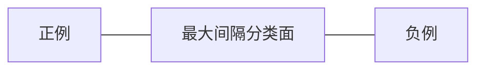

# 《机器学习算法：支持向量机》

## 1.背景介绍
### 1.1 机器学习的发展历程
### 1.2 支持向量机的诞生
### 1.3 支持向量机的重要性和影响力

## 2.核心概念与联系
### 2.1 支持向量的概念
#### 2.1.1 什么是支持向量
#### 2.1.2 支持向量的特点
#### 2.1.3 支持向量在分类中的作用
### 2.2 最大间隔分类器
#### 2.2.1 什么是最大间隔分类器
#### 2.2.2 最大间隔分类器的优点
#### 2.2.3 最大间隔分类器与支持向量机的关系
### 2.3 核函数
#### 2.3.1 核函数的概念
#### 2.3.2 常见的核函数类型
#### 2.3.3 核函数在支持向量机中的应用

## 3.核心算法原理具体操作步骤
### 3.1 线性支持向量机
#### 3.1.1 线性可分支持向量机
#### 3.1.2 线性不可分支持向量机
#### 3.1.3 软间隔支持向量机
### 3.2 非线性支持向量机
#### 3.2.1 核技巧
#### 3.2.2 SMO算法
#### 3.2.3 序列最小优化算法
### 3.3 多分类支持向量机
#### 3.3.1 一对一(One-vs-One)
#### 3.3.2 一对多(One-vs-Rest)
#### 3.3.3 有向无环图(DAG-SVM)

## 4.数学模型和公式详细讲解举例说明
### 4.1 线性支持向量机的数学模型
#### 4.1.1 函数间隔和几何间隔
#### 4.1.2 最优化问题的建立
#### 4.1.3 对偶问题求解
### 4.2 非线性支持向量机的数学模型  
#### 4.2.1 核函数的引入
#### 4.2.2 核矩阵的性质
#### 4.2.3 SMO算法的数学推导
### 4.3 数学模型的应用举例
#### 4.3.1 线性分类问题
#### 4.3.2 非线性分类问题
#### 4.3.3 回归问题

## 5.项目实践：代码实例和详细解释说明
### 5.1 Python中的支持向量机库
#### 5.1.1 Scikit-learn中的SVM
#### 5.1.2 LIBSVM和LIBLINEAR
#### 5.1.3 Tensorflow和Keras中的SVM
### 5.2 线性SVM代码实例
#### 5.2.1 数据集准备
#### 5.2.2 模型训练
#### 5.2.3 结果评估
### 5.3 非线性SVM代码实例
#### 5.3.1 数据集准备
#### 5.3.2 模型训练
#### 5.3.3 结果评估
### 5.4 多分类SVM代码实例 
#### 5.4.1 数据集准备
#### 5.4.2 模型训练
#### 5.4.3 结果评估

## 6.实际应用场景
### 6.1 文本分类
#### 6.1.1 垃圾邮件检测
#### 6.1.2 情感分析
#### 6.1.3 主题分类
### 6.2 图像分类
#### 6.2.1 手写数字识别
#### 6.2.2 人脸识别
#### 6.2.3 遥感图像分类  
### 6.3 生物信息学
#### 6.3.1 蛋白质结构预测
#### 6.3.2 基因表达数据分类
#### 6.3.3 药物分子筛选

## 7.工具和资源推荐
### 7.1 数据集资源
#### 7.1.1 UCI机器学习库
#### 7.1.2 Kaggle数据集
#### 7.1.3 OpenML数据集
### 7.2 开源库和工具
#### 7.2.1 LIBSVM和LIBLINEAR
#### 7.2.2 Scikit-learn
#### 7.2.3 Weka
### 7.3 在线学习资源
#### 7.3.1 Coursera机器学习课程
#### 7.3.2 吴恩达的机器学习教程
#### 7.3.3 支持向量机的研究论文

## 8.总结：未来发展趋势与挑战
### 8.1 支持向量机的优缺点
#### 8.1.1 支持向量机的优点
#### 8.1.2 支持向量机的缺点
#### 8.1.3 支持向量机的适用场景
### 8.2 支持向量机的改进方向 
#### 8.2.1 核函数的选择和优化
#### 8.2.2 大规模训练算法的改进
#### 8.2.3 多核学习和转移学习
### 8.3 支持向量机的未来挑战
#### 8.3.1 非平衡数据的处理
#### 8.3.2 高维数据的降维
#### 8.3.3 深度学习的挑战

## 9.附录：常见问题与解答
### 9.1 支持向量机的参数调优
#### 9.1.1 惩罚系数C的选择
#### 9.1.2 核函数参数的选择
#### 9.1.3 交叉验证和网格搜索
### 9.2 支持向量机的收敛性问题
#### 9.2.1 SMO算法的收敛性
#### 9.2.2 凸优化问题的收敛性
#### 9.2.3 非线性SVM的收敛性
### 9.3 支持向量机的稀疏性问题
#### 9.3.1 支持向量的稀疏性
#### 9.3.2 核矩阵的稀疏性
#### 9.3.3 稀疏性对计算效率的影响

作者：禅与计算机程序设计艺术 / Zen and the Art of Computer Programming

支持向量机(Support Vector Machine, SVM)是机器学习领域最重要也是最经典的算法之一。自20世纪90年代提出以来,SVM以其独特的优势在分类、回归等任务中取得了巨大的成功,成为机器学习的主流算法。

支持向量机的基本思想是在特征空间中寻找一个最优分类超平面,使得不同类别的样本能够被超平面很好地分开。这个最优分类超平面不仅能将训练样本分类,更重要的是对未知样本也有很好的分类能力,从而获得良好的泛化性能。

支持向量机之所以强大,在于其巧妙地利用了核函数(Kernel Function)的思想。通过核函数,SVM可以将非线性问题转化为线性问题来求解。同时,SVM还引入了软间隔(Soft Margin)的概念,增强了模型的适应性和鲁棒性。这些独特的优势使得SVM在许多领域得到了广泛的应用。

在数学模型上,支持向量机可以表述为一个凸二次规划问题。通过拉格朗日对偶性,这个问题可以转化为其对偶问题来高效求解。在对偶问题的求解过程中,SMO(序列最小最优化)是一种经典的高效算法。

下面我们通过一个简单的例子来直观理解SVM的工作原理。假设我们有一个二维的数据集,其中包含两类样本,我们的目标是找到一条直线将这两类样本分开。



如上图所示,SVM会在两类样本之间找到一个最大间隔分类面,使得两侧的支持向量到分类面的距离之和最大。这个分类面不仅能将已有样本分开,更重要的是对新样本也有很好的分类效果。

下面我们用数学语言来描述SVM的目标函数:

$$
\begin{aligned}
\min_{w,b} & \frac{1}{2}||w||^2 \\
s.t. & y_i(w^Tx_i+b) \geq 1, i=1,2,...,n
\end{aligned}
$$

其中$w$和$b$是分类超平面的参数,$x_i$和$y_i$分别是第$i$个样本的特征向量和类别标签。这个优化目标可以理解为在满足分类正确的约束下,最大化分类间隔。

在实际应用中,我们常常会遇到线性不可分的情况,此时可以通过核函数将原始空间映射到一个更高维的特征空间,使得样本在这个高维空间线性可分。常见的核函数有:

- 线性核:$K(x,z)=x^Tz$ 
- 多项式核:$K(x,z)=(x^Tz+c)^d$
- 高斯核(RBF):$K(x,z)=exp(-\frac{||x-z||^2}{2\sigma^2})$
- Sigmoid核:$K(x,z)=tanh(\beta x^Tz+\theta)$

通过引入核函数,非线性SVM可以写成如下形式:

$$
\begin{aligned}
\min_{\alpha} & \frac{1}{2}\sum_{i=1}^n\sum_{j=1}^n y_iy_j\alpha_i\alpha_jK(x_i,x_j)-\sum_{i=1}^n\alpha_i \\
s.t. & \sum_{i=1}^n y_i\alpha_i=0 \\ 
& 0 \leq \alpha_i \leq C, i=1,2,...,n
\end{aligned}
$$

其中$\alpha_i$是拉格朗日乘子,$C$是惩罚系数,控制着模型的复杂度。

在代码实现上,我们可以方便地使用Python中的Scikit-learn库来训练和测试SVM模型。下面是一个简单的示例:

```python
from sklearn import svm
from sklearn import datasets

# 加载iris数据集
iris = datasets.load_iris()
X = iris.data
y = iris.target

# 训练模型
clf = svm.SVC(kernel='linear')
clf.fit(X, y)

# 测试模型
X_new = [[5.6, 2.8, 4.9, 2.0]]
y_pred = clf.predict(X_new)
print(y_pred)  # 输出[2]
```

以上代码首先加载了经典的iris数据集,然后定义了一个线性核的SVM分类器,通过`fit`函数训练模型。最后我们用一个新的样本点来测试模型,可以看到模型正确预测出了该样本的类别。

支持向量机已经在许多实际场景中得到了成功应用,如文本分类、图像识别、生物信息学等。以手写数字识别为例,我们可以将每个数字图像的像素作为特征,然后训练多个二分类SVM来识别不同的数字。

尽管SVM已经相当成熟和完善,但仍然存在一些问题有待进一步研究,例如核函数的选择、大规模训练、非平衡数据处理等。此外,随着深度学习的兴起,如何将SVM与深度神经网络结合也是一个值得探索的方向。

总的来说,支持向量机是一个简单而强大的机器学习模型,它以其优良的学习性能和可解释性在学术界和工业界得到了广泛的认可和应用。相信通过进一步的理论创新和工程实践,SVM会在人工智能的发展中扮演越来越重要的角色。