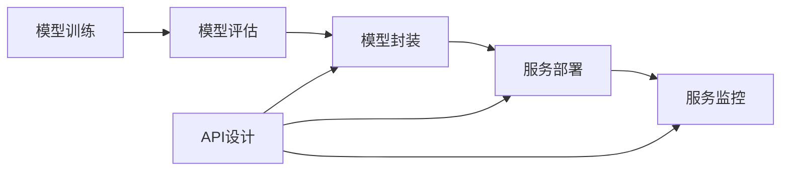

# 模型服务化与API设计原理与代码实战案例讲解

## 1. 背景介绍

### 1.1 模型服务化的兴起

在当今大数据和人工智能时代,越来越多的机器学习和深度学习模型被应用于各个领域。然而,训练好的模型如何高效地部署并提供服务,成为了一个亟待解决的问题。模型服务化应运而生,它旨在将训练好的模型封装成标准的服务接口,以API的形式对外提供服务。

### 1.2 API设计的重要性

API (Application Programming Interface) 是服务提供者和消费者之间的桥梁。一个设计良好的API不仅能够提高服务的可用性和易用性,还能够促进服务的扩展和集成。在模型服务化的背景下,API设计尤为重要,它直接影响到模型服务的性能、可靠性和可维护性。

### 1.3 本文的目标和结构

本文将深入探讨模型服务化与API设计的原理,并结合实际的代码案例进行讲解。全文分为以下几个部分:

1. 背景介绍
2. 核心概念与联系
3. 核心算法原理具体操作步骤
4. 数学模型和公式详细讲解举例说明
5. 项目实践:代码实例和详细解释说明
6. 实际应用场景
7. 工具和资源推荐 
8. 总结:未来发展趋势与挑战
9. 附录:常见问题与解答

## 2. 核心概念与联系

### 2.1 模型服务化

模型服务化是指将机器学习或深度学习模型封装成标准的服务接口,以API的形式对外提供服务。它包括以下几个关键步骤:

1. 模型训练:使用历史数据训练机器学习或深度学习模型
2. 模型评估:评估模型的性能和泛化能力
3. 模型封装:将训练好的模型封装成标准的服务接口
4. 服务部署:将封装好的模型服务部署到生产环境
5. 服务监控:对模型服务进行监控,确保其稳定性和可用性

### 2.2 API设计

API设计是指设计服务提供者和消费者之间的接口规范。一个好的API设计应该具备以下特点:

1. 易用性:API应该易于理解和使用,接口定义清晰明确
2. 一致性:API的设计应该保持风格一致,遵循统一的约定
3. 健壮性:API应该具备容错和异常处理机制,保证服务的稳定性
4. 安全性:API应该具备身份认证和权限控制机制,保证服务的安全性
5. 可扩展性:API应该易于扩展和维护,支持版本管理和向后兼容

### 2.3 模型服务化与API设计的关系

模型服务化和API设计是密切相关的。模型服务化旨在将模型封装成标准的服务接口,而API设计则定义了服务接口的规范。一个好的API设计能够提高模型服务的可用性、可靠性和可维护性。同时,模型服务化也对API设计提出了更高的要求,需要考虑模型的输入输出、性能优化、资源管理等因素。

下图展示了模型服务化与API设计的关系:



## 3. 核心算法原理具体操作步骤

### 3.1 模型封装

模型封装是模型服务化的核心步骤,它将训练好的模型转换为标准的服务接口。以下是模型封装的具体操作步骤:

1. 选择封装框架:选择合适的模型封装框架,如Flask、Django、FastAPI等
2. 定义输入输出接口:定义模型服务的输入输出接口,包括请求参数和响应格式
3. 加载模型:加载训练好的模型,如Keras、PyTorch、TensorFlow等
4. 实现预测逻辑:实现模型预测的逻辑,将输入数据传递给模型并返回预测结果
5. 添加辅助功能:添加必要的辅助功能,如日志记录、异常处理、性能监控等

### 3.2 API设计

API设计是模型服务化的另一个核心步骤,它定义了服务提供者和消费者之间的接口规范。以下是API设计的具体操作步骤:

1. 确定API风格:确定API的风格,如RESTful、RPC、GraphQL等
2. 定义资源模型:定义API的资源模型,包括资源类型、属性、关系等
3. 设计URL结构:设计API的URL结构,包括路径、查询参数、请求方法等
4. 定义请求和响应格式:定义API的请求和响应格式,包括数据类型、字段名称、约束条件等
5. 实现身份认证和权限控制:实现API的身份认证和权限控制,确保服务的安全性
6. 编写API文档:编写清晰、完整的API文档,方便服务消费者使用

## 4. 数学模型和公式详细讲解举例说明

### 4.1 线性回归模型

线性回归是一种常用的机器学习算法,用于建立自变量和因变量之间的线性关系。其数学模型可表示为:

$$y = w^Tx + b$$

其中,$y$为因变量,$x$为自变量,$w$为权重向量,$b$为偏置项。

线性回归的目标是找到最优的权重向量$w$和偏置项$b$,使得预测值与真实值之间的误差最小。通常使用最小二乘法来估计参数,即最小化损失函数:

$$J(w,b) = \frac{1}{2m}\sum_{i=1}^m(h_w(x^{(i)})-y^{(i)})^2$$

其中,$m$为样本数量,$h_w(x)=w^Tx+b$为预测函数。

求解最小二乘问题可以使用梯度下降法,不断更新参数$w$和$b$,直到损失函数收敛。参数更新公式为:

$$w := w - \alpha \frac{1}{m} \sum_{i=1}^m (h_w(x^{(i)})-y^{(i)})x^{(i)}$$
$$b := b - \alpha \frac{1}{m} \sum_{i=1}^m (h_w(x^{(i)})-y^{(i)})$$

其中,$\alpha$为学习率,控制每次更新的步长。

举例说明:假设我们要根据房屋面积预测房屋价格,已知样本数据如下:

| 面积(平方米) | 价格(万元) |
| --- | --- |
| 50 | 150 |
| 70 | 200 |
| 100 | 250 |
| 120 | 300 |

我们可以使用线性回归模型来建立面积和价格之间的关系:

$$price = w * area + b$$

使用最小二乘法估计参数$w$和$b$,得到:

$$w = 2.5, b = 25$$

因此,房屋价格预测模型为:

$$price = 2.5 * area + 25$$

给定一个新的房屋面积,我们就可以预测其价格。例如,一个面积为80平方米的房屋,其预测价格为:

$$price = 2.5 * 80 + 25 = 225$$

即225万元。

### 4.2 逻辑回归模型

逻辑回归是另一种常用的机器学习算法,用于二分类问题。其数学模型可表示为:

$$h_w(x) = \frac{1}{1+e^{-w^Tx}}$$

其中,$h_w(x)$为预测函数,表示样本$x$属于正类的概率。

逻辑回归的目标是找到最优的权重向量$w$,使得正类样本的概率最大化,负类样本的概率最小化。通常使用极大似然估计来估计参数,即最大化对数似然函数:

$$J(w) = \sum_{i=1}^m y^{(i)} log h_w(x^{(i)}) + (1-y^{(i)}) log(1-h_w(x^{(i)}))$$

其中,$m$为样本数量,$y^{(i)}$为样本$x^{(i)}$的真实标签(0或1)。

求解极大似然问题可以使用梯度上升法,不断更新参数$w$,直到对数似然函数收敛。参数更新公式为:

$$w := w + \alpha \sum_{i=1}^m (y^{(i)} - h_w(x^{(i)}))x^{(i)}$$

其中,$\alpha$为学习率,控制每次更新的步长。

举例说明:假设我们要根据学生的考试成绩预测其是否能够通过考试,已知样本数据如下:

| 成绩 | 是否通过 |
| --- | --- |
| 60 | 0 |
| 70 | 1 |
| 80 | 1 |
| 90 | 1 |

我们可以使用逻辑回归模型来建立成绩和通过概率之间的关系:

$$P(pass|score) = \frac{1}{1+e^{-(w*score+b)}}$$

使用极大似然估计估计参数$w$和$b$,得到:

$$w = 0.1, b = -10$$

因此,通过考试概率预测模型为:

$$P(pass|score) = \frac{1}{1+e^{-(0.1*score-10)}}$$

给定一个新的学生成绩,我们就可以预测其通过考试的概率。例如,一个成绩为75分的学生,其通过概率为:

$$P(pass|75) = \frac{1}{1+e^{-(0.1*75-10)}} = 0.73$$

即73%。

## 5. 项目实践:代码实例和详细解释说明

下面我们通过一个实际的代码案例,来演示如何将训练好的模型封装成API服务。我们以一个简单的图像分类模型为例,使用Flask框架来实现模型服务化。

### 5.1 模型训练

首先,我们使用Keras训练一个图像分类模型。这里我们使用MNIST手写数字数据集,建立一个简单的卷积神经网络。

```python
from tensorflow import keras
from tensorflow.keras import layers

# 加载MNIST数据集
(train_images, train_labels), (test_images, test_labels) = keras.datasets.mnist.load_data()

# 数据预处理
train_images = train_images.reshape((60000, 28, 28, 1)) / 255.0
test_images = test_images.reshape((10000, 28, 28, 1)) / 255.0

# 定义模型结构
model = keras.Sequential([
    layers.Conv2D(32, (3, 3), activation='relu', input_shape=(28, 28, 1)),
    layers.MaxPooling2D((2, 2)),
    layers.Conv2D(64, (3, 3), activation='relu'),
    layers.MaxPooling2D((2, 2)),
    layers.Conv2D(64, (3, 3), activation='relu'),
    layers.Flatten(),
    layers.Dense(64, activation='relu'),
    layers.Dense(10, activation='softmax')
])

# 编译模型
model.compile(optimizer='adam',
              loss='sparse_categorical_crossentropy',
              metrics=['accuracy'])

# 训练模型
model.fit(train_images, train_labels, epochs=5, batch_size=64)

# 评估模型
test_loss, test_acc = model.evaluate(test_images, test_labels)
print('Test accuracy:', test_acc)

# 保存模型
model.save('mnist_model.h5')
```

### 5.2 模型封装

接下来,我们使用Flask框架将训练好的模型封装成API服务。

```python
import numpy as np
from tensorflow import keras
from flask import Flask, request, jsonify

app = Flask(__name__)

# 加载模型
model = keras.models.load_model('mnist_model.h5')

@app.route('/predict', methods=['POST'])
def predict():
    # 获取请求数据
    data = request.get_json(force=True)
    image = np.array(data['image'])
    
    # 数据预处理
    image = image.reshape((1, 28, 28, 1)) / 255.0
    
    # 模型预测
    pred = model.predict(image)
    digit = np.argmax(pred)
    
    # 返回预测结果
    return jsonify({'digit': int(digit)})

if __name__ == '__main__':
    app.run(debug=True)
```

在上面的代码中,我们定义了一个`/predict`接口,接受POST请求。请求数据为一个28x28的手写数字图像,以JSON格式传递。我们首先对图像进行预处理,然后将其输入到模型中进行预测。最后,我们将预测结果以JSON格式返回,其中`digit`字段表示预测的数字。

### 5.3 API测试