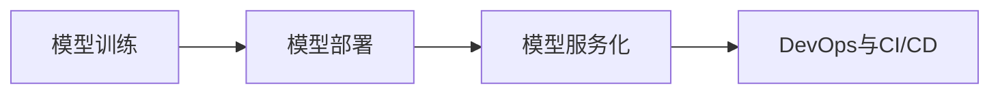

# 模型部署与服务化原理与代码实战案例讲解

## 1. 背景介绍
### 1.1 模型部署与服务化的重要性
在当今大数据和人工智能时代,机器学习和深度学习模型已经广泛应用于各个领域。然而,训练好的模型如果不能有效地部署和服务化,就无法真正发挥其价值。模型部署与服务化是将训练好的模型应用到生产环境中,并提供可靠、高效的服务,是实现模型商业价值的关键一环。

### 1.2 模型部署与服务化面临的挑战
模型部署与服务化过程中面临诸多挑战,例如:
- 模型的可移植性和兼容性问题
- 模型的性能和资源消耗问题  
- 模型的版本管理和更新问题
- 模型服务的高可用性和伸缩性问题
- 模型服务的监控和日志管理问题

### 1.3 本文的主要内容
本文将深入探讨模型部署与服务化的原理,介绍主流的部署方案和工具,并结合实际的代码案例进行讲解。通过本文,读者将掌握模型部署与服务化的关键技术,了解如何构建高效、可靠的模型服务。

## 2. 核心概念与联系
### 2.1 模型训练
- 数据收集与预处理
- 特征工程 
- 模型选择与调优
- 模型评估

### 2.2 模型部署
- 模型格式转换
- 模型量化与优化
- 模型封装与打包
- 模型部署环境搭建

### 2.3 模型服务化 
- Web服务框架选择
- API设计与开发
- 服务编排与治理
- 服务监控与告警

### 2.4 DevOps与CI/CD
- 代码版本管理
- 持续集成与持续交付
- 容器化与编排
- 服务发现与配置管理

### 2.5 核心概念关系图


## 3. 核心算法原理具体操作步骤
### 3.1 模型格式转换
- SavedModel格式
- ONNX格式
- PMML格式
- PaddlePaddle格式

### 3.2 模型量化
- 动态量化
- 静态量化
- 量化感知训练

### 3.3 模型优化
- 模型剪枝
- 低秩近似
- 知识蒸馏
- 模型编译

### 3.4 模型封装
- Python封装
- C++封装
- Java封装
- Go封装

### 3.5 模型部署
- TensorFlow Serving
- TorchServe
- Clipper
- KFServing
- BentoML
- Seldon Core

## 4. 数学模型和公式详细讲解举例说明
### 4.1 线性回归模型
线性回归模型是一种简单但应用广泛的机器学习模型,它的目标是找到一个线性函数来拟合数据。给定数据集 $\{(x_i,y_i)\}_{i=1}^N$,线性回归模型的数学表达式为:

$$\hat{y} = w^Tx + b$$

其中, $x$ 是特征向量, $w$ 是权重向量, $b$ 是偏置项。通过最小化均方误差损失函数来求解最优的 $w$ 和 $b$:

$$\min_{w,b} \frac{1}{N}\sum_{i=1}^N(y_i - \hat{y}_i)^2$$

求解上述最优化问题可以使用梯度下降法,权重 $w$ 和偏置 $b$ 的更新公式为:

$$w := w - \alpha \frac{1}{N}\sum_{i=1}^N(w^Tx_i + b - y_i)x_i$$
$$b := b - \alpha \frac{1}{N}\sum_{i=1}^N(w^Tx_i + b - y_i)$$

其中, $\alpha$ 是学习率。

### 4.2 逻辑回归模型
逻辑回归是一种常用的分类模型,它将线性回归的输出结果通过 Sigmoid 函数转换为概率值。二分类逻辑回归模型的数学表达式为:

$$P(y=1|x) = \frac{1}{1+e^{-(w^Tx+b)}}$$

其中, $P(y=1|x)$ 表示给定特征 $x$ 时,样本属于正类的概率。通过最大化对数似然函数来求解最优的 $w$ 和 $b$:

$$\max_{w,b} \sum_{i=1}^N \left[y_i \log P(y_i=1|x_i) + (1-y_i) \log (1-P(y_i=1|x_i))\right]$$

求解上述最优化问题可以使用梯度上升法,权重 $w$ 和偏置 $b$ 的更新公式为:

$$w := w + \alpha \sum_{i=1}^N(y_i - P(y_i=1|x_i))x_i$$  
$$b := b + \alpha \sum_{i=1}^N(y_i - P(y_i=1|x_i))$$

## 5. 项目实践：代码实例和详细解释说明

### 5.1 使用TensorFlow Serving部署图像分类模型
```python
# 训练MobileNetV2模型
model = tf.keras.applications.MobileNetV2(weights='imagenet')
model.save('./mobilenetv2', save_format='tf')

# 启动TensorFlow Serving服务
!docker run -p 8501:8501 \
  --mount type=bind,source=./mobilenetv2,target=/models/mobilenetv2 \
  -e MODEL_NAME=mobilenetv2 -t tensorflow/serving

# 发送预测请求
import requests
import json
import numpy as np
from PIL import Image

img = Image.open('cat.jpg').resize((224, 224))
img_array = np.array(img)[np.newaxis, :]

data = json.dumps({
    'instances': img_array.tolist()
})

headers = {"content-type": "application/json"}
json_response = requests.post(
    'http://localhost:8501/v1/models/mobilenetv2:predict',
    data=data, headers=headers)

predictions = json.loads(json_response.text)['predictions']
print(predictions)
```

上述代码首先使用Keras训练了一个MobileNetV2图像分类模型,并将模型保存为TensorFlow的SavedModel格式。然后使用Docker启动了一个TensorFlow Serving服务,并将保存的模型挂载到容器中。最后,使用requests库发送一个HTTP POST请求到TensorFlow Serving服务,将待预测的图像数据传递给模型,并获取模型的预测结果。

### 5.2 使用Flask实现模型推理API
```python
import tensorflow as tf
from flask import Flask, request, jsonify

model = tf.keras.models.load_model('model.h5')

app = Flask(__name__)

@app.route('/predict', methods=['POST'])
def predict():
    data = request.get_json(force=True)
    predictions = model.predict(data['instances'])
    output = predictions.tolist()
    return jsonify(output)

if __name__ == '__main__':
    app.run(host='0.0.0.0', port=5000)
```

上述代码使用Flask Web框架实现了一个模型推理API。首先加载了一个预训练的Keras模型,然后定义了一个`/predict`路由,接收POST请求。在请求处理函数中,从请求的JSON数据中获取待预测的实例数据,将其传递给模型进行预测,并将预测结果转换为列表格式,通过JSON格式返回给客户端。最后,启动Flask应用,监听5000端口。

## 6. 实际应用场景
### 6.1 智能客服系统
- 基于自然语言处理和对话系统的智能客服
- 使用意图识别和槽位填充技术理解用户问题
- 通过知识库问答和生成式对话生成回复
- 支持多轮对话和上下文理解

### 6.2 智能推荐系统
- 基于协同过滤和深度学习的推荐系统
- 使用用户行为数据和物品特征学习用户和物品的隐向量
- 通过最近邻搜索和矩阵分解生成推荐结果
- 支持实时推荐和离线更新

### 6.3 智能风控系统
- 基于机器学习的反欺诈和信用评估系统
- 使用交易数据和用户画像特征训练分类和异常检测模型
- 通过规则引擎和黑名单过滤高危交易
- 支持实时预测和近实时更新

### 6.4 工业质检系统
- 基于计算机视觉的缺陷检测和产品分类系统
- 使用图像数据和标注数据训练目标检测和图像分类模型
- 通过边缘计算和推理加速实现实时检测
- 支持批量离线检测和模型持续优化

## 7. 工具和资源推荐
### 7.1 模型训练
- TensorFlow: https://www.tensorflow.org/
- PyTorch: https://pytorch.org/
- Keras: https://keras.io/
- Scikit-learn: https://scikit-learn.org/

### 7.2 模型部署
- TensorFlow Serving: https://www.tensorflow.org/tfx/guide/serving
- TorchServe: https://pytorch.org/serve/
- Clipper: http://clipper.ai/
- KFServing: https://www.kubeflow.org/docs/components/serving/kfserving/
- BentoML: https://docs.bentoml.org/
- Seldon Core: https://docs.seldon.io/

### 7.3 Web服务框架
- Flask: https://flask.palletsprojects.com/
- FastAPI: https://fastapi.tiangolo.com/
- Django: https://www.djangoproject.com/
- Spring Boot: https://spring.io/projects/spring-boot

### 7.4 DevOps工具
- Docker: https://www.docker.com/
- Kubernetes: https://kubernetes.io/
- Jenkins: https://www.jenkins.io/
- Prometheus: https://prometheus.io/
- Grafana: https://grafana.com/

## 8. 总结：未来发展趋势与挑战
### 8.1 模型轻量化与移动端部署
随着移动设备的普及和边缘计算的兴起,在移动端和IoT设备上部署机器学习模型变得越来越重要。模型轻量化技术如量化、剪枝、蒸馏等将成为研究热点,帮助实现模型的小型化和低功耗。同时,移动端推理引擎如TensorFlow Lite、PyTorch Mobile等也将得到广泛应用。

### 8.2 云原生与Serverless架构
云原生技术如容器化、微服务化正在改变应用的开发和部署方式。将机器学习工作负载迁移到云原生环境中,利用容器编排平台如Kubernetes来实现模型服务的自动化部署、扩缩容、故障恢复等,将成为趋势。同时,Serverless架构下,无需关注服务器资源,只需按使用量付费,也非常适合机器学习推理服务。

### 8.3 自动机器学习与模型管理
机器学习模型的开发和维护需要耗费大量的时间和人力。自动机器学习(AutoML)技术如神经网络架构搜索(NAS)、超参数优化(HPO)等,可以帮助自动化模型开发流程,极大提升效率。此外,模型管理平台如MLflow、Kubeflow等,提供了端到端的机器学习生命周期管理功能,帮助团队协作开发和部署模型。

### 8.4 安全与隐私保护
机器学习模型面临着各种安全威胁,如数据中毒、模型窃取、对抗攻击等。同时,用户隐私数据的收集和使用也受到越来越多的关注和监管。因此,在开发和部署机器学习系统时,需要考虑模型安全和隐私保护,采用联邦学习、差分隐私、同态加密等隐私保护技术,并加强模型的鲁棒性,提升抵御攻击的能力。

## 9. 附录：常见问题与解答
### 9.1 如何选择合适的模型部署方案？
选择模型部署方案需要考虑以下因素:
- 模型的类型和规模
- 部署环境的资源限制
- 推理请求的并发量和延迟要求
- 开发和运维团队的技术栈和经验

对于中小规模的模型,可以选择使用Web服务框架如Flask、FastAPI等快速搭建推理服务。对于大规模、高并发的场景,可以考虑使用TensorFlow Serving、Clipper等专用的模型服务框架。如果需要在Kubernetes集群中部署,KFServing是一个不错的选择。

### 9.2 如何提高模型推理的性能？
提高模型推理性能的常用方法包括:
- 使用量化、剪枝等模型压缩技术,在精度损