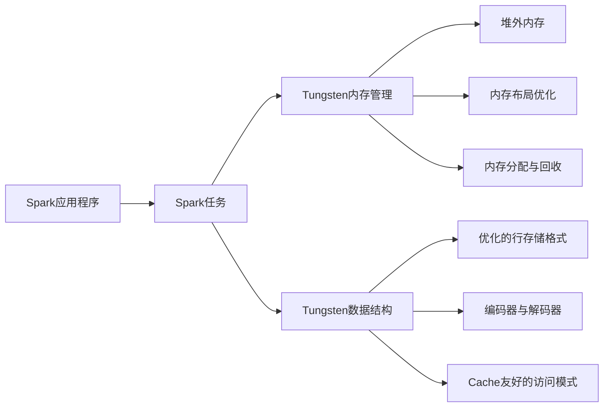

# 深入解析Spark Tungsten：内存管理与数据结构的革新

## 1. 背景介绍

### 1.1 Spark的发展历程

#### 1.1.1 Spark的起源与演进
#### 1.1.2 Spark在大数据领域的地位
#### 1.1.3 Spark面临的性能挑战

### 1.2 Tungsten项目概述  

#### 1.2.1 Tungsten项目的提出背景
#### 1.2.2 Tungsten项目的目标与意义
#### 1.2.3 Tungsten项目的主要内容

## 2. 核心概念与联系

### 2.1 Spark内存管理

#### 2.1.1 Spark内存管理的演进
#### 2.1.2 Tungsten内存管理的特点
#### 2.1.3 堆外内存与堆内内存

### 2.2 Spark数据结构

#### 2.2.1 传统Spark数据结构的局限性
#### 2.2.2 Tungsten引入的新数据结构
#### 2.2.3 新旧数据结构的对比

### 2.3 Tungsten内存管理与数据结构的关系

#### 2.3.1 内存布局优化
#### 2.3.2 数据序列化与反序列化
#### 2.3.3 内存分配与回收机制



## 3. 核心算法原理与具体操作步骤

### 3.1 Tungsten内存管理算法

#### 3.1.1 内存分配算法
#### 3.1.2 内存回收算法
#### 3.1.3 内存碎片管理

### 3.2 Tungsten数据结构设计

#### 3.2.1 优化的行存储格式设计
#### 3.2.2 编码器与解码器设计  
#### 3.2.3 Cache友好的访问模式设计

### 3.3 Tungsten性能优化技术

#### 3.3.1 代码生成技术
#### 3.3.2 算子融合技术  
#### 3.3.3 向量化执行引擎

## 4. 数学模型和公式详细讲解举例说明

### 4.1 Spark内存管理的数学模型

#### 4.1.1 内存分配的数学模型
#### 4.1.2 内存回收的数学模型
#### 4.1.3 内存碎片率的数学模型

内存碎片率的计算公式如下：

$MemoryFragmentationRatio = \frac{TotalFreeMemory - MaxContiguousFreeMemory}{TotalFreeMemory}$

其中，$TotalFreeMemory$表示总的空闲内存大小，$MaxContiguousFreeMemory$表示最大的连续空闲内存大小。

### 4.2 Tungsten数据结构的数学模型

#### 4.2.1 行存储格式的数学模型 
#### 4.2.2 编码器与解码器的数学模型
#### 4.2.3 Cache友好访问的数学模型

假设一个数据块的大小为$BlockSize$，Cache行的大小为$CacheLineSize$，数据元素的大小为$ElementSize$，那么一个数据块能够容纳的元素数量$ElementsPerBlock$计算公式如下：

$$ElementsPerBlock = \lfloor \frac{BlockSize}{ElementSize} \rfloor$$

为了实现Cache友好访问，我们需要保证$ElementSize$与$CacheLineSize$对齐，即满足以下条件：

$$ElementSize \mod CacheLineSize = 0$$

### 4.3 Tungsten性能优化的数学模型

#### 4.3.1 代码生成的数学模型
#### 4.3.2 算子融合的数学模型
#### 4.3.3 向量化执行的数学模型

## 5. 项目实践：代码实例和详细解释说明

### 5.1 Tungsten内存管理的代码实例

#### 5.1.1 内存池的实现代码
#### 5.1.2 内存分配器的实现代码 
#### 5.1.3 内存回收器的实现代码

### 5.2 Tungsten数据结构的代码实例

#### 5.2.1 优化行存储格式的实现代码
#### 5.2.2 编码器与解码器的实现代码
#### 5.2.3 Cache友好访问的实现代码

下面是一个优化行存储格式的简化实现代码示例：

```scala
case class OptimizedRowFormat(fields: Array[Any]) {
  def encode(): Array[Byte] = {
    val buffer = new ByteArrayOutputStream()
    val encoder = new Encoder(buffer)
    fields.foreach(encoder.write)
    buffer.toByteArray
  }
}

class Encoder(out: OutputStream) {
  def write(field: Any): Unit = field match {
    case int: Int => writeInt(int)
    case long: Long => writeLong(long)  
    case double: Double => writeDouble(double)
    case string: String => writeString(string)
    // ...
  }
  
  private def writeInt(value: Int): Unit = {
    out.write((value >>> 24) & 0xFF)  
    out.write((value >>> 16) & 0xFF)
    out.write((value >>> 8) & 0xFF)
    out.write(value & 0xFF)
  }
  
  // writeLong, writeDouble, writeString等方法的实现类似
}
```

在上面的代码中，`OptimizedRowFormat`表示优化后的行存储格式，它包含一个`Array[Any]`类型的字段数组。`encode()`方法将字段数组编码为字节数组。

`Encoder`类负责将各种类型的字段编码为字节形式写入输出流中。`writeInt`、`writeLong`、`writeDouble`、`writeString`等方法分别对应不同类型字段的编码逻辑。

通过这种优化的行存储格式和编码方式，可以实现更紧凑的内存布局和更高效的数据访问。

### 5.3 Tungsten性能优化的代码实例

#### 5.3.1 代码生成的实现代码
#### 5.3.2 算子融合的实现代码
#### 5.3.3 向量化执行的实现代码

## 6. 实际应用场景

### 6.1 Spark SQL的性能优化

#### 6.1.1 Spark SQL中的Tungsten内存管理应用
#### 6.1.2 Spark SQL中的Tungsten数据结构应用 
#### 6.1.3 Spark SQL中的Tungsten性能优化应用

### 6.2 Spark Streaming的性能优化

#### 6.2.1 Spark Streaming中的Tungsten内存管理应用
#### 6.2.2 Spark Streaming中的Tungsten数据结构应用
#### 6.2.3 Spark Streaming中的Tungsten性能优化应用

### 6.3 Spark MLlib的性能优化

#### 6.3.1 Spark MLlib中的Tungsten内存管理应用
#### 6.3.2 Spark MLlib中的Tungsten数据结构应用
#### 6.3.3 Spark MLlib中的Tungsten性能优化应用

## 7. 工具和资源推荐

### 7.1 Spark性能调优工具

#### 7.1.1 Spark Web UI
#### 7.1.2 Spark Metrics System
#### 7.1.3 Spark Profiler

### 7.2 Spark性能分析工具

#### 7.2.1 Spark History Server
#### 7.2.2 Spark Logging
#### 7.2.3 Spark Event Timeline  

### 7.3 Spark学习资源

#### 7.3.1 Spark官方文档
#### 7.3.2 Spark源码分析
#### 7.3.3 Spark社区与博客

## 8. 总结：未来发展趋势与挑战

### 8.1 Tungsten项目的成果与局限

#### 8.1.1 Tungsten项目取得的成果
#### 8.1.2 Tungsten项目存在的局限性
#### 8.1.3 Tungsten项目的改进空间

### 8.2 Spark未来的发展趋势

#### 8.2.1 Spark与AI的结合趋势
#### 8.2.2 Spark的云原生化趋势
#### 8.2.3 Spark的实时化趋势

### 8.3 Spark面临的挑战

#### 8.3.1 Spark的易用性挑战
#### 8.3.2 Spark的性能优化挑战 
#### 8.3.3 Spark的生态建设挑战

## 9. 附录：常见问题与解答

### 9.1 Tungsten与Catalyst的区别与联系
### 9.2 Tungsten对Spark SQL性能提升的原理
### 9.3 如何进一步优化Spark Tungsten的性能
### 9.4 Tungsten对Spark内存管理的改进
### 9.5 Tungsten对Spark数据结构的优化
### 9.6 Tungsten在Spark 3.0中的新特性
### 9.7 Tungsten与Java对象内存布局的差异
### 9.8 Tungsten如何避免Java GC的开销
### 9.9 Tungsten的适用场景与限制
### 9.10 Tungsten未来的发展方向

作者：禅与计算机程序设计艺术 / Zen and the Art of Computer Programming