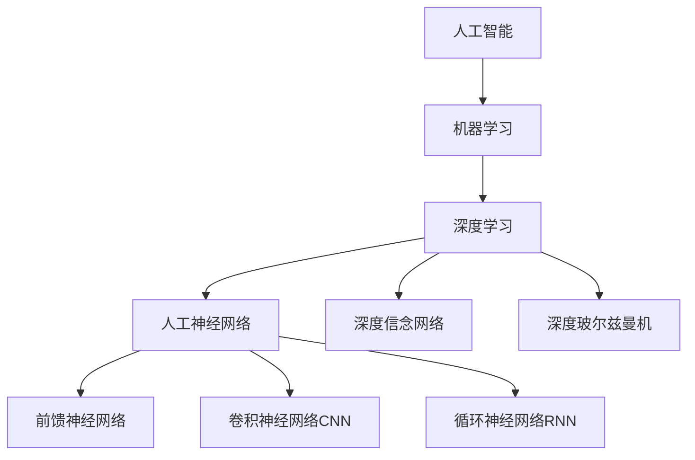

# 深度学习原理与代码实例讲解

## 1. 背景介绍

### 1.1 人工智能与机器学习概述
#### 1.1.1 人工智能的定义与发展历程
#### 1.1.2 机器学习的概念与分类
#### 1.1.3 深度学习在人工智能领域的地位

### 1.2 深度学习的起源与发展
#### 1.2.1 人工神经网络的早期研究
#### 1.2.2 深度学习的兴起与突破
#### 1.2.3 深度学习的应用领域与成就

### 1.3 深度学习的优势与挑战
#### 1.3.1 深度学习相比传统机器学习的优势
#### 1.3.2 深度学习面临的技术挑战
#### 1.3.3 深度学习的未来发展趋势

## 2. 核心概念与联系

### 2.1 人工神经网络基础
#### 2.1.1 生物神经元与人工神经元
#### 2.1.2 感知机与多层感知机
#### 2.1.3 前馈神经网络与反向传播算法

### 2.2 深度学习中的关键概念
#### 2.2.1 深度神经网络的结构与层次
#### 2.2.2 激活函数与损失函数
#### 2.2.3 优化算法与正则化技术

### 2.3 深度学习模型的分类
#### 2.3.1 卷积神经网络(CNN)
#### 2.3.2 循环神经网络(RNN)
#### 2.3.3 生成对抗网络(GAN)与自编码器(AE)



## 3. 核心算法原理具体操作步骤

### 3.1 前馈神经网络与反向传播算法
#### 3.1.1 前馈传播的计算过程
#### 3.1.2 反向传播算法的推导与实现
#### 3.1.3 梯度下降法与其变体

### 3.2 卷积神经网络(CNN)的原理与操作
#### 3.2.1 卷积层与池化层的计算过程  
#### 3.2.2 卷积核的参数学习与更新
#### 3.2.3 经典CNN模型：LeNet、AlexNet、VGGNet等

### 3.3 循环神经网络(RNN)的原理与操作
#### 3.3.1 RNN的展开与计算过程
#### 3.3.2 BPTT算法与梯度消失问题
#### 3.3.3 LSTM与GRU等改进型RNN模型

## 4. 数学模型和公式详细讲解举例说明

### 4.1 神经网络中的数学基础
#### 4.1.1 矩阵与向量运算
#### 4.1.2 导数与梯度的概念
#### 4.1.3 概率论与信息论基础

### 4.2 损失函数与优化算法的数学原理
#### 4.2.1 均方误差与交叉熵损失函数
$$ J(\theta) = -\frac{1}{m} \sum_{i=1}^{m}[y^{(i)}\log(h_\theta(x^{(i)}))+(1-y^{(i)})\log(1-h_\theta(x^{(i)}))] $$
#### 4.2.2 梯度下降法与随机梯度下降法
$$ \theta := \theta - \alpha \frac{\partial}{\partial \theta}J(\theta) $$
#### 4.2.3 动量法与自适应学习率算法

### 4.3 正则化技术的数学原理
#### 4.3.1 L1正则化与L2正则化
$$ J(\theta) = \frac{1}{2m}\sum_{i=1}^{m}(h_\theta(x^{(i)})-y^{(i)})^2 + \lambda\sum_{j=1}^{n}\theta_j^2 $$
#### 4.3.2 Dropout正则化
#### 4.3.3 早停法与数据增强技术

## 5. 项目实践：代码实例和详细解释说明

### 5.1 深度学习框架介绍
#### 5.1.1 TensorFlow框架的安装与使用
#### 5.1.2 PyTorch框架的安装与使用
#### 5.1.3 Keras高级API的使用

### 5.2 图像分类项目实践
#### 5.2.1 数据集的准备与预处理
#### 5.2.2 CNN模型的构建与训练
```python
model = Sequential()
model.add(Conv2D(32, (3, 3), activation='relu', input_shape=(28, 28, 1)))
model.add(MaxPooling2D((2, 2)))
model.add(Conv2D(64, (3, 3), activation='relu')) 
model.add(MaxPooling2D((2, 2)))
model.add(Conv2D(64, (3, 3), activation='relu'))
model.add(Flatten())
model.add(Dense(64, activation='relu'))
model.add(Dense(10, activation='softmax'))
```
#### 5.2.3 模型评估与优化改进

### 5.3 自然语言处理项目实践
#### 5.3.1 文本数据的表示与预处理
#### 5.3.2 RNN模型的构建与训练
```python
model = Sequential()
model.add(Embedding(max_features, 128))
model.add(LSTM(128, dropout=0.2, recurrent_dropout=0.2))  
model.add(Dense(1, activation='sigmoid'))
model.compile(loss='binary_crossentropy', optimizer='adam', metrics=['accuracy'])
```
#### 5.3.3 模型评估与优化改进

## 6. 实际应用场景

### 6.1 计算机视觉领域的应用
#### 6.1.1 图像分类与物体检测
#### 6.1.2 人脸识别与情感分析
#### 6.1.3 医学影像分析与诊断

### 6.2 自然语言处理领域的应用  
#### 6.2.1 文本分类与情感分析
#### 6.2.2 机器翻译与对话系统
#### 6.2.3 语音识别与合成

### 6.3 其他领域的应用
#### 6.3.1 推荐系统与个性化服务
#### 6.3.2 金融风险预测与反欺诈
#### 6.3.3 智能交通与无人驾驶

## 7. 工具和资源推荐

### 7.1 深度学习框架与库
#### 7.1.1 TensorFlow官方文档与教程
#### 7.1.2 PyTorch官方文档与教程
#### 7.1.3 Keras官方文档与示例

### 7.2 数据集资源
#### 7.2.1 ImageNet大规模视觉识别挑战赛数据集
#### 7.2.2 COCO通用物体检测数据集
#### 7.2.3 Penn Treebank自然语言处理数据集

### 7.3 学习资源推荐
#### 7.3.1 Andrew Ng的深度学习课程
#### 7.3.2 《深度学习》图书by Ian Goodfellow等
#### 7.3.3 Papers with Code网站与GitHub资源

## 8. 总结：未来发展趋势与挑战

### 8.1 深度学习的研究前沿
#### 8.1.1 注意力机制与Transformer模型
#### 8.1.2 图神经网络与知识图谱
#### 8.1.3 元学习与迁移学习

### 8.2 深度学习面临的挑战
#### 8.2.1 可解释性与可信性问题
#### 8.2.2 数据隐私与安全问题
#### 8.2.3 模型压缩与移动端部署

### 8.3 深度学习的未来发展方向
#### 8.3.1 多模态学习与跨领域融合
#### 8.3.2 自监督学习与无监督学习
#### 8.3.3 类脑智能与认知计算

## 9. 附录：常见问题与解答

### 9.1 深度学习入门问题
#### 9.1.1 如何选择合适的深度学习框架？
#### 9.1.2 如何选择合适的深度学习模型？
#### 9.1.3 如何进行数据预处理与特征工程？

### 9.2 模型训练与优化问题
#### 9.2.1 如何调整超参数以提高模型性能？
#### 9.2.2 如何解决过拟合与欠拟合问题？
#### 9.2.3 如何加速模型训练与收敛？

### 9.3 部署与应用问题
#### 9.3.1 如何将训练好的模型部署到生产环境？
#### 9.3.2 如何进行模型压缩与加速？
#### 9.3.3 如何实现模型的在线学习与增量更新？

作者：禅与计算机程序设计艺术 / Zen and the Art of Computer Programming