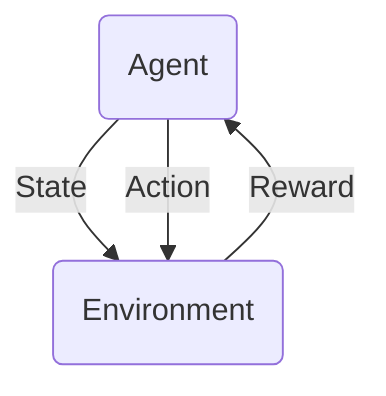
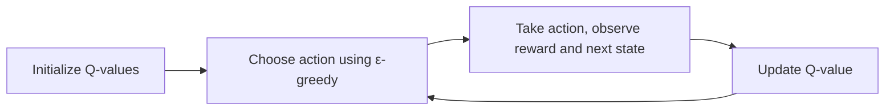

# 深度强化学习在游戏中的应用原理与代码实战案例讲解

## 1. 背景介绍
### 1.1 强化学习的发展历程
#### 1.1.1 强化学习的起源
#### 1.1.2 强化学习的发展阶段  
#### 1.1.3 深度强化学习的兴起

### 1.2 强化学习在游戏领域的应用
#### 1.2.1 游戏AI的发展历程
#### 1.2.2 强化学习在游戏AI中的优势
#### 1.2.3 深度强化学习在游戏领域的突破

## 2. 核心概念与联系
### 2.1 马尔可夫决策过程(MDP)
#### 2.1.1 MDP的定义
#### 2.1.2 MDP的组成要素
#### 2.1.3 MDP与强化学习的关系

### 2.2 价值函数与策略
#### 2.2.1 状态价值函数与动作价值函数 
#### 2.2.2 最优价值函数与最优策略
#### 2.2.3 价值函数与策略的关系

### 2.3 探索与利用
#### 2.3.1 探索与利用的概念
#### 2.3.2 ε-贪婪策略
#### 2.3.3 探索与利用的平衡

## 3. 核心算法原理具体操作步骤 
### 3.1 Q-Learning算法
#### 3.1.1 Q-Learning的更新规则
#### 3.1.2 Q-Learning的收敛性证明
#### 3.1.3 Q-Learning的伪代码

### 3.2 DQN算法
#### 3.2.1 DQN的网络结构
#### 3.2.2 DQN的损失函数
#### 3.2.3 DQN的目标网络与经验回放

### 3.3 Policy Gradient算法
#### 3.3.1 策略梯度定理
#### 3.3.2 REINFORCE算法
#### 3.3.3 Actor-Critic算法

## 4. 数学模型和公式详细讲解举例说明
### 4.1 Q-Learning的数学模型
#### 4.1.1 Q-Learning的贝尔曼方程
$$Q(s_t,a_t) \leftarrow Q(s_t,a_t) + \alpha [r_{t+1} + \gamma \max_a Q(s_{t+1},a) - Q(s_t,a_t)]$$
#### 4.1.2 Q-Learning的最优性证明
#### 4.1.3 Q-Learning的收敛性分析

### 4.2 DQN的数学模型 
#### 4.2.1 DQN的损失函数推导
$$L_i(\theta_i) = \mathbb{E}_{(s,a,r,s')\sim U(D)} \left[ \left(r + \gamma \max_{a'}Q(s',a';\theta_i^-) - Q(s,a;\theta_i) \right)^2 \right]$$
#### 4.2.2 DQN的梯度计算
#### 4.2.3 DQN的目标网络更新

### 4.3 Policy Gradient的数学模型
#### 4.3.1 策略梯度定理的推导
$$\nabla_\theta J(\theta) = \mathbb{E}_{\tau \sim p_\theta(\tau)} \left[ \sum_{t=0}^T \nabla_\theta \log \pi_\theta(a_t|s_t) Q^{\pi_\theta}(s_t,a_t) \right]$$
#### 4.3.2 REINFORCE算法的数学解释
#### 4.3.3 Actor-Critic算法的策略梯度与价值函数估计

## 5. 项目实践：代码实例和详细解释说明
### 5.1 基于OpenAI Gym的Q-Learning实现
#### 5.1.1 环境搭建与问题定义
#### 5.1.2 Q-Table的初始化与更新
#### 5.1.3 训练过程与结果分析

### 5.2 基于PyTorch的DQN实现
#### 5.2.1 DQN网络结构的定义
#### 5.2.2 经验回放与ε-贪婪策略
#### 5.2.3 训练循环与模型评估

### 5.3 基于TensorFlow的Policy Gradient实现  
#### 5.3.1 策略网络与价值网络的设计
#### 5.3.2 REINFORCE算法的实现
#### 5.3.3 Actor-Critic算法的实现

## 6. 实际应用场景
### 6.1 深度强化学习在Atari游戏中的应用
#### 6.1.1 Atari游戏环境介绍
#### 6.1.2 DQN在Atari游戏中的表现
#### 6.1.3 Rainbow等改进算法的应用

### 6.2 深度强化学习在棋类游戏中的应用
#### 6.2.1 AlphaGo的核心算法
#### 6.2.2 AlphaZero的通用框架
#### 6.2.3 深度强化学习在其他棋类游戏中的应用

### 6.3 深度强化学习在实时策略游戏中的应用
#### 6.3.1 星际争霸II的挑战
#### 6.3.2 AlphaStar的多智能体训练
#### 6.3.3 深度强化学习在其他实时策略游戏中的应用

## 7. 工具和资源推荐
### 7.1 深度强化学习框架
#### 7.1.1 OpenAI Baselines
#### 7.1.2 Stable Baselines
#### 7.1.3 Ray RLlib

### 7.2 深度强化学习环境
#### 7.2.1 OpenAI Gym
#### 7.2.2 Unity ML-Agents
#### 7.2.3 DeepMind Lab

### 7.3 深度强化学习课程与教程
#### 7.3.1 David Silver的强化学习课程
#### 7.3.2 UC Berkeley的深度强化学习课程
#### 7.3.3 Sutton和Barto的《强化学习》教材

## 8. 总结：未来发展趋势与挑战
### 8.1 深度强化学习的发展趋势
#### 8.1.1 基于模型的强化学习
#### 8.1.2 元强化学习
#### 8.1.3 多智能体强化学习

### 8.2 深度强化学习面临的挑战
#### 8.2.1 样本效率问题
#### 8.2.2 稳定性与鲁棒性问题
#### 8.2.3 可解释性与安全性问题

### 8.3 深度强化学习的未来展望
#### 8.3.1 深度强化学习与其他领域的结合
#### 8.3.2 深度强化学习在现实世界中的应用
#### 8.3.3 深度强化学习的理论突破

## 9. 附录：常见问题与解答
### 9.1 如何选择合适的深度强化学习算法？
### 9.2 如何处理深度强化学习中的探索与利用问题？
### 9.3 如何评估深度强化学习算法的性能？
### 9.4 深度强化学习在实际应用中需要注意哪些问题？
### 9.5 深度强化学习的未来研究方向有哪些？

作者：禅与计算机程序设计艺术 / Zen and the Art of Computer Programming