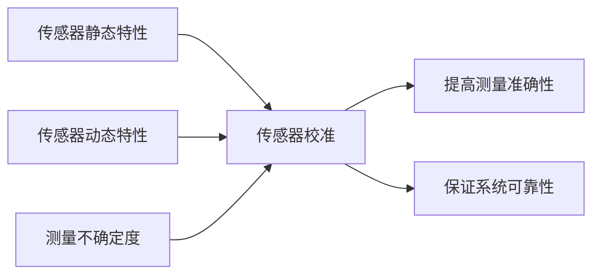

# 物联网(IoT)技术和各种传感器设备的集成：传感器的校准方法

## 1.背景介绍

在当今快速发展的物联网(IoT)时代,各种类型的传感器设备正在被广泛应用于工业生产、智慧城市、智能家居等诸多领域。传感器作为物联网系统的重要组成部分,其测量数据的准确性和可靠性直接影响到整个IoT系统的性能。然而,由于生产工艺、使用环境等因素的影响,传感器的测量精度往往会出现偏差,因此对传感器进行校准就显得尤为重要。本文将重点探讨物联网中各种传感器的校准方法,帮助工程师更好地理解和掌握传感器校准的核心技术。

### 1.1 物联网系统中传感器的重要性

- 传感器是物联网的重要组成部分,是连接物理世界和数字世界的桥梁
- 传感器负责采集各种物理量数据,为上层应用提供基础数据支撑
- 传感器数据的准确性直接影响物联网系统的可靠性和实用性

### 1.2 传感器测量误差的来源

- 生产工艺引入的系统误差
- 使用环境变化引起的随机误差
- 器件老化导致的性能退化
- 电磁干扰等外部因素影响

### 1.3 传感器校准的必要性

- 提高传感器测量数据的准确性和可靠性
- 保证物联网系统正常工作,提供高质量服务
- 延长传感器使用寿命,降低维护成本
- 提高数据分析和决策的有效性

## 2.核心概念与联系

在深入探讨传感器校准方法之前,我们先来了解几个核心概念：

### 2.1 传感器静态特性

传感器静态特性描述了在稳态条件下,传感器输出与输入之间的函数关系。常见的静态特性指标有：

- 线性度:传感器输出与输入的线性拟合程度
- 灵敏度:传感器输出变化量与输入变化量之比
- 迟滞:输入变化方向不同时,传感器输出的最大差异
- 重复性:在相同输入条件下,传感器输出的一致性

### 2.2 传感器动态特性  

传感器动态特性反映了传感器输出对输入变化的响应速度和阻尼特性。常用的动态指标包括:

- 响应时间:传感器输出达到稳态值的时间
- 阻尼系数:反映传感器响应的振荡衰减特性
- 频率响应:传感器对不同频率输入信号的响应特性

### 2.3 测量不确定度

测量不确定度是对测量结果的分散性的定量描述,反映了测量值的可靠程度。不确定度主要包括:

- A类不确定度:通过统计分析一系列观测值获得
- B类不确定度:通过其他方法(如仪器精度)获得
- 合成不确定度:综合考虑各种不确定度因素的总体影响

了解了这些核心概念,有助于我们系统地分析传感器误差来源,为选择合适的校准方法提供理论指导。

### 2.4 概念联系



从上图可以看出,传感器的静态特性、动态特性以及测量不确定度都会影响传感器测量的准确性,需要通过系统的校准来提高传感器性能,最终保证物联网系统的可靠运行。

## 3.核心算法原理具体操作步骤

传感器校准的目的是找到传感器输入和输出之间的映射关系,并据此对测量值进行修正。常用的校准算法有最小二乘法、神经网络法、支持向量机等。下面以最小二乘法为例,详细讲解其原理和操作步骤。

### 3.1 最小二乘法原理

最小二乘法是一种数学优化方法,通过最小化误差的平方和来寻找数据的最佳函数匹配。假设传感器输入为 $x$,输出为 $y$,我们希望找到一个函数 $f(x)$ 使得 $f(x)$ 与 $y$ 的差别最小。

令残差 $r_i$ 为实际输出与拟合函数输出之差:

$$r_i = y_i - f(x_i)$$

最小二乘法就是要找到一组参数使得残差平方和最小:

$$\min \sum_{i=1}^{n} r_i^2 = \min \sum_{i=1}^{n} (y_i - f(x_i))^2$$

### 3.2 最小二乘法操作步骤

以线性拟合为例,假设传感器输入输出满足线性关系: $y=kx+b$,校准步骤如下:

(1) 选择合适的标准器对传感器进行标定,获得一组标准输入值 $x_i$ 和对应的传感器输出值 $y_i$。  

(2) 构建误差函数:

$$E(k,b) = \sum_{i=1}^{n} (y_i - kx_i - b)^2$$

(3) 对 $k$ 和 $b$ 求偏导,令偏导数等于0:

$$\frac{\partial E}{\partial k} = -2\sum_{i=1}^{n} x_i(y_i - kx_i - b) = 0$$

$$\frac{\partial E}{\partial b} = -2\sum_{i=1}^{n} (y_i - kx_i - b) = 0$$

(4) 解上述方程组,得到 $k$ 和 $b$ 的估计值:

$$k = \frac{n\sum x_iy_i - \sum x_i \sum y_i}{n\sum x_i^2 - (\sum x_i)^2}$$

$$b = \frac{\sum x_i^2 \sum y_i - \sum x_i \sum x_iy_i}{n\sum x_i^2 - (\sum x_i)^2}$$

(5) 将求得的 $k$ 和 $b$ 代入线性模型,即可得到传感器的校准函数:

$$y = kx + b$$

今后传感器的测量值 $y$ 经过校准函数处理,就可以得到校准后的测量结果。

这里我们只讨论了最简单的线性校准情况,实际应用中可以采用多项式、指数、对数等多种回归模型,原理和步骤与之类似。此外,对于复杂的非线性情况,还可以采用神经网络等智能算法进行校准。

## 4.数学模型和公式详细讲解举例说明

为了更直观地理解传感器校准的数学原理,下面我们以温度传感器为例,给出完整的校准过程。

### 4.1 建立温度传感器数学模型

假设温度传感器的输出电压 $U$ 与温度 $T$ 满足线性关系:

$$U = k \cdot T + U_0$$

其中,$k$ 为灵敏度系数,$U_0$ 为零点偏移电压。

### 4.2 校准实验数据获取

利用高精度温度计对传感器施加不同温度 $T_i$,测量对应的传感器输出电压 $U_i$,得到实验数据如下:

| 温度 $T_i$ (℃) | 输出电压 $U_i$ (mV) |
|--------------|------------------|
| 10           | 2.5              |
| 20           | 3.0              |
| 30           | 3.5              |
| 40           | 4.0              |
| 50           | 4.5              |

### 4.3 最小二乘法求解校准参数

根据最小二乘公式,计算灵敏度 $k$ 和零点偏移 $U_0$:

$$k = \frac{n\sum T_iU_i - \sum T_i \sum U_i}{n\sum T_i^2 - (\sum T_i)^2}$$

$$U_0 = \frac{\sum T_i^2 \sum U_i - \sum T_i \sum T_iU_i}{n\sum T_i^2 - (\sum T_i)^2}$$

代入数据得:

$$k = \frac{5 \times 585 - 150 \times 17.5}{5 \times 5500 - 150^2} = 0.05 \text{mV}/\text{℃}$$

$$U_0 = \frac{5500 \times 17.5 - 150 \times 585}{5 \times 5500 - 150^2} = 2.0 \text{mV}$$

### 4.4 得到传感器校准模型

将求得的参数代入传感器模型,得到校准后的温度-电压关系:

$$T = 20 \cdot U - 40$$

其中,$T$ 为校准后的温度测量值,单位为 ℃;$U$ 为传感器输出电压,单位为 mV。

### 4.5 校准模型的应用

今后该传感器的测量电压 $U$ 经过校准模型变换:

$$T = 20 \cdot U - 40$$

就可以得到校准后的温度测量结果。

由此可见,数学建模和最小二乘算法在传感器校准中发挥了重要作用。工程师在实际应用时,还需要根据传感器特性选择合适的数学模型,优化参数求解方法,以提高校准精度。

## 5.项目实践：代码实例和详细解释说明

下面我们以 Python 语言为例,给出温度传感器校准的代码实现。

### 5.1 Python 代码实现

```python
import numpy as np

# 校准数据
T = np.array([10, 20, 30, 40, 50])  # 标准温度值
U = np.array([2.5, 3.0, 3.5, 4.0, 4.5])  # 传感器输出电压

# 最小二乘法求解
def least_square(x, y):
    n = len(x)
    k = (n * np.sum(x*y) - np.sum(x) * np.sum(y)) / (n * np.sum(x**2) - np.sum(x)**2)
    b = (np.sum(x**2) * np.sum(y) - np.sum(x) * np.sum(x*y)) / (n * np.sum(x**2) - np.sum(x)**2)
    return k, b

# 传感器校准函数
def calibrate(U):
    k, b = least_square(U, T)
    return k * U + b

# 测试校准效果
U_test = np.array([2.7, 3.2, 3.9, 4.4])  # 传感器输出电压
T_test = calibrate(U_test)  # 校准后的温度值
print("校准后的温度值:", T_test)
```

### 5.2 代码详细解释

(1) 首先导入 NumPy 库,用于数组操作和数值计算。

(2) 定义校准数据,包括标准温度值 `T` 和传感器输出电压 `U`,用 NumPy 数组表示。

(3) 编写最小二乘法求解函数 `least_square(x, y)`,输入变量 `x` 和 `y` 分别对应传感器输出电压 `U` 和标准温度 `T`,根据最小二乘公式计算斜率 `k` 和截距 `b`,并返回。

(4) 编写传感器校准函数 `calibrate(U)`,输入变量 `U` 为传感器输出电压,通过 `least_square` 函数计算校准参数 `k` 和 `b`,并返回校准后的温度值。

(5) 定义测试数据 `U_test`,表示待校准的传感器输出电压。

(6) 调用 `calibrate` 函数对 `U_test` 进行校准,得到校准后的温度值 `T_test`,并打印结果。

通过这段简单的代码,我们实现了传感器的最小二乘校准功能。实际项目中,还需要考虑数据预处理、异常值剔除、多项式拟合等因素,以进一步提高校准精度和鲁棒性。

## 6.实际应用场景

传感器校准技术在物联网领域有广泛的应用,下面列举几个典型场景。

### 6.1 工业生产过程监测

在工业生产中,传感器被大量用于监测各种工艺参数,如温度、压力、流量、液位等。传感器的测量精度直接影响产品质量和生产效率。通过定期对传感器进行校准,可以保证监测数据的准确性,及时发现和纠正生产异常,提高生产线的稳定性和可靠性。

### 6.2 环境监测与污染预警

在环境监测领