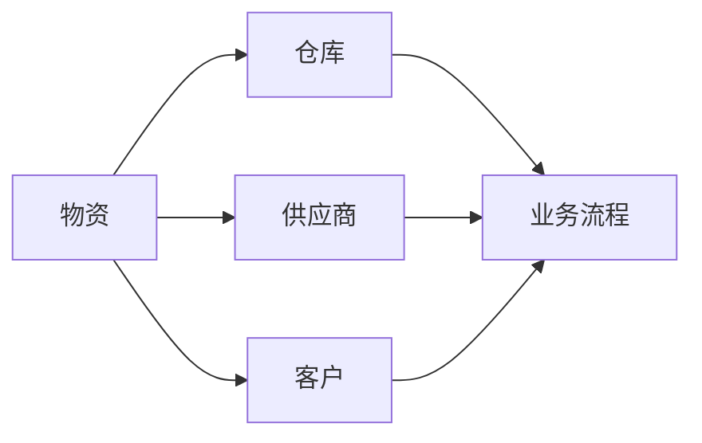

# 物资流通管理系统详细设计与具体代码实现

## 1.背景介绍

随着现代社会经济的快速发展,企业规模不断扩大,物资流通管理已成为企业管理中的重要环节。传统的人工管理模式已经无法满足企业高效运转的需求,因此开发一套功能完善、高度智能化的物资流通管理系统势在必行。

本文将详细阐述物资流通管理系统的设计思路和具体实现过程,重点关注系统架构、核心算法、数据模型以及关键功能模块的代码实现。通过对系统的全面剖析,帮助读者深入理解现代化物资流通管理系统的实现原理,为相关领域的研究和实践提供参考。

### 1.1 物资流通管理的痛点
#### 1.1.1 信息孤岛
#### 1.1.2 效率低下
#### 1.1.3 管理混乱

### 1.2 系统开发目标  
#### 1.2.1 打通信息壁垒
#### 1.2.2 提升管理效率  
#### 1.2.3 规范业务流程

## 2.核心概念与联系

要设计出一套优秀的物资流通管理系统,首先需要理清系统涉及的核心概念,以及它们之间的关联关系。

### 2.1 物资
#### 2.1.1 原材料
#### 2.1.2 半成品
#### 2.1.3 产成品

### 2.2 仓库
#### 2.2.1 原料仓
#### 2.2.2 半成品仓
#### 2.2.3 成品仓

### 2.3 供应商与客户
#### 2.3.1 供应商管理 
#### 2.3.2 客户管理

### 2.4 业务流程
#### 2.4.1 采购入库
#### 2.4.2 生产领料
#### 2.4.3 成品发货

下图展示了物资流通管理系统的核心概念以及它们之间的联系:



## 3.核心算法原理具体操作步骤

为了实现智能化的物资调度和库存管理,系统需要依赖一些核心算法。下面重点介绍两种常用算法:经济订货批量(EOQ)和物料需求计划(MRP)。

### 3.1 经济订货批量(EOQ)
#### 3.1.1 EOQ模型介绍
#### 3.1.2 EOQ计算公式
#### 3.1.3 EOQ的应用场景

### 3.2 物料需求计划(MRP) 
#### 3.2.1 MRP的基本概念
#### 3.2.2 MRP运算步骤  
#### 3.2.3 MRP的局限性

### 3.3 算法实现步骤
#### 3.3.1 数据准备
#### 3.3.2 计算执行
#### 3.3.3 结果应用

## 4.数学模型和公式详细讲解举例说明

在物资流通管理系统中,需要用到一些数学模型和公式,以实现精准的需求预测、库存优化等功能。本节选取几个典型的模型和公式进行详细讲解。

### 4.1 需求预测模型
#### 4.1.1 移动平均法
移动平均法是一种常用的需求预测模型,通过对过去一段时间的需求数据进行平均,来预测未来一段时间的需求量。其公式为:

$F_t = \frac{D_{t-1} + D_{t-2} + ... + D_{t-n}}{n}$

其中,$F_t$表示第$t$期的预测需求,$D_{t-i}$表示第$t-i$期的实际需求,$n$为移动平均的期数。

举例说明:假设某物资过去5个月的需求量分别为100、120、110、90、130,则按照3期移动平均法,未来1个月的预测需求量为:

$F_6 = \frac{130+90+110}{3} = 110$

#### 4.1.2 指数平滑法
#### 4.1.3 回归分析法

### 4.2 库存控制模型  
#### 4.2.1 ABC分类法
#### 4.2.2 安全库存模型
安全库存是为了应对需求的不确定性而准备的额外库存。安全库存的计算公式为:

$SS = Z \times \sigma \times \sqrt{LT}$

其中,$SS$为安全库存量,$Z$为服务水平对应的标准差倍数,$\sigma$为需求标准差,$LT$为提前期(单位为需求周期数)。

举例说明:假设某物资的日需求量服从均值为100,标准差为20的正态分布,要求98%的服务水平,提前期为5天。查表可知98%服务水平对应的$Z$值为2.05,则安全库存量为:

$SS = 2.05 \times 20 \times \sqrt{5} = 91.6$

#### 4.2.3 再订货点模型

## 5.项目实践：代码实例和详细解释说明

下面我们通过一个简单的物资出入库管理模块的代码实例,来说明如何用Java语言实现系统的核心功能。

### 5.1 物资类

```java
public class Material {
    private String id; //物资编号
    private String name; //物资名称
    private String type; //物资类型
    private int stock; //库存数量
    
    //构造方法、getter和setter方法略
}
```

Material类定义了物资的基本属性,包括编号、名称、类型和库存数量。这些属性与数据库中的字段一一对应。

### 5.2 仓库类

```java
public class Warehouse {
    private String id; //仓库编号
    private String name; //仓库名称
    private String location; //仓库位置
    
    private Map<String,Material> materials = new HashMap<>(); //仓库物资列表
    
    //构造方法、getter和setter方法略
    
    //添加物资
    public void addMaterial(Material m){
        materials.put(m.getId(), m);
    }
    
    //移除物资
    public void removeMaterial(String id){
        materials.remove(id);
    }
}
```

Warehouse类定义了仓库的基本属性,并使用一个HashMap来存储仓库中的物资,以物资编号为键,物资对象为值。addMaterial和removeMaterial方法分别实现了物资的添加和移除功能。

### 5.3 业务类

```java
public class BusinessService {
    
    //物资入库
    public void materialIn(String warehouseId, Material m){
        Warehouse w = WarehouseDao.getById(warehouseId);
        w.addMaterial(m);
        MaterialDao.updateStock(m.getId(), m.getStock());
    }
    
    //物资出库
    public void materialOut(String warehouseId, String materialId, int count){
        Warehouse w = WarehouseDao.getById(warehouseId);
        Material m = w.getMaterials().get(materialId);
        m.setStock(m.getStock() - count);
        w.addMaterial(m);
        MaterialDao.updateStock(materialId, m.getStock());
    }
}
```

BusinessService类实现了物资出入库的业务逻辑。materialIn方法实现了物资入库,首先根据仓库编号从数据库中查询出仓库对象,然后将新的物资添加到仓库中,最后更新物资的库存数量。materialOut方法实现了物资出库,逻辑与入库类似,只是需要从仓库的物资列表中找到对应的物资对象,并将其库存量减少。

以上是一个简单的物资出入库管理的代码示例,虽然还比较粗糙,但已经展示了系统的基本实现思路。在实际开发中,还需要考虑更多的业务场景和异常情况,并对代码进行重构和优化。

## 6.实际应用场景

物资流通管理系统可以应用于多个行业和场景,下面列举几个典型的应用案例。

### 6.1 制造业的生产物料管理
#### 6.1.1 原材料采购与入库
#### 6.1.2 生产领料与库存消耗
#### 6.1.3 产成品入库与发货

### 6.2 零售业的商品进销存管理
#### 6.2.1 商品采购与上架
#### 6.2.2 销售出库与库存同步
#### 6.2.3 商品调拨与补货

### 6.3 物流业的仓储配送管理
#### 6.3.1 货物入库与上架
#### 6.3.2 订单拣货与出库
#### 6.3.3 运输配送与签收

## 7.工具和资源推荐

要开发一套完善的物资流通管理系统,除了扎实的编程功底外,还需要借助一些开发工具和学习资源。以下是一些推荐:

### 7.1 开发工具
- IntelliJ IDEA:功能强大的Java IDE
- Visual Studio Code:轻量级的代码编辑器
- Navicat:数据库管理工具
- Postman:API测试工具

### 7.2 框架和库
- Spring Boot:简化Java EE开发
- MyBatis:优秀的持久层框架
- Dubbo:高性能Java RPC框架
- Vue.js:渐进式JavaScript框架

### 7.3 学习资源
- 《Java编程思想》:Java语言经典书籍
- 《Effective Java》:Java进阶必读
- 《Spring实战》:全面介绍Spring框架
- 《算法导论》:算法学习圣经
- CSDN:中文IT社区,技术博客聚集地

## 8.总结：未来发展趋势与挑战

随着新一代信息技术的发展,物资流通管理系统也面临着新的机遇和挑战。

### 8.1 移动化与云端化
#### 8.1.1 移动端APP开发
#### 8.1.2 云服务架构升级
#### 8.1.3 大数据处理能力

### 8.2 智能化与自动化
#### 8.2.1 人工智能算法应用
#### 8.2.2 机器人仓储作业
#### 8.2.3 无人配送终端

### 8.3 协同化与生态化
#### 8.3.1 供应链协同平台
#### 8.3.2 区块链溯源方案
#### 8.3.3 物联网设备集成

未来,物资流通管理系统将向着更加智能、高效、安全的方向发展,成为连接生产、流通、消费各个环节的数字化神经系统。同时,开发者也要不断学习创新,跟上时代发展的步伐。

## 9.附录：常见问题与解答

### Q1:系统应该选择什么样的架构模式?
A1:建议采用分层架构,包括表示层、业务层、持久层。同时,考虑引入微服务架构,提高系统的扩展性和灵活性。

### Q2:如何保证系统的高可用性?
A2:可以从硬件和软件两个层面入手。硬件层面可以采用服务器集群、负载均衡、数据备份等措施;软件层面要采用合理的系统容错设计,比如限流、熔断、降级等。

### Q3:大数据量下,如何提高系统性能?
A3:可以考虑引入缓存、索引、异步、并发等优化手段。同时,要注意编写高质量的SQL语句,避免慢查询。必要时,可以对数据库进行分库分表。

### Q4:如何保障系统的数据安全?
A4:首先要做好身份认证和权限控制,防止非法访问;其次要采用加密算法对敏感数据进行加密存储;再次要做好日志审计,及时发现可疑行为;最后要定期进行数据备份,以备不时之需。

### Q5:如何提高系统的可维护性?
A5:要合理进行系统模块化设计,做到高内聚低耦合;编码过程中要遵循清晰的命名和注释规范;系统上线前要编写完善的文档,包括需求文档、设计文档、部署文档等;日常运维过程中要做好版本管理和问题跟踪。

作者：禅与计算机程序设计艺术 / Zen and the Art of Computer Programming