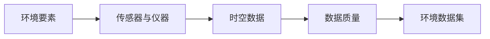

# 环境数据集：地球环境的数字化监测

## 1. 背景介绍
### 1.1 环境监测的重要性
随着全球气候变化、环境污染等问题日益严峻,环境监测已成为全人类面临的重大课题。通过对大气、水、土壤等环境要素进行持续监测,可以及时发现环境问题,为环保决策提供数据支撑。

### 1.2 环境数据集的概念
环境数据集是通过各种传感器、仪器设备采集到的反映环境状况的数字化数据集合。它涵盖了大气、水、土壤、生物等多个环境要素,记录了环境参数随时间和空间的变化。

### 1.3 环境数据集的应用价值
环境数据集是开展环境科学研究、制定环保政策的重要基础。通过对数据集的分析挖掘,可以发现环境变化规律、评估污染程度、预测未来趋势,为环境保护和可持续发展提供决策依据。

## 2. 核心概念与联系
### 2.1 环境要素
- 大气环境要素:温度、湿度、气压、风速、CO2浓度等
- 水环境要素:水温、pH值、溶解氧、电导率、重金属含量等  
- 土壤环境要素:土壤温度、湿度、pH值、有机质含量、重金属含量等
- 生物环境要素:物种多样性、植被指数、叶面积指数等

### 2.2 传感器与仪器设备
- 气象传感器:温湿度传感器、气压计、风速仪等
- 水质传感器:pH计、溶解氧仪、电导率仪、重金属检测仪等
- 土壤传感器:土壤温湿度传感器、pH计、重金属检测仪等 
- 遥感设备:卫星、无人机搭载的多光谱相机等

### 2.3 时空数据
环境数据集包含时间维度和空间维度两个关键属性:
- 时间属性:反映环境要素随时间的变化趋势
- 空间属性:反映环境要素在不同地理位置的分布特征

### 2.4 数据质量
- 准确性:测量结果与真实值的接近程度
- 精密度:多次测量结果的一致性程度
- 完整性:数据记录的连续性和空间覆盖的完整性
- 时效性:数据从采集到可用的时间延迟

下图展示了环境数据集的核心概念及其关联:



## 3. 核心算法原理具体操作步骤
### 3.1 数据采集
1. 布设环境监测站点,安装各类传感器和仪器设备
2. 传感器按设定频率自动采集环境参数
3. 仪器设备定期人工采样并检测环境样本
4. 卫星、无人机等遥感平台获取环境遥感影像

### 3.2 数据预处理
1. 数据清洗:去除异常值、无效值等"脏数据"
2. 数据归一化:将不同量纲的数据统一到相同尺度
3. 数据插补:对缺失数据进行合理估计与填充 
4. 数据融合:综合不同来源、不同类型的数据

### 3.3 数据分析
1. 统计分析:计算数据的均值、方差、相关系数等统计量
2. 趋势分析:考察环境要素随时间的变化趋势
3. 空间分析:研究环境要素在空间上的分布模式
4. 数据挖掘:使用机器学习等方法发现数据中的关联规则和模式

### 3.4 数据可视化
1. 统计图表:绘制折线图、散点图等展示数据统计特征
2. 时序图:展示环境要素随时间的变化曲线
3. 空间分布图:绘制热力图、等值线图等展示空间分布
4. 交互式可视化:开发可交互的可视化界面供用户探索数据

## 4. 数学模型和公式详细讲解举例说明
### 4.1 环境质量指数模型
环境质量指数(Environmental Quality Index, EQI)是一种综合评价环境质量状况的模型。它通过选取多个代表性环境要素,赋予权重,加权平均得到一个0-100的无量纲指数。

单项环境质量指数计算公式:

$$
EQI_i=\frac{C_i-C_{min}}{C_{max}-C_{min}} \times 100
$$

其中,$EQI_i$为第$i$项环境要素的质量指数,$C_i$为该要素的实测值,$C_{min}$和$C_{max}$分别为该要素的最小值和最大值。

综合环境质量指数计算公式:

$$
EQI=\sum_{i=1}^n w_i \times EQI_i
$$

其中,$w_i$为第$i$项要素的权重,$\sum_{i=1}^n w_i=1$。

例如,某地的综合环境质量指数考虑了空气质量指数(AQI)、地表水环境质量指数(WQSI)、生态环境状况指数(EI)三项要素,权重分别为0.5、0.3、0.2。已知该地AQI为80,WQSI为60,EI为90,则该地的综合环境质量指数为:

$$
EQI=0.5 \times 80+0.3 \times 60+0.2 \times 90=77
$$

该地的综合环境质量指数为77,表明环境质量状况总体良好。

### 4.2 环境容量模型
环境容量是指在一定时期、一定区域,在不破坏生态平衡条件下环境所能承受的污染物最大负荷量。它反映了区域环境对污染物的纳污能力。

环境容量计算公式:

$$
W=Q(C_s-C_0)
$$

其中,$W$为环境容量,$Q$为区域环境对污染物的输送能力,$C_s$为环境目标浓度,$C_0$为环境本底浓度。

例如,某湖泊的环境容量需要考虑磷酸盐(PO_4^{3-})的最大允许排放量。已知该湖泊的年径流量为1亿立方米,目标PO_4^{3-}浓度为0.02mg/L,本底浓度为0.01mg/L,则该湖泊对PO_4^{3-}的环境容量为:

$$
W=10^8 m^3/a \times (0.02-0.01) mg/L=10^4 kg/a
$$

该湖泊对PO_4^{3-}的环境容量为每年10吨,超过这一排放量可能会导致湖泊富营养化。因此需要控制流域内PO_4^{3-}的排放总量。

## 5. 项目实践：代码实例和详细解释说明
下面以Python为例,展示如何使用环境数据集进行数据分析和可视化。

```python
import pandas as pd
import matplotlib.pyplot as plt

# 读取环境监测站点的逐日数据
data = pd.read_csv('env_data.csv', parse_dates=['date'])

# 按站点分组,计算每个站点的月均值
monthly_data = data.groupby(['site', pd.Grouper(key='date', freq='M')])['pm25', 'no2'].mean().reset_index()

# 按站点绘制PM2.5和NO2的月均值趋势图
fig, ax = plt.subplots(figsize=(10, 6))
for site in monthly_data['site'].unique():
    df = monthly_data[monthly_data['site'] == site]
    ax.plot(df['date'], df['pm25'], label=f'PM2.5_{site}')
    ax.plot(df['date'], df['no2'], label=f'NO2_{site}')
    
ax.set_xlabel('Date')
ax.set_ylabel('Concentration (ug/m3)')
ax.legend()
plt.show()
```

代码说明:
1. 使用`pandas`库读取环境监测站点的逐日数据文件`env_data.csv`,其中包含了日期`date`、站点编号`site`、PM2.5浓度`pm25`、NO2浓度`no2`等字段。
2. 使用`groupby`和`Grouper`函数按站点和月份对数据进行分组,计算每个站点每月的PM2.5和NO2浓度均值,并将结果重塑为二维表格。
3. 使用`matplotlib`库创建画布和坐标轴,遍历每个站点,绘制该站点PM2.5和NO2月均值的时间序列曲线。
4. 设置合适的坐标轴标签和图例,显示图形。

该示例代码展示了如何使用环境数据集进行时间趋势分析和可视化,可以直观地比较不同站点之间污染物浓度的差异和变化规律。

## 6. 实际应用场景
环境数据集在环境管理、科学研究等领域有广泛应用,例如:
- 环境质量评估:利用环境数据集计算环境质量指数,评估区域环境状况,识别环境污染热点。
- 污染源解析:通过对环境数据的时空分析,判断污染物的来源、传输途径,为污染防治提供决策支持。  
- 生态环境监测:使用遥感数据集监测植被覆盖、土地利用等生态环境要素的变化,评估生态系统健康状况。
- 流域水环境管理:整合流域内的水质监测数据、水文数据,分析流域水环境问题,制定流域水污染防治规划。
- 大气污染预警:利用大气监测数据、气象数据建立大气污染预测预警模型,及时预警重污染天气。
- 环境公众服务:开发环境数据可视化平台,向公众发布环境质量信息,提高环境保护意识。

## 7. 工具和资源推荐
### 7.1 数据获取
- 中国环境监测总站:https://www.cnemc.cn/ 
- 美国国家环境保护局:https://www.epa.gov/
- 欧洲环境署:https://www.eea.europa.eu/
- 地球观测系统数据共享平台:https://www.geodata.cn/

### 7.2 数据分析
- Python生态库:numpy、pandas、scipy、statsmodels等
- R语言生态库:dplyr、tidyr、ggplot2、openair等
- 开源GIS工具:QGIS、GeoDa、GRASS GIS等

### 7.3 数据可视化
- Python可视化库:matplotlib、seaborn、plotly等
- R语言可视化库:ggplot2、leaflet、plotly等
- 开源BI工具:Superset、Redash、Metabase等
- 商业BI工具:Tableau、PowerBI、FineReport等

## 8. 总结：未来发展趋势与挑战
环境数据集是环境监测与管理的重要基础,随着传感器、物联网、大数据等技术的发展,环境数据集的规模和质量不断提升,在环境领域的应用也日益深入。未来环境数据集的发展趋势主要体现在:

1. 多源异构数据融合:综合地面监测、遥感监测、众包监测等多种数据源,提供更全面准确的环境信息。
2. 时空大数据分析:利用大数据技术挖掘环境数据中蕴含的时空模式,服务环境预测预警、污染溯源等应用。
3. 数据智能解译:应用机器学习算法自动分类解译遥感影像,提高环境要素提取的效率和精度。
4. 知识图谱构建:将环境领域知识与数据进行语义关联,形成环境知识图谱,赋能环境智能分析。

同时,环境数据集的发展也面临一些挑战:
1. 数据质量问题:环境监测数据的准确性、连续性、可比性有待进一步提高。
2. 数据共享开放:需要建立环境数据共享机制和标准规范,促进数据在部门间、区域间的流通与开放。
3. 数据安全隐私:要重视环境数据共享开放过程中的数据安全与隐私保护。
4. 跨学科融合应用:需要环境科学、数据科学、计算机科学等多学科协同,深化环境数据集的应用。

## 9. 附录：常见问题与解答
### Q1:环境数据集与生态数据集有何区别?
A:环境数据集侧重于反映环境要素的物理化学性质,如温度、湿度、污染物浓度等;而生态数据集侧重于反映生态系统的结构和功能,如物种组成、多样性指数等。两类数据集互为补充,