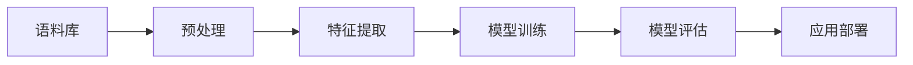

# 现代自然语言处理：从规则到统计

## 1. 背景介绍
### 1.1 自然语言处理的发展历程
#### 1.1.1 早期的规则系统
#### 1.1.2 基于统计的方法兴起
#### 1.1.3 深度学习的崛起
### 1.2 自然语言处理的应用领域
#### 1.2.1 机器翻译
#### 1.2.2 信息检索
#### 1.2.3 情感分析
#### 1.2.4 问答系统
#### 1.2.5 对话系统

## 2. 核心概念与联系
### 2.1 语言模型
#### 2.1.1 N-gram模型
#### 2.1.2 神经网络语言模型
### 2.2 词嵌入
#### 2.2.1 Word2Vec
#### 2.2.2 GloVe
#### 2.2.3 FastText
### 2.3 序列标注
#### 2.3.1 隐马尔可夫模型(HMM)
#### 2.3.2 条件随机场(CRF)
#### 2.3.3 循环神经网络(RNN)
### 2.4 注意力机制与Transformer
#### 2.4.1 Seq2Seq模型
#### 2.4.2 注意力机制
#### 2.4.3 Transformer结构



## 3. 核心算法原理具体操作步骤
### 3.1 文本预处理
#### 3.1.1 分词
#### 3.1.2 词性标注
#### 3.1.3 命名实体识别
### 3.2 语言模型训练
#### 3.2.1 N-gram模型训练
#### 3.2.2 神经网络语言模型训练
### 3.3 词嵌入训练
#### 3.3.1 Word2Vec训练
#### 3.3.2 GloVe训练
#### 3.3.3 FastText训练
### 3.4 序列标注模型训练
#### 3.4.1 HMM训练
#### 3.4.2 CRF训练
#### 3.4.3 BiLSTM-CRF训练
### 3.5 Transformer模型训练
#### 3.5.1 Encoder训练
#### 3.5.2 Decoder训练
#### 3.5.3 注意力机制训练

## 4. 数学模型和公式详细讲解举例说明
### 4.1 语言模型的数学表示
$$P(w_1, w_2, ..., w_n) = \prod_{i=1}^n P(w_i | w_1, ..., w_{i-1})$$
其中，$w_i$表示第$i$个词，$P(w_i | w_1, ..., w_{i-1})$表示在给定前$i-1$个词的条件下，第$i$个词的条件概率。

对于N-gram模型，假设一个词只与前面的$n-1$个词相关，那么有：
$$P(w_i|w_1, ..., w_{i-1}) \approx P(w_i|w_{i-n+1}, ..., w_{i-1})$$

### 4.2 词嵌入的数学表示
Word2Vec中的Skip-gram模型的目标是最大化如下的对数似然函数：
$$\sum_{t=1}^{T}\sum_{-c \leq j \leq c, j \neq 0} \log p(w_{t+j}|w_t)$$
其中，$w_t$表示中心词，$w_{t+j}$表示上下文词，$c$表示窗口大小。

GloVe模型的目标是最小化如下的损失函数：
$$J = \sum_{i,j=1}^V f(X_{ij})(w_i^T\tilde{w}_j + b_i + \tilde{b}_j - \log X_{ij})^2$$
其中，$X_{ij}$表示词$i$和词$j$在语料库中共同出现的次数，$f$是一个权重函数，$w_i$和$b_i$分别表示词$i$的词向量和偏置项，$\tilde{w}_j$和$\tilde{b}_j$分别表示上下文词$j$的词向量和偏置项。

### 4.3 序列标注模型的数学表示
HMM模型中，状态转移概率$a_{ij}$和发射概率$b_j(o_t)$的计算公式如下：
$$a_{ij} = \frac{A_{ij}}{\sum_{j=1}^N A_{ij}}$$
$$b_j(o_t) = \frac{B_{j}(o_t)}{\sum_{k=1}^M B_{j}(k)}$$
其中，$A_{ij}$表示从状态$i$转移到状态$j$的次数，$B_{j}(o_t)$表示在状态$j$下观察到$o_t$的次数，$N$表示状态数，$M$表示观察数。

CRF模型中，状态序列$y$的概率可以表示为：
$$p(y|x) = \frac{1}{Z(x)}\exp\left(\sum_{i=1}^n\sum_{j=1}^m \lambda_j f_j(y_{i-1}, y_i, x, i)\right)$$
其中，$Z(x)$是归一化因子，$f_j$是特征函数，$\lambda_j$是对应的权重。

### 4.4 Transformer模型的数学表示
Transformer的Encoder中的自注意力机制可以表示为：
$$\text{Attention}(Q, K, V) = \text{softmax}\left(\frac{QK^T}{\sqrt{d_k}}\right)V$$
其中，$Q$、$K$、$V$分别表示查询、键、值矩阵，$d_k$是键向量的维度。

Decoder中的注意力机制可以表示为：
$$\text{Attention}(Q, K, V) = \text{softmax}\left(\frac{QK^T}{\sqrt{d_k}}\right)V$$
$$\text{Context} = \text{Attention}(Q_d, K_e, V_e)$$
其中，$Q_d$表示Decoder的隐状态，$K_e$和$V_e$表示Encoder的输出。

## 5. 项目实践：代码实例和详细解释说明
### 5.1 文本预处理
```python
import jieba

text = "自然语言处理是人工智能的一个重要分支。"

# 分词
words = jieba.cut(text)
print(list(words))
# 输出：['自然语言', '处理', '是', '人工智能', '的', '一个', '重要', '分支', '。']

# 词性标注
words = jieba.posseg.cut(text)
for word, pos in words:
    print(f"{word}/{pos}", end=" ")
# 输出：自然语言/n 处理/v 是/v 人工智能/n 的/uj 一个/m 重要/a 分支/n 。/x 

# 命名实体识别
import hanlp

recognizer = hanlp.load(hanlp.pretrained.ner.MSRA_NER_BERT_BASE_ZH)
print(recognizer(text))
# 输出：[('自然语言处理', 'generic'), ('人工智能', 'generic')]
```

### 5.2 语言模型训练
```python
import nltk

# 准备语料
corpus = [
    'this is the first document',
    'this is the second document',
    'and the third one',
    'is this the first document'
]

# 分词
tokenized_corpus = [nltk.word_tokenize(sent) for sent in corpus]

# 训练bigram模型
bigram_model = nltk.collocations.BigramCollocationFinder.from_documents(tokenized_corpus)

# 计算给定句子的概率
sentence = ['this', 'is', 'the', 'first']
print(bigram_model.score_ngram(sentence))
```

### 5.3 词嵌入训练
```python
from gensim.models import Word2Vec

# 准备语料
corpus = [
    ['自然语言', '处理', '是', '人工智能', '的', '一个', '重要', '分支'],
    ['深度', '学习', '是', '自然语言', '处理', '的', '主流', '方法']
]

# 训练Word2Vec模型
model = Word2Vec(corpus, vector_size=100, window=5, min_count=1, workers=4)

# 获取词向量
print(model.wv['自然语言'])
```

### 5.4 序列标注模型训练
```python
import nltk

# 准备训练数据
train_data = [
    ('自然语言处理是人工智能的一个重要分支', ['O', 'O', 'O', 'O', 'O', 'O', 'O', 'O', 'O']),
    ('深度学习是自然语言处理的主流方法', ['O', 'O', 'O', 'O', 'O', 'O', 'O', 'O'])
]

# 定义特征提取器
def word2features(sent, i):
    word = sent[i]
    features = {
        'bias': 1.0,
        'word': word,
        'len': len(word),
        'prefix-1': word[0],
        'suffix-1': word[-1]
    }
    return features

# 提取特征
def sent2features(sent):
    return [word2features(sent, i) for i in range(len(sent))]

# 准备训练数据
X_train = [sent2features(sent) for sent, _ in train_data]
y_train = [label for _, label in train_data]

# 训练CRF模型
crf = nltk.CRFTagger(feature_func=sent2features)
crf.train(list(zip(X_train, y_train)))

# 预测新句子
sentence = '自然语言处理技术被广泛应用于各个领域'
print(crf.tag(sentence))
```

### 5.5 Transformer模型训练
```python
import torch
import torch.nn as nn
from transformers import BertTokenizer, BertModel

# 加载预训练的BERT模型和分词器
tokenizer = BertTokenizer.from_pretrained('bert-base-chinese')
bert = BertModel.from_pretrained('bert-base-chinese')

# 准备输入数据
text = "自然语言处理是人工智能的一个重要分支。"
tokens = tokenizer.tokenize(text)
input_ids = tokenizer.convert_tokens_to_ids(tokens)
input_ids = torch.tensor([input_ids])

# 获取BERT编码结果
with torch.no_grad():
    outputs = bert(input_ids)
    encoded = outputs.last_hidden_state

print(encoded.shape)  # 输出编码的形状
```

## 6. 实际应用场景
### 6.1 智能客服
利用自然语言处理技术，可以构建智能客服系统，自动回答用户的常见问题，提高客服效率。
### 6.2 情感分析
通过对用户评论、社交媒体等文本数据进行情感分析，可以了解用户对产品或服务的满意度，为决策提供依据。
### 6.3 机器翻译
利用神经机器翻译模型，如Transformer，可以实现高质量的自动翻译，方便跨语言交流。
### 6.4 智能搜索
通过自然语言处理技术，可以理解用户的搜索意图，提供更加精准的搜索结果。
### 6.5 自动摘要
利用文本摘要技术，可以自动生成文章的摘要，帮助用户快速了解文章主旨。

## 7. 工具和资源推荐
### 7.1 开源工具库
- NLTK: 自然语言处理入门工具包，提供了常用的NLP任务支持。
- SpaCy: 工业级自然语言处理库，速度快，支持多语言。
- Gensim: 主题模型工具包，支持Word2Vec、FastText等词嵌入模型。
- HanLP: 中文自然语言处理工具包，支持中文分词、词性标注、命名实体识别等任务。
- Transformers: 基于Transformer的自然语言处理库，集成了BERT、GPT等预训练模型。

### 7.2 语料库资源
- 维基百科: 多语言的自由内容百科全书，可用于语料库构建和知识抽取。
- 人民日报语料: 包含多年人民日报新闻文章，可用于训练中文语言模型。
- 微博情感分析数据集: 包含微博文本及其情感标注，可用于情感分析任务。
- LCQMC: 大规模中文问答匹配数据集，可用于问答系统和文本匹配任务。

### 7.3 预训练模型
- BERT: 基于Transformer的双向语言表示模型，可用于各种NLP下游任务。
- ERNIE: 百度提出的增强版BERT模型，在中文NLP任务上表现出色。
- RoBERTa: BERT的改进版，通过优化训练方式提高了模型性能。
- XLNet: 结合了Transformer-XL和自回归语言模型的预训练模型，在多个任务上超越BERT。

## 8. 总结：未来发展趋势与挑战
### 8.1 知识增强的预训练模型
未来的预训练模型将更多地融入知识，如常识知识、领域知识等，以提高模型的理解和推