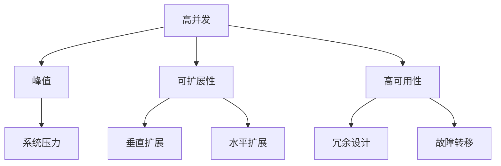

# 电商重要活动技术保障：高并发的峰值系统问题解决

## 1. 背景介绍
### 1.1 电商重要活动的挑战
#### 1.1.1 流量激增带来的系统压力
#### 1.1.2 用户体验至关重要
#### 1.1.3 系统稳定性和可用性要求高
### 1.2 高并发峰值系统面临的问题  
#### 1.2.1 服务器资源不足
#### 1.2.2 数据库读写瓶颈
#### 1.2.3 应用程序性能问题

## 2. 核心概念与联系
### 2.1 高并发
#### 2.1.1 高并发的定义
#### 2.1.2 高并发带来的挑战
### 2.2 峰值
#### 2.2.1 峰值的定义
#### 2.2.2 峰值对系统的影响
### 2.3 可扩展性
#### 2.3.1 可扩展性的重要性
#### 2.3.2 垂直扩展与水平扩展
### 2.4 高可用性
#### 2.4.1 高可用性的定义
#### 2.4.2 实现高可用性的方法



## 3. 核心算法原理具体操作步骤
### 3.1 缓存
#### 3.1.1 缓存的原理
#### 3.1.2 缓存的使用场景
#### 3.1.3 缓存的更新策略
### 3.2 负载均衡
#### 3.2.1 负载均衡的原理
#### 3.2.2 负载均衡算法
#### 3.2.3 负载均衡的实现方式
### 3.3 数据库优化
#### 3.3.1 索引优化
#### 3.3.2 查询优化
#### 3.3.3 分库分表

## 4. 数学模型和公式详细讲解举例说明
### 4.1 排队论模型
#### 4.1.1 排队论基本概念
#### 4.1.2 M/M/1排队模型
假设顾客到达服从泊松分布，到达率为$\lambda$，服务时间服从指数分布，服务率为$\mu$，则系统中顾客数$N$的概率分布为：

$$
P_n = (1-\rho)\rho^n, n=0,1,2,\dots
$$

其中，$\rho=\frac{\lambda}{\mu}$，表示服务强度或利用率。

例如，若$\lambda=50$（每小时50个请求），$\mu=60$（每小时可处理60个请求），则$\rho=\frac{5}{6}$，系统空闲的概率为$P_0=1-\frac{5}{6}=\frac{1}{6}$。

#### 4.1.3 排队论在高并发系统中的应用
### 4.2 Little定律
#### 4.2.1 Little定律的内容
Little定律描述了在稳定状态下，一个系统中平均存在的顾客数$L$、顾客到达率$\lambda$和顾客在系统中平均逗留时间$W$之间的关系：

$$
L = \lambda W
$$

#### 4.2.2 Little定律在高并发系统中的应用
例如，若一个系统平均每秒有100个请求到达（$\lambda=100$），每个请求平均处理时间为0.5秒（$W=0.5$），则根据Little定律，系统中平均存在的请求数为$L=100 \times 0.5=50$。

## 5. 项目实践：代码实例和详细解释说明
### 5.1 缓存实践
#### 5.1.1 Redis缓存的使用
```java
@Cacheable(value = "product", key = "#id")
public Product getProductById(Long id) {
    return productRepository.findById(id).orElse(null);
}
```
- `@Cacheable`注解标记在需要缓存的方法上，`value`指定缓存的名称，`key`指定缓存的键。
- 当调用`getProductById`方法时，会先检查缓存中是否存在对应的数据，如果存在则直接返回缓存数据，否则执行方法并将结果缓存。

#### 5.1.2 缓存预热与更新
### 5.2 消息队列实践
#### 5.2.1 RabbitMQ的使用
```java
@RabbitListener(queues = "order.queue")
public void processOrder(Order order) {
    // 处理订单逻辑
    orderService.processOrder(order);
}
```
- `@RabbitListener`注解标记在消息消费者方法上，`queues`指定监听的队列名称。
- 当有新的订单消息到达`order.queue`队列时，`processOrder`方法会被自动调用，执行订单处理逻辑。

#### 5.2.2 消息可靠性保障
### 5.3 数据库优化实践
#### 5.3.1 索引优化
```sql
CREATE INDEX idx_order_user_id ON orders (user_id);
```
- 在`orders`表的`user_id`字段上创建索引，提高根据用户ID查询订单的效率。

#### 5.3.2 读写分离

## 6. 实际应用场景
### 6.1 双11大促活动
#### 6.1.1 活动特点与挑战
#### 6.1.2 技术方案与实践
### 6.2 618年中大促
#### 6.2.1 活动特点与挑战  
#### 6.2.2 技术方案与实践
### 6.3 其他重要促销活动
#### 6.3.1 活动特点与挑战
#### 6.3.2 技术方案与实践

## 7. 工具和资源推荐
### 7.1 性能测试工具
#### 7.1.1 Apache JMeter
#### 7.1.2 Gatling
### 7.2 监控与告警
#### 7.2.1 Prometheus
#### 7.2.2 Grafana
### 7.3 学习资源
#### 7.3.1 书籍推荐
- 《亿级流量网站架构核心技术》
- 《大型网站技术架构：核心原理与案例分析》
#### 7.3.2 博客与论坛
- High Scalability
- 阿里中间件团队博客

## 8. 总结：未来发展趋势与挑战
### 8.1 技术趋势
#### 8.1.1 云原生架构
#### 8.1.2 Serverless 
### 8.2 业务发展
#### 8.2.1 营销方式创新
#### 8.2.2 用户体验提升
### 8.3 挑战与机遇
#### 8.3.1 海量数据处理
#### 8.3.2 实时计算需求

## 9. 附录：常见问题与解答
### 9.1 如何评估系统的高并发能力？
可以通过压力测试工具模拟大量并发请求，观察系统的响应时间、吞吐量、错误率等指标，分析系统的瓶颈所在。同时，还需要结合实际业务场景，评估峰值流量的大小和持续时间。

### 9.2 高并发系统如何保证数据一致性？
可以采用分布式事务、事务补偿、最终一致性等方案，根据业务特点选择合适的一致性模型。例如，对于强一致性要求高的场景，可以使用分布式事务；对于最终一致性要求的场景，可以通过消息队列实现异步数据同步。

### 9.3 如何应对流量突发的情况？
除了提前做好容量规划和资源准备外，还可以使用自动扩容、流量控制等手段来应对流量突发。例如，利用云平台的弹性伸缩能力，根据实时流量自动调整服务器数量；使用限流、降级等手段，保护系统不被过载。

---

作者：禅与计算机程序设计艺术 / Zen and the Art of Computer Programming