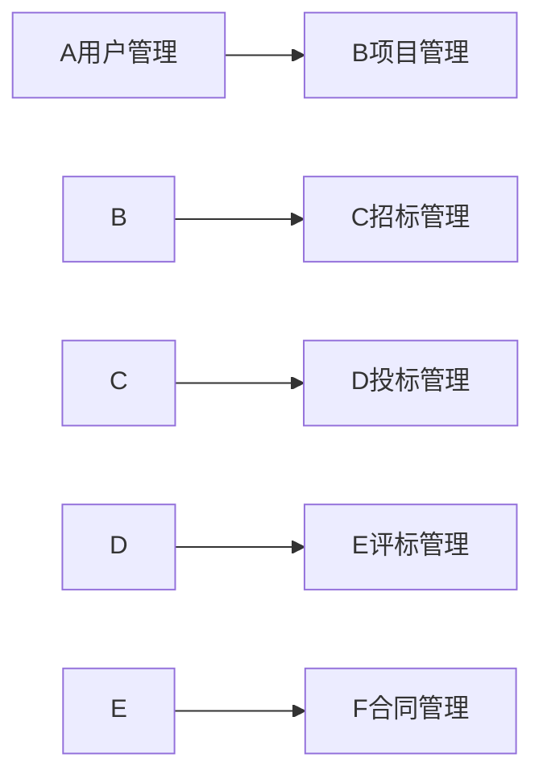

# 网上招标系统详细设计与具体代码实现

## 1. 背景介绍
### 1.1 网上招标系统的发展历程
### 1.2 网上招标系统的重要性
### 1.3 网上招标系统面临的挑战

## 2. 核心概念与联系
### 2.1 网上招标系统的定义
### 2.2 网上招标系统的核心组成部分
#### 2.2.1 用户管理模块
#### 2.2.2 项目管理模块 
#### 2.2.3 招标管理模块
#### 2.2.4 投标管理模块
#### 2.2.5 评标管理模块
#### 2.2.6 合同管理模块
### 2.3 网上招标系统各模块之间的关系



## 3. 核心算法原理具体操作步骤
### 3.1 用户身份认证算法
#### 3.1.1 基于角色的访问控制RBAC
#### 3.1.2 单点登录SSO
### 3.2 电子签名与数据加密算法
#### 3.2.1 非对称加密算法RSA
#### 3.2.2 对称加密算法AES
#### 3.2.3 哈希算法SHA256
### 3.3 自动评标算法
#### 3.3.1 规则引擎
#### 3.3.2 加权平均法
### 3.4 智能推荐与匹配算法
#### 3.4.1 协同过滤推荐
#### 3.4.2 基于内容的推荐

## 4. 数学模型和公式详细讲解举例说明
### 4.1 RSA加密算法数学原理
RSA基于大质数因子分解的数学问题。选择两个大质数p和q，计算 $n=pq$，欧拉函数 $\varphi(n)=(p-1)(q-1)$。选择整数e，使得 $1<e<\varphi(n)$，且e与 $\varphi(n)$ 互质。计算d，使得 $ed\equiv1\pmod{\varphi(n)}$。公钥为(n,e)，私钥为(n,d)。

加密：$c\equiv m^e\pmod n$  
解密：$m\equiv c^d\pmod n$

### 4.2 加权平均评分模型
对于评标专家打分 $x_1,x_2,...,x_n$，权重 $w_1,w_2,...,w_n$，总得分为：

$$
score=\frac{\sum_{i=1}^nw_ix_i}{\sum_{i=1}^nw_i}
$$

### 4.3 协同过滤推荐模型
使用皮尔逊相关系数计算用户相似度：

$$
sim(u,v)=\frac{\sum_{i\in I}(r_{u,i}-\bar r_u)(r_{v,i}-\bar r_v)}{\sqrt{\sum_{i\in I}(r_{u,i}-\bar r_u)^2}\sqrt{\sum_{i\in I}(r_{v,i}-\bar r_v)^2}}
$$

其中，$r_{u,i}$ 表示用户u对项目i的评分，$\bar r_u$ 表示u的平均评分，I为u和v共同评分的项目集合。

## 5. 项目实践：代码实例和详细解释说明
### 5.1 用户身份认证代码示例
```java
// 基于角色的权限控制注解
@PreAuthorize("hasRole('ADMIN')")
public void adminOnly() {
    // 只有ADMIN角色可以访问
}

// 单点登录集成Spring Security示例
@Configuration
public class SecurityConfig extends WebSecurityConfigurerAdapter {
    @Override
    protected void configure(HttpSecurity http) throws Exception {
        http
            .authorizeRequests()
            .anyRequest().authenticated()
            .and()
            .saml2Login(); // 使用SAML2协议进行SSO 
    }
}
```

### 5.2 电子签名与数据加密代码示例
```java
// 生成RSA密钥对
KeyPairGenerator keyGen = KeyPairGenerator.getInstance("RSA");
keyGen.initialize(2048);
KeyPair keyPair = keyGen.generateKeyPair();
PrivateKey privateKey = keyPair.getPrivate();
PublicKey publicKey = keyPair.getPublic();

// 使用私钥签名
Signature signature = Signature.getInstance("SHA256withRSA");
signature.initSign(privateKey);
signature.update(data);
byte[] sign = signature.sign();

// 使用公钥验签
signature.initVerify(publicKey);
signature.update(data);
boolean isValid = signature.verify(sign);

// AES加密
SecretKey secretKey = KeyGenerator.getInstance("AES").generateKey();
Cipher cipher = Cipher.getInstance("AES");
cipher.init(Cipher.ENCRYPT_MODE, secretKey);
byte[] encrypted = cipher.doFinal(data);
```

### 5.3 自动评标代码示例
```java
// Drools规则引擎
KieServices ks = KieServices.Factory.get();
KieContainer kContainer = ks.getKieClasspathContainer();
KieSession kSession = kContainer.newKieSession("rulesSession");

// 加入评标规则
kSession.insert(rule1);
kSession.insert(rule2);
// 加入投标对象 
kSession.insert(bid1);
kSession.insert(bid2);

// 触发规则
kSession.fireAllRules();
```

### 5.4 智能推荐代码示例
```java
// 协同过滤推荐
DataModel model = new FileDataModel(new File("data.csv"));
UserSimilarity similarity = new PearsonCorrelationSimilarity(model);
UserNeighborhood neighborhood = new NearestNUserNeighborhood(10, similarity, model);
Recommender recommender = new GenericUserBasedRecommender(model, neighborhood, similarity);

List<RecommendedItem> recommendations = recommender.recommend(userID, 5);
```

## 6. 实际应用场景
### 6.1 政府采购项目招投标
### 6.2 大型企业集中采购
### 6.3 工程建设项目招标投标

## 7. 工具和资源推荐
### 7.1 开源网上招投标系统
- OpenBid：基于Java的开源网上招投标系统
- EasyBid：基于PHP的开源网上招投标系统
### 7.2 第三方电子签名服务
- DocuSign：提供安全可靠的电子签名服务
- Adobe Sign：Adobe提供的电子签名解决方案
### 7.3 推荐系统工具库
- Apache Mahout：可扩展的机器学习和数据挖掘库
- Duine Framework：Java的推荐系统框架

## 8. 总结：未来发展趋势与挑战
### 8.1 区块链技术在网上招投标中的应用前景
### 8.2 人工智能在自动评标和智能匹配方面的进一步发展
### 8.3 移动端招投标系统的优化与普及
### 8.4 网上招投标数据安全与隐私保护面临的挑战

## 9. 附录：常见问题与解答
### 9.1 网上招投标系统如何保证公平公正？ 
通过严格的权限控制、全程留痕追溯、电子签名验签等技术手段，最大限度保证招投标过程的公平公正。
### 9.2 电子签名的法律效力如何？
在《中华人民共和国电子签名法》的规定下，符合条件的电子签名与手写签名或盖章具有同等的法律效力。
### 9.3 如何防止投标文件泄密？
采用非对称加密算法，投标人使用私钥加密，开标时才用公钥解密，可以有效防止提前泄密。
### 9.4 如何进一步提高评标的科学性？
引入人工智能技术，综合考虑历史数据，建立更加智能的评标模型，辅助专家进行评审。

作者：禅与计算机程序设计艺术 / Zen and the Art of Computer Programming