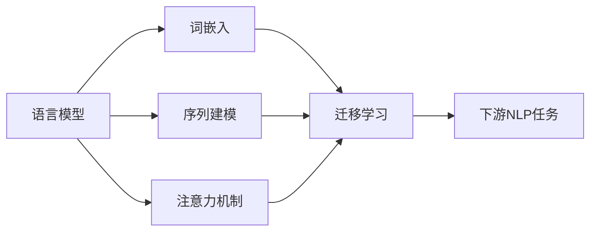

# 自然语言处理 (Natural Language Processing)

## 1. 背景介绍

自然语言处理(Natural Language Processing, NLP)是人工智能(Artificial Intelligence, AI)领域的一个重要分支,旨在使计算机能够理解、处理和生成人类语言。随着大数据和深度学习技术的发展,NLP在近年来取得了长足的进步,在智能对话系统、机器翻译、情感分析等领域得到了广泛应用。

### 1.1 NLP的发展历程

#### 1.1.1 早期规则系统
- 20世纪50年代,机器翻译研究开始兴起
- 基于语言学规则,人工构建语法和词典

#### 1.1.2 统计学习方法
- 20世纪80年代,统计机器学习方法逐渐兴起
- 基于大规模语料库,训练统计模型

#### 1.1.3 深度学习时代
- 2010年以来,深度学习技术在NLP领域取得突破
- 端到端学习,无需人工特征工程

### 1.2 NLP的主要任务

#### 1.2.1 文本分类
- 情感分析
- 主题分类
- 意图识别

#### 1.2.2 序列标注
- 命名实体识别
- 词性标注
- 语义角色标注

#### 1.2.3 文本生成
- 机器翻译
- 文本摘要
- 对话生成

#### 1.2.4 信息抽取
- 关系抽取
- 事件抽取
- 知识图谱构建

## 2. 核心概念与联系

### 2.1 语言模型
语言模型是NLP的基础,用于刻画单词序列的概率分布。给定前面的词,语言模型可以预测下一个最可能出现的词。常见的语言模型有:
- N-gram模型
- 神经网络语言模型
- Transformer语言模型(如BERT、GPT等)

### 2.2 词嵌入
词嵌入将词映射为低维连续向量表示,捕捉词之间的语义关系。经典的词嵌入模型包括:
- Word2Vec
- GloVe
- FastText

### 2.3 序列建模
许多NLP任务需要对文本序列进行建模,常用的序列模型有:
- 循环神经网络(RNN)
- 长短期记忆网络(LSTM)
- 门控循环单元(GRU)
- Transformer

### 2.4 注意力机制
注意力机制让模型能够聚焦于输入中的关键信息,在机器翻译、阅读理解等任务中发挥重要作用。常见的注意力机制包括:
- Additive Attention
- Dot-Product Attention
- Multi-Head Attention

### 2.5 迁移学习
迁移学习利用在大规模语料上预训练的模型,并将其应用于下游任务,显著提升了NLP系统的性能。代表性的预训练模型有:
- BERT
- RoBERTa
- XLNet
- GPT系列

下图展示了这些核心概念之间的联系:



## 3. 核心算法原理具体操作步骤

### 3.1 Word2Vec

Word2Vec是一种经典的词嵌入算法,包括CBOW和Skip-gram两种模型。以CBOW为例,其训练过程如下:

1. 构建词典,将每个词映射为唯一的索引
2. 定义窗口大小,提取中心词和上下文词
3. 将上下文词one-hot编码作为输入,中心词one-hot编码作为标签
4. 前向传播,计算隐层和输出层
5. 计算损失函数(如交叉熵损失)
6. 反向传播,更新词向量矩阵
7. 重复步骤3-6,直到收敛

### 3.2 Transformer

Transformer是一种基于自注意力机制的序列建模架构,广泛应用于NLP任务。其核心是Multi-Head Attention,计算步骤如下:

1. 将输入序列映射为查询矩阵Q、键矩阵K和值矩阵V
2. 计算注意力权重矩阵:$Attention(Q,K,V) = softmax(\frac{QK^T}{\sqrt{d_k}})V$
3. 将注意力矩阵与值矩阵相乘,得到输出
4. 将上述过程重复h次(Multi-Head),并拼接结果
5. 对拼接结果应用前馈神经网络,得到最终输出

### 3.3 BERT

BERT是一种基于Transformer的预训练语言模型,通过Masked Language Modeling和Next Sentence Prediction两个任务进行预训练。其微调过程如下:

1. 在特定任务的数据集上,将输入文本转化为BERT需要的格式(如添加[CLS]和[SEP]标记)
2. 冻结BERT的大部分参数,只微调顶层的分类器或特定任务层
3. 将任务损失函数(如交叉熵损失)传播回BERT,更新可训练参数
4. 重复步骤3,直到模型收敛
5. 在测试集上评估微调后的模型性能

## 4. 数学模型和公式详细讲解举例说明

### 4.1 Softmax函数

Softmax函数常用于将神经网络的输出转化为概率分布。对于输入向量$\mathbf{z} = (z_1, \ldots, z_K)$,Softmax函数定义为:

$$
\text{softmax}(z_i) = \frac{e^{z_i}}{\sum_{j=1}^K e^{z_j}} \quad \text{for } i = 1, \ldots, K
$$

例如,假设神经网络的输出为$\mathbf{z} = (2.0, 1.0, 0.1)$,则Softmax函数的计算过程如下:

$$
\begin{aligned}
\text{softmax}(z_1) &= \frac{e^{2.0}}{e^{2.0} + e^{1.0} + e^{0.1}} \approx 0.7 \\
\text{softmax}(z_2) &= \frac{e^{1.0}}{e^{2.0} + e^{1.0} + e^{0.1}} \approx 0.24 \\
\text{softmax}(z_3) &= \frac{e^{0.1}}{e^{2.0} + e^{1.0} + e^{0.1}} \approx 0.06
\end{aligned}
$$

可以看出,Softmax函数将输出转化为了一个合法的概率分布。

### 4.2 交叉熵损失

交叉熵损失常用于衡量两个概率分布之间的差异,在分类任务中用于量化模型预测与真实标签的偏离程度。对于真实标签$y$和预测概率$\hat{y}$,交叉熵损失定义为:

$$
H(y, \hat{y}) = -\sum_{i=1}^N y_i \log(\hat{y}_i)
$$

其中$N$为类别数。例如,假设真实标签为$y = (0, 1, 0)$,模型预测概率为$\hat{y} = (0.1, 0.7, 0.2)$,则交叉熵损失为:

$$
H(y, \hat{y}) = -(0 \times \log(0.1) + 1 \times \log(0.7) + 0 \times \log(0.2)) \approx 0.36
$$

交叉熵损失越小,说明模型预测与真实标签越接近。

### 4.3 注意力权重计算

在Transformer的Self-Attention中,注意力权重矩阵的计算公式为:

$$
\text{Attention}(Q, K, V) = \text{softmax}(\frac{QK^T}{\sqrt{d_k}})V
$$

其中$Q$、$K$、$V$分别为查询矩阵、键矩阵和值矩阵,$d_k$为键向量的维度。例如,假设$Q$、$K$、$V$的形状都为(2, 3),且$d_k = 3$,则注意力权重矩阵的计算过程如下:

$$
QK^T = \begin{pmatrix}
1 & 2 & 3 \\
4 & 5 & 6
\end{pmatrix}
\begin{pmatrix}
1 & 4 \\
2 & 5 \\
3 & 6
\end{pmatrix} =
\begin{pmatrix}
14 & 32 \\
32 & 77
\end{pmatrix}
$$

$$
\text{Attention}(Q, K, V) = \text{softmax}(\frac{1}{\sqrt{3}}
\begin{pmatrix}
14 & 32 \\
32 & 77
\end{pmatrix})
\begin{pmatrix}
1 & 2 & 3 \\
4 & 5 & 6
\end{pmatrix}
$$

通过Softmax归一化和矩阵乘法,即可得到最终的注意力输出。

## 5. 项目实践:代码实例和详细解释说明

下面以PyTorch为例,展示如何实现一个简单的基于RNN的情感分类模型。

```python
import torch
import torch.nn as nn

class RNNSentimentClassifier(nn.Module):
    def __init__(self, vocab_size, embed_dim, hidden_dim, num_classes):
        super().__init__()
        self.embedding = nn.Embedding(vocab_size, embed_dim)
        self.rnn = nn.RNN(embed_dim, hidden_dim, batch_first=True)
        self.fc = nn.Linear(hidden_dim, num_classes)
        
    def forward(self, x):
        x = self.embedding(x)
        _, h = self.rnn(x)
        out = self.fc(h.squeeze(0))
        return out

# 超参数设置
vocab_size = 10000
embed_dim = 100
hidden_dim = 256
num_classes = 2
batch_size = 64

# 假设已经准备好了训练数据和标签
train_data = ...
train_labels = ...

# 实例化模型和损失函数
model = RNNSentimentClassifier(vocab_size, embed_dim, hidden_dim, num_classes)
criterion = nn.CrossEntropyLoss()
optimizer = torch.optim.Adam(model.parameters(), lr=1e-3)

# 训练循环
for epoch in range(10):
    for i in range(0, len(train_data), batch_size):
        batch_data = train_data[i:i+batch_size]
        batch_labels = train_labels[i:i+batch_size]
        
        optimizer.zero_grad()
        outputs = model(batch_data)
        loss = criterion(outputs, batch_labels)
        loss.backward()
        optimizer.step()
        
    print(f'Epoch {epoch+1}, Loss: {loss.item():.4f}')

# 在测试集上评估模型
test_data = ...
test_labels = ...

with torch.no_grad():
    outputs = model(test_data)
    _, predicted = torch.max(outputs, 1)
    accuracy = torch.sum(predicted == test_labels).item() / len(test_labels)
    print(f'Test Accuracy: {accuracy:.4f}')
```

代码解释:

1. 定义了一个`RNNSentimentClassifier`类,包含词嵌入层、RNN层和全连接输出层
2. 在`forward`方法中,将输入数据经过嵌入层、RNN层和全连接层,得到最终的分类输出
3. 设置超参数,如词表大小、嵌入维度、隐藏状态维度和类别数
4. 准备训练数据和标签(这里假设已经完成了数据预处理)
5. 实例化模型、损失函数和优化器
6. 进行训练,每个批次计算损失、反向传播和参数更新
7. 在测试集上评估模型性能,计算分类准确率

以上就是一个简单的情感分类模型的PyTorch实现。在实际应用中,可以使用更大的数据集、更深的模型(如LSTM、Transformer)以及更多的训练技巧(如梯度裁剪、学习率调度)来进一步提升性能。

## 6. 实际应用场景

NLP技术在许多领域都有广泛的应用,下面列举几个典型场景:

### 6.1 智能客服

- 利用意图识别和槽位填充技术,理解用户问题的核心意图和关键信息
- 基于知识库问答和对话生成技术,自动生成回复内容
- 通过情感分析,识别用户情绪,提供个性化服务

### 6.2 舆情监控

- 利用文本分类技术,对海量新闻、评论等文本进行主题分类
- 通过命名实体识别,提取文本中的人名、地名、机构名等关键信息
- 使用情感分析,实时掌握舆论动向和情感倾向

### 6.3 智能搜索

- 利用关键词提取和语义表示技术,增强搜索引擎的查全率和查准率
- 通过问