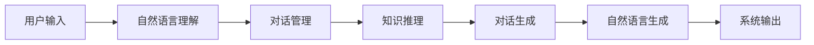

# 自然语言对话系统(Conversational AI)原理与代码实战案例讲解

## 1. 背景介绍
### 1.1 人机交互的发展历程
#### 1.1.1 早期命令行交互
#### 1.1.2 图形用户界面(GUI)
#### 1.1.3 自然语言交互的兴起

### 1.2 自然语言对话系统概述  
#### 1.2.1 定义与特点
#### 1.2.2 应用场景
#### 1.2.3 发展现状与趋势

## 2. 核心概念与联系
### 2.1 自然语言处理(NLP) 
#### 2.1.1 语法分析
#### 2.1.2 语义理解
#### 2.1.3 指代消解

### 2.2 对话管理(Dialogue Management)
#### 2.2.1 对话状态跟踪
#### 2.2.2 对话策略学习
#### 2.2.3 对话生成

### 2.3 知识表示与推理
#### 2.3.1 知识图谱
#### 2.3.2 本体推理
#### 2.3.3 常识推理

### 2.4 Mermaid流程图


## 3. 核心算法原理具体操作步骤
### 3.1 基于检索的对话系统
#### 3.1.1 候选回复选择
#### 3.1.2 回复排序
#### 3.1.3 回复去重

### 3.2 基于生成的对话系统  
#### 3.2.1 Seq2Seq模型
#### 3.2.2 注意力机制
#### 3.2.3 Copy机制
#### 3.2.4 Beam Search解码

### 3.3 基于强化学习的对话策略优化
#### 3.3.1 MDP建模
#### 3.3.2 策略梯度算法 
#### 3.3.3 DQN算法

## 4. 数学模型和公式详细讲解举例说明
### 4.1 Seq2Seq模型
$$ P(y_1,...,y_{T'}|x_1,...,x_T)=\prod_{t=1}^{T'} P(y_t|v,y_1,...,y_{t-1}) $$
其中，$x_1,...,x_T$为输入序列，$y_1,...,y_{T'}$为输出序列，$v$为Encoder的输出。

### 4.2 注意力机制
$$ e_{ij} = a(s_{i-1},h_j) $$
$$ \alpha_{ij} = \frac{exp(e_{ij})}{\sum_{k=1}^{T_x}exp(e_{ik})} $$  
$$ c_i = \sum_{j=1}^{T_x} \alpha_{ij}h_j $$

其中，$e_{ij}$为注意力得分，$\alpha_{ij}$为注意力权重，$c_i$为注意力上下文向量。

### 4.3 强化学习
$$ J(\theta)=E_{\pi_{\theta}}[\sum_{t=1}^{T}r_t] $$
$$ \theta \leftarrow \theta + \alpha \nabla_{\theta}J(\theta) $$

其中，$J(\theta)$为期望回报，$\pi_{\theta}$为参数化策略，$r_t$为每步奖励，$\alpha$为学习率。

## 5. 项目实践：代码实例和详细解释说明
### 5.1 基于检索的对话系统
```python
# 加载语料库
corpus = [
    ["你好","你好,我是智能助手,有什么可以帮到你?"],
    ["今天天气怎么样","今天天气晴朗,非常适合出去玩呢"],
    ["推荐几部好看的电影吧","最近上映了不少好电影,我给你推荐几部:...]
]

# 简单的相似度匹配
def retrieve(query):
    scores = [fuzz.ratio(query, pair[0]) for pair in corpus]
    idx = np.argmax(scores)
    return corpus[idx][1]

print(retrieve("你好啊"))  
print(retrieve("今天适合出去玩吗"))
print(retrieve("有什么好电影推荐"))
```

### 5.2 基于Seq2Seq生成的对话系统
```python
# 定义Encoder
class Encoder(nn.Module):
    def __init__(self, vocab_size, embed_size, enc_hidden_size, dec_hidden_size, dropout=0.2):
        super(Encoder, self).__init__()
        self.embed = nn.Embedding(vocab_size, embed_size)
        self.rnn = nn.GRU(embed_size, enc_hidden_size, batch_first=True, bidirectional=True)
        self.dropout = nn.Dropout(dropout)
        self.fc = nn.Linear(enc_hidden_size * 2, dec_hidden_size)

    def forward(self, x, lengths):
        sorted_len, sorted_idx = lengths.sort(0, descending=True)
        x_sorted = x[sorted_idx.long()]
        embedded = self.dropout(self.embed(x_sorted))

        packed_embedded = nn.utils.rnn.pack_padded_sequence(embedded, sorted_len.long().cpu().data.numpy(), batch_first=True)
        packed_out, hid = self.rnn(packed_embedded)
        out, _ = nn.utils.rnn.pad_packed_sequence(packed_out, batch_first=True)
        _, original_idx = sorted_idx.sort(0, descending=False)
        out = out[original_idx.long()].contiguous()
        hid = hid[:, original_idx.long()].contiguous()

        hid = torch.cat([hid[-2], hid[-1]], dim=1)
        hid = torch.tanh(self.fc(hid)).unsqueeze(0)

        return out, hid
        
# 定义Attention Layer
class Attention(nn.Module):
    def __init__(self, enc_hidden_size, dec_hidden_size):
        super(Attention, self).__init__()
        self.enc_hidden_size = enc_hidden_size
        self.dec_hidden_size = dec_hidden_size
        self.attn = nn.Linear((enc_hidden_size * 2) + dec_hidden_size, dec_hidden_size)
        self.v = nn.Linear(dec_hidden_size, 1, bias=False)

    def forward(self, s, enc_output):
        batch_size = enc_output.shape[0]
        src_len = enc_output.shape[1]
        s = s.repeat(1, src_len, 1)
        energy = torch.tanh(self.attn(torch.cat([s, enc_output], dim=2)))
        attention = self.v(energy).squeeze(2)
        return F.softmax(attention, dim=1)
        
# 定义Decoder
class Decoder(nn.Module):
    def __init__(self, vocab_size, embed_size, enc_hidden_size, dec_hidden_size, dropout=0.2):
        super(Decoder, self).__init__()
        self.embed = nn.Embedding(vocab_size, embed_size)
        self.attention = Attention(enc_hidden_size, dec_hidden_size)
        self.rnn = nn.GRU((enc_hidden_size*2)+embed_size, dec_hidden_size, batch_first=True)
        self.out = nn.Linear(dec_hidden_size, vocab_size)
        self.dropout = nn.Dropout(dropout)

    def create_mask(self, x_len, y_len):
        device = x_len.device
        max_x_len = x_len.max()
        max_y_len = y_len.max()
        x_mask = torch.arange(max_x_len, device=x_len.device)[None, :] < x_len[:, None]
        y_mask = torch.arange(max_y_len, device=x_len.device)[None, :] < y_len[:, None]
        mask = (1 - x_mask[:, :, None] * y_mask[:, None, :]).byte()
        return mask

    def forward(self, dec_input, last_hidden, encoder_outputs, x_len, y_len):
        mask = self.create_mask(x_len, y_len)
        
        embedded = self.embed(dec_input)
        embedded = self.dropout(embedded)
        attn_weights = self.attention(last_hidden, encoder_outputs)
        context = attn_weights.bmm(encoder_outputs)
        rnn_input = torch.cat([embedded, context], dim=2)
        output, hidden = self.rnn(rnn_input, last_hidden)
        output = output.squeeze(1)
        output = self.out(output)
        output = F.log_softmax(output, dim=1)
        return output, hidden, mask
        
# 模型训练        
def train(encoder, decoder, iterator, optimizer, criterion, clip):
    encoder.train()
    decoder.train()
    epoch_loss = 0
    for i, batch in enumerate(iterator):
        src, src_len = batch.src
        trg, trg_len = batch.trg
        optimizer.zero_grad()
        encoder_outputs, hidden = encoder(src, src_len)
        
        output = trg.data[:, 0] # 起始符号
        outputs = torch.zeros(len(batch), trg.size(1)-1, trg.size(2)).to(device)
        
        for t in range(1, trg.size(1)):
            output, hidden, mask = decoder(output.unsqueeze(1), hidden, encoder_outputs, src_len, trg_len)
            outputs[:,t-1] = output
            output = output.data.max(1)[1]
            
        loss = masked_cross_entropy(outputs.contiguous().view(-1,outputs.size(2)), trg[:,1:].contiguous().view(-1), mask[:,1:].contiguous().view(-1))
        loss.backward()
        torch.nn.utils.clip_grad_norm_(encoder.parameters(), clip)
        torch.nn.utils.clip_grad_norm_(decoder.parameters(), clip)
        optimizer.step()
        epoch_loss += loss.item()
        
    return epoch_loss / len(iterator)
```

## 6. 实际应用场景
### 6.1 智能客服
#### 6.1.1 客户咨询问题自动应答
#### 6.1.2 客户情绪识别与安抚
#### 6.1.3 人工客服对话辅助

### 6.2 智能家居
#### 6.2.1 语音控制家电
#### 6.2.2 家庭助手对话
#### 6.2.3 老人儿童陪伴

### 6.3 智能教育 
#### 6.3.1 智能问答导师
#### 6.3.2 口语对话练习
#### 6.3.3 课程推荐

## 7. 工具和资源推荐
### 7.1 开源工具包
- NLTK
- SpaCy
- Gensim
- AllenNLP
- Rasa

### 7.2 预训练模型
- BERT
- GPT
- XLNet
- ERNIE

### 7.3 知识图谱
- ConceptNet
- WordNet
- YAGO
- DBpedia

### 7.4 对话数据集
- Ubuntu Dialogue Corpus
- Douban Conversation Corpus
- DailyDialog
- PersonaChat

## 8. 总结：未来发展趋势与挑战
### 8.1 个性化对话系统
### 8.2 多模态对话系统
### 8.3 情感对话系统 
### 8.4 可解释性与鲁棒性
### 8.5 隐私与安全

## 9. 附录：常见问题与解答
### 9.1 如何处理OOV问题?
可以使用字符级模型或Copy机制等方法。

### 9.2 对话一致性问题如何解决?
可以引入Persona设定,Speaker Embedding等方法建模说话人个性;也可以通过Dialogue State Tracking等技术增强上下文理解。 

### 9.3 如何提高对话丰富度?
引入外部知识如知识图谱,百科;增加多样化回复;Adversarial Learning等。

### 9.4 对话中的歧义如何消除?
通过澄清问题,纠错,代词消解等方式与用户进一步确认澄清。

### 9.5 如何评估对话系统的性能?
常见的自动评估指标有Perplexity, BLEU, Embedding-based Metrics等;人工评估可考察Fluency, Coherence, Engagement, Informativeness等维度。

作者：禅与计算机程序设计艺术 / Zen and the Art of Computer Programming