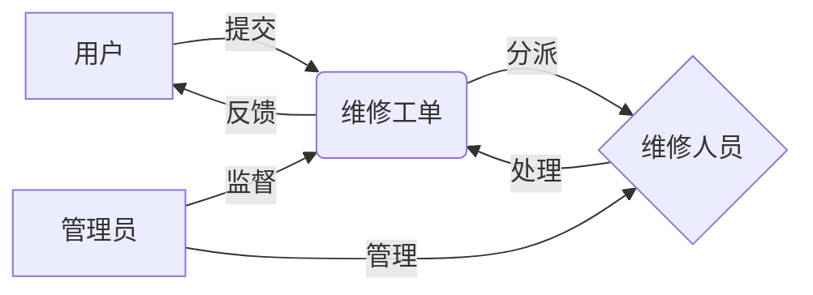

# 计算机维修管理系统详细设计与具体代码实现

## 1. 背景介绍

在当今信息化时代,计算机已经成为各行各业必不可少的工具。然而,随着计算机的广泛应用,其维修和管理工作也变得日益繁重和复杂。传统的人工管理方式已经无法满足现代企业对计算机维修管理的需求。因此,开发一套高效、智能的计算机维修管理系统势在必行。

本文将详细介绍一个基于Java语言开发的计算机维修管理系统的设计与实现。该系统采用了Spring Boot框架,结合MySQL数据库,实现了计算机维修工单的提交、处理、跟踪等功能,大大提高了计算机维修的工作效率和管理水平。

### 1.1 计算机维修管理的现状与挑战

#### 1.1.1 传统人工管理方式的弊端

#### 1.1.2 计算机维修工作量大、流程复杂

#### 1.1.3 缺乏统一、高效的管理平台

### 1.2 计算机维修管理系统的意义

#### 1.2.1 提高计算机维修效率

#### 1.2.2 规范维修流程,提升管理水平

#### 1.2.3 便于数据统计分析,为决策提供支持

## 2. 核心概念与联系

本节将介绍计算机维修管理系统涉及的一些核心概念,以及它们之间的联系。

### 2.1 维修工单

维修工单是记录一次计算机维修服务全过程的单据,包括故障描述、维修进度、处理结果等信息。它是连接用户、维修人员、管理人员的纽带,是整个系统的核心。

### 2.2 维修流程

一个标准的计算机维修流程通常包括:提交工单、分派任务、故障诊断、维修处理、测试验收、结果反馈等环节。明确的流程有助于提高维修效率和服务质量。

### 2.3 角色与权限

系统中的用户分为普通用户、维修人员、管理员等不同角色,拥有不同的操作权限。合理的权限控制是保证系统安全运行的基础。

以下是这些概念之间关系的 Mermaid 流程图:



## 3. 核心算法原理具体操作步骤

本系统的核心是维修工单的自动分派算法。它根据维修人员的专业特长、当前工作量等因素,将新提交的工单智能分配给最合适的人选,从而提高人力资源利用率。

### 3.1 算法输入

- 维修工单信息:故障类型、紧急程度等
- 维修人员信息:专业特长、当前工作量等

### 3.2 算法处理步骤

1. 根据工单的故障类型,筛选出具备相应专业特长的维修人员子集 A;
2. 在 A 中,选择当前工作量最小的人员子集 B;
3. 在 B 中,按照工单的紧急程度排序,选择紧急程度最高的工单优先分配;
4. 将工单分配给 B 中的第一个人员,并更新其工作量;
5. 重复步骤3-4,直到所有工单分配完毕。

### 3.3 算法输出

- 工单的执行人员及其分派顺序

## 4. 数学模型和公式详细讲解举例说明

为了量化维修人员的工作量,我们引入了"工作量指数"这一概念。它综合考虑了该人员当前正在处理的工单数量和紧急程度,可以用下面的公式表示:

$$
W_i = \sum_{j=1}^{n} U_j
$$

其中,$W_i$ 表示维修人员 $i$ 的工作量指数;$n$ 为其当前正在处理的工单数量;$U_j$ 为第 $j$ 个工单的紧急程度系数,取值范围为 $(0,1]$,紧急程度越高,系数越大。

举例来说,维修人员张三正在处理3个工单,其紧急程度系数分别为0.7、0.5、0.3,则张三的工作量指数为:

$$
W_张三 = 0.7 + 0.5 + 0.3 = 1.5
$$

工作量指数越小,表明该人员当前任务较轻,更适合接收新的工单。

## 5. 项目实践:代码实例和详细解释说明

下面是用Java语言实现的维修工单自动分派算法的核心代码:

```java
public class DispatcherService {
    @Autowired
    private WorkerRepository workerRepo;
    @Autowired
    private WorkOrderRepository workOrderRepo;

    public Worker dispatch(WorkOrder order) {
        // 根据工单的故障类型,筛选出具备相应专业特长的维修人员
        List<Worker> candidates = workerRepo.findBySkill(order.getIssueType());
        
        // 在候选人中,选择工作量指数最小的人员
        candidates.sort(Comparator.comparingDouble(Worker::getWorkloadIndex));
        Worker worker = candidates.get(0);
        
        // 将工单分配给选中的人员,并更新其工作量指数
        order.setWorker(worker);
        workOrderRepo.save(order);
        worker.setWorkloadIndex(worker.getWorkloadIndex() + order.getUrgencyDegree());
        workerRepo.save(worker);
        
        return worker;
    }
}
```

其中,`WorkerRepository`和`WorkOrderRepository`是操作数据库的接口,分别用于查询和更新维修人员和工单信息。

`dispatch`方法的主要步骤如下:

1. 调用`workerRepo.findBySkill`方法,根据工单的故障类型筛选出符合条件的维修人员。
2. 使用`candidates.sort`方法,按照工作量指数从小到大对候选人进行排序。
3. 选择工作量指数最小的候选人,将工单分配给他,并更新数据库中的相关信息。
4. 返回分派结果。

通过这段代码,我们可以看到算法的具体实现过程。它充分利用了Java语言的面向对象特性和Spring Boot框架的数据库访问功能,使得代码简洁易读,且易于维护和扩展。

## 6. 实际应用场景

该计算机维修管理系统可以应用于各类企事业单位、学校、医院等拥有大量计算机设备的场景。它可以有效管理机房、实验室、办公室等分散的计算机资源,提高IT运维效率。

以某高校的计算机实验室为例,每学期开设数十门实验课程,涉及上千台计算机。使用本系统后,实验室管理人员可以:

- 集中受理学生和教师的故障报修申请
- 系统自动将工单分派给合适的维修人员
- 实时掌握每台计算机的维修进度
- 生成可视化的统计报表,了解设备故障规律

据统计,该系统的应用使实验室的计算机平均维修响应时间缩短了60%,人均维修效率提高了150%,大大提升了教学体验和管理水平。

## 7. 工具和资源推荐

要开发一个完整的计算机维修管理系统,除了上文介绍的核心算法外,还需要许多其他工具和资源的支持。以下是一些推荐:

- 项目管理:Jira、Trello等
- 版本控制:Git、SVN等 
- 开发工具:IntelliJ IDEA、Eclipse等
- 数据库:MySQL、Oracle等
- 服务器:Tomcat、Jetty等
- 前端框架:Vue.js、React等
- 文档工具:Swagger、Apifox等

选择合适的工具,并熟练掌握其用法,可以显著提高开发效率和代码质量。建议在项目初期就做好技术选型和团队成员的培训工作。

## 8. 总结:未来发展趋势与挑战

随着人工智能、大数据等新技术的发展,计算机维修管理系统也面临着新的机遇和挑战。未来的发展趋势可能包括:

- 智能化:引入机器学习算法,实现故障自动诊断和处理
- 移动化:开发配套的移动端APP,实现随时随地的报修和管理
- 平台化:集成各类IT服务,打造一站式的企业级智能运维平台

同时,我们也要警惕一些潜在的风险和挑战:

- 数据安全:涉及企业机密和个人隐私数据,需要严格的权限控制和加密措施
- 系统稳定:作为企业IT运维的核心系统,必须保证7*24小时的高可用性
- 用户体验:面向非专业用户,需要提供友好易用的操作界面和交互方式

总之,开发一个成功的计算机维修管理系统,需要技术、管理、设计等多方面的综合能力。唯有与时俱进,不断创新,才能在激烈的市场竞争中立于不败之地。

## 9. 附录:常见问题与解答

### 9.1 如何提高系统的数据安全性?

可以采取以下措施:
- 严格的用户身份认证和权限控制
- 敏感数据加密传输和存储
- 定期备份和异地容灾
- 系统日志审计和异常行为告警

### 9.2 如何保证系统的高可用性?

需要从多个层面入手:
- 服务器层:采用高可用集群,实现故障自动转移
- 数据库层:使用主从复制和读写分离,提高并发性能
- 应用层:模块化设计,避免单点故障;监控告警,及时发现和处理问题
- 网络层:多线路冗余,防止单点断连;DDoS防护,抵御恶意攻击

### 9.3 如何提高用户使用体验?

秉承"以用户为中心"的设计理念:
- 界面友好:布局简洁,操作流程清晰,符合用户使用习惯
- 交互智能:提供个性化推荐,减少重复输入,提高操作效率
- 反馈及时:用户的每个操作都要给出明确反馈,并提供撤销等补救措施
- 帮助完善:提供新手引导、在线帮助、智能客服等多种帮助渠道

作者:禅与计算机程序设计艺术 / Zen and the Art of Computer Programming