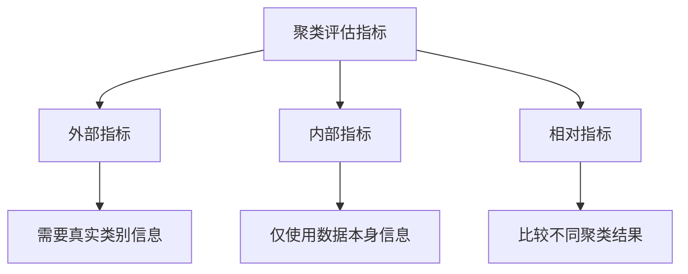

# 评估K-Means聚类结果的指标与方法

## 1. 背景介绍
### 1.1 聚类分析概述
#### 1.1.1 聚类分析的定义与目标
聚类分析是一种无监督学习方法,旨在将数据集划分为若干个内部相似而外部差异较大的子集(即簇)。其目标是最大化簇内的相似性,同时最小化簇间的相似性。

#### 1.1.2 聚类分析的应用领域
聚类分析在许多领域有着广泛的应用,例如:
- 客户细分:根据客户的属性(如年龄、收入等)将其划分为不同的群体,以便制定针对性的营销策略。 
- 图像分割:将图像划分为不同的区域,如前景和背景。
- 异常检测:通过识别与其他数据点显著不同的数据点来检测异常情况。

### 1.2 K-Means聚类算法
#### 1.2.1 K-Means算法原理
K-Means是一种经典的基于划分的聚类算法。其基本思想是:
1. 随机选择K个数据点作为初始的簇中心(centroids)。 
2. 计算每个数据点到各个簇中心的距离,并将其分配到距离最近的簇。
3. 更新每个簇的中心为该簇所有点的均值。
4. 重复步骤2-3,直到簇中心不再发生变化或达到最大迭代次数。

#### 1.2.2 K-Means算法的优缺点
K-Means算法的优点包括:
- 简单易懂,计算效率较高。
- 对于凸型数据集,能够得到较好的聚类结果。

缺点包括:  
- 需要预先指定簇的数量K。
- 对初始簇中心敏感,不同的初始化可能导致不同的结果。
- 对噪声和异常值敏感。
- 只适用于可用均值表示的数据。

### 1.3 评估聚类结果的重要性
#### 1.3.1 评估的必要性
由于聚类是一种无监督学习,没有预先标记的真实类别信息,因此评估聚类结果的质量至关重要。合理的评估有助于:
- 选择最优的聚类算法和参数。
- 验证聚类结果是否符合预期,是否具有实际意义。
- 为后续的分析和决策提供参考。

#### 1.3.2 评估的挑战  
评估聚类结果面临一些挑战:
- 缺乏统一的评估标准,不同的指标可能得出不同的结论。
- 对于高维数据,评估变得更加困难。
- 评估结果依赖于数据的特点和应用场景。

## 2. 核心概念与联系
### 2.1 外部指标
#### 2.1.1 外部指标的定义
外部指标通过将聚类结果与已知的真实类别标签进行比较来评估聚类性能。常见的外部指标包括:
- Rand Index(RI)
- Adjusted Rand Index(ARI)  
- Normalized Mutual Information(NMI)
- Purity
- F-measure

#### 2.1.2 外部指标的优缺点
外部指标的优点是:
- 直观易懂,结果解释性强。
- 能够量化聚类结果与真实类别的一致性。

缺点包括:
- 需要预先知道真实类别信息,在无监督场景下无法使用。
- 受类别不平衡问题的影响。

### 2.2 内部指标 
#### 2.2.1 内部指标的定义
内部指标仅利用数据本身的信息,通过计算簇内的紧凑度和簇间的分离度来评估聚类质量。常见的内部指标包括:
- Silhouette Coefficient
- Calinski-Harabasz Index
- Davies-Bouldin Index
- Dunn Index

#### 2.2.2 内部指标的优缺点
内部指标的优点是:
- 不需要真实类别信息,适用于无监督场景。
- 能够反映聚类结果的内在质量。

缺点包括:
- 计算复杂度较高,尤其对高维数据。
- 对数据分布的假设可能与实际不符。

### 2.3 相对指标
#### 2.3.1 相对指标的定义
相对指标通过比较不同聚类结果之间的差异来选择最优的聚类算法或参数。常见的相对指标包括: 
- Fowlkes-Mallows Index
- Jaccard Index
- Adjusted Mutual Information

#### 2.3.2 相对指标的优缺点
相对指标的优点是:
- 可以在无监督场景下比较不同的聚类结果。
- 有助于选择最优的聚类算法和参数。

缺点是:
- 无法提供聚类结果的绝对评价。
- 比较的聚类结果需要使用相同的数据集。

### 2.4 聚类评估指标之间的联系


## 3. 核心算法原理具体操作步骤
以Silhouette Coefficient为例,详细介绍其计算步骤:

### 3.1 计算样本i到同一簇其他样本的平均距离a(i)
$$a(i) = \frac{1}{|C_i|-1} \sum_{j \in C_i, i \neq j} d(i,j)$$
其中,$C_i$表示样本i所在的簇,$|C_i|$表示该簇的样本数量,$d(i,j)$表示样本i和j之间的距离。

### 3.2 计算样本i到其他簇的所有样本的平均距离,取最小值为b(i)
$$b(i) = \min_{k \neq i} \frac{1}{|C_k|} \sum_{j \in C_k} d(i,j)$$
其中,$C_k$表示除样本i所在簇之外的其他簇。

### 3.3 计算样本i的Silhouette系数s(i)
$$s(i) = \frac{b(i)-a(i)}{\max\{a(i),b(i)\}}$$

### 3.4 计算所有样本的Silhouette系数的均值,作为聚类结果的Silhouette Coefficient
$$Silhouette = \frac{1}{n} \sum_{i=1}^n s(i)$$
其中,n为数据集的样本数量。

Silhouette Coefficient的取值范围为[-1,1],值越大表示聚类效果越好。一般认为:
- 0.7 < Silhouette <= 1: 聚类结构明显
- 0.5 < Silhouette <= 0.7: 聚类结构一般
- 0.25 < Silhouette <= 0.5: 聚类结构较弱
- Silhouette <= 0.25: 几乎没有聚类结构

## 4. 数学模型和公式详细讲解举例说明
以Adjusted Rand Index(ARI)为例,详细说明其数学模型。

### 4.1 Rand Index(RI)
给定样本数量为n的数据集,U和V表示两种不同的聚类结果。定义:
- a: 在U和V中都属于同一簇的样本对数量
- b: 在U和V中都属于不同簇的样本对数量
- c: 在U中属于同一簇而在V中属于不同簇的样本对数量
- d: 在U中属于不同簇而在V中属于同一簇的样本对数量

则Rand Index定义为:
$$RI = \frac{a+b}{a+b+c+d} = \frac{a+b}{\binom{n}{2}}$$

### 4.2 Adjusted Rand Index(ARI)
RI的取值范围为[0,1],但即使两种聚类结果是随机的,其期望值也不为0。为了解决这个问题,提出了Adjusted Rand Index:
$$ARI = \frac{RI-E[RI]}{\max(RI)-E[RI]}$$
其中,$E[RI]$表示RI的期望值,可以证明:
$$E[RI] = \frac{(a+c)(a+d)+(b+c)(b+d)}{\binom{n}{2}^2}$$

ARI的取值范围为[-1,1],值越大表示聚类结果与真实类别越一致。当ARI为1时,表示两种聚类结果完全一致。

### 4.3 举例说明
假设有6个样本,真实类别标签为[1,1,2,2,3,3],聚类结果为[1,1,1,2,2,2]。则:
- a = 1 (样本1和2)
- b = 4 (样本1和4,1和5,1和6,2和3)
- c = 2 (样本3和4,3和5)
- d = 8 (样本2和4,2和5,2和6,3和4,3和5,3和6,4和5,5和6)

$$RI = \frac{1+4}{1+4+2+8} = \frac{1}{3}$$
$$E[RI] = \frac{(1+2)(1+8)+(4+2)(4+8)}{\binom{6}{2}^2} = \frac{17}{30}$$
$$ARI = \frac{\frac{1}{3}-\frac{17}{30}}{1-\frac{17}{30}} = -0.0909$$
可以看出,由于聚类结果与真实类别差异较大,因此ARI的值较低。

## 5. 项目实践：代码实例和详细解释说明
以下使用Python的scikit-learn库,计算K-Means聚类结果的Silhouette Coefficient。

```python
from sklearn.datasets import make_blobs
from sklearn.cluster import KMeans
from sklearn.metrics import silhouette_score

# 生成样本数据
X, _ = make_blobs(n_samples=500, centers=4, random_state=42)

# 进行K-Means聚类
kmeans = KMeans(n_clusters=4, random_state=42)
labels = kmeans.fit_predict(X)

# 计算Silhouette Coefficient
silhouette = silhouette_score(X, labels)

print(f"Silhouette Coefficient: {silhouette:.3f}")
```

输出结果:
```
Silhouette Coefficient: 0.662
```

代码解释:
1. 使用`make_blobs`函数生成500个样本,分为4个簇。
2. 创建`KMeans`对象,设置簇的数量为4,并使用`fit_predict`方法对数据进行聚类,得到每个样本的簇标签。
3. 使用`silhouette_score`函数计算Silhouette Coefficient,传入原始数据X和聚类标签labels。
4. 输出Silhouette Coefficient的值,保留3位小数。

根据输出结果,Silhouette Coefficient为0.662,表明聚类结构比较明显。

## 6. 实际应用场景
聚类评估指标在实际应用中发挥着重要作用,例如:

### 6.1 客户细分
在客户细分中,使用聚类算法将客户划分为不同的群体。通过计算Silhouette Coefficient等内部指标,可以评估聚类结果的质量,选择最优的细分方案。这有助于企业制定针对性的营销策略,提高客户满意度和忠诚度。

### 6.2 图像分割
图像分割旨在将图像划分为不同的区域,如前景和背景。使用聚类算法可以自动完成图像分割。通过计算Adjusted Rand Index等外部指标,可以将分割结果与人工标注的真实分割结果进行比较,评估分割算法的性能。这在医学图像分析、目标检测等领域有着广泛应用。

### 6.3 基因表达数据分析
在基因表达数据分析中,使用聚类算法可以将基因划分为不同的功能模块。通过计算Normalized Mutual Information等外部指标,可以将聚类结果与已知的基因功能注释进行比较,评估聚类的生物学意义。这有助于发现新的基因功能和调控关系,推动生物医学研究的发展。

## 7. 工具和资源推荐
以下是一些常用的聚类评估工具和资源:

- scikit-learn: Python机器学习库,提供了多种聚类算法和评估指标的实现。
- MATLAB: 提供了丰富的聚类分析和评估函数,如clusterCriterion、evalclusters等。
- R: 有多个专门用于聚类分析和评估的软件包,如clusterCrit、fpc等。
- 聚类评估指标的论文和综述: 如"An overview of clustering algorithms and validation techniques"、"A survey of clustering validation techniques"等,提供了全面的指标介绍和比较。

## 8. 总结：未来发展趋势与挑战
聚类评估指标的研究和应用还有许多发