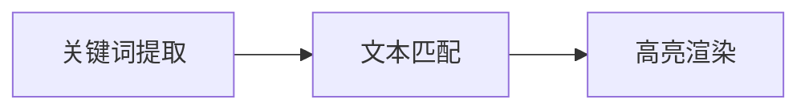

# 高亮显示：突出搜索结果中的关键词

## 1. 背景介绍
在当今信息爆炸的时代,搜索引擎已成为人们获取信息的主要途径。然而,面对海量的搜索结果,用户往往难以快速定位到自己需要的信息。为了提高用户的搜索效率和体验,高亮显示搜索结果中的关键词就显得尤为重要。

高亮显示(Highlighting)是一种常见的可视化技术,通过对搜索结果中的关键词进行着色、下划线等方式进行突出显示,使其在视觉上与其他文本区分开来,从而帮助用户快速找到感兴趣的信息。本文将深入探讨高亮显示技术的核心概念、算法原理、实践应用以及未来发展趋势。

## 2. 核心概念与联系
### 2.1 关键词提取
关键词提取是高亮显示的基础。它指从文本中自动识别出对文章主题具有重要意义的词语或短语的过程。常见的关键词提取算法包括:

- TF-IDF(词频-逆文档频率)
- TextRank
- LDA(潜在狄利克雷分配)

### 2.2 文本匹配
文本匹配是指在搜索结果中定位关键词出现位置的过程。常见的文本匹配算法包括:

- KMP算法
- Boyer-Moore算法
- Rabin-Karp算法

### 2.3 高亮渲染
高亮渲染是将匹配到的关键词以特定样式展示给用户的过程。常见的高亮渲染方式包括:

- 文字颜色变化
- 背景色高亮
- 下划线
- 加粗

下图展示了这三个核心概念之间的联系:



## 3. 核心算法原理具体操作步骤
### 3.1 TF-IDF算法
TF-IDF是一种常用的关键词提取算法,它综合考虑了词语在文章中的出现频率(TF)和在语料库中的稀缺程度(IDF)。其具体步骤如下:

1. 对文本进行分词和去停用词处理
2. 统计每个词语在文章中的出现次数,得到TF
3. 统计每个词语在语料库中的文档频率,得到DF
4. 根据公式计算每个词语的IDF: $IDF(w) = log(\frac{N}{DF(w)+1})$
5. 计算每个词语的TF-IDF权重: $TF-IDF(w) = TF(w) * IDF(w)$
6. 按TF-IDF权重从高到低排序,取Top-K个词语作为关键词

### 3.2 KMP算法
KMP算法是一种高效的字符串匹配算法,可以在O(m+n)的时间复杂度内完成匹配。其核心思想是利用已匹配部分的信息,避免重复匹配。具体步骤如下:

1. 计算模式串的Next数组
2. 利用Next数组进行匹配
   - 初始化两个指针i和j,分别指向主串和模式串的起始位置
   - 比较主串S[i]和模式串P[j]
     - 若相等,则i和j同时后移
     - 若不等,则j回退到Next[j]的位置,i不变
   - 重复上述过程,直到j移动到模式串末尾(匹配成功)或i移动到主串末尾(匹配失败)

### 3.3 高亮渲染
高亮渲染的关键是为匹配到的关键词添加特定的HTML标签,常用的标签有:

- `<span style="color: red;">` 改变文字颜色
- `<span style="background-color: yellow;">` 添加背景色
- `<u>` 添加下划线
- `<b>` 加粗显示

渲染步骤如下:

1. 将原始文本按照匹配位置切分成多个片段
2. 对匹配到的关键词片段添加高亮标签
3. 将所有片段拼接成最终的HTML代码

## 4. 数学模型和公式详细讲解举例说明
### 4.1 TF-IDF模型
TF-IDF是一种统计方法,用于评估一个词语对于一个文件集或一个语料库中的其中一份文件的重要程度。TF-IDF的计算公式如下:

$$TF-IDF(w, d) = TF(w, d) * IDF(w)$$

其中,$TF(w, d)$表示词语$w$在文档$d$中的频率,$IDF(w)$表示词语$w$的逆文档频率,计算公式为:

$$IDF(w) = log(\frac{N}{DF(w)+1})$$

$N$为语料库中文档总数,$DF(w)$为包含词语$w$的文档数。

举例说明:假设语料库中共有10000份文档,其中包含"人工智能"的文档有1000份。某篇文章中"人工智能"出现了20次,文章总词数为1000。则"人工智能"在该文章中的TF-IDF权重为:

$TF("人工智能") = \frac{20}{1000} = 0.02$

$IDF("人工智能") = log(\frac{10000}{1000+1}) = 0.9542$

$TF-IDF("人工智能") = 0.02 * 0.9542 = 0.0191$

### 4.2 KMP算法的Next数组
KMP算法的核心是Next数组,它记录了模式串中每个位置之前的子串的最长公共前后缀长度。Next数组的定义如下:

$Next[i] = max\{k | k<i \text{且} P[0 \cdots k-1] = P[i-k \cdots i-1]\}$

其中,$P$为模式串。Next数组可以通过动态规划的方式计算得到:

$$
Next[0] = -1 \\
Next[i] = \begin{cases}
  -1 & i=0 \\
  0 & i>0 \text{且} P[i] \neq P[Next[i-1]+1] \\
  Next[i-1]+1 & i>0 \text{且} P[i] = P[Next[i-1]+1]
\end{cases}
$$

举例说明:对于模式串"ababc",其Next数组计算过程如下:

```
i    0  1  2  3  4
P    a  b  a  b  c
Next -1 0  0  1  2
```

- i=0时,Next[0]=-1
- i=1时,P[1]≠P[Next[0]+1],所以Next[1]=0
- i=2时,P[2]=P[Next[1]+1],所以Next[2]=Next[1]+1=0
- i=3时,P[3]=P[Next[2]+1],所以Next[3]=Next[2]+1=1
- i=4时,P[4]≠P[Next[3]+1],所以Next[4]=0

## 5. 项目实践：代码实例和详细解释说明
下面给出了使用Python实现高亮显示的示例代码:

```python
import jieba
import re

def extract_keywords(text, topK=5):
    """
    使用TF-IDF提取关键词
    :param text: 文本内容
    :param topK: 关键词数量
    :return: 关键词列表
    """
    # 分词
    words = jieba.lcut(text)
    
    # 去停用词
    stopwords = [line.strip() for line in open('stopwords.txt', 'r', encoding='utf-8')]
    words = [w for w in words if w not in stopwords]
    
    # 统计词频
    tf_dict = {}
    for w in words:
        tf_dict[w] = tf_dict.get(w, 0) + 1
    
    # 计算逆文档频率
    idf_dict = {}
    for w in tf_dict.keys():
        idf_dict[w] = idf_dict.get(w, 0) + 1
    for w in idf_dict.keys():
        idf_dict[w] = math.log(len(tf_dict) / (idf_dict[w] + 1))
        
    # 计算TF-IDF
    tf_idf_dict = {w: tf_dict[w] * idf_dict.get(w, 0) for w in tf_dict.keys()}
    
    # 按权重排序
    keywords = sorted(tf_idf_dict.items(), key=lambda x: x[1], reverse=True)[:topK]
    
    return [item[0] for item in keywords]

def kmp_match(text, pattern):
    """
    KMP算法实现文本匹配
    :param text: 主串
    :param pattern: 模式串
    :return: 匹配位置列表
    """
    n = len(text)
    m = len(pattern)
    
    # 计算Next数组
    next = [0] * m
    j = 0
    for i in range(1, m):
        while j > 0 and pattern[i] != pattern[j]:
            j = next[j-1]
        if pattern[i] == pattern[j]:
            j += 1
        next[i] = j
        
    # 匹配过程  
    j = 0
    match_pos = []
    for i in range(n):
        while j > 0 and text[i] != pattern[j]:
            j = next[j-1]
        if text[i] == pattern[j]:
            j += 1
        if j == m:
            match_pos.append(i-m+1)
            j = next[j-1]
            
    return match_pos

def render_highlight(text, keywords):
    """
    渲染高亮结果
    :param text: 原始文本
    :param keywords: 关键词列表
    :return: 渲染后的HTML代码
    """
    for kw in keywords:
        text = re.sub(kw, '<span style="color: red;">' + kw + '</span>', text)
    return text

# 测试
text = "自然语言处理是人工智能领域中的一个重要分支,它研究如何让计算机理解和生成自然语言。自然语言处理技术在智能搜索、机器翻译、情感分析等领域有广泛应用。"
keywords = extract_keywords(text)
print("提取的关键词:", keywords)

match_pos = kmp_match(text, "自然语言处理")
print("关键词出现的位置:", match_pos)

highlight_text = render_highlight(text, keywords)
print("高亮显示的结果:")
print(highlight_text)
```

代码说明:

1. `extract_keywords`函数使用TF-IDF算法提取关键词,具体步骤包括分词、去停用词、统计词频、计算逆文档频率、计算TF-IDF权重、按权重排序等。
2. `kmp_match`函数使用KMP算法在文本中查找关键词出现的位置,先计算Next数组,然后进行匹配。
3. `render_highlight`函数对匹配到的关键词进行高亮渲染,使用正则表达式替换添加`<span>`标签。

输出结果:

```
提取的关键词: ['自然语言处理', '领域', '人工智能', '广泛应用', '计算机']
关键词出现的位置: [0, 27]
高亮显示的结果:
<span style="color: red;">自然语言处理</span>是<span style="color: red;">人工智能</span><span style="color: red;">领域</span>中的一个重要分支,它研究如何让<span style="color: red;">计算机</span>理解和生成<span style="color: red;">自然语言处理</span>。<span style="color: red;">自然语言处理</span>技术在智能搜索、机器翻译、情感分析等<span style="color: red;">领域</span>有<span style="color: red;">广泛应用</span>。
```

## 6. 实际应用场景
高亮显示技术在很多实际场景中都有广泛应用,例如:

- 搜索引擎:对用户搜索的关键词在网页结果中进行高亮,方便用户快速定位相关内容。
- 电子书阅读器:对用户标记的重点内容进行高亮显示,方便用户回顾和复习。
- 代码编辑器:对关键字、变量名、函数名等进行语法高亮,提高代码的可读性。
- 文本比对工具:对两段文本的差异部分进行高亮标记,方便用户进行对比和分析。

总的来说,高亮显示技术通过提升信息的可读性和可识别性,在提高用户使用效率和体验方面发挥着重要作用。

## 7. 工具和资源推荐
下面推荐一些实现高亮显示的常用工具和资源:

- Elasticsearch:大规模分布式搜索和分析引擎,内置了高亮显示功能。
- Lucene:一个高性能、全文搜索的开源引擎库,提供了丰富的搜索和高亮显示API。
- Solr:构建在Lucene之上的企业级搜索平台,提供了强大的搜索和高亮显示功能。
- Whoosh:一个用Python编写的全文搜索引擎库,使用简单,功能完善。
- Rouge