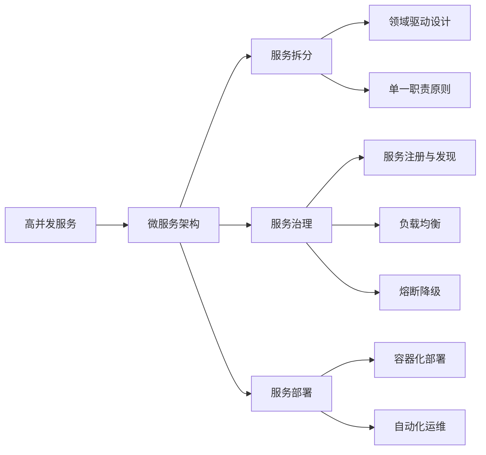

# 高并发服务、微服务架构设计和实现

## 1. 背景介绍
### 1.1 高并发服务的挑战
#### 1.1.1 海量用户访问
#### 1.1.2 高峰期流量洪峰
#### 1.1.3 系统性能瓶颈
### 1.2 微服务架构的兴起
#### 1.2.1 传统单体架构的局限性
#### 1.2.2 微服务架构的优势
#### 1.2.3 微服务架构的应用现状

## 2. 核心概念与联系
### 2.1 高并发服务
#### 2.1.1 并发与并行
#### 2.1.2 高并发的特点
#### 2.1.3 高并发服务的关键指标
### 2.2 微服务架构  
#### 2.2.1 微服务的定义
#### 2.2.2 微服务的特征
#### 2.2.3 微服务与SOA的区别
### 2.3 高并发服务与微服务架构的关系
#### 2.3.1 微服务架构适用于高并发场景
#### 2.3.2 微服务架构提高系统并发能力
#### 2.3.3 高并发驱动微服务架构演进



## 3. 核心算法原理具体操作步骤
### 3.1 服务拆分
#### 3.1.1 领域驱动设计
##### 3.1.1.1 划分领域边界
##### 3.1.1.2 识别领域模型
##### 3.1.1.3 定义限界上下文
#### 3.1.2 单一职责原则
##### 3.1.2.1 服务内聚性
##### 3.1.2.2 服务自治性
##### 3.1.2.3 服务粒度控制
### 3.2 服务治理
#### 3.2.1 服务注册与发现
##### 3.2.1.1 服务注册中心
##### 3.2.1.2 客户端服务发现
##### 3.2.1.3 服务健康检查
#### 3.2.2 负载均衡
##### 3.2.2.1 客户端负载均衡
##### 3.2.2.2 服务端负载均衡
##### 3.2.2.3 负载均衡算法
#### 3.2.3 熔断降级
##### 3.2.3.1 熔断机制
##### 3.2.3.2 降级策略
##### 3.2.3.3 限流算法
### 3.3 服务部署 
#### 3.3.1 容器化部署
##### 3.3.1.1 Docker容器技术
##### 3.3.1.2 容器编排工具
##### 3.3.1.3 容器化部署流程
#### 3.3.2 自动化运维
##### 3.3.2.1 持续集成
##### 3.3.2.2 持续交付
##### 3.3.2.3 基础设施即代码

## 4. 数学模型和公式详细讲解举例说明
### 4.1 排队论模型
#### 4.1.1 M/M/1排队模型
单个服务器排队系统，顾客到达服从泊松分布，服务时间服从指数分布。
$$P_n = \rho^n(1-\rho), n=0,1,2,...$$
其中，$\rho = \frac{\lambda}{\mu}$，$\lambda$为平均到达率，$\mu$为平均服务率。
#### 4.1.2 M/M/c排队模型
多服务器排队系统，顾客到达服从泊松分布，服务时间服从指数分布。
$$P_0 = \left[\sum_{k=0}^{c-1} \frac{1}{k!}\left(\frac{\lambda}{\mu}\right)^k + \frac{1}{c!}\frac{c\mu}{c\mu-\lambda}\left(\frac{\lambda}{\mu}\right)^c\right]^{-1}$$
其中，$c$为服务器数量。
### 4.2 Little定律
在稳定系统中，平均顾客数$L$、平均到达率$\lambda$和平均逗留时间$W$之间的关系。
$$L = \lambda W$$
### 4.3 Amdahl定律
并行计算中，加速比$S$与串行比例$\alpha$的关系。
$$S = \frac{1}{\alpha + \frac{1-\alpha}{N}}$$
其中，$N$为并行处理单元数。

## 5. 项目实践：代码实例和详细解释说明
### 5.1 Spring Cloud微服务架构
#### 5.1.1 服务注册与发现：Eureka
```java
@EnableEurekaServer
@SpringBootApplication
public class EurekaServerApplication {
    public static void main(String[] args) {
        SpringApplication.run(EurekaServerApplication.class, args);
    }
}
```
Eureka Server作为服务注册中心，提供服务注册和发现功能。
#### 5.1.2 服务调用：Feign
```java
@FeignClient("user-service")
public interface UserService {
    @GetMapping("/users/{id}")
    User getUserById(@PathVariable("id") Long id);
}
```
Feign是一个声明式的Web服务客户端，简化了服务调用的代码编写。
#### 5.1.3 服务熔断：Hystrix
```java
@HystrixCommand(fallbackMethod = "getUserByIdFallback")
public User getUserById(Long id) {
    return userService.getUserById(id);
}

public User getUserByIdFallback(Long id) {
    return new User();
}
```
Hystrix提供了服务熔断和降级的功能，提高系统的容错能力。
### 5.2 Kubernetes容器编排
#### 5.2.1 部署微服务应用
```yaml
apiVersion: apps/v1
kind: Deployment
metadata:
  name: user-service
spec:
  replicas: 3
  selector:
    matchLabels:
      app: user-service
  template:
    metadata:
      labels:
        app: user-service
    spec:
      containers:
      - name: user-service
        image: user-service:v1
        ports:
        - containerPort: 8080
```
通过Deployment资源对象定义微服务应用的部署，指定副本数、容器镜像等配置。
#### 5.2.2 服务发现与负载均衡
```yaml
apiVersion: v1
kind: Service
metadata:
  name: user-service
spec:
  selector:
    app: user-service
  ports:
  - port: 80
    targetPort: 8080
```
通过Service资源对象实现服务发现与负载均衡，将请求分发到后端的Pod实例。

## 6. 实际应用场景
### 6.1 电商平台
#### 6.1.1 订单系统
#### 6.1.2 商品系统
#### 6.1.3 支付系统
### 6.2 社交网络
#### 6.2.1 用户系统
#### 6.2.2 消息系统
#### 6.2.3 推荐系统
### 6.3 金融交易
#### 6.3.1 交易系统
#### 6.3.2 风控系统
#### 6.3.3 清算系统

## 7. 工具和资源推荐
### 7.1 开发框架
- Spring Boot
- Spring Cloud
- Dubbo
### 7.2 服务治理
- Eureka
- Consul
- Nacos
### 7.3 容器化
- Docker
- Kubernetes
- Istio
### 7.4 自动化运维
- Jenkins
- GitLab CI/CD
- Ansible

## 8. 总结：未来发展趋势与挑战
### 8.1 Serverless架构
### 8.2 Service Mesh服务网格
### 8.3 云原生应用
### 8.4 人工智能与微服务
### 8.5 安全与隐私挑战

## 9. 附录：常见问题与解答
### 9.1 微服务架构适合哪些场景？
### 9.2 微服务拆分的原则是什么？
### 9.3 如何保证微服务的数据一致性？
### 9.4 微服务架构下如何进行测试？
### 9.5 微服务治理的核心要素有哪些？

作者：禅与计算机程序设计艺术 / Zen and the Art of Computer Programming