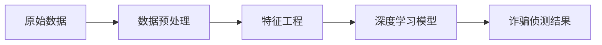

# AI人工智能深度学习算法：在诈骗侦测中的应用

## 1. 背景介绍
### 1.1 诈骗行为的危害
#### 1.1.1 个人财产损失
#### 1.1.2 企业声誉受损
#### 1.1.3 社会秩序混乱
### 1.2 传统诈骗侦测方法的局限性
#### 1.2.1 规则引擎方法
#### 1.2.2 专家系统方法  
#### 1.2.3 传统机器学习方法
### 1.3 深度学习在诈骗侦测中的优势
#### 1.3.1 强大的特征提取能力
#### 1.3.2 非线性建模能力
#### 1.3.3 端到端学习能力

## 2. 核心概念与联系
### 2.1 深度学习
#### 2.1.1 人工神经网络
#### 2.1.2 表示学习
#### 2.1.3 端到端学习
### 2.2 诈骗侦测
#### 2.2.1 异常检测 
#### 2.2.2 行为序列分析
#### 2.2.3 图模式挖掘
### 2.3 深度学习在诈骗侦测中的应用
#### 2.3.1 基于深度神经网络的异常检测
#### 2.3.2 基于循环神经网络的行为序列分析
#### 2.3.3 基于图神经网络的关系挖掘



## 3. 核心算法原理具体操作步骤
### 3.1 基于自编码器的异常检测
#### 3.1.1 自编码器原理
#### 3.1.2 训练过程
#### 3.1.3 异常分数计算
### 3.2 基于LSTM的行为序列分析  
#### 3.2.1 LSTM原理
#### 3.2.2 序列建模方法
#### 3.2.3 分类器设计
### 3.3 基于GCN的关系图挖掘
#### 3.3.1 图卷积网络原理 
#### 3.3.2 节点嵌入表示学习
#### 3.3.3 图分类器设计

## 4. 数学模型和公式详细讲解举例说明
### 4.1 自编码器的数学模型
#### 4.1.1 编码器
$$ \mathbf{h} = f(\mathbf{W}_e \mathbf{x} + \mathbf{b}_e) $$
#### 4.1.2 解码器  
$$ \mathbf{\hat{x}} = g(\mathbf{W}_d \mathbf{h} + \mathbf{b}_d) $$
#### 4.1.3 重构误差
$$ L(\mathbf{x}, \mathbf{\hat{x}}) = \|\mathbf{x} - \mathbf{\hat{x}}\|^2 $$
### 4.2 LSTM的前向传播公式
#### 4.2.1 输入门
$$ \mathbf{i}_t = \sigma(\mathbf{W}_{ii} \mathbf{x}_t + \mathbf{b}_{ii} + \mathbf{W}_{hi} \mathbf{h}_{t-1} + \mathbf{b}_{hi}) $$
#### 4.2.2 遗忘门
$$ \mathbf{f}_t = \sigma(\mathbf{W}_{if} \mathbf{x}_t + \mathbf{b}_{if} + \mathbf{W}_{hf} \mathbf{h}_{t-1} + \mathbf{b}_{hf}) $$  
#### 4.2.3 输出门
$$ \mathbf{o}_t = \sigma(\mathbf{W}_{io} \mathbf{x}_t + \mathbf{b}_{io} + \mathbf{W}_{ho} \mathbf{h}_{t-1} + \mathbf{b}_{ho}) $$
#### 4.2.4 细胞状态更新
$$ \mathbf{c}_t = \mathbf{f}_t \odot \mathbf{c}_{t-1} + \mathbf{i}_t \odot \tanh(\mathbf{W}_{ic} \mathbf{x}_t + \mathbf{b}_{ic} + \mathbf{W}_{hc} \mathbf{h}_{t-1} + \mathbf{b}_{hc}) $$
#### 4.2.5 隐藏状态输出
$$ \mathbf{h}_t = \mathbf{o}_t \odot \tanh(\mathbf{c}_t) $$
### 4.3 图卷积网络的数学定义
#### 4.3.1 图卷积定义
$$ \mathbf{H}^{(l+1)} = \sigma(\tilde{\mathbf{D}}^{-\frac{1}{2}} \tilde{\mathbf{A}} \tilde{\mathbf{D}}^{-\frac{1}{2}} \mathbf{H}^{(l)} \mathbf{W}^{(l)}) $$
#### 4.3.2 归一化邻接矩阵
$$ \tilde{\mathbf{A}} = \mathbf{A} + \mathbf{I}_N $$
$$ \tilde{D}_{ii} = \sum_{j} \tilde{A}_{ij} $$

## 5. 项目实践：代码实例和详细解释说明
### 5.1 基于PyTorch实现自编码器
```python
class AutoEncoder(nn.Module):
    def __init__(self, input_dim, hidden_dim):
        super(AutoEncoder, self).__init__()
        self.encoder = nn.Sequential(
            nn.Linear(input_dim, hidden_dim),
            nn.ReLU(),
            nn.Linear(hidden_dim, hidden_dim),
            nn.ReLU()
        )
        self.decoder = nn.Sequential(
            nn.Linear(hidden_dim, hidden_dim), 
            nn.ReLU(),
            nn.Linear(hidden_dim, input_dim),
            nn.Sigmoid()
        )
        
    def forward(self, x):
        h = self.encoder(x)
        x_hat = self.decoder(h)
        return x_hat
```
代码详解：
- 自编码器由编码器和解码器两部分组成，分别用于提取数据的高层特征表示和从特征还原原始输入。
- 编码器和解码器都是由两个全连接层和ReLU激活函数组成的多层感知机。
- forward方法定义了数据的前向传播过程，先通过编码器将输入映射到隐空间，再通过解码器重构出原始输入。

### 5.2 基于Keras实现LSTM序列分类
```python
model = Sequential()
model.add(LSTM(128, input_shape=(timesteps, input_dim)))
model.add(Dropout(0.5))
model.add(Dense(num_classes, activation='softmax'))

model.compile(loss='categorical_crossentropy',
              optimizer='adam',
              metrics=['accuracy'])

model.fit(x_train, y_train, 
          batch_size=batch_size, 
          epochs=epochs, 
          validation_data=(x_test, y_test))
```
代码详解：
- 使用Keras的Sequential模型搭建LSTM网络，设置LSTM隐藏单元数为128。
- 在LSTM层后接一个Dropout层，防止过拟合，然后接一个全连接层用于多分类。
- 模型使用分类交叉熵损失函数，Adam优化器，评估指标为准确率。
- 使用fit方法在训练集上进行训练，并在测试集上进行验证。

### 5.3 基于PyTorch Geometric实现GCN节点分类
```python
class GCN(torch.nn.Module):
    def __init__(self, input_dim, hidden_dim, output_dim):
        super(GCN, self).__init__()
        self.conv1 = GCNConv(input_dim, hidden_dim)
        self.conv2 = GCNConv(hidden_dim, output_dim)

    def forward(self, data):
        x, edge_index = data.x, data.edge_index
        x = self.conv1(x, edge_index)
        x = F.relu(x)
        x = F.dropout(x, training=self.training)
        x = self.conv2(x, edge_index)
        return F.log_softmax(x, dim=1)
        
device = torch.device('cuda' if torch.cuda.is_available() else 'cpu')
model = GCN(input_dim=dataset.num_node_features, 
            hidden_dim=16,
            output_dim=dataset.num_classes).to(device)
data = dataset[0].to(device)
optimizer = torch.optim.Adam(model.parameters(), lr=0.01)

model.train()
for epoch in range(200):
    optimizer.zero_grad()
    out = model(data)
    loss = F.nll_loss(out[data.train_mask], data.y[data.train_mask])
    loss.backward()
    optimizer.step()
```
代码详解：
- 定义了一个包含两层图卷积的GCN模型，每一层图卷积后接ReLU激活和Dropout。
- 模型的输入是节点特征和边的索引，输出是节点的分类概率。
- 使用Adam优化器，训练200个epoch，每个epoch中对训练集节点计算负对数似然损失并更新模型参数。

## 6. 实际应用场景
### 6.1 金融诈骗检测
#### 6.1.1 信用卡欺诈检测
#### 6.1.2 保险理赔欺诈检测
#### 6.1.3 洗钱活动检测
### 6.2 社交网络诈骗检测
#### 6.2.1 虚假账号检测
#### 6.2.2 恶意链接检测
#### 6.2.3 钓鱼诈骗检测 
### 6.3 电信诈骗检测
#### 6.3.1 呼叫中心诈骗检测
#### 6.3.2 短信诈骗检测
#### 6.3.3 钓鱼网站检测

## 7. 工具和资源推荐
### 7.1 深度学习框架
#### 7.1.1 PyTorch
#### 7.1.2 TensorFlow
#### 7.1.3 Keras
### 7.2 图神经网络工具包
#### 7.2.1 PyTorch Geometric
#### 7.2.2 Deep Graph Library
#### 7.2.3 Spektral
### 7.3 诈骗检测数据集
#### 7.3.1 IEEE-CIS Fraud Detection
#### 7.3.2 Credit Card Fraud Detection
#### 7.3.3 Social Network Fraud Detection

## 8. 总结：未来发展趋势与挑战
### 8.1 技术趋势
#### 8.1.1 多模态融合
#### 8.1.2 图神经网络
#### 8.1.3 对抗生成网络
### 8.2 应用趋势
#### 8.2.1 实时在线检测
#### 8.2.2 场景个性化
#### 8.2.3 与业务流程深度融合
### 8.3 挑战
#### 8.3.1 缺乏标注数据 
#### 8.3.2 模型鲁棒性不足
#### 8.3.3 推理效率有待提高

## 9. 附录：常见问题与解答
### 9.1 如何处理类别不平衡问题？
答：可以使用过采样、欠采样、加权损失函数等方法来缓解类别不平衡。此外，还可以使用集成学习的思想，针对少数类训练专门的分类器。

### 9.2 如何缓解深度学习模型的过拟合？
答：可以从以下几个方面入手：增加训练数据量、使用正则化技术如L1/L2正则化、Dropout等、进行数据增强、优化网络结构、使用早停法等。

### 9.3 如何权衡模型的性能和效率？
答：可以使用模型压缩技术如量化、剪枝等来平衡模型性能和效率。还可以使用知识蒸馏的方法，用较小的学生模型来学习较大教师模型的知识。在工程实践中，需要根据实际的算力和时延要求，选择合适的模型。

### 9.4 如何解释深度学习模型的预测结果？
答：可以使用可解释性方法如LIME、SHAP等来解释模型的预测。对于一些特定的网络结构，还可以直接可视化网络学到的特征模式。此外，知识图谱、规则引擎等技术也可以辅助解释模型行为。

作者：禅与计算机程序设计艺术 / Zen and the Art of Computer Programming