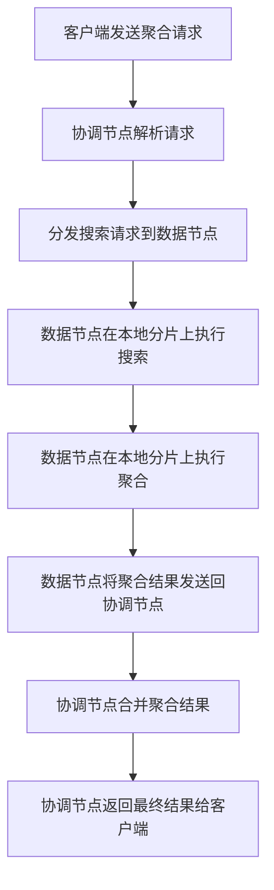

# ElasticSearch Aggregation原理与代码实例讲解

## 1.背景介绍

在当今大数据时代，海量数据的存储和分析成为了一个巨大的挑战。Elasticsearch作为一种分布式、RESTful的搜索和分析引擎,凭借其高效的全文搜索、近实时搜索和水平可扩展等优势,在日志数据分析、全文搜索、安全分析等领域广受欢迎。其中,Elasticsearch的聚合(Aggregation)功能为数据分析提供了强大的支持。

聚合可以让我们对数据进行统计、分组、过滤等操作,从而发现数据中的趋势和模式。无论是电子商务网站分析用户行为、物联网设备监控性能指标,还是安全运维分析日志,聚合都可以发挥重要作用。本文将深入探讨Elasticsearch聚合的原理和实践,帮助读者掌握这一强大功能。

## 2.核心概念与联系

在了解Elasticsearch聚合之前,我们需要理解以下几个核心概念:

### 2.1 Bucket(桶)

Bucket表示一个可以用来对文档进行分组的标准。例如,我们可以根据国家对用户进行分组,每个国家都是一个Bucket。Bucket可以嵌套,形成树状层级结构。

### 2.2 Metric(指标)

Metric用于对Bucket中的文档进行统计计算,例如计算每个Bucket中文档的数量、平均值等。Metric可以基于文档字段的值进行计算,也可以对其他Metric的输出结果进行计算。

### 2.3 Pipeline Aggregation

Pipeline Aggregation可以让我们对其他Aggregation的输出结果进行二次加工,例如对Bucket进行排序、去重等操作。

### 2.4 Elasticsearch Query DSL

Elasticsearch提供了一种基于JSON的查询语言Query DSL(Domain Specific Language),用于构建查询请求。聚合也是使用Query DSL来定义的。

上述概念相互关联,共同构建了Elasticsearch聚合的功能框架。接下来,我们将通过具体的例子来揭示聚合的工作原理。

## 3.核心算法原理具体操作步骤 

Elasticsearch聚合的工作原理可以概括为以下几个步骤:



1. **客户端发送聚合请求**

   客户端使用Elasticsearch的Query DSL构建聚合请求,并将其发送给任意一个节点(通常是协调节点)。

2. **协调节点解析请求**

   接收到聚合请求后,协调节点会解析请求,确定需要计算的聚合类型以及涉及到的索引和字段。

3. **分发搜索请求到数据节点**

   协调节点将搜索请求分发到保存相关数据的数据节点。每个数据节点只需要处理自己所负责的那部分数据(分片)。

4. **数据节点在本地分片上执行搜索**

   数据节点在本地分片上执行搜索操作,过滤出符合条件的文档。

5. **数据节点在本地分片上执行聚合**

   对于过滤出的文档,数据节点在本地分片上执行聚合操作,计算出相应的Bucket和Metric。

6. **数据节点将聚合结果发送回协调节点**

   每个数据节点将自己的聚合结果发送回协调节点。

7. **协调节点合并聚合结果**

   协调节点将来自所有数据节点的聚合结果进行合并,得到最终的聚合结果。

8. **协调节点返回最终结果给客户端**

   协调节点将合并后的聚合结果返回给客户端。

上述步骤体现了Elasticsearch分布式架构下聚合的执行过程。由于计算是在各个数据节点的本地分片上并行执行的,因此能够充分利用集群的计算资源,提高聚合的执行效率。

## 4.数学模型和公式详细讲解举例说明

在聚合过程中,Elasticsearch会使用不同的数学模型和公式来计算各种指标。下面我们将详细介绍一些常用的指标及其计算公式:

### 4.1 Value Count

Value Count用于计算一个字段中有多少个不同的值。假设我们有一个名为"product"的字段,其中包含了多个产品名称,我们可以使用Value Count来统计有多少种不同的产品:

$$
\text{Value Count}(product) = |\{v | v \in \text{product values}\}|
$$

其中,|·|表示集合的基数(元素个数)。

### 4.2 Cardinality

Cardinality也用于计算一个字段中有多少个不同的值,但它使用了HyperLogLog++算法来进行近似计算,从而提高了计算效率。对于基数很大的字段,使用Cardinality会比Value Count更加高效。

$$
\begin{aligned}
\text{Cardinality}(field) &\approx \\
&\frac{\left\|\bigcup_{i=1}^{m} S_i\right\|_2^2}{\sum_{i=1}^{m}\left\|S_i\right\|_2^2} \cdot \frac{m^2}{0.7213 / (1 + 1.079 / m)}
\end{aligned}
$$

其中,m是HyperLogLog++算法中使用的内存大小,S<sub>i</sub>是第i个子集。

### 4.3 Extended Stats

Extended Stats可以同时计算一个字段的多个统计指标,包括Count(文档数量)、Sum(总和)、Min(最小值)、Max(最大值)、Avg(平均值)、Sum of Squares(平方和)和Variance(方差)。

- Count: $\text{Count}(values) = |\{v | v \in \text{values}\}|$
- Sum: $\text{Sum}(values) = \sum_{v \in \text{values}} v$
- Min: $\text{Min}(values) = \min\limits_{v \in \text{values}} v$
- Max: $\text{Max}(values) = \max\limits_{v \in \text{values}} v$
- Avg: $\text{Avg}(values) = \frac{1}{n} \sum_{v \in \text{values}} v$
- Sum of Squares: $\text{Sum of Squares}(values) = \sum_{v \in \text{values}} v^2$
- Variance: $\text{Variance}(values) = \frac{\sum_{v \in \text{values}} (v - \mu)^2}{n}$

其中,n是values集合中元素的个数,$\mu$是平均值。

上述公式展示了Elasticsearch在执行聚合时所使用的一些数学模型。根据不同的需求,我们可以选择合适的指标来分析数据。

## 5.项目实践:代码实例和详细解释说明

为了更好地理解Elasticsearch聚合的使用方法,我们将通过一个电子商务网站的实例来演示如何使用聚合功能。假设我们有一个名为"orders"的索引,其中包含了网站上所有订单的信息,每个文档代表一个订单,主要字段如下:

- order_id: 订单ID
- customer_id: 客户ID
- product_name: 产品名称
- category: 产品类别
- price: 产品价格
- purchase_date: 购买日期

### 5.1 统计每个类别的订单数量

我们可以使用Terms Aggregation来按照产品类别对订单进行分组,并统计每个类别的订单数量:

```json
GET /orders/_search
{
  "size": 0,
  "aggs": {
    "categories": {
      "terms": {
        "field": "category"
      }
    }
  }
}
```

上述查询将返回如下结果:

```json
{
  ...
  "aggregations": {
    "categories": {
      "buckets": [
        {
          "key": "Electronics",
          "doc_count": 1234
        },
        {
          "key": "Clothing",
          "doc_count": 789
        },
        ...
      ]
    }
  }
}
```

在这个例子中,Terms Aggregation根据"category"字段对文档进行分组,每个不同的类别值都形成一个Bucket。"doc_count"表示该Bucket中包含的文档数量。

### 5.2 计算每个类别的总销售额

为了计算每个类别的总销售额,我们可以在Terms Aggregation中嵌套一个Sum Aggregation:

```json
GET /orders/_search
{
  "size": 0,
  "aggs": {
    "categories": {
      "terms": {
        "field": "category"
      },
      "aggs": {
        "total_revenue": {
          "sum": {
            "field": "price"
          }
        }
      }
    }
  }
}
```

这个查询的结果如下:

```json
{
  ...
  "aggregations": {
    "categories": {
      "buckets": [
        {
          "key": "Electronics",
          "doc_count": 1234,
          "total_revenue": {
            "value": 123456.78
          }
        },
        {
          "key": "Clothing",
          "doc_count": 789,
          "total_revenue": {
            "value": 45678.90
          }
        },
        ...
      ]
    }
  }
}
```

在这个例子中,我们首先使用Terms Aggregation按照"category"字段对文档进行分组,然后在每个Bucket中嵌套一个Sum Aggregation,计算该Bucket中所有文档的"price"字段之和,即总销售额。

### 5.3 按照购买日期和类别进行多层级分组

我们还可以使用嵌套的Terms Aggregation来实现多层级分组。例如,我们可以先按照购买日期对订单进行分组,然后在每个日期分组中再按照产品类别进行分组:

```json
GET /orders/_search
{
  "size": 0,
  "aggs": {
    "purchase_dates": {
      "terms": {
        "field": "purchase_date",
        "order": {
          "_key": "desc"
        }
      },
      "aggs": {
        "categories": {
          "terms": {
            "field": "category"
          }
        }
      }
    }
  }
}
```

这个查询的结果如下:

```json
{
  ...
  "aggregations": {
    "purchase_dates": {
      "buckets": [
        {
          "key_as_string": "2023-05-31",
          "key": 1685491200000,
          "doc_count": 456,
          "categories": {
            "buckets": [
              {
                "key": "Electronics",
                "doc_count": 234
              },
              {
                "key": "Clothing",
                "doc_count": 178
              },
              ...
            ]
          }
        },
        {
          "key_as_string": "2023-05-30",
          "key": 1685404800000,
          "doc_count": 389,
          "categories": {
            "buckets": [
              {
                "key": "Electronics",
                "doc_count": 156
              },
              {
                "key": "Clothing",
                "doc_count": 98
              },
              ...
            ]
          }
        },
        ...
      ]
    }
  }
}
```

在这个例子中,我们首先使用Terms Aggregation按照"purchase_date"字段对文档进行分组,并按照日期降序排列。然后,在每个日期分组中,我们再使用一个嵌套的Terms Aggregation按照"category"字段对文档进行进一步分组。

通过上述示例,我们可以看到Elasticsearch聚合的强大功能和灵活性。无论是简单的统计分析,还是复杂的多层级分组,都可以通过合理组合不同的Aggregation来实现。

## 6.实际应用场景

Elasticsearch聚合功能在许多领域都有广泛的应用,下面是一些典型的应用场景:

### 6.1 电子商务网站分析

- 分析用户购买行为,了解热门产品和类别
- 统计每个地区的销售额和订单数量
- 根据购买时间分析销售趋势

### 6.2 日志分析

- 对服务器日志进行聚合分析,发现错误模式和热点问题
- 统计不同级别日志的数量
- 按照时间段对日志进行分组,分析系统负载情况

### 6.3 网络安全分析

- 对入侵检测系统的日志进行聚合,发现可疑IP地址和攻击模式
- 统计不同类型攻击的数量和趋势
- 根据地理位置对攻击源进行分组

### 6.4 物联网设备监控

- 对设备性能指标进行聚合分析,发现异常情况
- 统计不同型号设备的故障率
- 按照时间段对设备状态