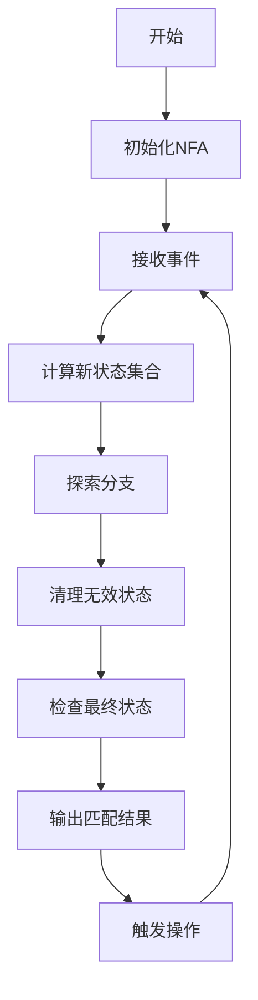

# Flink CEP原理与代码实例讲解

## 1.背景介绍

在当今时代,随着数据量的快速增长和实时处理需求的不断提高,传统的批处理系统已经无法满足现代应用的需求。因此,流式计算(Stream Processing)应运而生,成为了大数据处理领域的一个重要分支。Apache Flink作为一个开源的分布式流式数据处理引擎,凭借其低延迟、高吞吐量、容错性强等优势,在业界获得了广泛的应用。

Flink提供了多种流处理API,其中Flink CEP(Complex Event Processing)是一个强大的库,用于从有序事件流中发现特定的事件模式。CEP在许多领域都有应用,例如网络监控、金融交易、物联网等。通过CEP,我们可以对流数据进行实时分析,及时发现异常情况并采取相应的措施。

## 2.核心概念与联系

在深入探讨Flink CEP的原理之前,我们需要了解一些核心概念:

### 2.1 事件(Event)

事件是CEP处理的基本单元,可以是任何包含有效信息的数据记录,例如网络日志、传感器读数、交易记录等。事件通常包含时间戳信息,用于确定事件的发生顺序。

### 2.2 模式(Pattern)

模式是一个规则或条件的集合,用于描述我们想要从事件流中发现的特定情况。模式可以由多个模式原语组合而成,例如序列(Sequence)、并行(Parallel)、循环(Loop)等。

### 2.3 模式匹配(Pattern Matching)

模式匹配是CEP的核心功能,即根据预定义的模式在事件流中查找匹配的事件序列。一旦发现匹配的模式,CEP系统就会触发相应的操作或警报。

### 2.4 时间语义(Time Semantics)

在流式处理中,时间语义非常重要。Flink CEP支持三种时间语义:事件时间(Event Time)、引入时间(Ingestion Time)和处理时间(Processing Time)。正确选择时间语义对于获得准确的模式匹配结果至关重要。

## 3.核心算法原理具体操作步骤

Flink CEP的核心算法是基于有限状态机(Finite State Machine,FSM)的Nondeterministic Finite Automaton(NFA)模型。NFA模型可以高效地处理复杂的模式匹配问题,并且具有良好的可扩展性。

NFA模型的工作原理如下:

1. **状态转移**:NFA维护一个状态集合,每个状态代表模式的一部分。当事件到达时,NFA会根据事件的属性和当前状态,计算出新的状态集合。

2. **分支探索**:如果一个事件可以导致多个状态转移,NFA会同时探索所有可能的分支。这种非确定性特性使NFA能够处理各种复杂的模式。

3. **内存管理**:为了避免状态空间的无限膨胀,NFA会定期清理无效的状态,只保留活跃的状态。这种内存管理策略确保了NFA的高效运行。

4. **模式匹配**:当NFA达到最终状态时,意味着发现了一个完整的模式匹配。此时,NFA会输出匹配的事件序列,并触发相应的操作。

下面是Flink CEP中NFA模型的具体操作步骤:



上述流程图展示了NFA模型在Flink CEP中的工作方式。值得注意的是,Flink CEP还提供了一些优化策略,如状态共享、增量计算等,以提高性能和减少内存占用。

## 4.数学模型和公式详细讲解举例说明

在NFA模型中,我们可以使用数学符号和公式来形式化地描述模式匹配过程。下面是一些常用的数学表示:

### 4.1 事件流

我们将事件流表示为一个序列$E = \{e_1, e_2, \ldots, e_n\}$,其中$e_i$是第$i$个事件。每个事件$e_i$都包含一个时间戳$t_i$,用于确定事件的发生顺序。

### 4.2 模式表示

模式可以使用正则表达式进行表示。例如,序列模式"A followed by B"可以表示为$A \cdot B$,并行模式"A or B"可以表示为$A + B$。更复杂的模式可以通过组合这些基本运算符来构建。

### 4.3 状态转移函数

NFA的状态转移可以用一个函数$\delta$来描述,其中$\delta(q, e)$表示当前状态$q$在接收到事件$e$时,转移到的新状态集合。

$$\delta: Q \times \Sigma \rightarrow 2^Q$$

其中,$Q$是所有可能状态的集合,$\Sigma$是事件集合,而$2^Q$表示$Q$的幂集,即所有可能的状态子集。

### 4.4 模式匹配条件

对于一个给定的模式$P$,如果存在一个事件序列$E' = \{e'_1, e'_2, \ldots, e'_m\}$,使得$E'$是$E$的子序列,并且满足:

$$\delta(\delta(\ldots\delta(q_0, e'_1), e'_2), \ldots, e'_m) \in F$$

其中,$q_0$是NFA的初始状态,$F$是最终状态集合,那么我们就说模式$P$在事件流$E$中被匹配到了。

下面是一个具体的例子,假设我们有一个模式"A followed by B or C",它可以表示为$(A \cdot (B + C))$。如果事件流是$\{a, b, c, d, a, c\}$,那么这个模式在事件流中被匹配两次,分别是$\{a, b\}$和$\{a, c\}$。

## 5.项目实践:代码实例和详细解释说明

为了更好地理解Flink CEP的使用方法,我们来看一个实际的代码示例。假设我们需要监控一个在线购物网站的用户行为,当发现一个用户在10分钟内先浏览了商品,然后添加到购物车,最后进行下单操作时,我们就认为这是一次成功的购买行为,需要触发相应的营销活动。

### 5.1 定义事件类型

首先,我们需要定义事件的数据类型,包括事件名称、用户ID和事件时间戳:

```java
import org.apache.flink.cep.pattern.conditions.SimpleCondition;

public class UserEvent {
    public String userId;
    public String eventName;
    public Long timestamp;

    public UserEvent(String userId, String eventName, Long timestamp) {
        this.userId = userId;
        this.eventName = eventName;
        this.timestamp = timestamp;
    }

    public static SimpleCondition<UserEvent> filterStartCondition(String eventName) {
        return new SimpleCondition<UserEvent>() {
            @Override
            public boolean filter(UserEvent value) throws Exception {
                return value.eventName.equals(eventName);
            }
        };
    }
}
```

### 5.2 定义模式序列

接下来,我们定义需要匹配的模式序列:

```java
import org.apache.flink.cep.PatternStream;
import org.apache.flink.cep.pattern.Pattern;
import org.apache.flink.cep.pattern.conditions.SimpleCondition;

Pattern<UserEvent, ?> pattern = Pattern.<UserEvent>begin("start")
    .where(SimpleCondition.of(value -> value.eventName.equals("browse")))
    .next("next")
    .where(SimpleCondition.of(value -> value.eventName.equals("addToCart")))
    .within(Time.minutes(10))
    .next("end")
    .where(SimpleCondition.of(value -> value.eventName.equals("checkout")))
    .within(Time.minutes(10));
```

这个模式描述了一个序列:浏览商品 -> 添加到购物车(在10分钟内) -> 下单(在10分钟内)。我们使用`Pattern.begin()`方法定义模式的起点,然后使用`next()`方法指定后续的事件条件,使用`within()`方法设置事件之间的最大时间间隔。

### 5.3 应用模式并处理匹配结果

有了模式定义后,我们就可以将它应用到事件流上,并处理匹配的结果:

```java
import org.apache.flink.cep.PatternStream;
import org.apache.flink.cep.PatternFlatSelectFunction;
import org.apache.flink.util.Collector;

PatternStream<UserEvent> patternStream = CEP.pattern(
    inputStream.keyBy(UserEvent::getUserId),
    pattern
);

OutputTag<String> outputTag = new OutputTag<String>("side-output"){};

SingleOutputStreamOperator<String> result = patternStream.flatSelect(
    outputTag,
    new PatternFlatSelectFunction<UserEvent, String>() {
        @Override
        public void flatSelect(Map<String, List<UserEvent>> pattern, Collector<String> out) throws Exception {
            List<UserEvent> events = pattern.get("end");
            for (UserEvent event : events) {
                out.collect("User " + event.userId + " completed a purchase");
            }
        }
    },
    new PatternFlatSelectFunction<UserEvent, String>() {
        @Override
        public void flatSelect(Map<String, List<UserEvent>> pattern, Collector<String> out) throws Exception {
            // No-op, we're not interested in the side output
        }
    }
);
```

在上面的代码中,我们首先使用`CEP.pattern()`方法将模式应用到按用户ID分区的事件流上。然后,我们使用`flatSelect()`方法处理匹配的结果。如果发现一个完整的模式匹配,我们就输出一条购买成功的消息。

### 5.4 完整代码示例

下面是一个完整的示例程序,包括事件源、模式应用和结果处理:

```java
import org.apache.flink.cep.CEP;
import org.apache.flink.cep.PatternStream;
import org.apache.flink.streaming.api.datastream.DataStream;
import org.apache.flink.streaming.api.environment.StreamExecutionEnvironment;

public class UserBehaviorMonitoring {
    public static void main(String[] args) throws Exception {
        StreamExecutionEnvironment env = StreamExecutionEnvironment.getExecutionEnvironment();

        // 从数据源读取用户事件
        DataStream<UserEvent> input = env.addSource(new UserEventSource());

        // 定义模式
        Pattern<UserEvent, ?> pattern = Pattern.<UserEvent>begin("start")
            .where(SimpleCondition.of(value -> value.eventName.equals("browse")))
            .next("next")
            .where(SimpleCondition.of(value -> value.eventName.equals("addToCart")))
            .within(Time.minutes(10))
            .next("end")
            .where(SimpleCondition.of(value -> value.eventName.equals("checkout")))
            .within(Time.minutes(10));

        // 应用模式并处理结果
        PatternStream<UserEvent> patternStream = CEP.pattern(input.keyBy(UserEvent::getUserId), pattern);

        OutputTag<String> outputTag = new OutputTag<String>("side-output"){};

        SingleOutputStreamOperator<String> result = patternStream.flatSelect(
            outputTag,
            new PatternFlatSelectFunction<UserEvent, String>() {
                @Override
                public void flatSelect(Map<String, List<UserEvent>> pattern, Collector<String> out) throws Exception {
                    List<UserEvent> events = pattern.get("end");
                    for (UserEvent event : events) {
                        out.collect("User " + event.userId + " completed a purchase");
                    }
                }
            },
            new PatternFlatSelectFunction<UserEvent, String>() {
                @Override
                public void flatSelect(Map<String, List<UserEvent>> pattern, Collector<String> out) throws Exception {
                    // No-op, we're not interested in the side output
                }
            }
        );

        result.print();

        env.execute("User Behavior Monitoring");
    }
}
```

在这个示例中,我们首先从一个自定义的`UserEventSource`读取用户事件。然后,我们定义了一个模式,描述了购买行为的三个步骤。接着,我们将模式应用到按用户ID分区的事件流上,并使用`flatSelect()`方法处理匹配的结果。最后,我们打印出购买成功的消息。

通过这个实例,我们可以看到Flink CEP提供了一种声明式的方式来定义复杂的事件模式,并且能够高效地在事件流上进行模式匹配。这种功能在许多场景下都有重要的应用价值。

## 6.实际应用场景

Flink CEP可以应用于多个领域,下面是一些典型的应用场景:

### 6.1 网络监控

在网络监控领域,我们可以使用CEP来检测异常网络流量模式,例如分布式拒绝服务攻击(DDoS)、端口扫描等。通过定义相应的模式,CEP可