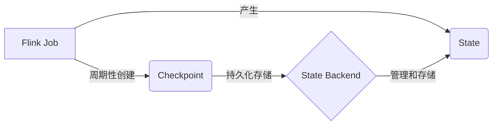
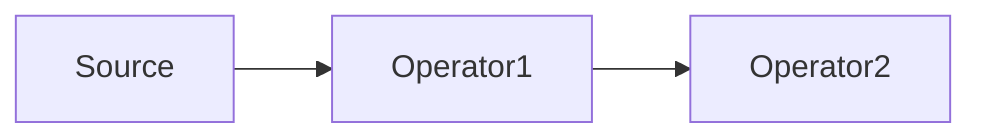

# Flink Checkpoint容错机制原理与代码实例讲解

## 1. 背景介绍

### 1.1 Flink简介

Apache Flink是一个开源的分布式流处理和批处理框架,由Apache软件基金会开发。Flink以数据并行和流水线方式执行任意流数据程序,Flink的流水线运行时系统可以执行批处理和流处理程序。Flink以其低延迟、高吞吐、容错性和准确性著称。

### 1.2 容错机制的重要性

在分布式计算环境下,由于各种软硬件故障,任务失败在所难免。对于流式计算应用而言,需要从故障中快速恢复,并继续处理数据,这就对容错性提出了很高的要求。Flink通过Checkpoint机制来保证exactly-once语义,使得Flink应用在出现故障后能够从Checkpoint恢复,继续处理数据,从而满足了流式计算的高容错性需求。

## 2. 核心概念与联系

### 2.1 状态(State)

在Flink中,状态是指流处理应用在计算过程中产生的中间结果数据。Flink中有两种基本类型的状态:

- Keyed State:这种状态与特定的key绑定,只能用于KeyedStream。
- Operator State:与特定operator绑定,可以用于所有类型的 operators。

### 2.2 检查点(Checkpoint)

Checkpoint是Flink容错机制的核心。Checkpoint是指在某一时间点对Flink Job的状态做一个快照,并持久化存储,用于在发生故障时恢复。Checkpoint是Flink实现exactly-once语义的基础。

### 2.3 Barrier

Barrier是Flink分布式快照的核心概念。Barrier是一种特殊的数据记录,用于把一条流上的数据按照不同的快照分界。当operator从它的一个输入流接收到一个barrier时,它会暂停处理,直到从其他输入流接收到barrier。当从所有输入流接收到barrier后,operator就将其状态保存到状态后端,然后将barrier传递到下游。

### 2.4 状态后端(State Backend)  

状态后端负责管理和checkpoint状态。Flink内置了3种状态后端:

- MemoryStateBackend:在内存中管理状态,checkpoint存储在JobManager的内存中。
- FsStateBackend:将状态数据保存在TaskManager的内存中,checkpoint存储在文件系统中。 
- RocksDBStateBackend:将正在运行中的状态数据保存在RocksDB数据库中,checkpoint存储在文件系统中。

它们之间的关系可以用下面的Mermaid图来表示:



## 3. 核心算法原理具体操作步骤

Flink Checkpoint的核心算法是Chandy-Lamport分布式快照算法。具体步骤如下:

1. JobManager向SourceOperator节点inject一个barrier
2. 当SourceOperator收到barrier时,会暂停数据处理,将自己的状态存储到状态后端,并向下游广播该barrier
3. 下游算子收到barrier后,会暂停数据处理,将收到barrier之前的数据处理完,并保存状态
4. 当下游算子从它所有的输入流接收到barrier时,会将自己的状态存储到状态后端,并向下游广播barrier
5. SinkOperator收到barrier时,会通知JobManager快照完成  
6. JobManager收集完所有任务的快照完成通知后,本次快照就完成了

## 4. 数学模型和公式详细讲解举例说明

设Flink Job有 $n$ 个operator $O_1, O_2, ..., O_n$,每个operator $O_i$ 在时间 $t$ 的状态为 $S_i^t$。

整个Job的状态快照 $C^t$ 定义为所有operator在时间 $t$ 的状态的集合:

$$C^t = \{S_1^t, S_2^t, ..., S_n^t\}$$

当在时间 $t$ 启动一次Checkpoint时,Flink会遍历所有的operator,让它们在接收到barrier时保存状态。设operator $O_i$ 接收到barrier的时间为 $t_i$,则本次Checkpoint得到的Job状态快照为:

$$C = \{S_1^{t_1}, S_2^{t_2}, ..., S_n^{t_n}\}$$  

虽然每个operator保存状态的时间可能不同,但Chandy-Lamport算法保证了这些状态的一致性,即这些状态对应了数据流在同一时间点的状态。

举例说明,假设有一个Flink Job包含3个operator:



在时间 $t_1$ 启动一次Checkpoint,则3个operator会在不同时间点保存状态:

- Source在 $t_1$ 时保存状态 $S_A^{t_1}$ 
- Operator1在 $t_2$ 时保存状态 $S_B^{t_2}$
- Operator2在 $t_3$ 时保存状态 $S_C^{t_3}$

则本次Checkpoint得到的状态快照为:

$$C = \{S_A^{t_1}, S_B^{t_2}, S_C^{t_3}\}$$

虽然三个状态保存的时间不同,但它们共同表示了数据流在时间 $t_1$ 的状态快照。

## 5. 项目实践：代码实例和详细解释说明

下面通过一个简单的WordCount例子来说明如何在Flink中使用Checkpoint。

```java
StreamExecutionEnvironment env = StreamExecutionEnvironment.getExecutionEnvironment();

// 每1000ms启动一次Checkpoint
env.enableCheckpointing(1000);

// 设置状态后端为FsStateBackend
env.setStateBackend(new FsStateBackend("file:///tmp/checkpoints"));

// 设置Checkpoint的最小间隔为500ms  
env.getCheckpointConfig().setMinPauseBetweenCheckpoints(500);

// 设置Checkpoint的超时时间为60s
env.getCheckpointConfig().setCheckpointTimeout(60000);

// 设置同一时间只允许一个Checkpoint
env.getCheckpointConfig().setMaxConcurrentCheckpoints(1);

DataStream<String> text = env.socketTextStream("localhost", 9999);

DataStream<Tuple2<String, Integer>> counts = text
    .flatMap(new Tokenizer())
    .keyBy(0)
    .sum(1);

counts.print();

env.execute("WordCount");
```

详细解释:

1. 通过`enableCheckpointing(1000)`来启用Checkpoint,参数表示每1000ms触发一次Checkpoint
2. 通过`setStateBackend`来设置状态后端为FsStateBackend,状态会保存到文件系统的`/tmp/checkpoints`目录下  
3. 通过`setMinPauseBetweenCheckpoints(500)`来设置两次Checkpoint之间的最小间隔为500ms,即使Checkpoint设置的间隔小于该值,Flink也会等待该时间间隔
4. 通过`setCheckpointTimeout(60000)`来设置Checkpoint的超时时间为60s,如果Checkpoint在60s内没有完成,则会被丢弃
5. 通过`setMaxConcurrentCheckpoints(1)`来设置同一时间只允许一个Checkpoint,这可以防止Checkpoint占用太多资源
6. 在任务中使用`flatMap`算子进行单词切分,然后用`keyBy`进行分组,用`sum`进行单词计数
7. 最后`print()`将结果打印出来

当任务运行时,Flink会定期触发Checkpoint,将任务的状态保存到文件系统。如果任务出现故障,Flink可以从最近的一次Checkpoint恢复任务状态,继续处理数据,从而实现exactly-once语义。

## 6. 实际应用场景

Flink的Checkpoint机制在实际生产中有广泛的应用,典型的应用场景包括:

1. 实时数据处理:如实时日志分析、实时风控等,这些场景对数据处理的时效性和准确性要求很高,需要在出现故障时能够快速恢复,Checkpoint机制可以很好地满足这一需求。

2. 事件驱动型应用:如实时推荐、实时广告投放等,这些应用通常需要维护大量的状态,Checkpoint机制可以保证状态的一致性和持久性。

3. 周期性批处理:如每日报表生成、周期性数据聚合等,这些任务通常运行时间较长,Checkpoint机制可以保证任务在出现故障时能够从断点恢复,避免重新计算。

4. 机器学习任务:如在线学习、增量学习等,这些任务需要不断更新模型参数,Checkpoint机制可以保证模型参数的一致性和持久性。

总之,只要是对数据处理的容错性和一致性有较高要求的场景,都可以考虑使用Flink的Checkpoint机制。

## 7. 工具和资源推荐

如果你想深入学习Flink的Checkpoint机制,可以参考以下资源:

1. Flink官方文档:https://ci.apache.org/projects/flink/flink-docs-stable/  
官方文档详细介绍了Checkpoint的原理和使用方法,是学习Checkpoint的权威资料。

2. Flink源码:https://github.com/apache/flink  
通过阅读Flink源码,可以更深入地理解Checkpoint的实现原理。

3. Flink Forward大会资料:https://www.flink-forward.org/  
Flink Forward是Flink社区的年度大会,会有很多关于Flink技术的分享,包括Checkpoint机制。

4. 《Stream Processing with Apache Flink》:  
这是O'Reilly出版的一本Flink学习指南,对Checkpoint机制有详细的介绍和示例。

5. Flink社区:https://flink.apache.org/community.html  
加入Flink社区,可以与其他Flink开发者交流学习,获取最新的Flink技术动向。

## 8. 总结：未来发展趋势与挑战

Flink的Checkpoint机制为流处理应用提供了强大的容错能力,是Flink得以广泛应用的重要原因之一。未来,Checkpoint机制还将在以下方面持续发展和优化:  

1. Checkpoint的性能优化:如何在不影响数据处理性能的情况下进行Checkpoint,是一个持续的优化方向。

2. 非对齐的Checkpoint:目前Flink采用的是对齐的Checkpoint,即所有算子在接收到Barrier后再进行Checkpoint,这可能会影响处理延迟。非对齐的Checkpoint允许算子在接收到Barrier前进行Checkpoint,可以进一步减小Checkpoint对处理延迟的影响。

3. 增量Checkpoint:目前Flink的Checkpoint是全量的,即每次都会保存全部状态,这对于状态量大的任务会产生较大的开销。增量Checkpoint只保存上次Checkpoint之后的增量状态,可以减小Checkpoint的开销。

4. 基于Checkpoint的状态演进:利用Checkpoint保存的历史状态,可以实现任务的状态演进和回滚,这对于调试和故障重现非常有帮助。

5. 更多的状态后端支持:目前Flink支持的状态后端还比较有限,未来会支持更多的状态后端,如HDFS、S3等,以满足不同场景的需求。

尽管Flink的Checkpoint机制已经相当成熟,但仍然面临着一些挑战:

1. 状态膨胀:对于状态量很大的任务,Checkpoint会占用大量的存储空间,如何有效地管理和清理Checkpoint是一个挑战。

2. Checkpoint的时间开销:Checkpoint会暂停数据处理,对于对延迟敏感的应用,如何减小Checkpoint的时间开销是一个挑战。

3. 跨任务的状态一致性:对于包含多个子任务的Flink应用,如何保证各个子任务状态的一致性也是一个挑战。

4. 容错性与性能的平衡:Checkpoint可以提供容错能力,但同时也会带来性能开销,如何在容错性和性能之间取得平衡是一个持续的挑战。

总的来说,Flink的Checkpoint机制还有很大的优化空间,同时也面临着不少挑战。相信通过社区的不断努力,Flink的Checkpoint机制会变得更加完善和高效,为流处理应用提供更加可靠的容错保障。

## 9. 附录：常见问题与解答

1. **Q:** Flink的Checkpoint与Spark的Checkpoint有什么区别?  
**A:** 两者的主要区别在于:  
- Flink的Checkpoint是轻量级的,可以频繁进行,而Spark的Checkpoint比较重,通常只在任务中间进行。  
- Flink的Checkpoint是基于Chandy-Lamport算法的分布式快照,可以提供exactly-once语义保证,而Spark的Checkpoint只能提供at-least-