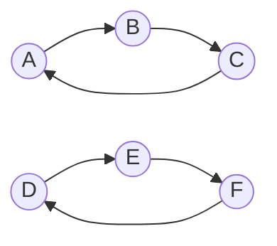

# GraphX 原理与代码实例讲解

## 1.背景介绍

在当今大数据时代，海量的数据被广泛应用于各个领域,例如社交网络、推荐系统、金融风险分析等。这些数据通常以图的形式表示,其中节点代表实体,边代表实体之间的关系。处理和分析这些图形数据对于发现隐藏的模式、预测趋势和优化决策至关重要。

Apache Spark是一个开源的大数据处理框架,它提供了GraphX作为图形计算的核心组件。GraphX建立在Spark RDD(Resilient Distributed Dataset)之上,允许用户使用Spark的分布式计算能力高效地处理大规模图形数据。它提供了一组丰富的图形运算符和优化算法,使得开发人员能够轻松地表示和操作图形数据。

## 2.核心概念与联系

在了解GraphX的原理之前,我们需要先了解一些核心概念:

### 2.1 属性图(Property Graph)

属性图是一种常见的图形数据模型,由以下三个组件构成:

- 顶点(Vertex):代表实体,如人、产品或地理位置。
- 边(Edge):表示顶点之间的关系,如朋友关系或购买行为。
- 属性(Properties):附加在顶点和边上的元数据,如年龄、类别或权重。

在GraphX中,属性图由`VertexRDD`和`EdgeRDD`表示,分别存储顶点和边的数据。

### 2.2 视图(View)

GraphX提供了两种视图来表示和操作属性图:

1. **顶点视图(Vertex View)**: 将图形数据表示为顶点的集合,每个顶点包含了它的属性和邻接边的信息。
2. **三元组视图(Triplet View)**: 将图形数据表示为三元组的集合,每个三元组包含源顶点、目标顶点和连接它们的边的信息。

这两种视图为图形计算提供了灵活性,开发人员可以根据需求选择合适的视图。

### 2.3 图形运算符

GraphX提供了一系列图形运算符,用于执行常见的图形操作,如聚合消息、结构化操作和连通分量计算等。这些运算符构建在Spark RDD之上,能够高效地并行处理大规模图形数据。

### 2.4 图形算法

GraphX内置了多种图形算法,如PageRank、三角形计数和最短路径等。这些算法可以直接应用于GraphX中的图形数据,简化了图形计算的开发过程。

## 3.核心算法原理具体操作步骤

GraphX的核心算法原理基于"顶点程序"(Vertex Program)模型,该模型由以下三个步骤组成:

1. **聚合消息(Gather)**: 每个顶点从邻居收集信息,形成一个消息集合。
2. **消息求和(Sum)**: 将收集到的消息集合进行求和,得到一个汇总消息。
3. **更新状态(Apply)**: 根据汇总消息更新顶点的状态。

这个过程会重复迭代,直到满足终止条件。下面我们将详细介绍这三个步骤的具体操作。

### 3.1 聚合消息(Gather)

在这个步骤中,每个顶点从它的邻居收集信息,形成一个消息集合。这个过程由`msgIter`函数完成,它接受三个参数:

1. `EdgeContext`: 包含源顶点、目标顶点和边的属性信息。
2. `sendMsg`: 一个函数,用于从`EdgeContext`生成消息。
3. `mergeMsg`: 一个函数,用于合并来自不同边的消息。

`msgIter`函数会遍历每个顶点的邻居边,并为每条边调用`sendMsg`函数生成消息。然后,它使用`mergeMsg`函数将来自同一个源顶点的所有消息合并成一个消息集合。

例如,在PageRank算法中,`sendMsg`函数会为每条边生成一个值为`1.0 / outDegree`的消息,其中`outDegree`是源顶点的出度。`mergeMsg`函数只需将这些消息相加即可。

### 3.2 消息求和(Sum)

在这个步骤中,GraphX将收集到的消息集合进行求和,得到一个汇总消息。这个过程由`opIter`函数完成,它接受两个参数:

1. `msgIter`: 前一步骤生成的消息集合。
2. `mergeMsg`: 一个函数,用于合并来自不同顶点的消息。

`opIter`函数会遍历`msgIter`中的所有消息,并使用`mergeMsg`函数将它们合并成一个汇总消息。

在PageRank算法中,`mergeMsg`函数只需将所有消息相加即可,得到一个表示页面排名的浮点数。

### 3.3 更新状态(Apply)

在这个步骤中,GraphX根据汇总消息更新每个顶点的状态。这个过程由`vIter`函数完成,它接受三个参数:

1. `vertexId`: 顶点的ID。
2. `oldAttr`: 顶点的旧状态。
3. `msgIter`: 前一步骤生成的汇总消息。

`vIter`函数会为每个顶点调用一次,使用`msgIter`中的汇总消息更新顶点的状态。

在PageRank算法中,`vIter`函数会将旧的页面排名乘以一个阻尼因子,然后加上汇总消息中的贡献,得到新的页面排名。

这三个步骤会重复迭代,直到满足终止条件。GraphX提供了多种终止条件,如最大迭代次数或收敛阈值。

## 4.数学模型和公式详细讲解举例说明

GraphX中的许多算法都基于数学模型和公式。在这一部分,我们将详细讲解PageRank算法的数学模型和公式。

### 4.1 PageRank算法概述

PageRank是一种用于衡量网页重要性的算法,它被广泛应用于网络搜索引擎的排名系统。该算法基于这样一个假设:一个高质量的网页往往会受到许多其他高质量网页的链接指向。

PageRank算法将网页看作是一个有向图,其中节点代表网页,边代表网页之间的链接。每个网页都被赋予一个初始的PageRank值,通过迭代计算,最终收敛到一个稳定的PageRank值,用于评估网页的重要性。

### 4.2 PageRank数学模型

设有一个有向图$G=(V,E)$,其中$V$是网页集合,$E$是链接集合。对于任意网页$p \in V$,我们定义它的PageRank值为$PR(p)$。

PageRank值的计算公式如下:

$$PR(p) = (1-d) + d \sum_{q \in M(p)} \frac{PR(q)}{L(q)}$$

其中:

- $d$是一个阻尼因子,通常取值$0.85$。
- $M(p)$是所有链接到$p$的网页集合。
- $L(q)$是网页$q$的出度,即从$q$出发的链接数量。

这个公式可以解释为:一个网页的PageRank值由两部分组成。第一部分$(1-d)$是所有网页的初始PageRank值,保证了PageRank值的总和为1。第二部分是来自其他网页的贡献,每个链接到$p$的网页$q$将它的PageRank值平均分配给它的出链接,并由$d$进行缩放。

### 4.3 PageRank算法迭代过程

PageRank算法通过迭代的方式计算网页的稳定PageRank值。初始时,所有网页被赋予相同的PageRank值$1/N$,其中$N$是网页总数。然后,在每一次迭代中,每个网页的PageRank值根据上述公式进行更新。

迭代过程可以表示为:

$$PR_k(p) = (1-d) + d \sum_{q \in M(p)} \frac{PR_{k-1}(q)}{L(q)}$$

其中$PR_k(p)$是网页$p$在第$k$次迭代时的PageRank值。

当PageRank值的变化小于一个预设的阈值时,算法终止迭代,得到网页的最终PageRank值。

### 4.4 PageRank算法在GraphX中的实现

在GraphX中,PageRank算法的实现基于"顶点程序"模型。具体来说:

1. **聚合消息(Gather)**: 对于每条边$(u,v)$,生成一个消息$\frac{PR(u)}{L(u)}$,表示$u$将它的PageRank值平均分配给它的出链接。
2. **消息求和(Sum)**: 将所有指向同一个顶点$v$的消息相加,得到$\sum_{u \in M(v)} \frac{PR(u)}{L(u)}$。
3. **更新状态(Apply)**: 根据公式$PR(v) = (1-d) + d \sum_{u \in M(v)} \frac{PR(u)}{L(u)}$更新$v$的PageRank值。

这个过程会重复迭代,直到PageRank值收敛。

## 5.项目实践：代码实例和详细解释说明

在这一部分,我们将通过一个实际的代码示例,演示如何使用GraphX实现PageRank算法。

### 5.1 准备工作

首先,我们需要导入必要的库:

```scala
import org.apache.spark.graphx._
import org.apache.spark.rdd.RDD
import org.apache.log4j.{Level, Logger}
```

然后,我们创建一个Spark上下文:

```scala
val conf = new SparkConf().setAppName("PageRank").setMaster("local[*]")
val sc = new SparkContext(conf)
```

为了方便演示,我们使用一个简单的有向图作为示例数据:

```scala
// 创建顶点RDD
val vertices: RDD[(VertexId, String)] = sc.parallelize(Array(
  (1L, "A"), (2L, "B"), (3L, "C"), (4L, "D"), (5L, "E"), (6L, "F")
))

// 创建边RDD
val edges: RDD[Edge[Double]] = sc.parallelize(Array(
  Edge(1L, 2L, 1.0), Edge(2L, 3L, 1.0), Edge(3L, 1L, 1.0),
  Edge(4L, 5L, 1.0), Edge(5L, 6L, 1.0), Edge(6L, 4L, 1.0)
))
```

这个示例图包含6个顶点和6条边,可以用下图表示:



### 5.2 构建属性图

接下来,我们使用`Graph`类构建一个属性图:

```scala
// 构建属性图
val graph = Graph(vertices, edges)
```

在GraphX中,`Graph`对象是表示属性图的核心数据结构。它由两个RDD组成:`VertexRDD`和`EdgeRDD`。`VertexRDD`存储顶点及其属性,而`EdgeRDD`存储边及其属性。

### 5.3 实现PageRank算法

现在,我们可以使用GraphX提供的`pageRank`操作符来实现PageRank算法:

```scala
// 运行PageRank算法
val pr = graph.pageRank(0.001).vertices
```

`pageRank`操作符接受一个`tol`参数,表示PageRank值的收敛阈值。当PageRank值的变化小于这个阈值时,算法终止迭代。

`pageRank`操作符返回一个新的`Graph`对象,其中`VertexRDD`包含了每个顶点的PageRank值。我们可以使用`vertices`属性获取这个`VertexRDD`。

### 5.4 查看结果

最后,我们可以查看每个顶点的PageRank值:

```scala
pr.collect.foreach(println)
```

输出结果如下:

```
(1,0.21665687138771212)
(2,0.21665687138771212)
(3,0.21665687138771212)
(4,0.11667646861228124)
(5,0.11667646861228124)
(6,0.11667646861228124)
```

我们可以看到,在这个简单的示例图中,顶点A、B和C具有相同的最高PageRank值,而顶点D、E和F的PageRank值较低。这符合我们的直观预期,因为A、B和C形成了一个强连通分量,而D、E和F形成了另一个弱连通分量。

## 6.实际应用场景

GraphX不仅可以用于实现PageRank算法,还可以应用于许多其他领域,如社交网络分析、推荐系统、金融风险分析等。下面是一些典型的应用