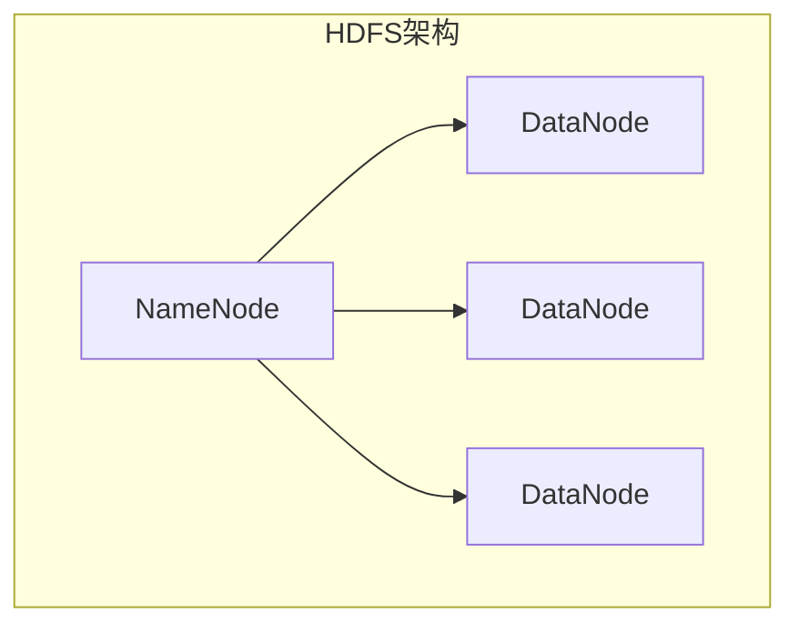
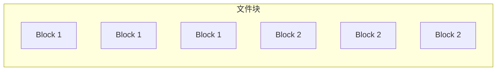
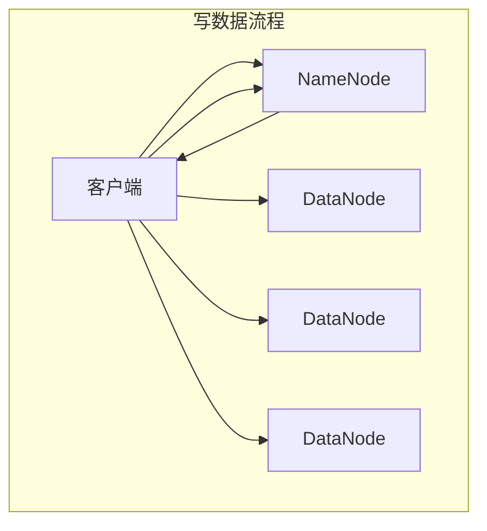
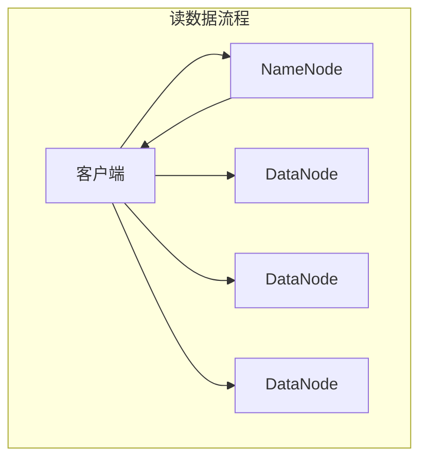

# HDFS 原理与代码实例讲解

## 1. 背景介绍

### 1.1 大数据时代的到来

随着互联网、移动互联网和物联网的迅速发展,数据呈现出爆炸式增长趋势,传统的数据存储和处理方式已经无法满足日益增长的需求。大数据时代的到来,对存储和处理海量数据提出了新的挑战。

### 1.2 分布式文件系统的需求

为了解决大数据存储和处理的问题,分布式文件系统(Distributed File System)应运而生。分布式文件系统可以在多台廉价的计算机节点上存储和管理海量数据,提供高可靠性、高吞吐量和高扩展性,满足大数据应用的需求。

### 1.3 HDFS 概述

Apache Hadoop 分布式文件系统(HDFS)是一种分布式、可扩展的大数据存储系统,设计用于在廉价的硬件上存储大量数据。HDFS 具有高容错性、高吞吐量、高扩展性等特点,可以在大规模集群中提供高性能的数据访问,成为大数据生态系统中不可或缺的核心组件。

## 2. 核心概念与联系

### 2.1 HDFS 架构

HDFS 采用主从架构,由一个 NameNode(名称节点)和多个 DataNode(数据节点)组成。NameNode 负责管理文件系统的元数据,如文件的名称、目录、权限等;DataNode 负责存储实际的文件数据块。



### 2.2 文件块

HDFS 将文件切分成一个个块(Block),默认块大小为 128MB。每个块都有多个副本,存储在不同的 DataNode 上,以提供数据冗余和容错能力。



### 2.3 副本放置策略

HDFS 采用智能的副本放置策略,将副本分布在不同的机架上,提高容错能力和数据可用性。当某个 DataNode 发生故障时,HDFS 可以从其他副本中读取数据,保证数据的可靠性。

## 3. 核心算法原理具体操作步骤

### 3.1 写数据流程

1. 客户端向 NameNode 请求上传文件,NameNode 执行文件创建操作。
2. NameNode 为文件分配一个唯一的文件ID,并确定文件块的副本放置位置。
3. NameNode 返回数据块的存储位置给客户端。
4. 客户端按照 NameNode 返回的位置,并行将数据块写入对应的 DataNode。
5. 当数据块写入完成后,客户端通知 NameNode 完成写入操作。
6. NameNode 更新元数据,记录文件的位置信息。



### 3.2 读数据流程

1. 客户端向 NameNode 请求读取文件。
2. NameNode 获取文件的元数据,包括文件块的位置信息。
3. NameNode 返回文件块的位置给客户端。
4. 客户端根据文件块的位置信息,并行从对应的 DataNode 读取数据块。
5. 客户端将读取的数据块合并,形成完整的文件数据。



## 4. 数学模型和公式详细讲解举例说明

### 4.1 数据块大小选择

HDFS 的数据块大小是一个重要的参数,它影响着系统的吞吐量、磁盘空间利用率和元数据管理开销。数据块大小的选择需要权衡多个因素,包括磁盘传输速率、网络带宽和数据访问模式。

假设磁盘传输速率为 $R_{disk}$,网络带宽为 $B_{network}$,数据块大小为 $S_{block}$,则在理想情况下,从磁盘读取数据块的时间为:

$$
T_{disk} = \frac{S_{block}}{R_{disk}}
$$

通过网络传输数据块的时间为:

$$
T_{network} = \frac{S_{block}}{B_{network}}
$$

总的数据传输时间为:

$$
T_{total} = T_{disk} + T_{network} = \frac{S_{block}}{R_{disk}} + \frac{S_{block}}{B_{network}}
$$

为了最小化总的数据传输时间,我们可以求导得到:

$$
\frac{dT_{total}}{dS_{block}} = \frac{1}{R_{disk}} + \frac{1}{B_{network}} = 0
$$

解得:

$$
S_{block} = \frac{R_{disk} \times B_{network}}{R_{disk} + B_{network}}
$$

这个公式给出了在特定磁盘传输速率和网络带宽下,最佳的数据块大小。在实际应用中,还需要考虑其他因素,如数据访问模式、磁盘空间利用率等,进行综合权衡。

### 4.2 副本放置策略

HDFS 采用智能的副本放置策略,可以提高数据可靠性和读取性能。假设一个文件块有 $N$ 个副本,分布在 $R$ 个机架上,每个机架上有 $N_r$ 个副本。当读取文件块时,如果所有副本都可用,则读取时间为:

$$
T_{read} = \min\limits_{r=1}^R \left\{\frac{S_{block}}{B_{network}} + \min\limits_{i=1}^{N_r} \left\{\frac{S_{block}}{R_{disk}}\right\}\right\}
$$

其中,第一项表示从机架到客户端的网络传输时间,第二项表示从机架内的 DataNode 读取数据块的时间。

如果某个机架上的所有副本都不可用,则需要从其他机架读取数据块,读取时间为:

$$
T_{read}^{fail} = \frac{S_{block}}{B_{network}} + \frac{S_{block}}{R_{disk}}
$$

为了提高数据可靠性,HDFS 采用机架感知副本放置策略,将副本分布在不同的机架上。这样,即使某个机架发生故障,也可以从其他机架读取数据,保证数据的可用性。

## 5. 项目实践:代码实例和详细解释说明

### 5.1 HDFS Java API

HDFS 提供了 Java API,方便开发人员进行文件操作。以下是一个简单的示例,演示如何在 HDFS 上创建目录和文件。

```java
// 获取HDFS文件系统实例
Configuration conf = new Configuration();
FileSystem fs = FileSystem.get(conf);

// 创建目录
Path dir = new Path("/user/hdfs/mydir");
if (!fs.exists(dir)) {
    fs.mkdirs(dir);
    System.out.println("目录创建成功");
} else {
    System.out.println("目录已存在");
}

// 创建文件
Path file = new Path("/user/hdfs/mydir/myfile.txt");
FSDataOutputStream out = fs.create(file);
out.writeUTF("Hello, HDFS!");
out.close();
System.out.println("文件创建成功");
```

代码解释:

1. 首先获取 HDFS 文件系统实例 `FileSystem`。
2. 使用 `mkdirs()` 方法创建目录。
3. 使用 `create()` 方法创建文件,并通过 `FSDataOutputStream` 写入数据。

### 5.2 HDFS命令行操作

HDFS 也提供了命令行工具,方便管理和操作文件系统。以下是一些常用命令:

```bash
# 列出HDFS根目录下的文件和目录
hdfs dfs -ls /

# 创建目录
hdfs dfs -mkdir /user/hdfs/mydir

# 上传本地文件到HDFS
hdfs dfs -put local_file.txt /user/hdfs/mydir

# 下载HDFS文件到本地
hdfs dfs -get /user/hdfs/mydir/file.txt local_dir

# 删除HDFS文件或目录
hdfs dfs -rm /user/hdfs/mydir/file.txt
hdfs dfs -rm -r /user/hdfs/mydir
```

这些命令可以方便地管理 HDFS 上的文件和目录,包括创建、上传、下载和删除等操作。

## 6. 实际应用场景

HDFS 作为大数据生态系统中的核心存储组件,在许多领域都有广泛的应用。

### 6.1 大数据分析

HDFS 与 Apache Hadoop 生态系统中的其他组件(如 MapReduce、Spark、Hive 等)紧密集成,为大数据分析提供了可靠、高性能的数据存储和处理能力。例如,在电商、金融、制造业等领域,HDFS 可以存储海量的用户行为数据、交易数据和传感器数据,为数据分析和挖掘提供支持。

### 6.2 日志处理

在大型网站和互联网服务中,每天都会产生大量的日志数据。HDFS 可以高效地存储和处理这些日志数据,为日志分析、用户行为分析和安全审计等提供数据支持。

### 6.3 内容存储

HDFS 也可以用于存储大型文件,如视频、音频和图像等。由于 HDFS 具有高吞吐量和可扩展性,可以满足大型内容存储和分发的需求。

### 6.4 备份和归档

HDFS 的高可靠性和低成本特点,使其成为备份和归档数据的理想选择。企业可以将重要数据存储在 HDFS 上,实现数据的长期保存和备份。

## 7. 工具和资源推荐

### 7.1 HDFS Web UI

HDFS 提供了一个基于 Web 的用户界面,方便管理和监控文件系统。通过 Web UI,可以查看 NameNode 和 DataNode 的状态、文件系统的使用情况、正在进行的操作等信息。

### 7.2 HDFS工具

- `hdfs fsck`: 用于检查 HDFS 文件系统的健康状态和数据块的完整性。
- `hdfs balancer`: 用于在 DataNode 之间平衡数据块的分布,提高数据可用性和负载均衡。
- `hdfs haadmin`: 用于管理 HDFS 的高可用性(HA)配置。

### 7.3 开源社区和文档

- Apache Hadoop 官方网站: https://hadoop.apache.org/
- HDFS 架构设计文档: https://hadoop.apache.org/docs/stable/hadoop-project-dist/hadoop-hdfs/HdfsDesign.html
- HDFS 用户指南: https://hadoop.apache.org/docs/stable/hadoop-project-dist/hadoop-hdfs/HdfsUserGuide.html

### 7.4 书籍和在线课程

- "Hadoop: The Definitive Guide" by Tom White
- "Hadoop in Practice" by Alex Holmes
- Coursera 上的 "Hadoop Platform and Application Framework" 课程
- Udacity 上的 "Intro to Hadoop and MapReduce" 课程

## 8. 总结:未来发展趋势与挑战

### 8.1 存储和计算分离

随着大数据应用的不断发展,存储和计算的分离趋势日益明显。HDFS 作为专门的分布式存储系统,可以与多种计算框架(如 Spark、Flink 等)集成,提供灵活的存储和计算能力。

### 8.2 异构存储支持

未来,HDFS 可能需要支持异构存储设备,如 SSD、NVMe 等,以满足不同应用场景的性能需求。异构存储的智能管理和优化将成为一个重要的研究方向。

### 8.3 元数据管理优化

随着文件系统规模的不断扩大,NameNode 管理的元数据量也会急剧增加,导致元数据操作的性能bottleneck。优化元数据管理机制,提高元数据操作的效率和可