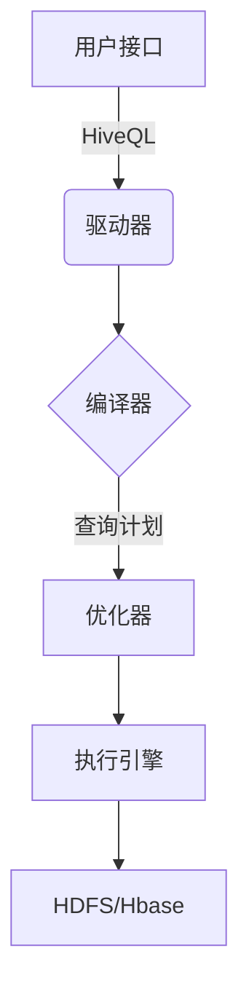
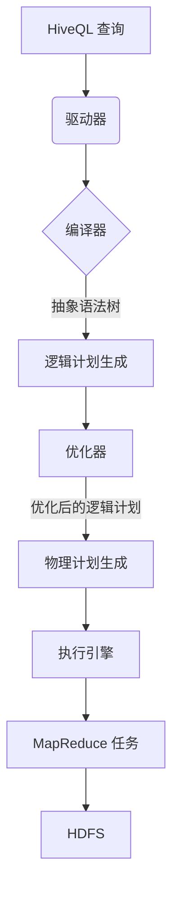

# HiveQL原理与代码实例讲解

## 1. 背景介绍

在大数据时代，海量数据的存储和处理成为了一个巨大的挑战。Apache Hive 作为一种建立在 Hadoop 之上的数据仓库工具,为结构化数据的分析提供了强大的 SQL 查询能力。Hive 使用类似 SQL 的语言 HiveQL(Hive Query Language),允许用户使用熟悉的 SQL 语法来查询、汇总和分析存储在 Hadoop 分布式文件系统(HDFS)中的大数据集。

HiveQL 的出现极大地降低了大数据分析的门槛,使得数据分析师和业务人员无需掌握复杂的 MapReduce 编程,就能够轻松地处理 TB 级别的海量数据。HiveQL 将底层的 MapReduce 任务抽象化,使用户可以专注于数据分析本身,而不必关注分布式计算的细节。

## 2. 核心概念与联系

### 2.1 Hive 架构

Hive 的架构由以下几个核心组件组成:



1. **用户接口**: 用户可以通过 CLI(命令行界面)、JDBC/ODBC 或 Web UI 等方式与 Hive 进行交互。
2. **驱动器(Driver)**: 负责接收 HiveQL 查询,并与编译器、优化器和执行引擎进行交互。
3. **编译器(Compiler)**: 将 HiveQL 查询转换为查询计划。
4. **优化器(Optimizer)**: 对查询计划进行优化,以提高查询效率。
5. **执行引擎(Execution Engine)**: 执行优化后的查询计划,并与 HDFS 或其他数据源进行交互。

### 2.2 Hive 数据模型

Hive 支持多种数据模型,包括:

- **表(Table)**: 类似于关系型数据库中的表,用于存储结构化数据。
- **分区(Partition)**: 将表按照某些列的值进行分区,以提高查询效率。
- **存储桶(Bucket)**: 对表进行散列分区,以提高数据的并行处理能力。
- **视图(View)**: 基于 HiveQL 查询创建的虚拟表,用于简化查询语句。

### 2.3 Hive 文件格式

Hive 支持多种文件格式,常用的有:

- **TextFile**: 纯文本格式,每行表示一条记录,字段之间用分隔符分隔。
- **SequenceFile**: Hadoop 自身的二进制文件格式,提供了压缩和切分功能。
- **RCFile(Record Columnar File)**: 列式存储格式,适合于需要批量读取部分列的场景。
- **ORC(Optimized Row Columnar)**: 优化的列式存储格式,提供了高效的压缩和编码技术。
- **Parquet**: 另一种列式存储格式,由 Apache Parquet 项目开发,提供了高效的编码和压缩。

## 3. 核心算法原理具体操作步骤

### 3.1 Hive 查询执行流程

当用户提交一个 HiveQL 查询时,Hive 会经历以下几个步骤:



1. **驱动器(Driver)** 接收 HiveQL 查询。
2. **编译器(Compiler)** 将 HiveQL 查询转换为抽象语法树(AST)。
3. **逻辑计划生成器** 根据 AST 生成逻辑计划。
4. **优化器(Optimizer)** 对逻辑计划进行一系列优化,如投影剪裁、分区剪裁、列剪裁等。
5. **物理计划生成器** 根据优化后的逻辑计划生成物理计划。
6. **执行引擎(Execution Engine)** 执行物理计划,生成一个或多个 MapReduce 任务。
7. **MapReduce 任务** 在 Hadoop 集群上并行执行,将结果写入 HDFS。

### 3.2 Hive 查询优化

Hive 的查询优化主要包括以下几个方面:

1. **投影剪裁(Projection Pruning)**: 只读取查询所需的列,减少 I/O 开销。
2. **分区剪裁(Partition Pruning)**: 只扫描满足条件的分区,避免全表扫描。
3. **列剪裁(Column Pruning)**: 只读取查询所需的列,减少 I/O 开销。
4. **谓词下推(Predicate Pushdown)**: 将过滤条件下推到存储层,减少数据传输量。
5. **连接重排(Join Reorder)**: 优化连接顺序,减少中间结果的大小。
6. **MapJoin**: 将小表数据加载到内存中,避免昂贵的 Shuffle 操作。
7. **自动 Bucket 映射(Auto Bucket Mapjoin)**: 利用存储桶对 MapJoin 进行优化。

## 4. 数学模型和公式详细讲解举例说明

在 Hive 中,一些常见的数学函数和统计函数都可以使用 HiveQL 来实现。下面我们将介绍一些常用的数学模型和公式,并给出相应的 HiveQL 实现。

### 4.1 平均值(AVG)

平均值是一种常用的统计量,用于计算一组数据的中心趋势。在 HiveQL 中,可以使用 `AVG` 函数来计算平均值:

$$
\text{AVG}(x_1, x_2, \ldots, x_n) = \frac{1}{n} \sum_{i=1}^{n} x_i
$$

示例:

```sql
SELECT AVG(age) FROM users;
```

### 4.2 方差(VAR_POP)和标准差(STDDEV_POP)

方差和标准差是衡量数据离散程度的重要指标。在 HiveQL 中,可以使用 `VAR_POP` 和 `STDDEV_POP` 函数来计算总体方差和标准差:

$$
\text{VAR_POP}(x_1, x_2, \ldots, x_n) = \frac{1}{n} \sum_{i=1}^{n} (x_i - \mu)^2
$$

$$
\text{STDDEV_POP}(x_1, x_2, \ldots, x_n) = \sqrt{\text{VAR_POP}(x_1, x_2, \ldots, x_n)}
$$

其中 $\mu$ 表示平均值。

示例:

```sql
SELECT VAR_POP(score), STDDEV_POP(score) FROM student_scores;
```

### 4.3 相关系数(CORR)

相关系数用于衡量两个变量之间的线性相关程度。在 HiveQL 中,可以使用 `CORR` 函数来计算两个变量的皮尔逊相关系数:

$$
\text{CORR}(X, Y) = \frac{\sum_{i=1}^{n} (x_i - \bar{x})(y_i - \bar{y})}{\sqrt{\sum_{i=1}^{n} (x_i - \bar{x})^2} \sqrt{\sum_{i=1}^{n} (y_i - \bar{y})^2}}
$$

其中 $\bar{x}$ 和 $\bar{y}$ 分别表示 $X$ 和 $Y$ 的平均值。

示例:

```sql
SELECT CORR(age, income) FROM users;
```

### 4.4 线性回归(LFIT)

线性回归是一种常用的机器学习模型,用于建立自变量和因变量之间的线性关系。在 HiveQL 中,可以使用 `LFIT` 函数来计算线性回归模型的系数:

$$
y = \alpha + \beta_1 x_1 + \beta_2 x_2 + \ldots + \beta_n x_n
$$

其中 $\alpha$ 是常数项, $\beta_i$ 是自变量 $x_i$ 的系数。

示例:

```sql
SELECT LFIT(y, x1, x2, x3) FROM data;
```

上述查询将返回一个数组,包含常数项 $\alpha$ 和各个自变量的系数 $\beta_i$。

## 5. 项目实践: 代码实例和详细解释说明

在本节中,我们将通过一个实际的项目案例来演示 HiveQL 的使用。假设我们有一个包含用户浏览记录的数据集,其中包括用户 ID、页面 ID、浏览时间等字段。我们希望分析用户的浏览行为,并找出热门页面。

### 5.1 创建表

首先,我们需要在 Hive 中创建一个表来存储数据:

```sql
CREATE TABLE user_visits (
    user_id INT,
    page_id INT,
    visit_time TIMESTAMP
)
ROW FORMAT DELIMITED
FIELDS TERMINATED BY ','
STORED AS TEXTFILE;
```

上述语句创建了一个名为 `user_visits` 的表,包含三个字段:用户 ID、页面 ID 和浏览时间。数据将以逗号分隔的文本文件格式存储在 HDFS 上。

### 5.2 加载数据

接下来,我们需要将数据加载到 Hive 表中。假设我们有一个名为 `visits.txt` 的文本文件,内容如下:

```
1,101,2023-05-01 10:00:00
1,102,2023-05-01 10:15:00
2,101,2023-05-01 11:30:00
1,103,2023-05-01 12:00:00
...
```

我们可以使用 `LOAD` 命令将数据加载到 Hive 表中:

```sql
LOAD DATA INPATH '/path/to/visits.txt' INTO TABLE user_visits;
```

### 5.3 统计页面浏览量

现在,我们可以使用 HiveQL 查询来分析数据。例如,我们可以统计每个页面的浏览量:

```sql
SELECT page_id, COUNT(*) AS visit_count
FROM user_visits
GROUP BY page_id
ORDER BY visit_count DESC;
```

该查询将按照浏览量降序输出每个页面的浏览次数,从而可以找出热门页面。

### 5.4 分析用户行为

除了统计页面浏览量,我们还可以分析用户的浏览行为。例如,我们可以计算每个用户的平均浏览时长:

```sql
SELECT user_id, AVG(UNIX_TIMESTAMP(LEAD(visit_time, 1) OVER (PARTITION BY user_id ORDER BY visit_time)) -
                    UNIX_TIMESTAMP(visit_time)) AS avg_duration
FROM user_visits
GROUP BY user_id;
```

该查询使用了 `LEAD` 窗口函数来计算相邻两次浏览之间的时间差,然后取平均值作为每个用户的平均浏览时长。

### 5.5 使用分区和存储桶

为了提高查询效率,我们可以对表进行分区和存储桶操作。例如,我们可以按照日期对 `user_visits` 表进行分区:

```sql
ALTER TABLE user_visits PARTITION BY (visit_date STRING);

INSERT OVERWRITE TABLE user_visits PARTITION (visit_date)
SELECT user_id, page_id, visit_time, DATE_FORMAT(visit_time, 'yyyy-MM-dd') AS visit_date
FROM user_visits;
```

上述语句将 `user_visits` 表按照访问日期进行分区。在查询时,Hive 只需要扫描满足条件的分区,从而提高查询效率。

同时,我们还可以对表进行存储桶操作,以提高数据的并行处理能力:

```sql
SET hive.enforce.bucketing=true;
SET hive.exec.dynamic.partition.mode=nonstrict;

INSERT OVERWRITE TABLE user_visits
PARTITION (visit_date)
CLUSTERED BY (user_id) SORTED BY (user_id) INTO 16 BUCKETS
SELECT user_id, page_id, visit_time, DATE_FORMAT(visit_time, 'yyyy-MM-dd') AS visit_date
FROM user_visits;
```

上述语句将 `user_visits` 表按照用户 ID 进行存储桶操作,将数据分成 16 个存储桶。这样可以提高基于用户 ID 进行分组和聚合操作的效率。

## 6. 实际应用场景

HiveQL 在许多领域都有广泛的应用,包括但不限于:

1. **网站分析**: 分析用户浏览行为、流量来源、页面热度等,优化网站设计和营销策略。
2. **日志分析**: 分析系统日志、服务器日志等,了解系统