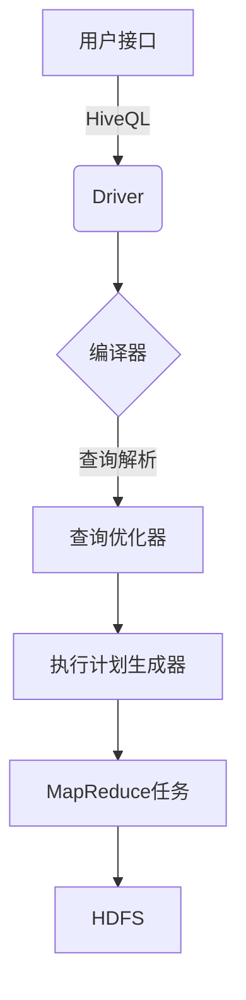

# Hive原理与代码实例讲解

## 1.背景介绍

Apache Hive是一个建立在Hadoop之上的数据仓库基础工具，它可以让用户通过类SQL语句来访问存储在Hadoop分布式文件系统(HDFS)中的数据。Hive的设计目标是提供一种类似SQL的查询语言，让数据分析师和传统数据库应用程序员可以轻松地将结构化的数据文件映射为数据库表，并在此基础上提供数据挖掘功能。

Hive最初由Facebook公司开发，后来加入Apache软件基金会，成为Apache的一个顶级项目。Hive可以将结构化的数据文件映射为一张数据库表，并提供类SQL的查询语句来查询这些数据。Hive本身并不存储数据，而是将执行的查询语句转化为MapReduce任务在Hadoop集群上执行。

### 1.1 Hive的优势

- **SQL友好**：Hive提供了类SQL的查询语言HiveQL，使得开发人员可以很方便地将结构化数据映射为数据库表，并提供类似SQL的查询功能。
- **可扩展性**：Hive建立在Hadoop之上，可以利用Hadoop的分布式计算能力，实现数据的高效查询和分析。
- **容错性**：Hadoop的容错机制使得Hive能够在节点出现故障时仍能继续工作。
- **成本低廉**：Hadoop是开源的，使用Hive可以大幅降低数据分析的成本。

### 1.2 Hive的应用场景

- **数据仓库**：Hive可以用于构建企业级的数据仓库，存储和分析海量的结构化数据。
- **ETL工具**：Hive可以作为ETL(Extract-Transform-Load)工具，用于数据的提取、转换和加载。
- **数据分析**：Hive提供了SQL类似的查询语言，可以用于对存储在HDFS中的海量数据进行分析和挖掘。

## 2.核心概念与联系

### 2.1 Hive架构

Hive的整体架构如下图所示:



1. **用户接口**：用户可以通过命令行工具(CLI)、JDBC/ODBC或Web UI等方式向Hive发送HiveQL查询语句。
2. **Driver**：Driver是Hive的核心组件，负责接收HiveQL查询语句，并与其他组件交互完成查询执行。
3. **编译器**：编译器将HiveQL查询语句转换为Hive的查询计划。
4. **查询优化器**：查询优化器根据一些规则对查询计划进行优化，以提高查询效率。
5. **执行计划生成器**：执行计划生成器根据优化后的查询计划生成MapReduce任务。
6. **MapReduce任务**：MapReduce任务在Hadoop集群上执行，处理存储在HDFS中的数据。

### 2.2 Hive元数据存储

Hive中的元数据存储在关系数据库中，默认使用Apache Derby数据库。元数据包括表的名字、表的数据所在的目录以及每列的数据类型等信息。

### 2.3 Hive数据模型

Hive中的数据模型与关系数据库类似，包括以下几个核心概念：

- **Database**：Hive中的数据库，相当于关系数据库中的数据库实例。
- **Table**：Hive中的表，相当于关系数据库中的表。
- **Partition**：表可以根据一个或多个列进行分区，每个分区对应HDFS中的一个目录。
- **Bucket**：表也可以根据一个或多个列进行分桶，用于提高查询效率。

## 3.核心算法原理具体操作步骤

### 3.1 Hive查询执行流程

Hive查询的执行流程如下：

1. **语法解析**：Hive使用Antlr工具对HiveQL语句进行语法解析，生成抽象语法树(AST)。
2. **逻辑计划生成**：根据AST生成逻辑计划。
3. **查询优化**：对逻辑计划进行一系列优化，如投影剪裁、分区剪裁、列裁剪等。
4. **物理计划生成**：根据优化后的逻辑计划生成物理计划。
5. **任务提交**：将物理计划转换为一个或多个MapReduce任务，并提交到Hadoop集群执行。

### 3.2 MapReduce执行流程

Hive查询最终会被转换为MapReduce任务在Hadoop集群上执行。MapReduce任务的执行流程如下：

1. **Map阶段**：Map任务并行读取输入数据，并对数据进行处理，生成键值对。
2. **Shuffle阶段**：将Map任务输出的键值对按照键进行分组和排序。
3. **Reduce阶段**：Reduce任务并行读取Shuffle阶段输出的键值对，对每个键对应的值进行聚合或其他操作。
4. **输出**：将Reduce任务的输出结果写入HDFS。

## 4.数学模型和公式详细讲解举例说明

在Hive查询优化过程中，会使用一些数学模型和公式来估算查询成本，从而选择最优的执行计划。下面介绍两个常用的模型：

### 4.1 基于成本的优化(CBO)

CBO是Hive中默认的查询优化策略。它基于一些统计信息(如表的行数、每列的不同值个数等)，估算每个执行计划的成本，并选择成本最小的执行计划。

估算成本的公式如下：

$$
Cost = \sum_{i=1}^{n} Cost_i
$$

其中，$Cost_i$表示第$i$个操作的成本，包括CPU、IO和网络开销等。对于不同的操作，成本计算公式不同，例如：

- **TableScan**：$Cost = numRows \times rowSize$
- **HashJoin**：$Cost = numRows_1 \times numRows_2 \times (rowSize_1 + rowSize_2)$

### 4.2 基于规则的优化(RBO)

RBO是Hive早期版本使用的查询优化策略，它根据一些预定义的规则对查询计划进行转换，例如投影剪裁、分区剪裁等。

RBO虽然简单高效，但无法处理复杂的查询场景。因此，Hive后来引入了CBO作为默认的优化策略。

## 5.项目实践：代码实例和详细解释说明

### 5.1 创建表

在Hive中，可以使用`CREATE TABLE`语句创建表。例如，创建一个名为`students`的表，包含三个列：

```sql
CREATE TABLE students (
    id INT,
    name STRING,
    age INT
)
ROW FORMAT DELIMITED
FIELDS TERMINATED BY ','
STORED AS TEXTFILE;
```

- `ROW FORMAT DELIMITED`指定数据文件的格式为逗号分隔。
- `FIELDS TERMINATED BY ','`指定列之间使用逗号分隔。
- `STORED AS TEXTFILE`指定数据存储格式为文本文件。

### 5.2 加载数据

可以使用`LOAD DATA`语句将数据加载到Hive表中。例如，将HDFS上的`/data/students.txt`文件加载到`students`表中：

```sql
LOAD DATA INPATH '/data/students.txt' INTO TABLE students;
```

假设`students.txt`文件内容如下：

```
1,Alice,18
2,Bob,20
3,Charlie,19
```

### 5.3 查询数据

可以使用`SELECT`语句查询Hive表中的数据，语法与SQL类似：

```sql
SELECT * FROM students;
```

输出结果：

```
1,Alice,18
2,Bob,20
3,Charlie,19
```

也可以使用`WHERE`子句进行过滤：

```sql
SELECT name, age FROM students WHERE age > 18;
```

输出结果：

```
Bob,20
Charlie,19
```

### 5.4 分区表

Hive支持对表进行分区，可以提高查询效率。例如，按照`age`列对`students`表进行分区：

```sql
CREATE TABLE students_partitioned (
    id INT,
    name STRING
)
PARTITIONED BY (age INT)
ROW FORMAT DELIMITED
FIELDS TERMINATED BY ',';
```

加载数据时，需要指定分区值：

```sql
LOAD DATA INPATH '/data/students_18.txt' INTO TABLE students_partitioned PARTITION (age=18);
LOAD DATA INPATH '/data/students_19.txt' INTO TABLE students_partitioned PARTITION (age=19);
LOAD DATA INPATH '/data/students_20.txt' INTO TABLE students_partitioned PARTITION (age=20);
```

查询时，可以使用`WHERE`子句过滤分区：

```sql
SELECT * FROM students_partitioned WHERE age = 18;
```

### 5.5 JOIN查询

Hive支持多表JOIN查询，语法与SQL类似：

```sql
CREATE TABLE courses (
    id INT,
    name STRING
);

LOAD DATA INPATH '/data/courses.txt' INTO TABLE courses;

SELECT s.name, c.name
FROM students s
JOIN courses c ON s.id = c.id;
```

## 6.实际应用场景

Hive作为一种数据仓库工具，在企业级数据分析领域有着广泛的应用场景：

1. **网络日志分析**：分析网站访问日志，了解用户行为模式、热门页面等信息。
2. **电商交易分析**：分析电商平台的交易数据，发现销售趋势、热销商品等信息。
3. **金融风险分析**：分析金融交易数据，识别潜在的风险和欺诈行为。
4. **社交网络分析**：分析社交网络数据，发现用户关系、影响力等信息。
5. **推荐系统**：基于用户历史行为数据，构建个性化推荐系统。

## 7.工具和资源推荐

### 7.1 Hive GUI工具

- **Hue**：开源的Web界面工具，支持浏览HDFS文件、执行Hive查询等功能。
- **DBeaver**：通用的数据库管理工具，支持连接Hive元数据库并执行HiveQL查询。

### 7.2 Hive性能优化工具

- **Hive算子向量化**：通过向量化执行引擎提高Hive查询性能。
- **Hive LLAP**：低延迟分析处理(LLAP)可以大幅提高Hive的查询响应时间。

### 7.3 Hive学习资源

- **Apache Hive官网**：https://hive.apache.org/
- **Hive编程指南**：https://cwiki.apache.org/confluence/display/Hive/Home
- **Hive权威指南**：《Hive编程指南》一书

## 8.总结：未来发展趋势与挑战

随着大数据技术的不断发展，Hive也在持续演进和优化中。未来Hive可能会面临以下发展趋势和挑战：

1. **性能优化**：继续优化Hive的查询执行效率，缩短查询响应时间。
2. **云原生支持**：更好地支持在云环境下运行Hive。
3. **流式处理**：支持对实时数据流进行查询和分析。
4. **机器学习集成**：将机器学习算法集成到Hive中，支持数据挖掘和建模。
5. **安全性增强**：提高Hive的安全性和隐私保护能力。

## 9.附录：常见问题与解答

### 9.1 Hive与传统数据库的区别是什么？

Hive是一种基于Hadoop的数据仓库工具，而传统数据库是关系型数据库。它们之间的主要区别包括：

- **数据存储**：Hive将数据存储在HDFS中，而传统数据库将数据存储在本地磁盘或SAN上。
- **计算模型**：Hive使用MapReduce进行分布式计算，而传统数据库使用单机计算。
- **查询语言**：Hive使用类SQL语言HiveQL，而传统数据库使用SQL。
- **延迟**：Hive适合批量处理，查询延迟较高，而传统数据库适合在线事务处理，查询延迟较低。

### 9.2 如何提高Hive查询性能？

提高Hive查询性能的一些方法包括：

- **使用分区表**：对表进行分区可以减少需要扫描的数据量。
- **使用存储桶**：对表进行存储桶可以提高JOIN操作的效率。
- **优化JOIN操作**：选择合适的JOIN算法(MapJoin、BucketMapJoin等)。
- **压缩数据**：压缩存储数据可以减少IO开销。
- **使用向量化执行引擎**：开启Hive的向量化执行引擎可以提高CPU