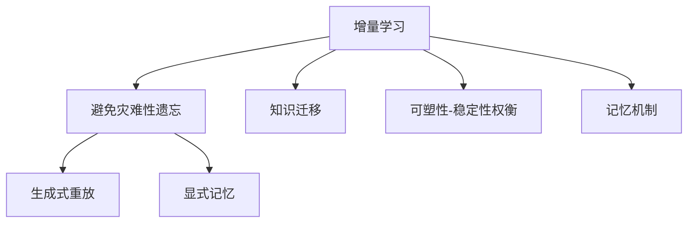

# Incremental Learning原理与代码实例讲解

## 1. 背景介绍

在当今快速发展的数据时代,机器学习模型需要能够持续学习新的数据,而不会忘记之前学习的知识。这种能力被称为"增量学习"(Incremental Learning)。传统的机器学习算法通常假设训练数据是静态的,并且在模型训练完成后就不会再有新的数据加入。然而,在许多实际应用场景中,数据是不断产生和更新的,如何有效地将新数据整合到已有模型中,而不会导致灾难性遗忘(Catastrophic Forgetting)是一个值得关注的问题。

增量学习旨在解决这一问题,使机器学习模型能够在新数据到来时持续学习,同时保留之前学习到的知识。这对于处理动态环境、持续数据流以及受限计算资源等情况尤为重要。增量学习的应用范围广泛,包括计算机视觉、自然语言处理、推荐系统等多个领域。

## 2. 核心概念与联系

增量学习的核心概念包括以下几个方面:

### 2.1 灾难性遗忘

灾难性遗忘指的是在学习新数据的过程中,机器学习模型会严重"遗忘"之前学习到的知识。这种现象的根源在于神经网络在学习新数据时,会调整参数以适应新数据的分布,从而破坏了之前学习到的参数配置。

### 2.2 知识迁移

知识迁移(Knowledge Transfer)是指将之前学习到的知识有效地迁移到新任务或新数据上,从而加速新知识的学习过程。在增量学习中,知识迁移是避免灾难性遗忘的关键。

### 2.3 可塑性-稳定性权衡

增量学习需要在可塑性(Plasticity)和稳定性(Stability)之间寻求平衡。可塑性指模型能够学习新数据的能力,而稳定性则指模型保留之前学习到知识的能力。过于注重可塑性会导致遗忘旧知识,而过于注重稳定性又会阻碍新知识的学习。

### 2.4 记忆机制

为了实现增量学习,需要设计合适的记忆机制来存储和维护之前学习到的知识。常见的记忆机制包括生成式重放(Generative Replay)、显式记忆(Episodic Memory)等。



## 3. 核心算法原理具体操作步骤

增量学习的核心算法原理可以概括为以下几个步骤:

1. **初始化模型**: 使用初始训练数据集训练一个基础模型。

2. **存储旧知识**: 在训练新数据之前,需要存储旧知识的表示,以避免遗忘。常见的方法包括:
   - 生成式重放: 使用生成模型(如GAN或VAE)生成类似于旧数据的合成样本,并在训练新数据时与之一起训练。
   - 显式记忆: 显式地存储一部分旧数据或其特征表示,在训练新数据时与之一起训练。

3. **训练新数据**: 使用新数据以及存储的旧知识表示,对模型进行增量训练。这一步需要平衡新旧知识的重要性,避免过度遗忘或无法学习新知识。

4. **知识蒸馏**: 将新模型的输出与旧模型的输出进行对比,最小化两者之间的差异,从而实现知识迁移。

5. **评估模型**: 在新旧数据上评估模型的性能,检查是否发生了严重的遗忘或无法学习新知识的情况。

6. **迭代训练**: 重复步骤2-5,持续整合新的数据,实现真正的增量学习。

这些步骤并非固定,不同的增量学习算法可能会有所变化和改进。下面将介绍几种经典的增量学习算法。

## 4. 数学模型和公式详细讲解举例说明

### 4.1 生成式重放(Generative Replay)

生成式重放是一种常见的增量学习记忆机制。其核心思想是使用生成模型(如GAN或VAE)生成类似于旧数据的合成样本,并在训练新数据时与之一起训练,以保留旧知识。

假设我们有一个生成模型 $G$,能够从一个潜在空间 $z$ 生成样本 $x$,即 $x = G(z)$。在增量学习时,我们首先使用旧数据 $D_{old}$ 训练生成模型 $G$,使其能够生成类似于旧数据的样本。然后,在训练新数据 $D_{new}$ 时,我们从生成模型中采样一批合成旧样本 $\hat{D}_{old}$,将其与新数据 $D_{new}$ 合并为 $D_{mix} = D_{new} \cup \hat{D}_{old}$,并使用 $D_{mix}$ 训练模型 $f$。

这种方法的目标函数可以表示为:

$$\mathcal{L}(f, D_{mix}) = \mathcal{L}(f, D_{new}) + \lambda \mathcal{L}(f, \hat{D}_{old})$$

其中 $\lambda$ 是一个权重系数,用于平衡新旧数据的重要性。通过同时优化新旧数据的损失函数,模型可以在学习新知识的同时,保留之前学习到的知识。

生成式重放的一个关键挑战是生成模型需要足够强大,才能生成高质量的合成样本。此外,如何选择合适的 $\lambda$ 值也是一个需要探索的问题。

### 4.2 显式记忆(Episodic Memory)

显式记忆是另一种常见的增量学习记忆机制。其核心思想是显式地存储一部分旧数据或其特征表示,并在训练新数据时与之一起训练,以保留旧知识。

假设我们有一个记忆库 $M$,用于存储旧数据或其特征表示。在增量学习时,我们首先从旧数据 $D_{old}$ 中选择一部分样本及其标签存储在 $M$ 中。然后,在训练新数据 $D_{new}$ 时,我们将记忆库 $M$ 中的样本与新数据 $D_{new}$ 合并为 $D_{mix} = D_{new} \cup M$,并使用 $D_{mix}$ 训练模型 $f$。

这种方法的目标函数可以表示为:

$$\mathcal{L}(f, D_{mix}) = \mathcal{L}(f, D_{new}) + \lambda \mathcal{L}(f, M)$$

其中 $\lambda$ 同样是一个权重系数,用于平衡新旧数据的重要性。通过同时优化新旧数据的损失函数,模型可以在学习新知识的同时,保留之前学习到的知识。

显式记忆的一个关键挑战是如何选择哪些旧样本存储在记忆库中,以及如何确定记忆库的大小。另外,如何选择合适的 $\lambda$ 值也是一个需要探索的问题。

### 4.3 知识蒸馏(Knowledge Distillation)

知识蒸馏是一种常见的知识迁移方法,在增量学习中也可以应用。其核心思想是将新模型的输出与旧模型的输出进行对比,最小化两者之间的差异,从而实现知识迁移。

假设我们有一个旧模型 $f_{old}$ 和一个新模型 $f_{new}$,我们希望将 $f_{old}$ 的知识迁移到 $f_{new}$ 中。我们可以定义一个知识蒸馏损失函数:

$$\mathcal{L}_{KD}(f_{new}, f_{old}, x) = \tau^2 \text{KL}(p_{old}(y|x) || p_{new}(y|x))$$

其中 $p_{old}(y|x)$ 和 $p_{new}(y|x)$ 分别表示旧模型和新模型在输入 $x$ 上的预测概率分布,KL 表示 Kullback-Leibler 散度,用于衡量两个概率分布之间的差异。 $\tau$ 是一个温度参数,用于控制软目标的熵。

通过最小化知识蒸馏损失函数,新模型 $f_{new}$ 的输出将尽可能地接近旧模型 $f_{old}$ 的输出,从而实现知识迁移。在增量学习中,我们可以将知识蒸馏损失函数与新数据的损失函数相结合,形成总的目标函数:

$$\mathcal{L}(f_{new}, D_{new}, f_{old}) = \mathcal{L}(f_{new}, D_{new}) + \lambda \mathcal{L}_{KD}(f_{new}, f_{old}, D_{new})$$

其中 $\lambda$ 是一个权重系数,用于平衡新数据的损失和知识蒸馏损失的重要性。

知识蒸馏的一个关键挑战是如何选择合适的温度参数 $\tau$ 和权重系数 $\lambda$,以实现最佳的知识迁移效果。另外,在增量学习场景下,旧模型可能会被不断更新,如何有效地管理和存储旧模型也是一个需要解决的问题。

## 5. 项目实践: 代码实例和详细解释说明

为了更好地理解增量学习的原理和实现,我们将通过一个基于 PyTorch 的代码实例来演示如何应用生成式重放和知识蒸馏进行增量学习。我们将使用 MNIST 手写数字数据集作为示例。

### 5.1 准备工作

首先,我们导入所需的库和定义一些辅助函数:

```python
import torch
import torch.nn as nn
import torch.optim as optim
from torch.utils.data import DataLoader
from torchvision import datasets, transforms

# 定义神经网络模型
class Net(nn.Module):
    def __init__(self):
        super(Net, self).__init__()
        self.conv1 = nn.Conv2d(1, 10, kernel_size=5)
        self.conv2 = nn.Conv2d(10, 20, kernel_size=5)
        self.fc1 = nn.Linear(320, 50)
        self.fc2 = nn.Linear(50, 10)

    def forward(self, x):
        x = nn.functional.relu(nn.functional.max_pool2d(self.conv1(x), 2))
        x = nn.functional.relu(nn.functional.max_pool2d(self.conv2(x), 2))
        x = x.view(-1, 320)
        x = nn.functional.relu(self.fc1(x))
        x = self.fc2(x)
        return x

# 定义数据加载函数
def load_data(batch_size, is_train=True):
    transform = transforms.Compose([
        transforms.ToTensor(),
        transforms.Normalize((0.1307,), (0.3081,))
    ])
    dataset = datasets.MNIST('data', train=is_train, download=True, transform=transform)
    loader = DataLoader(dataset, batch_size=batch_size, shuffle=True)
    return loader
```

我们定义了一个简单的卷积神经网络模型 `Net` 和一个数据加载函数 `load_data`。

### 5.2 生成式重放实现

接下来,我们实现生成式重放的增量学习算法。我们将使用一个简单的多层感知机作为生成模型,并在训练过程中逐步增加新的数据。

```python
import torch.nn.functional as F

# 定义生成模型
class Generator(nn.Module):
    def __init__(self, input_size, hidden_size, output_size):
        super(Generator, self).__init__()
        self.fc1 = nn.Linear(input_size, hidden_size)
        self.fc2 = nn.Linear(hidden_size, output_size)

    def forward(self, x):
        x = F.relu(self.fc1(x))
        x = torch.sigmoid(self.fc2(x))
        return x

# 定义增量学习函数
def incremental_learning(model, generator, train_loaders, batch_size, epochs, lr, replay_ratio):
    device = torch.device("cuda" if torch.cuda.is_available() else "cpu")
    model.to(device)
    generator.to(device)
    optimizer = optim.SGD(model.parameters(), lr=lr)
    criterion = nn.CrossEntropyLoss()

    for loader in train_loaders:
        # 训练生成模型
        generator.train()
        for data, _ in loader:
            data = data.view(-1, 28 * 28).to(device)
            noise = torch.randn(data.size(0), 100).to(device)
            fake_data = generator(noise)
            generator_loss = F.binary_cross