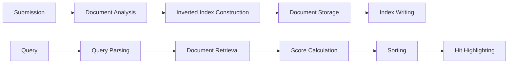

# Lucene: Understanding the Principles and Practical Implementation

## 1. Background Introduction

Lucene is an open-source search engine library written in Java. It was initially developed by Doug Cutting and is now maintained by the Apache Software Foundation. Lucene is widely used for various search applications, including enterprise search, web search, and mobile search. This article aims to provide a comprehensive understanding of Lucene's principles and practical implementation.

### 1.1 Brief History of Lucene

Lucene was first developed by Doug Cutting in 1999 as a search engine for his personal website. In 2000, Cutting released Lucene as an open-source project under the Apache Software License. The project quickly gained popularity, and in 2002, it was moved to the Apache Software Foundation. Since then, Lucene has been continuously developed and improved by a large community of contributors.

### 1.2 Importance of Lucene

Lucene plays a crucial role in the development of search applications. Its powerful search capabilities, scalability, and flexibility make it an ideal choice for various search scenarios. Some of the key features of Lucene include:

- Full-text search: Lucene supports full-text search, allowing users to search for specific words or phrases within documents.
- Indexing: Lucene indexes documents to improve search performance, making it faster to search large datasets.
- Query parsing: Lucene provides a powerful query parser that can handle complex queries, such as Boolean queries, phrase queries, and fuzzy queries.
- Faceting: Lucene supports faceting, which allows users to filter search results based on various criteria, such as date, category, or location.
- Highly customizable: Lucene is highly customizable, allowing developers to tailor its behavior to their specific needs.

## 2. Core Concepts and Connections

To understand Lucene, it is essential to grasp several core concepts and their interconnections.

### 2.1 Indexing

Indexing is the process of creating an index for a dataset. In Lucene, indexing involves analyzing documents, creating an inverted index, and storing the index in a data structure called an `IndexReader`. The inverted index is a data structure that maps each word in the indexed documents to the documents that contain the word. This structure allows Lucene to quickly find documents that contain specific words.

### 2.2 Querying

Querying is the process of searching the index for documents that match a given query. Lucene provides a powerful query parser that can handle various types of queries, such as Boolean queries, phrase queries, and fuzzy queries. The query parser breaks down the query into individual terms and analyzes the index to find documents that contain those terms.

### 2.3 Scoring

Scoring is the process of ranking search results based on their relevance to the query. Lucene uses a scoring algorithm called the TF-IDF (Term Frequency-Inverse Document Frequency) algorithm to calculate the score of each document. The TF-IDF algorithm takes into account the frequency of a term in a document, the frequency of the term in the entire index, and the length of the document.

### 2.4 Hit Highlighting

Hit highlighting is the process of highlighting the matching terms in the search results. Lucene supports hit highlighting, which can help users quickly identify the relevant parts of the search results.

## 3. Core Algorithm Principles and Specific Operational Steps

### 3.1 Indexing Algorithm

The indexing algorithm in Lucene consists of several steps:

1. Document Analysis: The first step is to analyze the documents to be indexed. This involves tokenizing the text, removing stop words, and applying various analyzers to the tokens.
2. Inverted Index Construction: Once the tokens have been analyzed, the inverted index is constructed. This involves creating an entry in the inverted index for each token, with the entry containing a list of documents that contain the token.
3. Document Storage: The analyzed documents are stored in a data structure called a `Document`. Each `Document` contains the original text, the analyzed tokens, and various metadata, such as the document's ID and timestamp.
4. Index Writing: The final step is to write the index to disk. This involves creating an `IndexWriter` object, which writes the `Document` objects and the inverted index to disk.

### 3.2 Querying Algorithm

The querying algorithm in Lucene consists of several steps:

1. Query Parsing: The first step is to parse the query using the query parser. This involves breaking down the query into individual terms and analyzing the index to find documents that contain those terms.
2. Score Calculation: Once the documents that match the query have been found, the scores of the documents are calculated using the TF-IDF algorithm.
3. Sorting: The documents are sorted based on their scores, with the most relevant documents appearing at the top of the results.
4. Hit Highlighting: If hit highlighting is enabled, the matching terms in the search results are highlighted.

## 4. Detailed Explanation and Examples of Mathematical Models and Formulas

### 4.1 TF-IDF Algorithm

The TF-IDF algorithm is a mathematical model used to calculate the relevance of a document to a query. The algorithm takes into account the frequency of a term in a document, the frequency of the term in the entire index, and the length of the document.

The TF-IDF score for a term in a document is calculated as follows:

$$
TF(t,d) = \\frac{f(t,d)}{\\sum\\_{t' \\in d} f(t',d)}
$$

Where $f(t,d)$ is the frequency of term $t$ in document $d$, and the denominator is the total frequency of all terms in document $d$.

The IDF score for a term in the index is calculated as follows:

$$
IDF(t) = \\log \\frac{N}{DF(t)}
$$

Where $N$ is the total number of documents in the index, and $DF(t)$ is the number of documents that contain term $t$.

The TF-IDF score for a document is the product of the TF and IDF scores for each term in the document:

$$
TF-IDF(d,q) = \\sum\\_{t \\in q} TF(t,d) \\times IDF(t)
$$

Where $q$ is the query, and the sum is over all terms in the query.

### 4.2 Mermaid Flowchart for Indexing and Querying Algorithms



## 5. Project Practice: Code Examples and Detailed Explanations

In this section, we will provide code examples and detailed explanations for various aspects of Lucene, such as indexing, querying, and hit highlighting.

### 5.1 Indexing Example

Here is an example of indexing a simple dataset using Lucene:

```java
import org.apache.lucene.analysis.standard.StandardAnalyzer;
import org.apache.lucene.document.Document;
import org.apache.lucene.document.Field;
import org.apache.lucene.index.IndexWriter;
import org.apache.lucene.store.Directory;
import org.apache.lucene.store.RAMDirectory;

public class IndexingExample {
    public static void main(String[] args) throws Exception {
        // Create a RAM directory for the index
        Directory directory = new RAMDirectory();

        // Create an index writer
        IndexWriter writer = new IndexWriter(directory, new StandardAnalyzer(), true, IndexWriter.MaxFieldLength.UNLIMITED);

        // Create a document
        Document document = new Document();
        document.add(new Field(\"title\", \"Example Document\", Field.Store.YES, Field.Index.ANALYZED));
        document.add(new Field(\"content\", \"This is an example document. It contains some text for indexing.\", Field.Store.YES, Field.Index.ANALYZED));

        // Add the document to the index
        writer.addDocument(document);

        // Commit the changes to the index
        writer.commit();

        // Close the index writer
        writer.close();
    }
}
```

### 5.2 Querying Example

Here is an example of querying the index we created in the previous section:

```java
import org.apache.lucene.document.Document;
import org.apache.lucene.index.IndexReader;
import org.apache.lucene.queryparser.classic.QueryParser;
import org.apache.lucene.search.IndexSearcher;
import org.apache.lucene.search.ScoreDoc;
import org.apache.lucene.search.TopDocs;
import org.apache.lucene.store.Directory;
import org.apache.lucene.util.Version;

public class QueryingExample {
    public static void main(String[] args) throws Exception {
        // Load the index from the RAM directory
        Directory directory = new RAMDirectory();
        IndexReader reader = IndexReader.open(directory);
        IndexSearcher searcher = new IndexSearcher(reader);

        // Create a query parser
        QueryParser parser = new QueryParser(\"content\", new StandardAnalyzer(Version.LUCENE_4_10_0));

        // Create a query
        Query query = parser.parse(\"example\");

        // Execute the query and get the top 10 results
        TopDocs topDocs = searcher.search(query, 10);

        // Print the scores and documents of the top 10 results
        for (ScoreDoc scoreDoc : topDocs.scoreDocs) {
            Document document = searcher.doc(scoreDoc.doc);
            System.out.println(\"Score: \" + scoreDoc.score + \", Document ID: \" + scoreDoc.doc + \", Title: \" + document.get(\"title\"));
        }
    }
}
```

## 6. Practical Application Scenarios

Lucene can be used in various practical application scenarios, such as:

- Enterprise search: Lucene can be used to build enterprise search applications that allow users to search for documents, emails, and other content within an organization.
- Web search: Lucene can be used to build web search engines that allow users to search for web pages based on keywords.
- Mobile search: Lucene can be used to build mobile search applications that allow users to search for content on their mobile devices.
- E-commerce search: Lucene can be used to build e-commerce search applications that allow users to search for products based on keywords, categories, and other attributes.

## 7. Tools and Resources Recommendations

Here are some tools and resources that can help you learn and use Lucene:

- Apache Lucene website: <https://lucene.apache.org/>
- Lucene in Action: <https://www.manning.com/books/lucene-in-action-6th-edition>
- Lucene Cookbook: <https://www.packtpub.com/big-data-and-business-intelligence/lucene-cookbook>
- Lucene Wiki: <https://lucene.apache.org/core/docs/latest/index.html>
- Lucene mailing lists: <https://lucene.apache.org/community.html>

## 8. Summary: Future Development Trends and Challenges

Lucene has been a powerful search engine library for over two decades, and it continues to evolve and improve. Some future development trends and challenges for Lucene include:

- Integration with other technologies: Lucene can be integrated with various other technologies, such as Elasticsearch, Solr, and Apache Hadoop. This integration can help developers build more powerful and scalable search applications.
- Machine learning: Machine learning can be used to improve the relevance of search results by learning from user behavior and feedback. This can help developers build more intelligent and personalized search applications.
- Real-time search: Real-time search is becoming increasingly important in today's fast-paced world. Lucene can be used to build real-time search applications that can handle large volumes of data and provide near-instant search results.
- Security: Security is a critical concern for many search applications, especially those that handle sensitive data. Lucene can be used to build secure search applications that protect user data and comply with various regulations.

## 9. Appendix: Frequently Asked Questions and Answers

Here are some frequently asked questions and answers about Lucene:

### 9.1 What is Lucene?

Lucene is an open-source search engine library written in Java. It is widely used for various search applications, including enterprise search, web search, and mobile search.

### 9.2 What are the key features of Lucene?

The key features of Lucene include full-text search, indexing, query parsing, faceting, and high customizability.

### 9.3 How does Lucene work?

Lucene works by indexing documents, analyzing queries, and calculating scores based on the TF-IDF algorithm.

### 9.4 What is the TF-IDF algorithm?

The TF-IDF algorithm is a mathematical model used to calculate the relevance of a document to a query. It takes into account the frequency of a term in a document, the frequency of the term in the entire index, and the length of the document.

### 9.5 How can I learn more about Lucene?

You can learn more about Lucene by visiting the Apache Lucene website, reading books such as Lucene in Action and Lucene Cookbook, and participating in the Lucene mailing lists.

## Author: Zen and the Art of Computer Programming