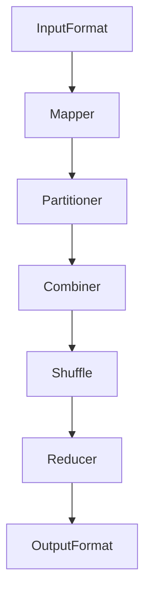

# MapReduce原理与代码实例讲解

## 1. 背景介绍

在大数据时代,数据量的爆炸性增长使得传统的数据处理方式已经无法满足现代计算需求。MapReduce作为一种分布式计算模型,为处理海量数据提供了高效、可扩展的解决方案。它由Google公司于2004年提出,并在2007年对外开源,成为Apache Hadoop项目的核心组件之一。

MapReduce的设计理念源于函数式编程,将复杂的计算任务分解为两个主要阶段:Map(映射)和Reduce(归约)。这种思想简化了大规模数据处理的复杂性,使得开发人员可以专注于编写处理逻辑,而不必关注分布式计算的细节。

## 2. 核心概念与联系

MapReduce包含以下几个核心概念:

1. **InputFormat**: 定义了如何将输入数据拆分为多个splits,以及如何解析splits中的记录。
2. **Mapper**: 对每个输入记录执行用户定义的Map操作,生成中间键值对。
3. **Partitioner**: 根据Mapper输出的键对中间结果进行分区。
4. **Combiner**(可选): 在Mapper端对相同键的值执行本地聚合操作,减少网络传输量。
5. **Shuffle**: 将Mapper的输出按键分组,并分发给对应的Reducer。
6. **Reducer**: 对每个键及其关联的值集合执行用户定义的Reduce操作,生成最终结果。
7. **OutputFormat**: 定义了如何将Reducer的输出结果写入外部存储系统。

这些概念构成了MapReduce的整体数据流程,如下Mermaid流程图所示:



## 3. 核心算法原理具体操作步骤

MapReduce的核心算法原理可以分为以下几个步骤:

### 3.1 输入数据拆分

InputFormat将输入数据拆分为多个splits,每个split由一个单独的Mapper任务处理。常用的InputFormat包括TextInputFormat(文本文件)和SequenceFileInputFormat(Hadoop序列化文件)等。

### 3.2 Map阶段

1. 框架为每个splits启动一个Mapper任务。
2. Mapper读取splits中的记录,对每个记录执行用户定义的Map函数,生成键值对序列。
3. Mapper对生成的键值对执行分区操作,将同一分区的键值对发送到同一个Reducer。
4. (可选)在Mapper端执行Combiner操作,对相同键的值进行本地聚合,减少网络传输量。

### 3.3 Shuffle阶段

1. 将Mapper的输出按键进行分组,并分发给对应的Reducer。
2. 在分发过程中,框架对键值对进行排序,以保证Reducer端可以连续读取相同键的值。

### 3.4 Reduce阶段

1. 框架为每个键启动一个Reducer任务。
2. Reducer读取相同键的所有值,对这些值执行用户定义的Reduce函数,生成最终结果。
3. Reducer将结果写入外部存储系统,如HDFS或HBase等。

## 4. 数学模型和公式详细讲解举例说明

在MapReduce中,常见的数学模型和公式包括:

### 4.1 数据分区

MapReduce使用哈希分区(Hash Partitioning)将Mapper的输出数据分发给不同的Reducer。对于给定的键k,它的分区号可以通过以下公式计算:

$$
partition(k) = (k.hashCode() \& Integer.MAX\_VALUE) \% numReduceTasks
$$

其中,`numReduceTasks`表示Reducer的数量。该公式确保了相同的键会被分发到同一个Reducer,从而实现了键值对的聚合。

### 4.2 数据采样

为了优化MapReduce作业的性能,框架会对输入数据进行采样,估计每个键的数据量。采样过程通常使用以下公式计算:

$$
s = \frac{c}{r} \sum_{i=1}^{r} x_i
$$

其中,`s`表示键的数据量估计值,`c`表示输入数据的总大小,`r`表示采样的记录数,`x_i`表示第i个采样记录的大小。

基于这个估计值,MapReduce可以进行更好的任务调度和资源分配,提高作业的执行效率。

### 4.3 数据倾斜

在MapReduce中,数据倾斜(Data Skew)是一个常见的性能瓶颈。当某些键的值数量远远大于其他键时,就会导致部分Reducer任务负载过重,而其他任务则负载较轻。为了缓解这个问题,MapReduce提供了以下解决方案:

1. **采样和分区**: 通过对输入数据进行采样,估计每个键的数据量,然后使用自定义分区器将数据均匀分配给Reducer。
2. **Combiner**: 在Mapper端执行Combiner操作,减少网络传输量并缓解Reducer端的压力。
3. **特殊键处理**: 对于数据量特别大的键,可以将其单独处理,避免影响其他键的执行。

## 5. 项目实践:代码实例和详细解释说明

为了更好地理解MapReduce的工作原理,我们将通过一个单词计数(Word Count)的实例来演示MapReduce的使用。

### 5.1 定义Mapper

Mapper的作用是将输入的文本行拆分为单词,并为每个单词生成键值对`<word, 1>`。

```java
public static class TokenizerMapper
    extends Mapper<Object, Text, Text, IntWritable>{

    private final static IntWritable one = new IntWritable(1);
    private Text word = new Text();

    public void map(Object key, Text value, Context context
                    ) throws IOException, InterruptedException {
        StringTokenizer itr = new StringTokenizer(value.toString());
        while (itr.hasMoreTokens()) {
            word.set(itr.nextToken());
            context.write(word, one);
        }
    }
}
```

### 5.2 定义Reducer

Reducer的作用是对相同的单词进行计数,将相同单词的值相加,得到最终的`<word, count>`结果。

```java
public static class IntSumReducer
    extends Reducer<Text,IntWritable,Text,IntWritable> {
    private IntWritable result = new IntWritable();

    public void reduce(Text key, Iterable<IntWritable> values,
                       Context context
                       ) throws IOException, InterruptedException {
        int sum = 0;
        for (IntWritable val : values) {
            sum += val.get();
        }
        result.set(sum);
        context.write(key, result);
    }
}
```

### 5.3 运行MapReduce作业

在主程序中,我们需要配置作业,设置输入/输出路径,以及Mapper和Reducer类。

```java
public static void main(String[] args) throws Exception {
    Configuration conf = new Configuration();
    Job job = Job.getInstance(conf, "word count");
    job.setJarByClass(WordCount.class);
    job.setMapperClass(TokenizerMapper.class);
    job.setCombinerClass(IntSumReducer.class);
    job.setReducerClass(IntSumReducer.class);
    job.setOutputKeyClass(Text.class);
    job.setOutputValueClass(IntWritable.class);
    FileInputFormat.addInputPath(job, new Path(args[0]));
    FileOutputFormat.setOutputPath(job, new Path(args[1]));
    System.exit(job.waitForCompletion(true) ? 0 : 1);
}
```

在上面的代码中,我们设置了Mapper、Combiner和Reducer类,以及输入/输出路径。最后,通过`job.waitForCompletion()`方法提交并等待作业完成。

## 6. 实际应用场景

MapReduce广泛应用于各种大数据处理场景,包括但不限于:

1. **日志分析**: 分析网站访问日志、服务器日志等,用于网站优化、安全监控等。
2. **数据处理**: 对结构化/非结构化数据进行清洗、转换、统计等操作。
3. **机器学习**: 作为分布式计算框架,MapReduce可以用于训练大规模机器学习模型。
4. **图计算**: 通过MapReduce实现大规模图数据的处理和分析。
5. **科学计算**: 在天文学、生物信息学等领域,MapReduce被用于处理海量科学数据。

## 7. 工具和资源推荐

在使用MapReduce时,以下工具和资源可以为您提供帮助:

1. **Apache Hadoop**: MapReduce的开源实现,提供了完整的分布式计算框架。
2. **Apache Spark**: 基于内存计算的大数据处理框架,支持MapReduce API。
3. **Apache Hive**: 基于MapReduce的数据仓库工具,支持SQL查询。
4. **Apache Pig**: 提供了类SQL的脚本语言,简化了MapReduce程序的开发。
5. **Cloudera**: 提供商业化的Hadoop发行版和支持服务。
6. **MapReduce设计模式**: 一本介绍MapReduce设计模式的经典书籍。

## 8. 总结:未来发展趋势与挑战

尽管MapReduce已经成为大数据处理的事实标准,但它仍然面临一些挑战和限制:

1. **延迟高**: MapReduce作业通常需要较长的启动时间,不适合低延迟的实时计算场景。
2. **不支持迭代计算**: 对于需要多次迭代的算法(如机器学习),MapReduce的效率较低。
3. **资源利用率低**: MapReduce作业在执行过程中会浪费大量资源,导致资源利用率较低。

为了解决这些问题,业界提出了多种改进方案,例如Apache Spark、Apache Tez等,它们提供了更高效的内存计算模型和更丰富的API,成为MapReduce的有力补充。

未来,随着大数据技术的不断发展,分布式计算框架也将持续演进,以满足日益复杂的计算需求。无论如何,MapReduce作为分布式计算的先驱,其思想和理念将继续影响着大数据领域的发展。

## 9. 附录:常见问题与解答

### 9.1 MapReduce适合处理什么样的数据?

MapReduce最适合处理非结构化或半结构化的大规模数据集,例如网页、日志文件、社交网络数据等。对于结构化的数据(如关系数据库),使用SQL可能更加高效。

### 9.2 如何优化MapReduce作业的性能?

优化MapReduce作业的性能可以从以下几个方面着手:

1. 合理设置作业参数,如Mapper/Reducer数量、内存大小等。
2. 使用Combiner减少网络传输量。
3. 避免不必要的数据复制和序列化操作。
4. 优化数据格式和压缩方式。
5. 利用数据本地性原则,减少数据传输。

### 9.3 MapReduce和Apache Spark有什么区别?

Apache Spark是一种基于内存计算的大数据处理框架,相比MapReduce具有以下优势:

1. 支持更丰富的计算模型,如SQL、机器学习等。
2. 支持迭代计算,对于迭代算法更加高效。
3. 延迟更低,更适合实时计算场景。
4. 资源利用率更高,避免了不必要的数据复制和序列化。

但是,MapReduce在处理非结构化数据方面仍然具有一定优势,两者可以结合使用,发挥各自的长处。

### 9.4 如何处理MapReduce中的数据倾斜问题?

数据倾斜是MapReduce中常见的性能瓶颈,可以通过以下方式缓解:

1. 使用自定义分区器,将数据均匀分配给Reducer。
2. 在Mapper端使用Combiner,减少网络传输量。
3. 对于数据量特别大的键,可以单独处理,避免影响其他键的执行。
4. 调整Reducer的数量,使其与数据分布相匹配。

作者: 禅与计算机程序设计艺术 / Zen and the Art of Computer Programming