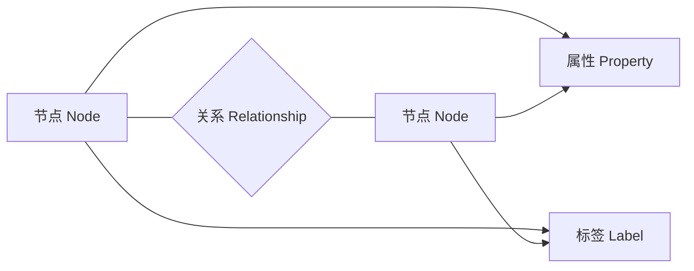

# Neo4j原理与代码实例讲解

## 1.背景介绍
### 1.1 图数据库的兴起
### 1.2 Neo4j的诞生与发展历程
### 1.3 Neo4j在各行业的应用现状

## 2.核心概念与联系
### 2.1 图的基本概念
#### 2.1.1 节点(Node)
#### 2.1.2 关系(Relationship) 
#### 2.1.3 属性(Property)
#### 2.1.4 标签(Label)
### 2.2 Neo4j的数据模型
#### 2.2.1 节点与关系的表示
#### 2.2.2 Schema-free的灵活性
#### 2.2.3 属性图模型
### 2.3 图数据库与关系型数据库的区别
#### 2.3.1 数据模型差异
#### 2.3.2 查询方式差异
#### 2.3.3 适用场景差异



## 3.核心算法原理具体操作步骤
### 3.1 Neo4j的原生图算法
#### 3.1.1 最短路径算法
##### 3.1.1.1 Dijkstra算法
##### 3.1.1.2 A*算法
#### 3.1.2 中心度算法
##### 3.1.2.1 PageRank算法
##### 3.1.2.2 Betweenness Centrality算法
#### 3.1.3 社区发现算法  
##### 3.1.3.1 Louvain算法
##### 3.1.3.2 Label Propagation算法
### 3.2 图算法的并行化处理
#### 3.2.1 并行化框架
#### 3.2.2 并行化Graph Compute

## 4.数学模型和公式详细讲解举例说明
### 4.1 图的数学表示
#### 4.1.1 邻接矩阵
$$
A = 
\begin{bmatrix}
0 & 1 & 0 \\ 
1 & 0 & 1 \\
0 & 1 & 0
\end{bmatrix}
$$
#### 4.1.2 关联矩阵
### 4.2 图算法的数学原理
#### 4.2.1 最短路径的数学模型
设图$G=(V,E)$，起点$s$，终点$t$，边$(u,v)$的权重为$w(u,v)$。定义从$s$到$v$的最短路径长度为$d(v)$。
$$
d(v)=
\begin{cases}
0 & v=s \\ 
\min\limits_{(u,v)\in E}{(d(u)+w(u,v))} & v \ne s
\end{cases}
$$
#### 4.2.2 PageRank的数学模型
设页面$i$的PageRank值为$r_i$，$i$链接到的页面集合为$B_i$，$N_i$是$i$的出链数量，则PageRank值的计算公式为：
$$r_i = \alpha \sum_{j \in B_i} \frac{r_j}{N_j} + \frac{1-\alpha}{N}$$
其中$\alpha$为阻尼系数，$N$为所有页面总数。

## 5.项目实践：代码实例和详细解释说明
### 5.1 使用Cypher查询语言操作Neo4j
#### 5.1.1 创建节点与关系
```cypher
CREATE (n:Person {name: 'John', age: 30})
CREATE (m:Person {name: 'Alice', age: 25})
CREATE (n)-[:KNOWS]->(m)
```
#### 5.1.2 模式匹配查询
```cypher
MATCH (n:Person)-[:KNOWS]->(m:Person) 
WHERE n.age > 20
RETURN n, m
```
### 5.2 使用Java API操作Neo4j
#### 5.2.1 连接Neo4j数据库
```java
Driver driver = GraphDatabase.driver("bolt://localhost:7687", 
        AuthTokens.basic("neo4j", "password"));
```
#### 5.2.2 执行Cypher查询
```java
try (Session session = driver.session()) {
    Result result = session.run("MATCH (n:Person) RETURN n.name as name");
    while (result.hasNext()) {
        Record record = result.next();
        System.out.println(record.get("name").asString());
    }
}
```
### 5.3 基于Neo4j构建推荐系统
#### 5.3.1 数据建模
#### 5.3.2 相似度计算
#### 5.3.3 推荐结果生成

## 6.实际应用场景
### 6.1 社交网络分析
#### 6.1.1 社交关系挖掘
#### 6.1.2 影响力分析
#### 6.1.3 社区发现
### 6.2 金融风控
#### 6.2.1 反欺诈
#### 6.2.2 关联交易检测 
#### 6.2.3 风险传染分析
### 6.3 知识图谱
#### 6.3.1 知识表示与存储
#### 6.3.2 实体关系抽取
#### 6.3.3 问答系统

## 7.工具和资源推荐
### 7.1 Neo4j官方网站与文档
### 7.2 Neo4j Desktop
### 7.3 Neo4j Bloom可视化工具
### 7.4 APOC过程库
### 7.5 Neo4j图算法库

## 8.总结：未来发展趋势与挑战
### 8.1 Neo4j的优势与局限性
### 8.2 图数据库的发展趋势
#### 8.2.1 大规模图数据处理
#### 8.2.2 图神经网络的兴起
#### 8.2.3 云原生图数据库
### 8.3 Neo4j面临的机遇与挑战

## 9.附录：常见问题与解答
### 9.1 如何选择合适的图数据库
### 9.2 如何设计高效的图数据模型
### 9.3 如何优化图查询性能
### 9.4 如何进行图数据的导入与导出
### 9.5 Neo4j的集群部署方案

作者：禅与计算机程序设计艺术 / Zen and the Art of Computer Programming