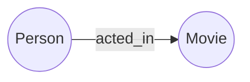

# Neo4j原理与代码实例讲解

## 1. 背景介绍

### 1.1 图数据库的兴起

随着大数据时代的到来,传统的关系型数据库在处理高度关联的复杂数据时显得力不从心。图数据库作为一种新兴的 NoSQL 数据库,以其灵活的数据模型和强大的图算法支持,在社交网络、推荐系统、欺诈检测等领域得到了广泛应用。

### 1.2 Neo4j 简介

Neo4j 是目前最流行的图数据库之一,其开源、高性能、易用性使其成为了图数据库领域的佼佼者。Neo4j 使用属性图模型来表示和存储数据,支持使用 Cypher 查询语言进行图数据的增删改查以及复杂的图算法和图分析。

### 1.3 本文结构安排

本文将从以下几个方面对 Neo4j 进行深入讲解:

- Neo4j 的核心概念与数据模型
- Neo4j 的存储原理与索引机制  
- Cypher 查询语言详解
- Neo4j 图算法库介绍
- 基于 Neo4j 的项目实践
- Neo4j 的实际应用场景
- Neo4j 学习资源推荐
- Neo4j 未来的发展趋势与挑战
- 常见问题与解答

## 2. 核心概念与联系

### 2.1 属性图模型

Neo4j 使用属性图模型来表示数据。属性图由节点(Node)和关系(Relationship)组成,节点和关系都可以包含属性(Property)。



如上图所示,一个人(Person)和一部电影(Movie)可以通过 acted_in 关系相连,表示该人出演了这部电影。

### 2.2 节点(Node)

节点用来表示实体,例如人、地点、事物等。节点可以包含多个属性,用Key-Value对表示。同一类型的节点通常会有一个标签(Label),用于区分不同类型的节点。

例如:

```
(:Person {name: "Tom Hanks", born: 1956})
```

表示一个标签为 Person 的节点,有 name 和 born 两个属性。

### 2.3 关系(Relationship) 

关系用来连接两个节点,表示节点之间的联系。关系是有方向的,包括开始节点(start node)和结束节点(end node)。与节点类似,关系也可以包含属性。

例如:

```
(:Person)-[:ACTED_IN {roles: ["Forrest"]}]->(:Movie {title: "Forrest Gump"})
```

表示一个人出演了阿甘正传这部电影,并且在电影中扮演 Forrest 这个角色。

### 2.4 属性(Property)

属性以 Key-Value 对的形式存在,用来描述节点或关系的特征。Key 是字符串类型,Value 可以是字符串、数字、布尔等类型。

### 2.5 标签(Label)

标签是节点的类型名称,一个节点可以有多个标签,用来对节点进行分组。

### 2.6 路径(Path)

路径由一个或多个节点通过关系连接而成。路径可以表示节点之间的各种复杂关联。

## 3. 核心算法原理具体操作步骤

### 3.1 Neo4j 存储原理

Neo4j 将数据存储在内存和硬盘上。图的结构信息,如节点、关系、属性等元数据,都存储在内存中,保证了访问的高效性。节点和关系的属性值以及一些索引信息存储在硬盘上。

Neo4j 使用 Native Graph Storage(NGS)作为其存储引擎。它是一个定制的存储管理器,针对图数据模型和图操作进行了优化。

### 3.2 节点存储

节点以 store file 的形式存储在硬盘上,文件名为 neostore.nodestore.db。每个节点使用一个 fixed-size record 来存储,其中包含:

- 节点的 ID(node identifier)
- 第一个属性的 ID(指向 property store)
- 第一个关系的 ID(指向 relationship store)
- 节点的所有标签 ID(指向 label store)

### 3.3 关系存储

关系也以 store file 的形式存储,文件名为 neostore.relationshipstore.db。每个关系 record 包含:

- 关系的 ID(relationship identifier) 
- 开始节点的 ID
- 结束节点的 ID
- 关系类型(指向 relationship type store)
- 第一个属性的 ID(指向 property store)

关系 record 使用双向链表来维护节点的关系链表,可以高效地获取节点的所有关系。

### 3.4 属性存储

属性以 key-value 的形式存储在 property store 中,包括 neostore.propertystore.db 和 neostore.propertystore.db.strings 等文件。

- neostore.propertystore.db 存储属性的 key 和 value
- neostore.propertystore.db.strings 存储字符串类型的属性值
- neostore.propertystore.db.arrays 存储数组类型的属性值

不同类型的属性值会被序列化为字节数组存储。

### 3.5 索引

为了加速节点和关系的查询,Neo4j 提供了 Schema Indexes 和 Lookup Indexes 两类索引。

Schema Indexes 会在创建时扫描整个数据库,并自动维护索引。例如:

```
CREATE INDEX ON :Person(name)
```

会为 Person 节点的 name 属性创建索引。

Lookup Indexes 用于唯一约束,确保属性值的唯一性,例如:

```
CREATE CONSTRAINT ON (p:Person) ASSERT p.id IS UNIQUE
```

会为 Person 节点的 id 属性创建唯一约束索引。

## 4. 数学模型和公式详细讲解举例说明

图可以表示为 $G=(V,E)$,其中 $V$ 表示节点的集合,$E$ 表示边的集合。

### 4.1 节点度中心性(Degree Centrality)

节点的度中心性表示节点的重要程度,度数越高的节点越重要。对于无向图,节点 $i$ 的度中心性为:

$$C_D(i) = \frac{d_i}{n-1}$$

其中,$d_i$ 为节点 $i$ 的度数,$n$ 为图中节点数。

对于有向图,节点的出度中心性和入度中心性为:

$$C_{out}(i) = \frac{d_i^{out}}{n-1}$$

$$C_{in}(i) = \frac{d_i^{in}}{n-1}$$

其中,$d_i^{out}$ 和 $d_i^{in}$ 分别为节点 $i$ 的出度数和入度数。

### 4.2 最短路径(Shortest Path)

在图中,两个节点之间的最短路径对应着它们之间的最短距离或代价。常用的最短路径算法有 Dijkstra 算法和 A* 算法。

以 Dijkstra 算法为例,假设起点为 $s$,距离为 $d$,算法步骤如下:

1. 初始化:$d[s]=0$,其他节点 $d[v]=\infty$
2. 找出未访问节点中 $d[v]$ 最小的节点 $u$
3. 标记 $u$ 为已访问
4. 对 $u$ 的每个未访问邻居 $v$,更新 $d[v]=min(d[v], d[u]+w(u,v))$
5. 重复步骤 2-4,直到所有节点都被访问

其中,$w(u,v)$ 表示边 $(u,v)$ 的权重。

### 4.3 PageRank

PageRank 是一种用于评估节点重要性的算法,最初用于评估网页的重要性。节点的 PageRank 值由其邻居节点的 PageRank 值决定,公式为:

$$PR(u) = \frac{1-d}{N} + d \sum_{v \in B_u} \frac{PR(v)}{L(v)}$$

其中,$PR(u)$ 为节点 $u$ 的 PageRank 值,$B_u$ 为指向 $u$ 的节点集合,$L(v)$ 为 $v$ 的出度数,$N$ 为图中节点数,$d$ 为阻尼因子,一般取 0.85。

PageRank 计算可以使用迭代法,初始时所有节点的 PR 值相同,每轮迭代更新节点的 PR 值,直到收敛。  

## 5. 项目实践：代码实例和详细解释说明

下面通过一个电影图谱的例子,演示如何使用 Neo4j 和 Cypher 查询语言进行图数据的建模、查询与分析。

### 5.1 数据建模

首先,我们定义图的 Schema:

```
(:Person {name, born})
(:Movie {title, released, tagline})

(:Person)-[:ACTED_IN {roles}]->(:Movie)
(:Person)-[:DIRECTED]->(:Movie)
(:Person)-[:PRODUCED]->(:Movie)
(:Person)-[:WROTE]->(:Movie)

(:Movie)-[:REVIEWED_BY {rating, summary}]-(:Person)
```

其中,Person 和 Movie 为两类节点,分别表示人和电影。它们通过 ACTED_IN、DIRECTED、PRODUCED、WROTE、REVIEWED_BY 等关系连接,关系上有角色、评分等属性。

### 5.2 数据导入

使用 Cypher 语句插入示例数据:

```cypher
CREATE (tom:Person {name: "Tom Hanks", born: 1956})
CREATE (forrest_gump:Movie {title: "Forrest Gump", released: 1994, tagline: "Life is like a box of chocolates...you never know what you're gonna get."})
CREATE (tom)-[:ACTED_IN {roles: ["Forrest"]}]->(forrest_gump)
```

### 5.3 查询与分析

1. 查询电影的基本信息

```cypher
MATCH (m:Movie)
WHERE m.title = "Forrest Gump"
RETURN m.title, m.released, m.tagline
```

2. 查询电影的演员

```cypher
MATCH (p:Person)-[:ACTED_IN]->(m:Movie)
WHERE m.title = "Forrest Gump"
RETURN p.name, p.born
```

3. 查询电影的导演

```cypher
MATCH (d:Person)-[:DIRECTED]->(m:Movie)
WHERE m.title = "Forrest Gump"  
RETURN d.name
```

4. 查询电影的评分

```cypher
MATCH (m:Movie)<-[r:REVIEWED_BY]-(p:Person)
WHERE m.title = "Forrest Gump"
RETURN p.name, r.rating, r.summary
```

5. 查询演员出演的所有电影

```cypher
MATCH (p:Person)-[:ACTED_IN]->(m:Movie)
WHERE p.name = "Tom Hanks"
RETURN m.title, m.released
```

6. 查询两个演员合作过的电影

```cypher
MATCH (p1:Person)-[:ACTED_IN]->(m:Movie)<-[:ACTED_IN]-(p2:Person)
WHERE p1.name = "Tom Hanks" AND p2.name = "Robin Wright"
RETURN m.title
```

### 5.4 图算法应用

下面使用 Neo4j 的图算法库对图进行分析。

1. 计算节点的度中心性

```cypher
CALL gds.degree.stream({
  nodeProjection: 'Person',
  relationshipProjection: 'ACTED_IN'
})
YIELD nodeId, score
RETURN gds.util.asNode(nodeId).name AS name, score AS degree
ORDER BY degree DESC
```

2. 计算节点的 PageRank

```cypher
CALL gds.pageRank.stream({
  nodeProjection: '*',
  relationshipProjection: '*',
  maxIterations: 20,
  dampingFactor: 0.85
})
YIELD nodeId, score
RETURN gds.util.asNode(nodeId).name AS name, score AS pageRank
ORDER BY pageRank DESC
```

## 6. 实际应用场景

Neo4j 在以下场景中有广泛应用:

### 6.1 社交网络分析

图数据库可以很好地建模社交网络,通过图算法分析用户之间的关系、社区结构、影响力传播等。

### 6.2 推荐系统

利用图数据库存储用户、商品、评分等信息,通过协同过滤、基于内容的推荐等算法,可以实现个性化推荐。

### 6.3 欺诈检测

欺诈行为通常体现在实体之间的异常关联,比如金融诈骗、保险欺诈等。图数据库可以建模实体之间的关系,通过图算法和机器学习检测欺诈行为。

### 6.4 知识图谱

图数据库非常适合存储知识图谱,通过节点表示实体(如人物、地点、事件),关系表示实体之间的联系,可以方便地管理和查询复杂的知识。

### 6.5 网络与 IT 运维

图数据库可以建模 IT 基础设施,如服务器、交换机、应用等组件,通过