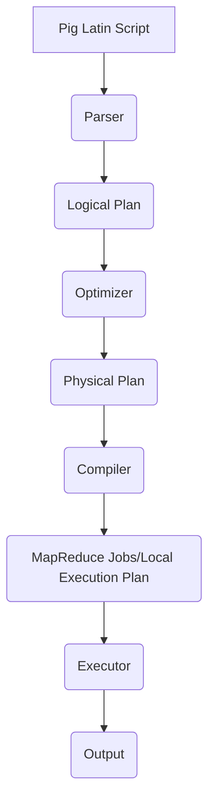
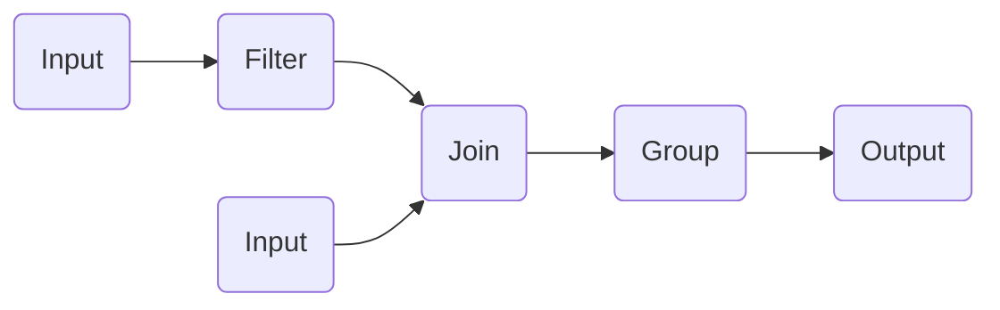

# Pig原理与代码实例讲解

## 1.背景介绍

在当今大数据时代，海量的结构化和非结构化数据的存储和处理成为了一个巨大的挑战。Apache Pig作为一种高级数据流语言,旨在简化大规模数据集的ETL(提取、转换和加载)过程。它提供了一种简洁、高效的方式来分析和处理存储在Hadoop分布式文件系统(HDFS)或其他数据源中的数据。

Pig的出现解决了MapReduce编程的复杂性,使得开发人员无需直接编写复杂的MapReduce程序,而是使用类SQL的Pig Latin脚本语言来描述数据转换过程。Pig会自动将这些脚本转化为一系列优化过的MapReduce作业,从而大大提高了开发效率和代码可维护性。

## 2.核心概念与联系

### 2.1 Pig Latin

Pig Latin是Pig的核心,它是一种用于表达数据转换管道的过程流语言。Pig Latin脚本由一系列操作符组成,每个操作符都接收一个或多个输入数据流,并产生一个或多个输出数据流。

### 2.2 数据模型

Pig采用了一种简单但功能强大的数据模型,称为Bag。Bag可以看作是一个元组(Tuple)的集合,每个元组又由多个字段(Field)组成。这种半结构化的数据模型非常适合表示各种类型的数据,如结构化数据、半结构化数据和非结构化数据。

### 2.3 执行模式

Pig提供了两种执行模式:本地模式和MapReduce模式。本地模式适用于小规模数据集的测试和调试,而MapReduce模式则用于在Hadoop集群上处理大规模数据集。

### 2.4 架构概览

Pig的架构可以分为以下几个主要组件:

1. **Parser**: 解析Pig Latin脚本,构建逻辑计划。
2. **Optimizer**: 对逻辑计划进行优化,生成物理计划。
3. **Compiler**: 将物理计划编译为一系列MapReduce作业或本地执行计划。
4. **Executor**: 执行编译后的MapReduce作业或本地执行计划。



## 3.核心算法原理具体操作步骤

Pig的核心算法原理主要体现在以下几个方面:

### 3.1 逻辑计划构建

Parser组件负责解析Pig Latin脚本,并构建对应的逻辑计划。逻辑计划是一种抽象的数据流表示,描述了数据转换的逻辑步骤。

### 3.2 逻辑计划优化

Optimizer组件对逻辑计划进行一系列优化,包括投影剪枝、过滤器下推、合并连续的转换操作等。这些优化旨在减少数据传输和计算开销,提高执行效率。

### 3.3 物理计划生成

经过优化后的逻辑计划被编译为物理计划。物理计划描述了如何在底层执行引擎(如MapReduce或本地执行器)上执行数据转换操作。

### 3.4 MapReduce作业生成

对于MapReduce执行模式,Compiler组件将物理计划编译为一系列MapReduce作业。每个MapReduce作业都包含一个Map阶段和一个Reduce阶段,用于并行处理数据。

### 3.5 本地执行计划生成

对于本地执行模式,Compiler组件将物理计划编译为一个可在单机上执行的执行计划。

### 3.6 执行和结果输出

Executor组件负责执行编译后的MapReduce作业或本地执行计划,并将结果输出到指定的目标位置(如HDFS或本地文件系统)。

## 4.数学模型和公式详细讲解举例说明

在Pig中,一些常见的数据转换操作可以用数学模型和公式来表示,以便更好地理解其原理。

### 4.1 关系代数

Pig Latin中的许多操作符,如`FILTER`、`JOIN`和`UNION`等,都可以用关系代数来描述。例如,对于两个关系(Bag)R和S,它们的笛卡尔积(CROSS)可以表示为:

$$
R \times S = \{(r, s) | r \in R, s \in S\}
$$

### 4.2 集合操作

Pig Latin中的`DISTINCT`操作可以用集合理论中的去重操作来表示。对于一个Bag B,其去重结果可以表示为:

$$
\text{DISTINCT}(B) = \{t | t \in B, \nexists t' \in B, t' \neq t \land t' = t\}
$$

### 4.3 数据流模型

Pig Latin脚本可以看作是一个数据流模型,其中每个操作符都接收一个或多个输入数据流,并产生一个或多个输出数据流。我们可以用数据流图来表示这种模型,其中节点表示操作符,边表示数据流。



在上图中,`Filter`操作符接收一个输入数据流A,经过过滤后产生一个输出数据流;`Join`操作符接收两个输入数据流B和D,执行连接操作后产生一个输出数据流;`Group`操作符接收`Join`的输出,执行分组操作后产生最终的输出数据流F。

## 5.项目实践:代码实例和详细解释说明

为了更好地理解Pig的使用,我们将通过一个实际项目案例来演示Pig Latin脚本的编写和执行。

### 5.1 项目背景

假设我们有一个电子商务网站的用户访问日志数据,其中包含了用户ID、访问时间、浏览页面URL等信息。我们希望统计每个用户在一段时间内访问的独立页面数量,并按照访问页面数量从高到低进行排序。

### 5.2 数据准备

我们将日志数据存储在HDFS上,文件路径为`/user/logs/access.log`。文件内容示例如下:

```
user1,2023-05-01 10:00:00,/home
user1,2023-05-01 10:05:00,/product/123
user2,2023-05-01 11:00:00,/home
user1,2023-05-01 10:10:00,/product/456
user2,2023-05-01 11:10:00,/cart
...
```

每行记录由用户ID、访问时间和访问URL三个字段组成,字段之间使用逗号分隔。

### 5.3 Pig Latin脚本

```pig
-- 加载数据
logs = LOAD '/user/logs/access.log' USING PigStorage(',') AS (user, time, url);

-- 过滤指定时间范围内的记录
filtered_logs = FILTER logs BY time >= '2023-05-01 00:00:00' AND time <= '2023-05-31 23:59:59';

-- 提取用户ID和URL
user_urls = FOREACH filtered_logs GENERATE user, url;

-- 去重URL
distinct_user_urls = DISTINCT user_urls;

-- 分组计数
url_counts = GROUP distinct_user_urls BY user;
user_visit_counts = FOREACH url_counts GENERATE group AS user, COUNT(distinct_user_urls) AS visit_count;

-- 排序
sorted_user_visit_counts = ORDER user_visit_counts BY visit_count DESC;

-- 存储结果
STORE sorted_user_visit_counts INTO '/user/logs/visit_counts' USING PigStorage(',');
```

### 5.4 脚本解释

1. 使用`LOAD`操作符加载原始日志数据,并指定字段分隔符为逗号。
2. 使用`FILTER`操作符过滤指定时间范围内的记录。
3. 使用`FOREACH...GENERATE`操作符提取用户ID和URL字段。
4. 使用`DISTINCT`操作符去重,得到每个用户访问过的独立URL列表。
5. 使用`GROUP...BY`操作符按照用户ID分组,并使用`COUNT`函数统计每个用户访问的独立URL数量。
6. 使用`ORDER...BY`操作符按照访问URL数量从高到低进行排序。
7. 使用`STORE`操作符将结果存储到HDFS指定路径。

### 5.5 执行和结果

我们可以在Pig运行环境中执行上述脚本,如下所示:

```
$ pig -x mapreduce script.pig
```

执行完成后,结果文件`/user/logs/visit_counts`将包含每个用户访问的独立页面数量,示例如下:

```
user1,4
user2,3
user3,2
...
```

## 6.实际应用场景

Pig广泛应用于各种大数据处理场景,包括但不限于:

1. **网站日志分析**: 分析用户访问行为、统计流量来源等。
2. **电子商务数据处理**: 处理订单数据、推荐系统等。
3. **社交网络数据分析**: 分析用户关系网络、内容传播等。
4. **金融风险分析**: 检测欺诈行为、评估信用风险等。
5. **基因组学数据处理**: 处理基因测序数据、进行生物信息学分析等。

## 7.工具和资源推荐

### 7.1 Pig工具

- **Pig CLI**: Pig的命令行界面,用于执行Pig Latin脚本。
- **Pig Unit**: Pig的单元测试框架,用于测试Pig Latin脚本。
- **Pig HCatalog**: 允许Pig直接访问Apache Hive元数据和数据。
- **Pig HBase**: 允许Pig直接访问Apache HBase数据。

### 7.2 学习资源

- **Apache Pig官方文档**: https://pig.apache.org/docs/latest/
- **Pig编程指南**: https://github.com/apache/pig/tree/trunk/docs
- **Pig Latin基础教程**: https://www.tutorialspoint.com/apache_pig/index.htm
- **Pig实战视频教程**: https://www.youtube.com/playlist?list=PLBBog2r6uMCSmMVTW_QmDLyASBvovyAO3

## 8.总结:未来发展趋势与挑战

### 8.1 未来发展趋势

1. **更好的优化器**: 持续优化Pig的查询优化器,提高执行效率。
2. **更丰富的函数库**: 扩展Pig的内置函数库,支持更多数据处理场景。
3. **更好的可视化工具**: 开发更友好的可视化工具,降低Pig的学习曲线。
4. **更紧密的生态系统集成**: 与Hadoop生态系统中的其他组件(如Hive、Spark等)进一步集成。

### 8.2 挑战

1. **性能瓶颈**: 随着数据量的不断增长,Pig的性能优化将面临更大挑战。
2. **复杂数据类型支持**: 对于复杂的半结构化和非结构化数据,Pig需要提供更好的支持。
3. **流式处理**: 未来可能需要支持流式数据处理,以满足实时数据处理的需求。
4. **可扩展性**: 需要提高Pig的可扩展性,以适应不断变化的数据处理需求。

## 9.附录:常见问题与解答

### 9.1 Pig和Hive有什么区别?

Pig和Hive都是Hadoop生态系统中的数据处理工具,但它们有一些区别:

- **语言**: Pig使用类SQL的Pig Latin语言,而Hive使用类SQL的HiveQL语言。
- **数据模型**: Pig采用半结构化的Bag数据模型,而Hive采用关系数据模型。
- **使用场景**: Pig更适合于ETL和数据探索,而Hive更适合于数据仓库和OLAP查询。
- **执行引擎**: Pig默认使用MapReduce作为执行引擎,而Hive可以使用MapReduce或Tez作为执行引擎。

### 9.2 如何在Pig中处理嵌套数据?

Pig支持处理嵌套数据,可以使用`FLATTEN`操作符将嵌套的Bag或Tuple展平。例如,对于一个包含嵌套Tuple的Bag `nested_data`,我们可以使用以下代码将其展平:

```pig
flattened_data = FOREACH nested_data GENERATE FLATTEN($0);
```

### 9.3 Pig是否支持用户定义函数(UDF)?

是的,Pig支持用户定义函数(UDF)。用户可以使用Java、Python或其他语言编写UDF,并在Pig Latin脚本中调用。UDF可以用于实现自定义的数据转换逻辑。

### 9.4 如何在Pig中进行数据