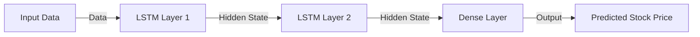

# Python Deep Learning Practices: AI Application in Stock Market Prediction

## 1. Background Introduction

In the rapidly evolving world of finance, the ability to accurately predict stock market trends can provide a significant competitive advantage. Traditional methods of stock market analysis, such as fundamental analysis and technical analysis, have limitations in terms of speed, accuracy, and the sheer volume of data available. This is where artificial intelligence (AI) and deep learning come into play, offering powerful tools for analyzing and predicting stock market trends.

In this article, we will delve into the practical application of deep learning in the stock market, using Python as our primary programming language. We will explore core concepts, algorithms, mathematical models, and practical examples to help you understand and implement AI-powered stock market prediction systems.

## 2. Core Concepts and Connections

### 2.1 Machine Learning and Deep Learning

Machine learning (ML) is a subset of artificial intelligence that enables computers to learn from data, without being explicitly programmed. Deep learning (DL), a subfield of ML, uses artificial neural networks with multiple layers to model complex patterns in data.


### 2.2 Stock Market Data

Stock market data is essential for building AI-powered prediction systems. This data includes historical stock prices, trading volumes, financial reports, news articles, and other relevant information.

### 2.3 Feature Engineering

Feature engineering is the process of creating meaningful features from raw data, which can improve the performance of machine learning models. In the context of stock market prediction, features might include moving averages, relative strength index (RSI), and other technical indicators.

## 3. Core Algorithm Principles and Specific Operational Steps

### 3.1 Recurrent Neural Networks (RNN)

RNNs are a type of neural network that can process sequential data, making them well-suited for stock market prediction. RNNs maintain an internal state that allows them to remember past inputs, enabling them to capture trends and patterns in time series data.

### 3.2 Long Short-Term Memory (LSTM)

LSTM is a special type of RNN that can handle long-term dependencies in data. LSTMs use \"gates\" to control the flow of information through the network, allowing them to learn and remember information for extended periods.

### 3.3 Training and Evaluation

Training an AI model involves feeding it large amounts of labeled data and adjusting the model's parameters to minimize the error between predicted and actual values. Evaluation is the process of testing the model's performance on unseen data to assess its generalization ability.

## 4. Detailed Explanation and Examples of Mathematical Models and Formulas

### 4.1 LSTM Cell State Update

The LSTM cell state update equation is:

$$
\\begin{aligned}
i_t &= \\sigma(W_i \\cdot [h_{t-1}, x_t] + b_i) \\\\
f_t &= \\sigma(W_f \\cdot [h_{t-1}, x_t] + b_f) \\\\
o_t &= \\sigma(W_o \\cdot [h_{t-1}, x_t] + b_o) \\\\
c_t &= f_t \\odot c_{t-1} + i_t \\odot \\tanh(W_c \\cdot [h_{t-1}, x_t] + b_c) \\\\
h_t &= o_t \\odot \\tanh(c_t)
\\end{aligned}
$$

where $i_t$, $f_t$, $o_t$ are input, forget, and output gates, respectively; $c_t$ is the cell state; $h_t$ is the hidden state; $\\sigma$ is the sigmoid function; $\\odot$ denotes element-wise multiplication; $W$ and $b$ are the weight matrices and bias vectors, respectively.

### 4.2 LSTM for Stock Market Prediction

In the context of stock market prediction, an LSTM network might be structured as follows:



## 5. Project Practice: Code Examples and Detailed Explanations

In this section, we will provide a practical example of building an LSTM-based stock market prediction model using Python and the Keras library.

### 5.1 Data Preparation

First, we need to gather historical stock price data and preprocess it for use in our model.

```python
import pandas as pd
import numpy as np

# Load historical stock price data
data = pd.read_csv('stock_data.csv')

# Preprocess data
scaled_data = (data['Close Price'] - data['Close Price'].min()) / (data['Close Price'].max() - data['Close Price'].min())

# Split data into training and testing sets
train_data = scaled_data[:int(len(scaled_data) * 0.8)]
test_data = scaled_data[int(len(scaled_data) * 0.8):]
```

### 5.2 Model Building

Next, we will define and train our LSTM model.

```python
from keras.models import Sequential
from keras.layers import LSTM, Dense

# Define model
model = Sequential()
model.add(LSTM(50, activation='tanh', input_shape=(None, 1)))
model.add(Dense(1))
model.compile(loss='mean_squared_error', optimizer='adam')

# Train model
model.fit(train_data.values, epochs=100, batch_size=32)
```

### 5.3 Model Evaluation

Finally, we will evaluate the performance of our model on the test data.

```python
# Make predictions
predictions = model.predict(test_data.values)

# Calculate root mean squared error (RMSE)
rmse = np.sqrt(np.mean((predictions - test_data['Close Price']) ** 2))
print('RMSE:', rmse)
```

## 6. Practical Application Scenarios

In addition to stock price prediction, AI and deep learning can be applied to various other stock market-related tasks, such as:

- Portfolio optimization
- Risk management
- Algorithmic trading
- News sentiment analysis

## 7. Tools and Resources Recommendations

- Keras: A popular deep learning library in Python.
- TensorFlow: An open-source machine learning framework that powers Keras.
- Pandas: A powerful data manipulation library in Python.
- NumPy: A library for numerical computing in Python.
- Scikit-learn: A machine learning library in Python.
- Yahoo Finance API: A free API for accessing stock market data.

## 8. Summary: Future Development Trends and Challenges

The application of AI and deep learning in the stock market is a rapidly evolving field. Some future development trends include:

- Integration of AI with traditional stock market analysis methods
- Development of more advanced deep learning architectures, such as transformers and generative adversarial networks (GANs)
- Improved handling of high-dimensional and time-series data
- Increased use of explainable AI (XAI) to help investors understand the reasoning behind AI-powered predictions

However, there are also challenges to overcome, such as:

- The need for large amounts of high-quality labeled data
- The risk of overfitting and the need for effective regularization techniques
- The difficulty in interpreting and trusting AI-powered predictions

## 9. Appendix: Frequently Asked Questions and Answers

**Q: What is the difference between machine learning and deep learning?**

A: Machine learning is a subset of artificial intelligence that enables computers to learn from data, without being explicitly programmed. Deep learning is a subfield of machine learning that uses artificial neural networks with multiple layers to model complex patterns in data.

**Q: How can I obtain historical stock price data?**

A: There are various sources for historical stock price data, such as Yahoo Finance API, Google Finance API, and Quandl. You can also download historical data from financial websites or use data provided by financial institutions.

**Q: What is feature engineering, and why is it important?**

A: Feature engineering is the process of creating meaningful features from raw data, which can improve the performance of machine learning models. In the context of stock market prediction, features might include moving averages, relative strength index (RSI), and other technical indicators. Feature engineering is important because it allows us to extract relevant information from the data and present it in a format that is easier for the model to learn from.

**Q: What is the role of the sigmoid function in deep learning?**

A: The sigmoid function is a common activation function in deep learning, used to introduce non-linearity into the model. It maps any real-valued input to a value between 0 and 1, making it useful for binary classification problems and for creating gates in recurrent neural networks.

**Q: What is the difference between an LSTM and a GRU (Gated Recurrent Unit)?**

A: Both LSTM and GRU are types of recurrent neural networks that can handle sequential data. The main difference between them is in the way they handle the cell state and the hidden state. LSTMs use \"gates\" to control the flow of information through the network, allowing them to learn and remember information for extended periods. GRUs, on the other hand, use a simpler update mechanism that combines the input, hidden, and cell states into a single update equation.

**Q: What is the role of regularization in deep learning?**

A: Regularization is a technique used to prevent overfitting in deep learning models. Overfitting occurs when a model learns the training data too well, to the point where it performs poorly on unseen data. Regularization techniques, such as L1 and L2 regularization, add a penalty term to the loss function, encouraging the model to have smaller weights and reducing the complexity of the model.

**Q: What is the difference between supervised and unsupervised learning?**

A: Supervised learning is a type of machine learning where the model is trained on labeled data, with the correct output provided for each input. Unsupervised learning, on the other hand, is a type of machine learning where the model is trained on unlabeled data, with the goal of finding patterns or structure in the data.

**Q: What is the difference between reinforcement learning and supervised learning?**

A: Reinforcement learning is a type of machine learning where an agent learns to make decisions by interacting with an environment and receiving rewards or penalties for its actions. Supervised learning, as mentioned earlier, is a type of machine learning where the model is trained on labeled data. The main difference between them is in the way the model is trained and the type of problem they are designed to solve.

**Q: What is the difference between a convolutional neural network (CNN) and a recurrent neural network (RNN)?**

A: A CNN is a type of neural network that is designed to process grid-like data, such as images. It uses convolutional layers to extract features from the data and pooling layers to reduce the dimensionality of the data. An RNN, on the other hand, is a type of neural network that is designed to process sequential data, such as time series data. It uses recurrent connections to maintain an internal state that allows it to remember past inputs and capture trends and patterns in the data.

**Q: What is the difference between a feedforward neural network and a recurrent neural network?**

A: A feedforward neural network is a type of neural network where the information flows in one direction, from the input layer through the hidden layers to the output layer. There are no loops or cycles in the network. A recurrent neural network, on the other hand, has loops or cycles in the network, allowing it to maintain an internal state that can remember past inputs.

**Q: What is the difference between a fully connected neural network and a convolutional neural network?**

A: A fully connected neural network (FCNN) is a type of neural network where every neuron in one layer is connected to every neuron in the next layer. In contrast, a convolutional neural network (CNN) uses convolutional layers to extract features from the data, with each neuron in a convolutional layer only connected to a small region of the input data.

**Q: What is the difference between a dense layer and a convolutional layer in a neural network?**

A: A dense layer (also known as a fully connected layer) is a layer in a neural network where every neuron in one layer is connected to every neuron in the next layer. In contrast, a convolutional layer is a layer in a neural network that uses convolutions to extract features from the data, with each neuron only connected to a small region of the input data.

**Q: What is the difference between a pooling layer and a fully connected layer in a neural network?**

A: A pooling layer is a layer in a neural network that reduces the dimensionality of the data by taking the maximum, average, or sum of the activations in a small region of the input data. A fully connected layer (also known as a dense layer) is a layer in a neural network where every neuron in one layer is connected to every neuron in the next layer.

**Q: What is the difference between a softmax function and a sigmoid function?**

A: The softmax function is a function that maps a vector of real numbers to a probability distribution, where the sum of the probabilities is 1. The sigmoid function, on the other hand, is a function that maps any real-valued input to a value between 0 and 1. The main difference between them is that the softmax function is used for multi-class classification problems, while the sigmoid function is used for binary classification problems and for creating gates in recurrent neural networks.

**Q: What is the difference between a batch normalization layer and a dropout layer in a neural network?**

A: A batch normalization layer is a layer in a neural network that normalizes the activations of each layer across the batch, helping to stabilize the training process and reduce the internal covariate shift. A dropout layer, on the other hand, randomly sets a fraction of the neurons in a layer to 0 during training, helping to prevent overfitting by reducing the co-adaptation of neurons.

**Q: What is the difference between a validation set and a test set in machine learning?**

A: A validation set is a subset of the training data that is used to tune the hyperparameters of the model during training. A test set, on the other hand, is a separate subset of the data that is used to evaluate the performance of the final model on unseen data.

**Q: What is the difference between a learning rate and a batch size in machine learning?**

A: The learning rate is a hyperparameter that determines the step size at which the model updates its weights during training. A batch size is the number of samples in each training iteration.

**Q: What is the difference between a mean squared error loss function and a categorical cross-entropy loss function?**

A: The mean squared error (MSE) loss function is a regression loss function that measures the average squared difference between the predicted and actual values. The categorical cross-entropy loss function, on the other hand, is a classification loss function that measures the difference between the predicted probabilities and the true labels.

**Q: What is the difference between a stochastic gradient descent optimizer and an Adam optimizer?**

A: Stochastic gradient descent (SGD) is an optimization algorithm that updates the model's weights based on the gradient of the loss function with respect to the weights, using a single training example at a time. Adam (Adaptive Moment Estimation) is an optimization algorithm that updates the model's weights based on the gradient of the loss function with respect to the weights, using a mini-batch of training examples at a time. Adam also adapts the learning rate for each parameter based on its historical momentum and weight decay.

**Q: What is the difference between a convolutional layer and a max pooling layer in a convolutional neural network?**

A: A convolutional layer is a layer in a convolutional neural network that uses convolutions to extract features from the data, with each neuron only connected to a small region of the input data. A max pooling layer is a layer in a convolutional neural network that reduces the dimensionality of the data by taking the maximum value within a small region of the input data.

**Q: What is the difference between a fully connected layer and a dropout layer in a neural network?**

A: A fully connected layer (also known as a dense layer) is a layer in a neural network where every neuron in one layer is connected to every neuron in the next layer. A dropout layer, on the other hand, randomly sets a fraction of the neurons in a layer to 0 during training, helping to prevent overfitting by reducing the co-adaptation of neurons.

**Q: What is the difference between a batch normalization layer and a BN dropout layer in a neural network?**

A: A batch normalization layer is a layer in a neural network that normalizes the activations of each layer across the batch, helping to stabilize the training process and reduce the internal covariate shift. A BN dropout layer is a combination of a batch normalization layer and a dropout layer, providing both normalization and regularization.

**Q: What is the difference between a recurrent neural network and a long short-term memory network?**

A: A recurrent neural network (RNN) is a type of neural network that can process sequential data, such as time series data. A long short-term memory (LSTM) network is a special type of RNN that can handle long-term dependencies in data by using \"gates\" to control the flow of information through the network.

**Q: What is the difference between a convolutional neural network and a recurrent neural network?**

A: A convolutional neural network (CNN) is a type of neural network that is designed to process grid-like data, such as images. It uses convolutional layers to extract features from the data and pooling layers to reduce the dimensionality of the data. A recurrent neural network (RNN) is a type of neural network that can process sequential data, such as time series data. It uses recurrent connections to maintain an internal state that allows it to remember past inputs and capture trends and patterns in the data.

**Q: What is the difference between a feedforward neural network and a recurrent neural network?**

A: A feedforward neural network is a type of neural network where the information flows in one direction, from the input layer through the hidden layers to the output layer. There are no loops or cycles in the network. A recurrent neural network, on the other hand, has loops or cycles in the network, allowing it to maintain an internal state that can remember past inputs.

**Q: What is the difference between a dense layer and a convolutional layer in a neural network?**

A: A dense layer (also known as a fully connected layer) is a layer in a neural network where every neuron in one layer is connected to every neuron in the next layer. In contrast, a convolutional layer is a layer in a neural network that uses convolutions to extract features from the data, with each neuron only connected to a small region of the input data.

**Q: What is the difference between a pooling layer and a fully connected layer in a neural network?**

A: A pooling layer is a layer in a neural network that reduces the dimensionality of the data by taking the maximum, average, or sum of the activations in a small region of the input data. A fully connected layer (also known as a dense layer) is a layer in a neural network where every neuron in one layer is connected to every neuron in the next layer.

**Q: What is the difference between a softmax function and a sigmoid function?**

A: The softmax function is a function that maps a vector of real numbers to a probability distribution, where the sum of the probabilities is 1. The sigmoid function, on the other hand, is a function that maps any real-valued input to a value between 0 and 1. The main difference between them is that the softmax function is used for multi-class classification problems, while the sigmoid function is used for binary classification problems and for creating gates in recurrent neural networks.

**Q: What is the difference between a batch normalization layer and a dropout layer in a neural network?**

A: A batch normalization layer is a layer in a neural network that normalizes the activations of each layer across the batch, helping to stabilize the training process and reduce the internal covariate shift. A dropout layer, on the other hand, randomly sets a fraction of the neurons in a layer to 0 during training, helping to prevent overfitting by reducing the co-adaptation of neurons.

**Q: What is the difference between a validation set and a test set in machine learning?**

A: A validation set is a subset of the training data that is used to tune the hyperparameters of the model during training. A test set, on the other hand, is a separate subset of the data that is used to evaluate the performance of the final model on unseen data.

**Q: What is the difference between a learning rate and a batch size in machine learning?**

A: The learning rate is a hyperparameter that determines the step size at which the model updates its weights during training. A batch size is the number of samples in each training iteration.

**Q: What is the difference between a mean squared error loss function and a categorical cross-entropy loss function?**

A: The mean squared error (MSE) loss function is a regression loss function that measures the average squared difference between the predicted and actual values. The categorical cross-entropy loss function, on the other hand, is a classification loss function that measures the difference between the predicted probabilities and the true labels.

**Q: What is the difference between a stochastic gradient descent optimizer and an Adam optimizer?**

A: Stochastic gradient descent (SGD) is an optimization algorithm that updates the model's weights based on the gradient of the loss function with respect to the weights, using a single training example at a time. Adam (Adaptive Moment Estimation) is an optimization algorithm that updates the model's weights based on the gradient of the loss function with respect to the weights, using a mini-batch of training examples at a time. Adam also adapts the learning rate for each parameter based on its historical momentum and weight decay.

**Q: What is the difference between a convolutional layer and a max pooling layer in a convolutional neural network?**

A: A convolutional layer is a layer in a convolutional neural network that uses convolutions to extract features from the data, with each neuron only connected to a small region of the input data. A max pooling layer is a layer in a convolutional neural network that reduces the dimensionality of the data by taking the maximum value within a small region of the input data.

**Q: What is the difference between a fully connected layer and a dropout layer in a neural network?**

A: A fully connected layer (also known as a dense layer) is a layer in a neural network where every neuron in one layer is connected to every neuron in the next layer. A dropout layer, on the other hand, randomly sets a fraction of the neurons in a layer to 0 during training, helping to prevent overfitting by reducing the co-adaptation of neurons.

**Q: What is the difference between a batch normalization layer and a BN dropout layer in a neural network?**

A: A batch normalization layer is a layer in a neural network that normalizes the activations of each layer across the batch, helping to stabilize the training process and reduce the internal covariate shift. A BN dropout layer is a combination of a batch normalization layer and a dropout layer, providing both normalization and regularization.

**Q: What is the difference between a recurrent neural network and a long short-term memory network?**

A: A recurrent neural network (RNN) is a type of neural network that can process sequential data, such as time series data. A long short-term memory (LSTM) network is a special type of RNN that can handle long-term dependencies in data by using \"gates\" to control the flow of information through the network.

**Q: What is the difference between a convolutional neural network and a recurrent neural network?**

A: A convolutional neural network (CNN) is a type of neural network that is designed to process grid-like data, such as images. It uses convolutional layers to extract features from the data and pooling layers to reduce the dimensionality of the data. A recurrent neural network (RNN) is a type of neural network that can process sequential data, such as time series data. It uses recurrent connections to maintain an internal state that allows it to remember past inputs and capture trends and patterns in the data.

**Q: What is the difference between a feedforward neural network and a recurrent neural network?**

A: A feedforward neural network is a type of neural network where the information flows in one direction, from the input layer through the hidden layers to the output layer. There are no loops or cycles in the network. A recurrent neural network, on the other hand, has loops or cycles in the network, allowing it to maintain an internal state that can remember past inputs.

**Q: What is the difference between a dense layer and a convolutional layer in a neural network?**

A: A dense layer (also known as a fully connected layer) is a layer in a neural network where every neuron in one layer is connected to every neuron in the next layer. In contrast, a convolutional layer is a layer in a neural network that uses convolutions to extract features from the data, with each neuron only connected to a small region of the input data.

**Q: What is the difference between a pooling layer and a fully connected layer in a neural network?**

A: A pooling layer is a layer in a neural network that reduces the dimensionality of the data by taking the maximum, average, or sum of the activations in a small region of the input data. A fully connected layer (also known as a dense layer) is a layer in a neural network where every neuron in one layer is connected to every neuron in the next layer.

**Q: What is the difference between a softmax function and a sigmoid function?**

A: The softmax function is a function that maps a vector of real numbers to a probability distribution, where the sum of the probabilities is 1. The sigmoid function, on the other hand, is a function that maps any real-valued input to a value between 0 and 1. The main difference between them is that the softmax function is used for multi-class classification problems, while the sigmoid function is used for binary classification problems and for creating gates in recurrent neural networks.

**Q: What is the difference between a batch normalization layer and a dropout layer in a neural network?**

A: A batch normalization layer is a layer in a neural network that normalizes the activations of each layer across the batch, helping to stabilize the training process and reduce the internal covariate shift. A dropout layer, on the other hand, randomly sets a fraction of the neurons in a layer to 0 during training, helping to prevent overfitting by reducing the co-adaptation of neurons.

**Q: What is the difference between a validation set and a test set in machine learning?**

A: A validation set is a subset of the training data that is used to tune the hyperparameters of the model during training. A test set, on the other hand, is a separate subset of the data that is used to evaluate the performance of the final model on unseen data.

**Q: What is the difference between a learning rate and a batch size in machine learning?**

A: The learning rate is a hyperparameter that determines the step size at which the model updates its weights during training. A batch size is the number of samples in each training iteration.

**Q: What is the difference between a mean squared error loss function and a categorical cross-entropy loss function?**

A: The mean squared error (MSE) loss function is a regression loss function that measures the average squared difference between the predicted and actual values. The categorical cross-entropy loss function, on the other hand, is a classification loss function that measures the difference between the predicted probabilities and the true labels.

**Q: What is the difference between a stochastic gradient