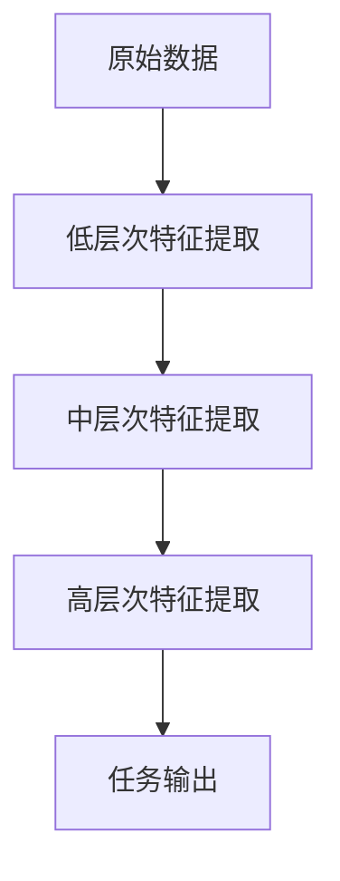
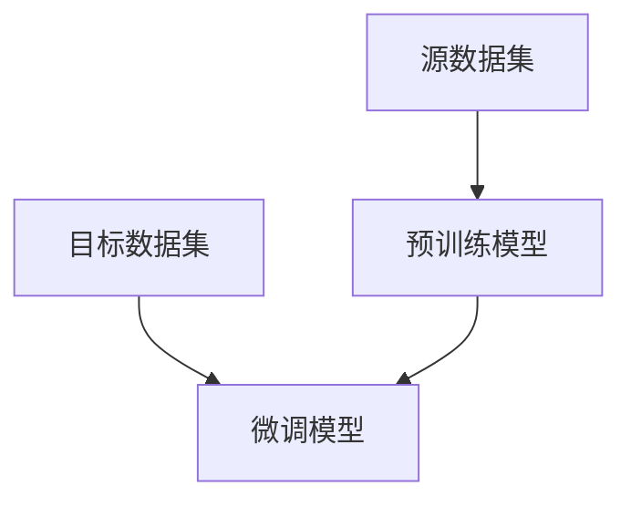

# Python深度学习实践：运用迁移学习提升模型效能

## 1.背景介绍

### 1.1 深度学习的兴起

近年来,深度学习在计算机视觉、自然语言处理、语音识别等领域取得了令人瞩目的成就,成为人工智能领域最炙手可热的技术之一。传统的机器学习算法依赖于人工设计特征,而深度学习则可以自动从原始数据中学习特征表示,极大地降低了特征工程的工作量。

### 1.2 数据集规模与模型效能的关系

然而,训练一个有效的深度神经网络通常需要大量的标注数据,而在很多实际应用场景中,获取大规模标注数据集的成本是非常高昂的。因此,如何在有限的数据集上训练出有效的深度学习模型,成为了一个亟待解决的问题。

### 1.3 迁移学习的概念

迁移学习(Transfer Learning)为解决上述问题提供了一种有效的方法。迁移学习的核心思想是利用在源领域学习到的知识,来帮助在目标领域的任务学习。具体来说,就是首先在一个大规模的数据集(如ImageNet)上预训练一个深度神经网络模型,然后将这个模型的部分参数或特征表示迁移到目标任务上,进行微调(fine-tuning),从而获得一个在目标任务上表现良好的模型。

## 2.核心概念与联系

### 2.1 特征表示与迁移

深度神经网络的关键在于学习数据的分层特征表示。低层次的特征,如边缘和纹理,对于不同的视觉任务是通用的;而高层次的特征则更加специ化,与具体的任务相关。迁移学习的思想就是利用在大规模数据集上学习到的通用低层次特征表示,并在目标任务上对高层特征进行微调,从而获得针对目标任务的特征表示。



### 2.2 预训练模型与微调

迁移学习通常包括两个阶段:预训练(Pre-training)和微调(Fine-tuning)。

在预训练阶段,我们在一个大规模的源数据集(如ImageNet)上训练一个深度神经网络模型,获得模型的参数初始化值。

在微调阶段,我们将预训练模型的部分参数或特征表示迁移到目标任务模型中,并在目标数据集上进行进一步的训练,使模型适应目标任务的分布。通常情况下,我们会冻结预训练模型的低层次特征提取层,只对高层次特征提取层和任务输出层进行微调。



### 2.3 特征提取与微调策略

在迁移学习中,我们可以采用不同的特征提取和微调策略,包括:

1. **特征提取**: 直接利用预训练模型提取特征,在目标任务上训练一个新的分类器。
2. **微调全连接层**: 冻结预训练模型的卷积层,只微调全连接层的参数。
3. **微调部分层**: 根据任务的相似性,选择性地微调预训练模型的部分层。
4. **微调所有层**: 对预训练模型的所有层进行微调。

不同的策略在效果和计算代价之间需要权衡,应根据具体任务和资源情况进行选择。

## 3.核心算法原理具体操作步骤 

### 3.1 预训练模型选择

首先,我们需要选择一个合适的预训练模型。常用的预训练模型包括在ImageNet数据集上训练的VGG、ResNet、Inception等模型。这些模型在计算机视觉领域的各种任务上都表现出色,是迁移学习的良好基础。

### 3.2 数据准备

接下来,我们需要准备目标任务的数据集。数据集应当划分为训练集、验证集和测试集。对于图像分类任务,需要对图像进行适当的预处理,如调整大小、归一化等。

### 3.3 模型初始化

我们将预训练模型加载到目标任务的模型中,作为参数的初始化值。根据选择的特征提取和微调策略,我们可能需要冻结部分层的参数,或者替换最后的分类层。

### 3.4 模型训练

在训练阶段,我们将目标任务的训练数据输入到模型中,计算损失函数,并通过反向传播算法更新模型参数。我们可以使用不同的优化器、学习率策略等超参数,来加速模型的收敛。

### 3.5 模型评估

在每个训练周期结束后,我们会在验证集上评估模型的性能,如准确率、精确率、召回率等指标。如果模型在验证集上的性能没有提升,我们可能需要调整超参数或采用其他的特征提取和微调策略。

### 3.6 模型微调

根据模型在验证集上的表现,我们可以对模型进行进一步的微调。例如,我们可以解冻更多的层,并使用较小的学习率继续训练模型。另外,我们也可以尝试不同的正则化技术,如dropout、L1/L2正则化等,来防止模型过拟合。

### 3.7 模型部署

当模型在验证集上达到满意的性能后,我们可以在测试集上进行最终的评估,并将模型部署到实际的应用系统中。

## 4.数学模型和公式详细讲解举例说明

### 4.1 卷积神经网络

卷积神经网络(Convolutional Neural Network, CNN)是深度学习中广泛应用于计算机视觉任务的一种网络结构。CNN由多个卷积层、池化层和全连接层组成,能够自动从原始图像数据中学习分层特征表示。

卷积层的核心操作是卷积运算,其数学表达式如下:

$$
S(i, j) = (I * K)(i, j) = \sum_{m}\sum_{n}I(i+m, j+n)K(m, n)
$$

其中,$$I$$表示输入特征图,$$K$$表示卷积核,$$S$$表示输出特征图。卷积运算能够提取输入特征图的局部特征,如边缘、纹理等。

池化层则用于降低特征图的分辨率,减少参数数量和计算量。常用的池化操作包括最大池化和平均池化。

全连接层将前面层的特征图展平,并与权重矩阵相乘,得到最终的分类或回归输出。

### 4.2 损失函数

在训练深度神经网络时,我们需要定义一个损失函数(Loss Function)来衡量模型预测与真实标签之间的差异。常用的损失函数包括交叉熵损失函数、均方误差损失函数等。

对于分类任务,交叉熵损失函数的数学表达式如下:

$$
L = -\frac{1}{N}\sum_{i=1}^{N}\sum_{j=1}^{M}y_{ij}\log(p_{ij})
$$

其中,$$N$$表示样本数量,$$M$$表示类别数量,$$y_{ij}$$表示样本$$i$$属于类别$$j$$的真实标签(0或1),$$p_{ij}$$表示模型预测样本$$i$$属于类别$$j$$的概率。

### 4.3 优化算法

为了最小化损失函数,我们需要使用优化算法来更新神经网络的参数。常用的优化算法包括随机梯度下降(Stochastic Gradient Descent, SGD)、动量优化(Momentum)、RMSProp、Adam等。

以SGD为例,参数更新规则如下:

$$
\theta_{t+1} = \theta_t - \eta\nabla_\theta L(\theta_t)
$$

其中,$$\theta_t$$表示第$$t$$次迭代时的参数,$$\eta$$表示学习率,$$\nabla_\theta L(\theta_t)$$表示损失函数关于参数$$\theta_t$$的梯度。

## 5.项目实践:代码实例和详细解释说明

接下来,我们将通过一个实际的图像分类项目,演示如何使用PyTorch框架实现迁移学习。我们将在CIFAR-10数据集上训练一个图像分类模型,并使用预训练的ResNet-18模型进行迁移学习。

### 5.1 导入必要的库

```python
import torch
import torchvision
import torchvision.transforms as transforms
import torch.nn as nn
import torch.optim as optim
```

### 5.2 准备数据集

```python
# 定义数据预处理
transform = transforms.Compose([
    transforms.Resize(224),
    transforms.ToTensor(),
    transforms.Normalize((0.5, 0.5, 0.5), (0.5, 0.5, 0.5))
])

# 加载CIFAR-10数据集
trainset = torchvision.datasets.CIFAR10(root='./data', train=True, download=True, transform=transform)
trainloader = torch.utils.data.DataLoader(trainset, batch_size=32, shuffle=True)

testset = torchvision.datasets.CIFAR10(root='./data', train=False, download=True, transform=transform)
testloader = torch.utils.data.DataLoader(testset, batch_size=32, shuffle=False)
```

### 5.3 定义模型

```python
# 加载预训练的ResNet-18模型
model = torchvision.models.resnet18(pretrained=True)

# 冻结卷积层参数
for param in model.parameters():
    param.requires_grad = False

# 替换最后的全连接层
num_features = model.fc.in_features
model.fc = nn.Linear(num_features, 10)
```

### 5.4 定义损失函数和优化器

```python
criterion = nn.CrossEntropyLoss()
optimizer = optim.SGD(model.fc.parameters(), lr=0.001, momentum=0.9)
```

### 5.5 训练模型

```python
num_epochs = 10

for epoch in range(num_epochs):
    running_loss = 0.0
    for inputs, labels in trainloader:
        # 前向传播
        outputs = model(inputs)
        loss = criterion(outputs, labels)
        
        # 反向传播
        optimizer.zero_grad()
        loss.backward()
        optimizer.step()
        
        running_loss += loss.item()
    
    # 打印训练loss
    print(f'Epoch {epoch+1}, Loss: {running_loss/len(trainloader):.4f}')
```

### 5.6 评估模型

```python
correct = 0
total = 0
with torch.no_grad():
    for inputs, labels in testloader:
        outputs = model(inputs)
        _, predicted = torch.max(outputs.data, 1)
        total += labels.size(0)
        correct += (predicted == labels).sum().item()

print(f'Accuracy on test set: {100 * correct / total:.2f}%')
```

通过上述代码示例,我们可以看到如何使用PyTorch框架实现迁移学习。首先,我们加载预训练的ResNet-18模型,并冻结卷积层的参数。然后,我们替换最后的全连接层,使其输出维度与目标任务的类别数量相匹配。在训练过程中,我们只更新全连接层的参数,利用预训练模型提取的特征进行分类。最后,我们在测试集上评估模型的性能。

## 6.实际应用场景

迁移学习在计算机视觉、自然语言处理等领域有广泛的应用场景,包括但不限于:

### 6.1 医学图像分析

在医学图像分析领域,由于标注数据的获取成本很高,迁移学习可以帮助我们在有限的数据集上训练出有效的模型。例如,我们可以使用在ImageNet上预训练的模型,对X光、CT、MRI等医学影像进行疾病检测和分类。

### 6.2 遥感图像分析

遥感图像分析涉及对卫星图像或无人机图像进行目标检测、场景分类等任务。由于获取大规模标注数据集的难度较大,迁移学习可以提高模型的性能。

### 6.3 自然语言处理

在自然语言处理领域,预训练语言模型(如BERT、GPT)已经取得了巨大的成功。这些模型在大规模语料库上进行预训练,学习到了丰富的语义和语法知识,然后可以通过微调的方式应用到下游任务,如文本分类、机器翻译、问答系统等。

### 6.4 其他领域

除了上述领域,迁移学习还可以应用于视频分析、音频处理、推荐系统等多个领域,帮助我们在有限的数据集上