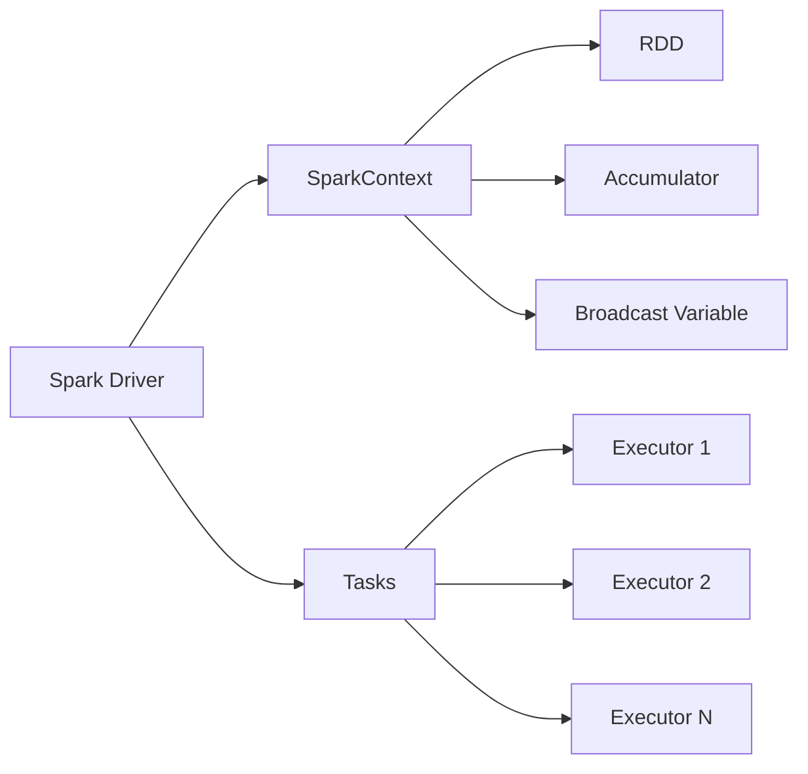
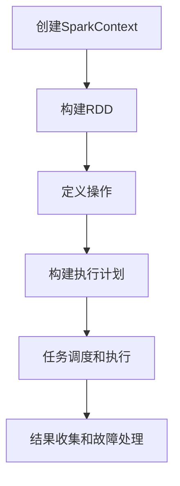

# Spark Driver原理与代码实例讲解

## 1.背景介绍

Apache Spark是一个开源的大数据处理框架,它提供了一种快速、通用的数据处理方式。在Spark中,Driver程序充当着至关重要的角色,它负责协调整个Spark应用程序的执行过程。本文将深入探讨Spark Driver的原理和实现细节,并通过代码实例帮助读者更好地理解其工作机制。

## 2.核心概念与联系

在了解Spark Driver之前,我们需要先了解以下几个核心概念:

### 2.1 Spark应用程序

Spark应用程序是指用户编写的Spark代码,它由一个驱动程序(Driver Program)和分布在集群中的多个执行程序(Executor)组成。

### 2.2 Spark上下文(SparkContext)

SparkContext是Spark应用程序与Spark集群之间的入口点。它负责创建RDD(Resilient Distributed Dataset)、累加器(Accumulator)和广播变量(Broadcast Variable),并且将用户的代码分发到集群中执行。

### 2.3 Spark Driver

Spark Driver是Spark应用程序的主程序,它负责创建SparkContext,并将用户的代码转换为一系列的任务(Task),然后分发给Executor执行。Driver还负责跟踪每个任务的状态,并在发生故障时重新调度任务。

### 2.4 Spark Executor

Executor是Spark集群中的工作节点,它负责执行Driver分发的任务。每个Executor都运行在集群的一个工作节点上,并且可以同时执行多个任务。

### 2.5 RDD(Resilient Distributed Dataset)

RDD是Spark中的核心数据结构,它是一个不可变、分区的记录集合。RDD可以通过从外部数据源(如HDFS、HBase等)创建,也可以通过对现有RDD进行转换操作而产生新的RDD。

上述概念之间的关系可以用下图表示:



## 3.核心算法原理具体操作步骤

Spark Driver的核心算法原理可以概括为以下几个步骤:

### 3.1 创建SparkContext

Driver程序的第一步是创建SparkContext对象,它是Spark应用程序与Spark集群交互的入口点。创建SparkContext时,需要指定集群的配置信息,如集群管理器(Standalone、YARN或Mesos)、应用程序名称等。

```scala
val conf = new SparkConf().setAppName("MyApp")
val sc = new SparkContext(conf)
```

### 3.2 构建RDD

用户可以通过从外部数据源(如HDFS、HBase等)创建RDD,或者通过对现有RDD进行转换操作而产生新的RDD。

```scala
val textFile = sc.textFile("hdfs://...")
val errors = textFile.filter(line => line.contains("ERROR"))
```

### 3.3 定义操作

用户可以在RDD上定义转换操作(Transformation)和行动操作(Action)。转换操作会产生新的RDD,而行动操作会触发实际的计算。

```scala
val counts = errors.map(line => (line.split(":")(0), 1))
                  .reduceByKey((a, b) => a + b)
counts.saveAsTextFile("hdfs://...") // 行动操作
```

### 3.4 构建执行计划

当用户触发一个行动操作时,Spark会根据RDD的血统关系构建一个执行计划(DAG),并将其分解为多个阶段(Stage)。每个阶段包含一组任务(Task),这些任务将被分发到Executor上执行。

### 3.5 任务调度和执行

Driver将任务分发给Executor执行。每个Executor都会启动一个Task Runner线程来执行分配的任务。Task Runner会从Driver获取任务的代码和数据,并在本地执行。

### 3.6 结果收集和故障处理

Executor将任务的执行结果返回给Driver。Driver会收集所有Executor的结果,并进行最终的结果汇总。如果某个任务失败,Driver会根据故障类型决定是否重新调度该任务。

整个过程可以用下图表示:



## 4.数学模型和公式详细讲解举例说明

在Spark中,一些算法和操作涉及到数学模型和公式,下面我们将详细讲解其中一些常见的模型和公式。

### 4.1 RDD分区策略

RDD的分区策略决定了数据如何在集群中进行划分和分布。Spark支持多种分区策略,如哈希分区(HashPartitioner)、范围分区(RangePartitioner)等。

假设我们有一个RDD,其记录的键为整数,我们希望将其按照键的哈希值进行分区,使得相同的键会落在同一个分区中。这种分区策略可以用下面的公式表示:

$$
partition = key.hashCode() \% numPartitions
$$

其中,`key.hashCode()`是键的哈希值,`numPartitions`是分区的总数。

### 4.2 Spark Streaming中的水位线(Watermark)

在Spark Streaming中,水位线(Watermark)用于控制状态数据的保留时间,从而避免无限期地保留过期的状态数据。水位线的计算公式如下:

$$
watermark = max(event\_time) - maxDelayInSeconds
$$

其中,`max(event_time)`是当前批次中所有事件的最大事件时间,`maxDelayInSeconds`是用户指定的最大允许延迟时间(以秒为单位)。

当事件的事件时间小于当前水位线时,该事件将被丢弃,相应的状态数据也会被清除。

### 4.3 机器学习算法

Spark MLlib提供了多种机器学习算法,如逻辑回归、决策树、聚类等。这些算法通常涉及到数学模型和公式。以逻辑回归为例,其目标函数可以表示为:

$$
J(\theta) = -\frac{1}{m}\sum_{i=1}^{m}[y^{(i)}\log(h_\theta(x^{(i)})) + (1-y^{(i)})\log(1-h_\theta(x^{(i)}))]
$$

其中,$$h_\theta(x) = \frac{1}{1 + e^{-\theta^Tx}}$$是逻辑回归模型,$$\theta$$是模型参数,$$x^{(i)}$$是第$$i$$个训练样本,$$y^{(i)}$$是对应的标签。

通过优化目标函数$$J(\theta)$$,我们可以得到最优的模型参数$$\theta$$。

## 5.项目实践:代码实例和详细解释说明

为了更好地理解Spark Driver的工作原理,我们将通过一个实际的代码示例来进行说明。在这个示例中,我们将统计一个文本文件中每个单词出现的次数。

### 5.1 创建SparkContext

首先,我们需要创建SparkContext对象,它是Spark应用程序与Spark集群交互的入口点。

```scala
import org.apache.spark.SparkContext
import org.apache.spark.SparkConf

object WordCount {
  def main(args: Array[String]): Unit = {
    // 创建SparkConf对象
    val conf = new SparkConf().setAppName("WordCount")
    
    // 创建SparkContext对象
    val sc = new SparkContext(conf)
    
    // 其他代码...
  }
}
```

### 5.2 构建RDD

接下来,我们从HDFS上读取文本文件,并将其转换为RDD。

```scala
// 从HDFS上读取文本文件
val textFile = sc.textFile("hdfs://path/to/file.txt")
```

### 5.3 定义操作

我们将对文本文件进行一系列的转换操作,最终得到每个单词及其出现次数的键值对。

```scala
// 将每一行拆分为单词
val words = textFile.flatMap(line => line.split(" "))

// 将每个单词映射为(word, 1)的键值对
val pairs = words.map(word => (word, 1))

// 按照键(单词)进行聚合,统计每个单词的出现次数
val counts = pairs.reduceByKey((a, b) => a + b)
```

### 5.4 执行操作

最后,我们触发一个行动操作,将结果保存到HDFS上。

```scala
// 将结果保存到HDFS
counts.saveAsTextFile("hdfs://path/to/output")
```

### 5.5 停止SparkContext

在应用程序结束时,我们需要停止SparkContext,以释放资源。

```scala
// 停止SparkContext
sc.stop()
```

完整的代码如下:

```scala
import org.apache.spark.SparkContext
import org.apache.spark.SparkConf

object WordCount {
  def main(args: Array[String]): Unit = {
    // 创建SparkConf对象
    val conf = new SparkConf().setAppName("WordCount")
    
    // 创建SparkContext对象
    val sc = new SparkContext(conf)
    
    // 从HDFS上读取文本文件
    val textFile = sc.textFile("hdfs://path/to/file.txt")
    
    // 将每一行拆分为单词
    val words = textFile.flatMap(line => line.split(" "))
    
    // 将每个单词映射为(word, 1)的键值对
    val pairs = words.map(word => (word, 1))
    
    // 按照键(单词)进行聚合,统计每个单词的出现次数
    val counts = pairs.reduceByKey((a, b) => a + b)
    
    // 将结果保存到HDFS
    counts.saveAsTextFile("hdfs://path/to/output")
    
    // 停止SparkContext
    sc.stop()
  }
}
```

在这个示例中,我们首先创建了SparkContext对象,然后从HDFS上读取文本文件,并将其转换为RDD。接下来,我们对RDD进行一系列的转换操作,包括拆分单词、映射为键值对和聚合统计。最后,我们触发一个行动操作,将结果保存到HDFS上。

通过这个示例,我们可以看到Spark Driver是如何协调整个应用程序的执行过程的。Driver负责创建SparkContext、构建RDD、定义操作、构建执行计划、任务调度和执行,以及结果收集和故障处理。

## 6.实际应用场景

Spark Driver在实际应用中扮演着非常重要的角色,它可以用于各种大数据处理场景,如日志分析、数据处理、机器学习等。下面是一些常见的应用场景:

### 6.1 日志分析

在大型网站或系统中,每天会产生大量的日志数据。通过Spark,我们可以实时地处理这些日志数据,进行错误分析、用户行为分析等。例如,我们可以统计每个错误类型的出现次数,或者分析用户的浏览路径。

### 6.2 数据处理

Spark可以用于各种数据处理任务,如ETL(Extract-Transform-Load)、数据清洗、数据转换等。例如,我们可以从多个数据源读取数据,进行数据清洗和转换,然后将处理后的数据加载到数据仓库或数据湖中。

### 6.3 机器学习

Spark MLlib提供了多种机器学习算法,如逻辑回归、决策树、聚类等。我们可以利用Spark进行大规模的机器学习任务,如推荐系统、广告定向、欺诈检测等。

### 6.4 流式计算

Spark Streaming可以用于实时数据处理,如实时日志分析、实时监控、实时预测等。例如,我们可以实时地处理传感器数据,进行异常检测和预测。

### 6.5 图计算

Spark GraphX提供了图计算功能,可以用于社交网络分析、网页排名、交通路线规划等场景。例如,我们可以分析社交网络中的影响力传播,或者计算网页的PageRank值。

## 7.工具和资源推荐

在使用Spark Driver进行开发时,有一些工具和资源可以帮助我们提高效率和质量。

### 7.1 Spark官方文档

Spark官方文档(https://spark.apache.org/docs/latest/)是学习和使用Spark的重要资源。它包含了Spark的概念、API、配置等方面的详细说明。

### 7.2 Spark编程指南

Spark编程指南(https://spark.apache.org/docs/latest/rdd-programming-guide.html)提供了使用RDD进行编程的指南,包括RDD的创建、转换和行动操作等。

### 7.3 Spark示例程序