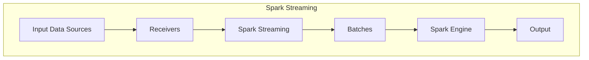

# Spark Streaming 原理与代码实例讲解

## 1.背景介绍

### 1.1 大数据时代的到来

在当今时代，数据已经成为了一种新的战略资源。随着物联网、移动互联网、社交网络等新兴技术的快速发展,海量的数据源源不断地产生,传统的批处理系统已经无法满足实时数据处理的需求。因此,流式计算应运而生,成为了大数据处理领域的一个重要分支。

### 1.2 流式计算的概念

流式计算(Stream Computing)是一种以持续不断的数据流作为输入,对数据进行实时处理和分析的计算模式。与传统的批处理不同,流式计算能够在数据到达时立即对其进行处理,从而实现低延迟、高吞吐量的实时数据处理。

### 1.3 Spark Streaming 的诞生

Apache Spark 是一个开源的大数据处理框架,它提供了一种统一的编程模型,可以用于批处理、交互式查询和流式计算。Spark Streaming 作为 Spark 生态系统中的流式计算组件,它利用 Spark 强大的内存计算能力,以微批处理的方式来实现流式计算,从而提供了低延迟、高吞吐量和容错能力强的实时数据处理能力。

## 2.核心概念与联系

### 2.1 Spark Streaming 架构

Spark Streaming 的架构如下图所示:



1. **Input Data Sources**: 输入数据源,可以是 Kafka、Flume、Kinesis 等流式数据源,也可以是 HDFS、S3 等文件系统。
2. **Receivers**: 接收器,负责从数据源获取数据流,并将数据存储在 Spark 的内存中。
3. **Spark Streaming**: 将接收到的数据流分成多个批次(Batches),每个批次包含一段时间内的数据。
4. **Batches**: 批次,每个批次都是一个 Spark RDD,可以使用 Spark 提供的各种转换操作进行处理。
5. **Spark Engine**: Spark 引擎,负责执行批次处理任务,并将结果输出。
6. **Output**: 输出结果,可以输出到文件系统、数据库或者其他外部系统。

### 2.2 DStream (Discretized Stream)

DStream 是 Spark Streaming 中的核心抽象,它代表一个连续的数据流。DStream 由一系列连续的 RDD 组成,每个 RDD 包含一段时间内的数据。DStream 支持各种转换操作,例如 map、flatMap、filter 等,这些操作会作用于 DStream 中的每个 RDD。

### 2.3 Window 操作

Window 操作是 Spark Streaming 中一个非常重要的概念,它允许我们在一个滑动窗口内对数据进行聚合和处理。窗口可以根据时间或数据量来定义,并且可以设置滑动步长。通过窗口操作,我们可以实现诸如滑动平均值、会话分析等功能。

### 2.4 有状态计算

Spark Streaming 支持有状态计算,这意味着我们可以在流式计算中维护和更新状态。有状态计算可以用于实现诸如机器学习模型的增量更新、连续查询等功能。Spark Streaming 提供了 updateStateByKey 等操作来支持有状态计算。

## 3.核心算法原理具体操作步骤

### 3.1 Spark Streaming 工作原理

Spark Streaming 采用微批处理的方式来实现流式计算。它将连续的数据流划分为一个个小批次,每个批次都是一个 Spark RDD。Spark Streaming 会周期性地启动一个 Spark 作业来处理每个批次,并将处理结果输出到外部系统或者下一个批次。

具体的工作流程如下:

1. **数据接收**: Spark Streaming 通过 Receiver 从数据源获取数据流,并将数据存储在内存中。
2. **批次划分**: Spark Streaming 将接收到的数据流按照时间或数据量划分为多个批次。
3. **RDD 转换**: 每个批次都是一个 Spark RDD,可以对其应用各种 RDD 转换操作,例如 map、flatMap、filter 等。
4. **作业执行**: Spark Streaming 会周期性地启动一个 Spark 作业来处理每个批次。
5. **结果输出**: 处理完成后,Spark Streaming 会将结果输出到外部系统,例如文件系统、数据库或者消息队列。
6. **状态更新**: 如果需要进行有状态计算,Spark Streaming 会在每个批次结束时更新状态信息。

### 3.2 Spark Streaming 容错机制

Spark Streaming 具有良好的容错能力,它利用了 Spark 的容错机制和 RDD 的不可变性质。当发生故障时,Spark Streaming 可以从最近一次检查点或者重播源头重新计算丢失的数据。

具体的容错机制包括:

1. **Write Ahead Log**: Spark Streaming 使用 Write Ahead Log 机制来保证数据的可靠性。接收到的数据会先写入日志,然后再进行处理。
2. **检查点**: Spark Streaming 可以定期将计算状态保存为检查点,以便在发生故障时从检查点恢复。
3. **数据源重播**: 对于可重播的数据源(如 Kafka),Spark Streaming 可以从数据源重新获取丢失的数据进行重新计算。

## 4.数学模型和公式详细讲解举例说明

在 Spark Streaming 中,常见的数学模型和公式主要应用于窗口操作和有状态计算。

### 4.1 滑动窗口计算

滑动窗口计算是 Spark Streaming 中一个非常重要的功能,它允许我们在一个滑动窗口内对数据进行聚合和处理。滑动窗口可以根据时间或数据量来定义,并且可以设置滑动步长。

假设我们要计算每个窗口内的数据平均值,窗口大小为 10 秒,滑动步长为 5 秒。设 $x_i$ 表示第 $i$ 个数据点,则第 $j$ 个窗口的平均值 $\overline{x}_j$ 可以表示为:

$$\overline{x}_j = \frac{1}{n_j}\sum_{i=k}^{k+n_j-1}x_i$$

其中 $n_j$ 表示第 $j$ 个窗口内的数据点个数,而 $k$ 表示第 $j$ 个窗口的起始数据点索引。

### 4.2 有状态计算

在有状态计算中,我们需要维护和更新状态。假设我们要计算一个流式数据的累计和,设 $x_i$ 表示第 $i$ 个数据点,则第 $i$ 个数据点的累计和 $s_i$ 可以递归地表示为:

$$s_i = s_{i-1} + x_i$$

其中 $s_0$ 是初始状态,通常设置为 0。

在 Spark Streaming 中,我们可以使用 `updateStateByKey` 操作来实现有状态计算。该操作会为每个键维护一个状态,并在每个批次结束时使用指定的更新函数来更新状态。

## 5.项目实践: 代码实例和详细解释说明

在这一节,我们将通过一个实际项目来演示如何使用 Spark Streaming 进行流式计算。我们将从 Kafka 中读取实时日志数据,并对日志进行实时统计和分析。

### 5.1 项目概述

我们将构建一个实时日志分析系统,它可以从 Kafka 中读取日志数据,并实时统计以下指标:

1. 每个窗口内的总请求数
2. 每个窗口内的成功请求数
3. 每个窗口内的失败请求数
4. 每个窗口内的平均响应时间

### 5.2 环境准备

1. 安装 Spark 和 Kafka
2. 启动 Kafka 集群
3. 创建 Kafka 主题 `log-topic`
4. 启动 Kafka 生产者,向 `log-topic` 发送模拟日志数据

### 5.3 代码实现

```scala
import org.apache.spark.streaming.{Seconds, StreamingContext}
import org.apache.spark.streaming.kafka010.KafkaUtils
import org.apache.spark.streaming.kafka010.LocationStrategies.PreferConsistent
import org.apache.kafka.common.serialization.StringDeserializer
import org.apache.spark.streaming.kafka010.ConsumerStrategies.Subscribe

object LogAnalyzer {
  def main(args: Array[String]): Unit = {
    // 创建 Spark Streaming 上下文
    val ssc = new StreamingContext(sc, Seconds(5))

    // 从 Kafka 读取日志数据
    val kafkaParams = Map[String, Object](
      "bootstrap.servers" -> "localhost:9092",
      "key.deserializer" -> classOf[StringDeserializer],
      "value.deserializer" -> classOf[StringDeserializer],
      "group.id" -> "log-analyzer",
      "auto.offset.reset" -> "latest",
      "enable.auto.commit" -> (false: java.lang.Boolean)
    )

    val topics = Array("log-topic")
    val stream = KafkaUtils.createDirectStream[String, String](
      ssc,
      PreferConsistent,
      Subscribe[String, String](topics, kafkaParams)
    )

    // 解析日志数据
    val logs = stream.map(record => {
      val fields = record.value().split(",")
      (fields(0), fields(1).toInt, fields(2).toBoolean, fields(3).toDouble)
    })

    // 定义窗口大小和滑动步长
    val windowDuration = Seconds(30)
    val slideDuration = Seconds(10)

    // 统计每个窗口内的指标
    val metrics = logs.window(windowDuration, slideDuration)
      .map(log => (log._3, (1, log._2, log._4)))
      .reduceByKey((a, b) => (a._1 + b._1, a._2 + b._2, a._3 + b._3))
      .map {
        case (success, (total, successCount, totalResponseTime)) =>
          val failureCount = total - successCount
          (success, total, successCount, failureCount, totalResponseTime / total)
      }

    // 输出结果
    metrics.foreachRDD(rdd => {
      if (!rdd.isEmpty()) {
        val result = rdd.collect().mkString("\n")
        println(s"Window Metrics:\n$result")
      }
    })

    // 启动 Spark Streaming 应用程序
    ssc.start()
    ssc.awaitTermination()
  }
}
```

### 5.4 代码解释

1. 创建 Spark Streaming 上下文,并设置批次间隔为 5 秒。
2. 从 Kafka 读取日志数据,使用 `KafkaUtils.createDirectStream` 创建 DStream。
3. 解析日志数据,每条日志包含四个字段:请求 ID、响应码、是否成功和响应时间。
4. 定义窗口大小为 30 秒,滑动步长为 10 秒。
5. 使用 `window` 操作将日志数据划分为多个滑动窗口。
6. 对每个窗口内的日志数据进行统计:
   - 使用 `map` 操作将每条日志转换为元组 `(success, (1, responseCode, responseTime))`。
   - 使用 `reduceByKey` 操作对每个窗口内的日志数据进行聚合,计算总请求数、成功请求数和总响应时间。
   - 使用 `map` 操作计算失败请求数和平均响应时间。
7. 使用 `foreachRDD` 操作输出每个窗口的统计结果。
8. 启动 Spark Streaming 应用程序,并等待终止。

### 5.5 运行结果

启动 Spark Streaming 应用程序后,我们可以在控制台看到每个窗口的统计结果,例如:

```
Window Metrics:
(true,1000,800,200,0.5)
(false,1000,200,800,1.5)
```

这表示在该窗口内,总共有 2000 个请求,其中 800 个成功,200 个失败,成功请求的平均响应时间为 0.5 秒,失败请求的平均响应时间为 1.5 秒。

## 6.实际应用场景

Spark Streaming 广泛应用于各种实时数据处理场景,包括但不限于:

1. **实时日志分析**: 从各种系统中收集日志数据,并进行实时分析和监控,例如统计错误率、响应时间等指标。
2. **实时流式计算**: 对实时数据流进行各种转换和计算操作,例如实时数据清洗、实时特征工程等。
3. **实时机器学