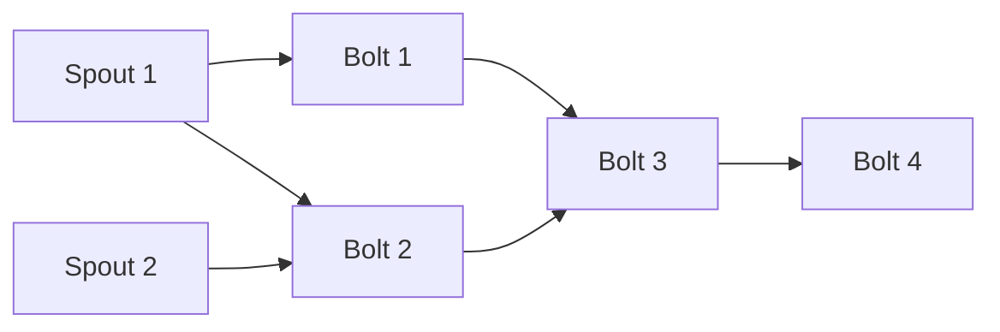

# Storm Topology原理与代码实例讲解

## 1.背景介绍

随着大数据时代的到来,实时流式计算应用程序的需求与日俱增。Apache Storm作为一个分布式实时计算系统,能够以高吞吐量和低延迟的方式处理大量的实时数据流。Storm的核心设计理念是将实时计算作为一系列持续的流式转换,其中流数据以Topology的形式在集群中传输。

Topology是Storm中最核心的概念,它定义了数据源、处理流程和输出目标。一个完整的Topology包含了Spout(数据源)、Bolt(处理单元)、数据分组(Stream Grouping)、Worker进程等组件,这些组件协同工作以实现实时数据处理。本文将深入探讨Storm Topology的原理、结构、关键算法以及代码实现细节,为读者提供一个全面的理解。

## 2.核心概念与联系

### 2.1 Topology结构

一个Storm Topology由有向无环图(DAG)组成,其中每个节点表示一个Spout或Bolt。Spout是数据源,它从外部系统(如Kafka、数据库等)获取数据流,并将其注入Topology。Bolt则是处理单元,它对从Spout或其他Bolt发送过来的数据流执行转换、过滤、聚合等操作。



### 2.2 Stream Grouping

Stream Grouping定义了Bolt如何从其他Spout或Bolt接收数据流。Storm提供了多种Stream Grouping策略,如Shuffle Grouping、Fields Grouping、All Grouping等,用于控制数据流的分区和路由。

### 2.3 Worker进程

Storm在集群中运行多个Worker进程,每个Worker进程执行一部分Topology任务。Worker进程内部包含一个或多个Executor线程,每个Executor线程又包含一个或多个Task,Task是真正执行Spout或Bolt代码的单元。

### 2.4 Tuple

Tuple是Storm中传递的基本数据单元,由一系列按序键值对组成。Spout会生成源Tuple,然后沿着Topology流动,在各个Bolt中被不断转换和处理。

## 3.核心算法原理具体操作步骤

### 3.1 Topology部署

当用户提交一个Topology到Storm集群时,Nimbus(Storm的主控节点)会根据Topology配置计算出所需的Slot(Worker进程执行槽)数量,并将代码和配置分发到各个Supervisor节点上。

1. 用户向Nimbus提交打包好的Topology jar包
2. Nimbus根据Topology配置计算所需Slot数量
3. 向Supervisor节点分发Topology代码和配置
4. Supervisor节点启动或分配Worker进程
5. Worker进程启动Executor线程和Task

### 3.2 数据流处理

Topology启动后,Spout开始从外部系统获取数据,并将数据封装成Tuple注入Topology。Tuple沿着有向无环图在Bolt之间流动,经过一系列转换和处理。

1. Spout读取外部数据源,生成Tuple
2. Tuple根据Stream Grouping策略分发给Bolt
3. Bolt对接收到的Tuple执行处理逻辑
4. Bolt发射新的Tuple到下游Bolt
5. 经过多个Bolt处理后,最终结果输出到外部系统

### 3.3 消息跟踪(Acking)

为了保证数据处理的可靠性,Storm采用了消息跟踪(Acking)机制。当一个Tuple完整地处理完成后,Topology会发出一个消息确认(Ack)。如果Tuple在处理过程中失败,则会触发重新处理(Fail)。

1. Spout向Topology注入一个Tuple,并为其分配一个消息ID
2. Tuple在Bolt之间传递,每个Task处理后暂存Tuple
3. Tuple完整处理完成后,最终Bolt发出Ack消息
4. 追溯到源头,Spout收到Ack,将暂存的Tuple清除
5. 如果发生Fail,暂存的Tuple将重新处理

### 3.4 故障恢复

Storm采用了至少一次(At Least Once)的处理语义,即在发生故障时,相同的Tuple可能会被重复处理。为了应对Worker进程或节点故障,Storm使用了定期检查点(Checkpoint)和重新分配(Reassignment)机制。

1. Worker进程周期性地为执行进度制作检查点快照
2. 如果Worker进程发生故障,Supervisor会重启该Worker
3. 新的Worker进程从最近的检查点恢复执行状态
4. 如果整个节点发生故障,Nimbus会将该节点上的Slot重新分配到其他节点

## 4.数学模型和公式详细讲解举例说明

在Storm中,有一个关键问题是如何合理地分配Task到Worker进程上,以实现高效的并行计算和负载均衡。这可以通过建模成一个优化问题来解决。

设有n个Bolt,每个Bolt $i$有$p_i$个并行度(Task数量)。我们的目标是将这些Task分配到m个Worker进程上,使得每个Worker进程的负载尽可能均衡。

定义决策变量$x_{ij}$表示是否将Bolt $i$的第$j$个Task分配到Worker进程$k$上:

$$
x_{ijk} = \begin{cases}
1, & \text{if task j of bolt i is assigned to worker k} \\
0, & \text{otherwise}
\end{cases}
$$

我们希望最小化各Worker进程之间的负载差异,这可以建模为最小化目标函数:

$$
\min \max_{1 \leq k \leq m} \sum_{i=1}^n \sum_{j=1}^{p_i} c_{ij} x_{ijk}
$$

其中$c_{ij}$表示Bolt $i$的第$j$个Task的计算代价(如CPU或内存使用量)。

同时,我们需要满足以下约束条件:

1. 每个Task只能分配到一个Worker进程上:

$$
\sum_{k=1}^m x_{ijk} = 1, \quad \forall i, j
$$

2. 每个Worker进程的容量有限制:

$$
\sum_{i=1}^n \sum_{j=1}^{p_i} c_{ij} x_{ijk} \leq C_k, \quad \forall k
$$

其中$C_k$表示Worker进程$k$的容量限制。

这是一个整数线性规划问题,可以使用启发式算法或商业求解器来求解。Storm使用了一种基于压力包的简化分配算法,尽可能将相同Bolt的Task分配到同一个Worker进程上,以减少数据传输开销。

## 5.项目实践:代码实例和详细解释说明

下面是一个简单的Storm Topology示例,它从Kafka读取消息,进行词频统计,并将结果写回Kafka。

### 5.1 定义Topology

```java
TopologyBuilder builder = new TopologyBuilder();

// 设置Spout(从Kafka读取数据)
KafkaSpout kafkaSpout = new KafkaSpout<>(spoutConfig);
builder.setSpout("kafka-spout", kafkaSpout, 4);

// 设置Bolt进行词频统计
builder.setBolt("split-bolt", new SplitSentenceBolt(), 8)
        .shuffleGrouping("kafka-spout");
builder.setBolt("count-bolt", new WordCountBolt(), 12)
        .fieldsGrouping("split-bolt", new Fields("word"));

// 设置Bolt将结果写回Kafka  
KafkaBolt kafkaBolt = new KafkaBolt<>()
        .withTopicSelector(new DefaultTopicSelector("wordcount-output"))
        .withTupleToKafkaMapper(new FieldNameBasedTupleToKafkaMapper<>());
builder.setBolt("kafka-bolt", kafkaBolt, 4)
        .fieldsGrouping("count-bolt", new Fields("word"));

// 创建Topology配置
Config conf = new Config();
conf.setNumWorkers(4);

// 提交Topology
StormSubmitter.submitTopology("kafka-wordcount", conf, builder.createTopology());
```

这个Topology包含3个Spout/Bolt:

1. `KafkaSpout`从Kafka读取原始消息
2. `SplitSentenceBolt`将消息分割成单词
3. `WordCountBolt`统计每个单词的出现次数
4. `KafkaBolt`将结果写回Kafka

我们使用`TopologyBuilder`定义了Topology的数据流向,并设置了各个组件的并行度(Task数量)。最后使用`StormSubmitter`将Topology提交到Storm集群执行。

### 5.2 Spout示例

```java
public class KafkaSpout extends BaseRichSpout {
    // 省略其他代码...

    public void nextTuple() {
        // 从Kafka消费消息
        ConsumerRecords<String, String> records = consumer.poll(pollTimeout);
        for (ConsumerRecord<String, String> record : records) {
            // 将消息封装成Tuple并发射出去
            Values value = new Values(record.value());
            collector.emit(new Values(record.key()), value);
        }
    }
}
```

`KafkaSpout`是一个从Kafka读取数据的Spout实现。在`nextTuple`方法中,它从Kafka消费消息,并将每条消息封装成一个Tuple发射出去。

### 5.3 Bolt示例

```java
public class SplitSentenceBolt extends BaseRichBolt {
    private OutputCollector collector;

    public void prepare(Map conf, TopologyContext context, OutputCollector collector) {
        this.collector = collector;
    }

    public void execute(Tuple tuple) {
        String sentence = tuple.getString(0);
        for (String word : sentence.split("\\s+")) {
            collector.emit(new Values(word));
        }
    }

    // 省略其他方法...
}
```

`SplitSentenceBolt`是一个将句子分割成单词的Bolt实现。在`execute`方法中,它接收一个Tuple(代表一个句子),将句子按空格分割成单词,并为每个单词发射一个新的Tuple。

```java
public class WordCountBolt extends BaseRichBolt {
    private Map<String, Integer> counts = new HashMap<>();

    public void execute(Tuple tuple) {
        String word = tuple.getString(0);
        Integer count = counts.get(word);
        if (count == null) {
            count = 0;
        }
        count++;
        counts.put(word, count);
        collector.emit(new Values(word, count));
    }

    // 省略其他方法...
}
```

`WordCountBolt`是一个统计单词出现次数的Bolt实现。在`execute`方法中,它接收一个Tuple(代表一个单词),更新该单词的计数,并发射一个新的Tuple,包含单词和当前计数。

### 5.4 Stream Grouping示例

在定义Topology时,我们使用了不同的Stream Grouping策略:

```java
builder.setBolt("split-bolt", new SplitSentenceBolt(), 8)
        .shuffleGrouping("kafka-spout");
builder.setBolt("count-bolt", new WordCountBolt(), 12)
        .fieldsGrouping("split-bolt", new Fields("word"));
builder.setBolt("kafka-bolt", kafkaBolt, 4)
        .fieldsGrouping("count-bolt", new Fields("word"));
```

- `shuffleGrouping`表示Tuple会随机分发到下游Bolt的任意一个Task
- `fieldsGrouping`表示根据Tuple中的某些字段值,确定将Tuple分发到哪个下游Task

在这个例子中:

1. `split-bolt`使用`shuffleGrouping`从`kafka-spout`随机接收消息
2. `count-bolt`使用`fieldsGrouping`,根据单词字段值,将相同单词的Tuple分发到同一个Task
3. `kafka-bolt`使用`fieldsGrouping`,根据单词字段值,将相同单词的计数结果分发到同一个Task

通过合理使用Stream Grouping,我们可以在并行计算和数据分组之间达到平衡。

## 6.实际应用场景

Storm Topology广泛应用于各种实时数据处理场景,例如:

1. **实时数据分析**:从各种数据源(如网络日志、传感器数据等)获取实时数据流,进行实时分析和可视化,用于网络监控、智能交通等领域。

2. **实时消息处理**:对实时消息进行路由、转换和处理,如实时广告投放、社交网络消息分发等。

3. **实时计算**:执行实时的复杂事件处理、在线机器学习等计算密集型任务。

4. **实时ETL**:从各种数据源提取、转换、加载实时数据,用于实时数据仓库更新。

5. **物联网(IoT)数据处理**:处理来自大量物联网设备的实时传感器数据流。

6. **在线服务保护**:实时检测和防御安全威胁,如垃圾邮件过滤、网络入侵检测等。

Storm的实时