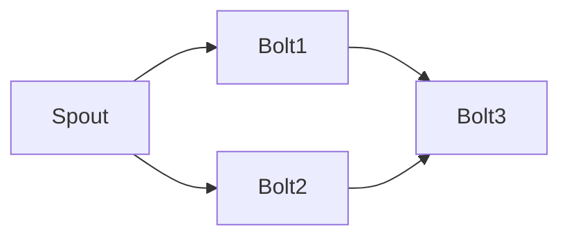

# Storm实时流处理框架原理与代码实例讲解

## 1. 背景介绍
### 1.1 大数据处理的挑战
在当今大数据时代,海量数据以前所未有的速度持续产生。传统的批处理模式已经无法满足实时性要求,迫切需要一种新的大数据处理范式。
### 1.2 实时流处理的兴起 
实时流处理(Real-time Stream Processing)应运而生,它能够对源源不断的数据进行实时、高吞吐的处理,并产生低延迟的处理结果。代表性的实时流处理框架有Apache Storm、Spark Streaming等。
### 1.3 Storm简介
本文将重点介绍Apache Storm实时流处理框架。Storm是一个分布式、高容错的实时计算系统,由Twitter开源,用于处理大规模数据流。它提供了简单易用的编程模型,支持多种编程语言。

## 2. 核心概念与联系
### 2.1 Topology（拓扑）
Storm中的一个实时应用程序被封装为一个Topology。Topology是一个有向无环图(DAG),由Spouts和Bolts构成,定义了数据流的转换过程。
### 2.2 Spout（数据源）
Spout是Topology的数据源,负责从外部数据源读取数据,并将数据以元组(tuple)的形式发射到下游的Bolt中。常见的Spout包括Kafka、ActiveMQ等消息队列,以及自定义的数据源。
### 2.3 Bolt（处理单元）  
Bolt是Topology的处理单元,负责对接收到的数据进行转换、过滤、聚合等操作,并可以将新的数据元组发射给下一个Bolt。一个Topology可以包含多个Bolt,形成数据处理的流水线。
### 2.4 Tuple（元组）
Tuple是Storm中数据传输的基本单位,本质上是一个命名值列表。每个Spout或Bolt接收到的数据,以及发射出去的数据都是Tuple。
### 2.5 Stream（流）
Stream是Tuple的无界序列,代表了Spouts到Bolts,以及Bolts之间的数据传输通道。

下图展示了Storm的核心概念以及它们之间的关系:



## 3. 核心算法原理具体操作步骤
### 3.1 数据分区
为了实现并行处理,Storm需要将数据流分区,使得每个Bolt的任务可以并行处理不同的数据子集。Storm使用如下策略进行数据分区:

1. 随机分区(Shuffle Grouping):数据元组随机均匀分发到Bolt的所有任务中。
2. 字段分区(Fields Grouping):根据指定字段的值进行分区,保证相同字段值的元组进入同一个任务。 
3. 全局分区(Global Grouping):所有元组都进入同一个任务。
4. 不分区(None Grouping):不关心数据如何分区,等同于随机分区。
5. 直接分区(Direct Grouping):由数据源直接决定元组发送到哪个任务。
6. 本地或随机分区(Local or Shuffle Grouping):如果目标Bolt有任务与数据源任务在同一个Worker进程,优先发送到这些任务,否则等同于随机分区。

### 3.2 数据可靠性
Storm提供了不同级别的数据可靠性保障:

1. At most once:每个元组最多被处理一次,可能会有数据丢失。这是默认的可靠性级别。
2. At least once:每个元组至少被处理一次,可能会有重复处理。需要Spout在Tuple处理失败时重新发送。  
3. Exactly once:每个元组精确地处理一次。需要Spout和Bolt配合实现幂等性。

Storm使用acker机制跟踪每个元组的处理情况。当一个元组被Spout发射时,会带有一个msgId。当元组被Bolt完全处理时,Bolt会发送一个ack消息给acker任务。如果在超时时间内acker没有收到所有的ack消息,就会要求Spout重发该元组。

### 3.3 反压机制(Backpressure)
为了避免数据积压导致的系统故障,Storm提供了反压机制。当Bolt处理速度跟不上数据流入速度时,Storm会自动减缓Spout发射数据的速率。Storm使用可计数的缓冲区和滑动窗口来衡量系统的负载,动态调节数据流速。

## 4. 数学模型和公式详细讲解举例说明
### 4.1 指数加权移动平均(EWMA)
Storm使用EWMA来估计Bolt的处理能力。设$x_t$为t时刻的处理能力测量值,$\hat{x}_t$为t时刻的EWMA估计值,则:

$$
\hat{x}_t=\beta\hat{x}_{t-1}+(1-\beta)x_t
$$

其中$\beta$是平滑因子,控制了历史数据的权重。Storm默认取$\beta=0.9$。

举例:假设前三个时刻的处理能力测量值为10,12,8,则EWMA估计值为:

$\hat{x}_1=0.9\times0+0.1\times10=1$ 
$\hat{x}_2=0.9\times1+0.1\times12=2.1$
$\hat{x}_3=0.9\times2.1+0.1\times8=2.69$

可见EWMA能够平滑测量值的波动,给出更稳定的估计值。

### 4.2 小批量处理
Storm支持将多个元组打包成一个小批量(mini-batch)进行处理,提高吞吐量。设$B$为小批量大小,$L$为单个元组的处理延迟,则小批量的处理延迟$L_B$为:

$$
L_B=L+\frac{B-1}{2\lambda}
$$

其中$\lambda$是元组到达率。可见批量大小$B$越大,处理延迟越高。Storm需要在吞吐量和延迟之间进行权衡。

## 5. 项目实践:代码实例和详细解释说明
下面通过一个简单的WordCount例子,展示如何使用Storm进行流式单词计数。

### 5.1 项目依赖
首先在pom.xml中添加Storm依赖:

```xml
<dependency>
    <groupId>org.apache.storm</groupId>
    <artifactId>storm-core</artifactId>
    <version>2.2.0</version>
</dependency>  
```

### 5.2 实现Spout
我们自定义一个Spout,不断发射句子:

```java
public class SentenceSpout extends BaseRichSpout {
    private SpoutOutputCollector collector;
    private String[] sentences = {
        "Apache Storm is awesome",
        "Learn Storm and Java",
        "Storm Kafka integration" 
    };
    private int index = 0;
    
    @Override
    public void open(Map<String, Object> conf, TopologyContext context, SpoutOutputCollector collector) {
        this.collector = collector;
    }

    @Override
    public void nextTuple() {
        String sentence = sentences[index];
        collector.emit(new Values(sentence));
        index++;
        if (index >= sentences.length) {
            index = 0;
        }
        Utils.sleep(1000);
    }

    @Override
    public void declareOutputFields(OutputFieldsDeclarer declarer) {
        declarer.declare(new Fields("sentence"));
    }
}
```

### 5.3 实现Bolt
接下来实现两个Bolt:SplitSentenceBolt用于将句子切分为单词,WordCountBolt用于对单词进行计数。

```java
public class SplitSentenceBolt extends BaseBasicBolt {
    @Override
    public void execute(Tuple tuple, BasicOutputCollector collector) {
        String sentence = tuple.getStringByField("sentence");
        String[] words = sentence.split("\\s+");
        for (String word : words) {
            collector.emit(new Values(word));
        }
    }

    @Override
    public void declareOutputFields(OutputFieldsDeclarer declarer) {
        declarer.declare(new Fields("word"));
    }
}

public class WordCountBolt extends BaseBasicBolt {
    private Map<String, Integer> counts = new HashMap<>();

    @Override
    public void execute(Tuple tuple, BasicOutputCollector collector) {
        String word = tuple.getStringByField("word");
        Integer count = counts.get(word);
        if (count == null) {
            count = 0;
        }
        count++;
        counts.put(word, count);
        collector.emit(new Values(word, count));
    }

    @Override
    public void declareOutputFields(OutputFieldsDeclarer declarer) {
        declarer.declare(new Fields("word", "count"));
    }
}
```

### 5.4 组装Topology
最后,我们将Spout和Bolt组装成一个Topology:

```java
public class WordCountTopology {
    public static void main(String[] args) throws Exception {
        TopologyBuilder builder = new TopologyBuilder();
        
        builder.setSpout("sentence-spout", new SentenceSpout());
        
        builder.setBolt("split-bolt", new SplitSentenceBolt())
                .shuffleGrouping("sentence-spout");
        
        builder.setBolt("count-bolt", new WordCountBolt())
                .fieldsGrouping("split-bolt", new Fields("word"));
        
        Config config = new Config();
        
        if (args != null && args.length > 0) {
            config.setNumWorkers(3);
            StormSubmitter.submitTopology(args[0], config, builder.createTopology());
        } else {
            LocalCluster cluster = new LocalCluster();
            cluster.submitTopology("WordCountTopology", config, builder.createTopology());
            Utils.sleep(10000);
            cluster.killTopology("WordCountTopology");
            cluster.shutdown();
        }
    }
}
```

运行程序,我们就能看到实时的单词计数结果不断输出。这个简单的例子展示了如何使用Storm进行流式数据处理。

## 6. 实际应用场景
Storm在实际中有非常广泛的应用,几乎覆盖了实时数据处理的各个领域:

1. 实时数据分析:如网站的实时访问统计、应用程序的实时监控等。
2. 实时推荐系统:根据用户的实时行为,动态调整推荐结果。
3. 实时金融系统:如实时股票行情分析、实时欺诈检测等。
4. 物联网数据处理:对传感器等物联网设备产生的海量数据进行实时分析。
5. 社交网络数据处理:如实时热点话题发现、实时用户情感分析等。

Storm能够应对高并发、低延迟、高吞吐的实时处理需求,在各行各业得到了广泛应用。

## 7. 工具和资源推荐
1. Storm官方网站:提供了Storm的各种文档、教程、视频等学习资源。
2. Storm源码:通过阅读Storm的源码,可以深入理解其实现原理。
3. Storm-Starter项目:Storm官方的示例项目,包含了各种Storm使用案例。
4. Storm-Kafka整合:利用Kafka作为数据源,是Storm的常见使用方式。
5. Storm-HBase/Redis/Elasticsearch整合:利用HBase等存储系统保存Storm的计算结果。
6. Storm-UI:Storm提供的Web管理界面,可以监控Topology的运行状态。
7. Storm-Trident:Storm的高级API,提供了类似Spark的函数式编程模型。

充分利用这些工具和资源,可以帮助我们更好地掌握和应用Storm技术。

## 8. 总结:未来发展趋势与挑战
Storm作为实时流处理领域的先驱,已经被广泛应用于各个行业。未来随着数据量的持续增长,实时处理的需求会越来越多。Storm面临的机遇和挑战并存:

1. 流批一体化:同时支持流处理和批处理,减少框架集成的复杂度。
2. SQL支持:提供SQL接口,降低使用门槛,提高开发效率。
3. 机器学习支持:与机器学习平台整合,支持实时机器学习。
4. 容错性改进:提供端到端的Exactly-once语义,进一步提高数据处理的可靠性。
5. 性能优化:在保证可靠性的前提下,进一步提高系统的吞吐量和降低处理延迟。

相信通过社区的共同努力,Storm一定能够克服挑战,在实时流处理领域继续扮演重要角色。

## 9. 附录:常见问题与解答
1. Q:Storm适合处理什么样的数据? A:Storm适合处理连续的、无界的数据流,如日志流、事件流、点击流等。
2. Q:Storm的部署方式有哪些? A:可以单机模式部署,也可以集群模式部署。Storm集群由主节点Nimbus和工作节点Supervisor组成。
3. Q:Storm的容错机制是怎样的? A:Nimbus和Supervisor都是无状态的,失败后可以快速重启。Topology状态由Zookeeper维护,可以从失败中恢复。
4. Q:Storm消息如何保证不丢失? A:Spout使用msgId跟踪每个元组,失败时可以