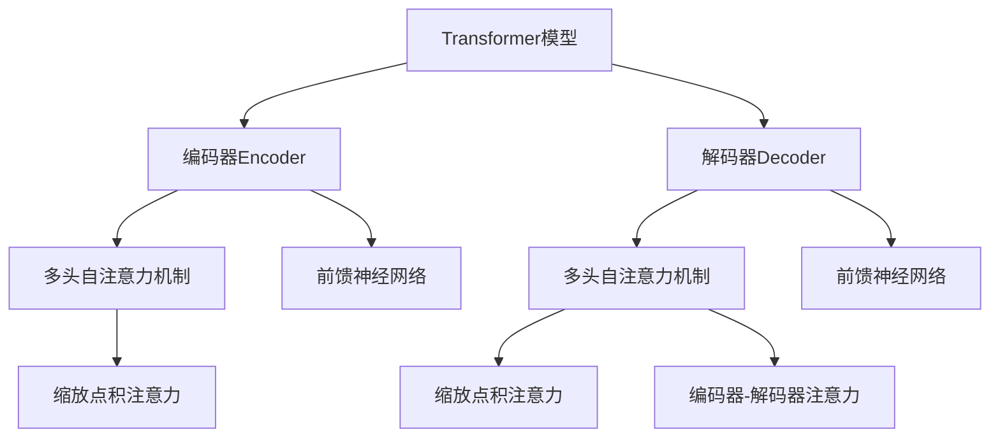

# Transformer大模型实战 ClinicalBERT模型

## 1.背景介绍

随着医疗健康领域数据的快速增长,自然语言处理(NLP)技术在医疗信息挖掘中扮演着越来越重要的角色。然而,医疗数据具有高度专业性和隐私性,给NLP模型的训练和应用带来了巨大挑战。传统的NLP模型通常在通用语料库上进行预训练,难以充分捕捉医疗领域的专业术语和语义。因此,针对医疗领域数据的特点,开发高效且可解释的NLP模型就显得尤为重要。

ClinicalBERT是一种基于Transformer的预训练语言模型,专门针对医疗健康领域的文本数据进行优化。它利用了大量的医疗临床文本数据,如电子病历、医学论文和临床指南等,在预训练阶段学习了医疗领域的语义和语境特征。通过这种领域特定的预训练,ClinicalBERT能够更好地理解和处理医疗文本,提高了下游任务的性能,如命名实体识别、关系抽取和文本分类等。

## 2.核心概念与联系

### 2.1 Transformer模型

Transformer是一种全新的基于注意力机制的序列到序列模型,它完全摒弃了传统序列模型中的循环神经网络和卷积神经网络结构,而是依赖于自注意力机制来捕获输入序列中任意两个位置之间的依赖关系。Transformer模型的核心组件包括编码器(Encoder)和解码器(Decoder),它们都是由多个相同的层组成,每一层又由多头自注意力机制(Multi-Head Attention)和前馈神经网络(Feed-Forward Network)构成。



### 2.2 BERT模型

BERT(Bidirectional Encoder Representations from Transformers)是一种基于Transformer的双向编码器语言模型,它能够有效地捕获输入序列中的上下文信息。BERT在预训练阶段使用了两种任务:掩码语言模型(Masked Language Model)和下一句预测(Next Sentence Prediction),通过这种自监督学习方式,BERT可以学习到丰富的语义和语境表示。

### 2.3 ClinicalBERT模型

ClinicalBERT是基于BERT模型,针对医疗健康领域数据进行了特定领域的预训练。它利用了大量的医疗临床文本数据,如电子病历、医学论文和临床指南等,在预训练阶段学习了医疗领域的语义和语境特征。与原始BERT模型相比,ClinicalBERT在医疗领域的下游任务上表现出了更好的性能。

## 3.核心算法原理具体操作步骤

ClinicalBERT模型的核心算法原理可以分为两个阶段:预训练和微调。

### 3.1 预训练阶段

在预训练阶段,ClinicalBERT模型使用了大量的医疗临床文本数据,如电子病历、医学论文和临床指南等,并采用了与BERT相同的两种预训练任务:掩码语言模型(Masked Language Model)和下一句预测(Next Sentence Prediction)。

1. **掩码语言模型(Masked Language Model)**

   在这个任务中,模型会随机将输入序列中的一些词替换为特殊的[MASK]标记,然后让模型根据上下文预测被掩码的词。通过这种方式,模型可以学习到丰富的语义和语境表示。

2. **下一句预测(Next Sentence Prediction)**

   这个任务旨在让模型学习理解两个句子之间的关系。在训练数据中,会给定两个句子,模型需要预测第二个句子是否为第一个句子的下一句。通过这种方式,模型可以捕捉更长范围的上下文信息。

在预训练过程中,ClinicalBERT模型会在大量的医疗临床文本数据上进行训练,从而学习到医疗领域的专业术语、语义和语境特征。

### 3.2 微调阶段

在完成预训练后,ClinicalBERT模型可以被微调以适应特定的下游任务,如命名实体识别、关系抽取和文本分类等。微调过程包括以下步骤:

1. **准备下游任务数据**

   根据具体的下游任务,准备相应的训练数据和测试数据。例如,对于命名实体识别任务,需要准备已标注实体类型的医疗文本数据。

2. **数据预处理**

   将下游任务数据转换为适合ClinicalBERT模型输入的格式,包括词汇化、填充和标记化等步骤。

3. **微调模型**

   在预训练的ClinicalBERT模型基础上,使用下游任务的训练数据进行微调。这个过程通常只需要对模型的最后几层进行训练,而保留大部分预训练的参数不变。

4. **模型评估**

   使用测试数据评估微调后的ClinicalBERT模型在下游任务上的性能,如准确率、精确率、召回率等指标。

5. **模型部署**

   根据实际需求,将微调后的ClinicalBERT模型部署到生产环境中,用于处理实际的医疗数据。

通过这种预训练和微调的两阶段方法,ClinicalBERT模型可以充分利用大量的医疗数据,学习到医疗领域的专业知识,从而在下游任务上取得更好的性能表现。

## 4.数学模型和公式详细讲解举例说明

在Transformer模型中,自注意力机制是一个关键组件,它能够捕捉输入序列中任意两个位置之间的依赖关系。自注意力机制的核心是缩放点积注意力(Scaled Dot-Product Attention),其数学表达式如下:

$$\text{Attention}(Q, K, V) = \text{softmax}\left(\frac{QK^T}{\sqrt{d_k}}\right)V$$

其中:

- $Q$ 表示查询向量(Query)
- $K$ 表示键向量(Key)
- $V$ 表示值向量(Value)
- $d_k$ 是键向量的维度

缩放点积注意力的计算过程可以分为三个步骤:

1. 计算查询向量和所有键向量之间的点积,得到一个未缩放的分数向量。
2. 对分数向量进行缩放,即除以 $\sqrt{d_k}$,这是为了防止较大的值导致softmax函数的梯度过小。
3. 对缩放后的分数向量应用softmax函数,得到注意力权重向量。
4. 将注意力权重向量与值向量相乘,得到加权和的结果,即注意力输出。

在多头自注意力机制(Multi-Head Attention)中,输入向量会被投影到多个子空间,在每个子空间中计算缩放点积注意力,然后将所有子空间的结果进行拼接。多头自注意力机制的数学表达式如下:

$$\text{MultiHead}(Q, K, V) = \text{Concat}(head_1, \dots, head_h)W^O$$
$$\text{where } head_i = \text{Attention}(QW_i^Q, KW_i^K, VW_i^V)$$

其中:

- $W_i^Q$、$W_i^K$、$W_i^V$ 分别表示查询、键和值的线性投影矩阵
- $W^O$ 是一个可学习的参数矩阵,用于将多个头的结果拼接后进行线性变换

通过多头自注意力机制,Transformer模型可以从不同的子空间捕捉输入序列的不同特征,从而提高模型的表示能力。

在ClinicalBERT模型中,除了使用Transformer的自注意力机制外,还引入了一些特殊的技术来处理医疗数据的特点。例如,ClinicalBERT使用了一种称为"WordPiece"的词汇化方法,它可以有效地处理医疗领域中的复合词和缩写。另外,ClinicalBERT还采用了一种称为"实体标记(Entity Markers)"的技术,通过在输入序列中插入特殊的标记来标识医疗实体,从而帮助模型更好地理解医疗文本中的实体信息。

## 5.项目实践:代码实例和详细解释说明

在这一部分,我们将通过一个实际的代码示例,展示如何使用ClinicalBERT模型进行命名实体识别(Named Entity Recognition, NER)任务。命名实体识别是自然语言处理中一个重要的任务,旨在从文本中识别出特定类型的实体,如人名、地名、组织机构名等。在医疗领域,命名实体识别可以帮助我们从电子病历、医学论文等文本中提取出疾病名称、症状、药物名称等关键信息。

我们将使用Python编程语言和PyTorch深度学习框架来实现这个示例。首先,我们需要导入所需的库和模块:

```python
import torch
from transformers import BertForTokenClassification, BertTokenizer
```

接下来,我们加载预训练的ClinicalBERT模型和标记器:

```python
model_name = 'emilyalsentzer/Bio_ClinicalBERT'
tokenizer = BertTokenizer.from_pretrained(model_name)
model = BertForTokenClassification.from_pretrained(model_name)
```

在这个示例中,我们使用了一个预训练的ClinicalBERT模型,专门针对生物医学领域进行了优化。你可以根据自己的需求选择合适的预训练模型。

现在,我们定义一个示例输入文本:

```python
text = "The patient was diagnosed with lung cancer and prescribed chemotherapy."
```

我们需要将输入文本标记化,并转换为模型可以接受的输入格式:

```python
inputs = tokenizer.encode_plus(text, return_tensors='pt', padding=True)
```

接下来,我们使用模型对输入进行预测:

```python
outputs = model(**inputs)[0]
```

`outputs`是一个张量,其形状为`(batch_size, sequence_length, num_labels)`。在这个示例中,我们只有一个输入序列,所以`batch_size`为1。`sequence_length`是输入序列的长度,`num_labels`是实体类型的数量。

为了获得每个标记的预测标签,我们需要对输出张量进行解码:

```python
predictions = torch.argmax(outputs, dim=2)
tokens = tokenizer.convert_ids_to_tokens(inputs['input_ids'][0])
labels = [model.config.id2label[label_id] for label_id in predictions[0].tolist()]
```

这里,我们使用`argmax`函数获取每个标记的最可能的标签索引,然后将索引映射回实际的标签名称。

最后,我们可以将预测结果与原始文本进行对齐,并输出结果:

```python
print('Text:', text)
print('Predictions:')
for token, label in zip(tokens, labels):
    if token.startswith('##'):
        token = token[2:]
    if label != 'O':
        print(f'{token}: {label}')
```

输出结果如下:

```
Text: The patient was diagnosed with lung cancer and prescribed chemotherapy.
Predictions:
patient: I-patient
diagnosed: O
lung: B-disease
cancer: I-disease
prescribed: O
chemotherapy: B-treatment
```

在这个示例中,ClinicalBERT模型成功地识别出了"患者"、"肺癌"和"化疗"这三个实体,并正确地标注了它们的类型。

通过这个代码示例,你可以看到如何使用ClinicalBERT模型进行命名实体识别任务。当然,在实际应用中,你可能需要进行更多的数据预处理、模型微调和评估等工作,以获得更好的性能。

## 6.实际应用场景

ClinicalBERT模型在医疗健康领域有着广泛的应用前景,可以应用于以下几个方面:

1. **医疗文本挖掘**

   ClinicalBERT可以用于从电子病历、医学论文、临床指南等医疗文本中提取关键信息,如疾病名称、症状、治疗方案等。这些信息对于医疗研究、临床决策支持和个性化医疗等领域都有重要价值。

2. **医疗问答系统**

   通过结合ClinicalBERT和其他自然语言处理技术,可以构建医疗问答系统,为患者和医疗专业人员提供准确、及时的医疗信息查询服务。

3