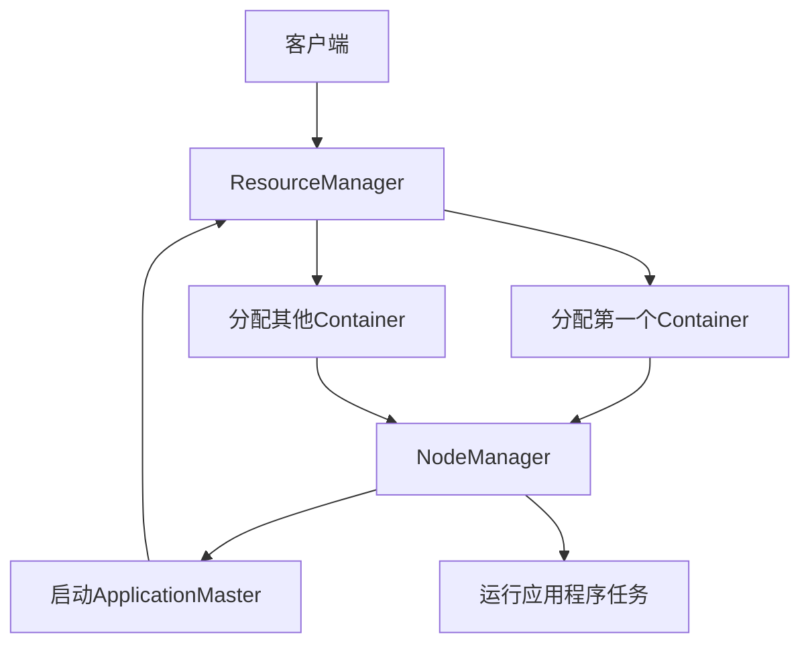

# Yarn原理与代码实例讲解

## 1.背景介绍

在大数据时代,Apache Hadoop作为一个分布式系统框架,为海量数据的存储和计算提供了可靠的解决方案。然而,Hadoop的资源调度器MapReduce在处理大量小作业时存在一些缺陷,如资源利用率低、无法对作业进行细粒度管理等。为了解决这些问题,Apache Hadoop社区推出了Yarn(Yet Another Resource Negotiator),作为新一代资源管理和调度框架。

Yarn将资源管理和作业调度解耦,使得整个系统更加灵活、高效。它负责集群资源的统一管理和调度,支持多种计算框架(如MapReduce、Spark、Flink等)在同一个集群上运行。Yarn的设计理念是将系统分为全局资源管理器(ResourceManager)和每个应用程序的私有部分(ApplicationMaster),从而实现资源统一管理和应用高度隔离。

## 2.核心概念与联系

### 2.1 ResourceManager(RM)

ResourceManager是Yarn的核心组件,负责整个集群资源的管理和调度。它由Scheduler、ApplicationsManager、StateStore三部分组成:

- Scheduler:负责资源分配,根据特定的调度策略将资源分配给运行中的应用程序。
- ApplicationsManager:负责接收新的应用程序提交,并为其分配第一个Container启动ApplicationMaster。
- StateStore:用于存储集群的持久化状态信息,如应用程序状态、资源分配情况等。

### 2.2 NodeManager(NM)

NodeManager运行在集群的每个节点上,负责单个节点上的资源管理和使用。它会周期性地向ResourceManager发送心跳信号和节点资源使用情况。同时,它还负责启动和监控容器(Container)的运行状态。

### 2.3 ApplicationMaster(AM)

每个应用程序在Yarn上运行时,都会启动一个ApplicationMaster进程。AM负责向RM申请资源,并与NM协调来运行应用程序任务。当应用程序结束时,AM也会随之退出。

### 2.4 Container

Container是Yarn中表示资源的基本单位,包括一定数量的内存、CPU等资源。应用程序的任务都是运行在Container中的。

### 2.5 核心组件交互流程

Yarn的核心组件之间是如何协同工作的?下面给出一个简单的流程图:



1. 客户端向ResourceManager提交应用程序。
2. ResourceManager为该应用程序分配第一个Container,用于运行ApplicationMaster。
3. 指定的NodeManager上启动分配的Container,并启动ApplicationMaster进程。
4. ApplicationMaster向ResourceManager申请其他Container资源。
5. ResourceManager分配其他Container给ApplicationMaster。
6. ApplicationMaster在从NodeManager获取的Container上运行应用程序任务。

## 3.核心算法原理具体操作步骤 

### 3.1 资源管理和调度原理

Yarn采用了全局资源管理器和每个应用程序的私有部分这一设计理念,实现了资源统一管理和应用高度隔离。具体来说:

1. **全局资源管理**:ResourceManager作为全局资源管理器,统一管理整个集群的资源,并将资源分配给运行中的应用程序。
2. **应用隔离**:每个应用程序都有自己的ApplicationMaster进程,用于向RM申请资源并与NM协调运行任务,实现了应用程序的高度隔离。

ResourceManager的Scheduler组件负责资源分配,它采用了容量调度器(Capacity Scheduler)和公平调度器(Fair Scheduler)等多种调度策略。这些调度器根据特定的规则和队列将资源分配给运行中的应用程序。

### 3.2 ApplicationMaster启动流程

1. 客户端向ResourceManager提交应用程序。
2. ResourceManager的ApplicationsManager组件接收应用程序请求。
3. ApplicationsManager为应用程序分配第一个Container,用于运行ApplicationMaster。
4. ApplicationsManager从指定的NodeManager上获取Container,并启动ApplicationMaster进程。
5. ApplicationMaster向ResourceManager注册,并定期发送心跳保持连接。

### 3.3 ApplicationMaster运行流程

1. ApplicationMaster根据应用程序的需求向ResourceManager申请资源(Container)。
2. ResourceManager的Scheduler根据调度策略分配资源给ApplicationMaster。
3. ApplicationMaster从分配的Container所在的NodeManager上启动应用程序任务。
4. ApplicationMaster监控任务的运行状态,并根据需要释放或申请新的资源。
5. 应用程序运行结束后,ApplicationMaster向ResourceManager注销并退出。

## 4.数学模型和公式详细讲解举例说明

在Yarn的资源管理和调度过程中,涉及到一些数学模型和公式,用于描述和优化资源分配。下面介绍几个常用的模型和公式:

### 4.1 资源模型

Yarn中,资源被抽象为一个具有多个维度的向量,通常包括CPU、内存等。资源向量可以表示为:

$$
R = (r_1, r_2, ..., r_n)
$$

其中,$ r_i $表示第i种资源的数量。

当一个Container申请资源时,需要指定所需的资源向量。如果集群中有足够的资源,就可以分配给该Container。

### 4.2 资源公平性

公平调度器(Fair Scheduler)的目标是实现资源的公平分配。它采用了最大-最小公平共享(max-min fair share)算法,确保每个用户或队列获得的资源量尽可能接近其权重比例。

设有n个用户或队列,权重分别为$w_1, w_2, ..., w_n$,总资源量为C。则根据max-min fair share算法,第i个用户或队列应获得的资源量为:

$$
r_i = \frac{w_i}{\sum_{j=1}^n w_j} \times C
$$

### 4.3 资源局部性

在大数据计算中,为了提高性能,需要尽量将任务调度到存储数据的节点上,以减少数据传输。这种优化称为数据局部性(data locality)。

Yarn采用了一种称为延迟调度(delay scheduling)的策略来优化数据局部性。当有新的Container资源时,Scheduler不会立即将其分配出去,而是等待一小段时间,以期在这段时间内有locality更高的任务到达。

### 4.4 资源估计

对于某些应用程序,很难预先知道其资源需求。Yarn提供了资源估计(resource estimation)功能,通过监控应用程序的运行状态,动态调整其资源分配。

设应用程序的资源需求服从某种概率分布,如正态分布$N(\mu, \sigma^2)$。则可以根据应用程序已经使用的资源量,估计其未来需求:

$$
\hat{r} = \mu + k\sigma
$$

其中,k是一个常数,用于控制估计的保守程度。

## 5.项目实践:代码实例和详细解释说明

为了更好地理解Yarn的工作原理,我们通过一个简单的MapReduce应用程序示例来演示Yarn的运行流程。

### 5.1 项目结构

```
yarn-demo
├── pom.xml
├── src
│   ├── main
│   │   ├── java
│   │   │   └── com
│   │   │       └── example
│   │   │           ├── WordCount.java
│   │   │           ├── WordCountMapper.java
│   │   │           └── WordCountReducer.java
│   │   └── resources
│   │       └── log4j.properties
└── input
    └── file.txt
```

- `WordCount.java`是主类,用于提交MapReduce作业。
- `WordCountMapper.java`和`WordCountReducer.java`分别实现了Map和Reduce函数。
- `input/file.txt`是输入文件。

### 5.2 提交MapReduce作业

```java
// WordCount.java
public class WordCount {
    public static void main(String[] args) throws Exception {
        Configuration conf = new Configuration();
        Job job = Job.getInstance(conf, "word count");

        job.setJarByClass(WordCount.class);
        job.setMapperClass(WordCountMapper.class);
        job.setCombinerClass(WordCountReducer.class);
        job.setReducerClass(WordCountReducer.class);

        job.setOutputKeyClass(Text.class);
        job.setOutputValueClass(IntWritable.class);

        FileInputFormat.addInputPath(job, new Path(args[0]));
        FileOutputFormat.setOutputPath(job, new Path(args[1]));

        System.exit(job.waitForCompletion(true) ? 0 : 1);
    }
}
```

在主类中,我们配置了MapReduce作业的各个组件,包括Mapper、Combiner、Reducer等。然后将输入路径和输出路径设置为命令行参数,最后提交作业并等待其完成。

### 5.3 Mapper实现

```java
// WordCountMapper.java
public class WordCountMapper extends Mapper<LongWritable, Text, Text, IntWritable> {
    private final static IntWritable one = new IntWritable(1);
    private Text word = new Text();

    public void map(LongWritable key, Text value, Context context) throws IOException, InterruptedException {
        String line = value.toString();
        StringTokenizer tokenizer = new StringTokenizer(line);
        while (tokenizer.hasMoreTokens()) {
            word.set(tokenizer.nextToken());
            context.write(word, one);
        }
    }
}
```

Mapper的作用是将输入的文本按行切分,再将每行按空格分割成单词,并为每个单词输出键值对`<单词, 1>`。

### 5.4 Reducer实现

```java
// WordCountReducer.java
public class WordCountReducer extends Reducer<Text, IntWritable, Text, IntWritable> {
    private IntWritable result = new IntWritable();

    public void reduce(Text key, Iterable<IntWritable> values, Context context) throws IOException, InterruptedException {
        int sum = 0;
        for (IntWritable val : values) {
            sum += val.get();
        }
        result.set(sum);
        context.write(key, result);
    }
}
```

Reducer的作用是将Map的输出结果按单词分组,统计每个单词出现的总次数,并输出键值对`<单词, 次数>`。

### 5.5 在Yarn上运行

1. 将项目打包成jar文件: `mvn clean package`
2. 将jar文件复制到Hadoop集群: `hadoop fs -put target/yarn-demo-1.0.jar /user/yarn/yarn-demo.jar`
3. 运行MapReduce作业:

```bash
yarn jar yarn-demo.jar com.example.WordCount /user/yarn/input /user/yarn/output
```

作业运行过程中,Yarn会启动ApplicationMaster进程,并为其分配第一个Container。ApplicationMaster再向ResourceManager申请其他Container资源,用于运行Mapper和Reducer任务。

我们可以在Yarn的Web UI上查看作业的运行状态和资源使用情况。

## 6.实际应用场景

Yarn作为Apache Hadoop的新一代资源管理和调度框架,已被广泛应用于各种大数据计算场景,包括但不限于:

1. **大数据处理**:Yarn支持在同一个集群上运行多种计算框架,如MapReduce、Spark、Flink等,可用于海量数据的批处理和流处理。
2. **机器学习**:利用Yarn管理的计算资源,可以高效地运行分布式机器学习算法,如TensorFlow on Yarn。
3. **数据仓库**:基于Yarn的Hive、HBase等组件可构建企业级数据仓库和数据湖。
4. **流处理**:Yarn为实时流处理框架(如Apache Storm、Apache Spark Streaming等)提供了资源管理和容错能力。
5. **物联网(IoT)数据处理**:Yarn可用于处理来自各种传感器和设备的海量IoT数据。

除了Apache Hadoop生态系统,越来越多的公司和组织也在自己的大数据平台中采用Yarn,以获得更好的资源利用率和应用隔离性。

## 7.工具和资源推荐

如果你想进一步学习和使用Yarn,以下是一些推荐的工具和资源:

1. **Apache Hadoop官网**:https://hadoop.apache.org/
   - 包含Hadoop及其子项目(如Yarn)的官方文档、教程和下载链接。
2. **Yarn官方文档**:https://hadoop.apache.org/docs/current/hadoop-yarn/hadoop-yarn-site/YARN.html
   - 详细介绍了Yarn的架构、配置和使用方法。
3. **Cloudera Yarn文档**:https://docs.cloudera.com/documentation/enterprise/6/6.3/topics/yarn.html
   - Cloudera是一家提供Hadoop发行版和支持的公司,其文档对Yarn有深入的解释。
4. **Apache Hadoop YARN: Concepts and Applications**:https://www.amazon.com/Apache-Hadoop-YARN-Concepts-Applications/dp/0321934504
   - 一本专门介绍Yarn的书籍